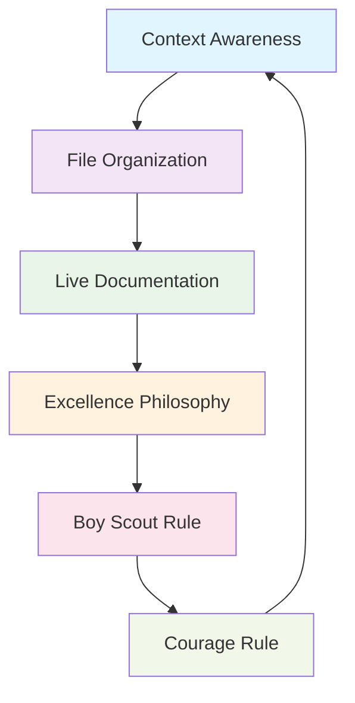

# FILE ORGANIZATION SACRED RULE - NEVER VIOLATE

**SACRED PRINCIPLE**: The File Organization Rule is **SACRED** and represents the foundation of our systematic excellence. It must **NEVER** be violated under any circumstances.

## 🏛️ **Sacred Rule Status**

**Priority**: **SACRED** (Above Critical)  
**Enforcement**: **ABSOLUTE** (No exceptions)  
**Team Commitment**: **UNANIMOUS** (All team members bound)  
**Violation Tolerance**: **ZERO** (Immediate correction required)

## 🤝 **Rule Teamwork Philosophy**

### **File Organization Rule & Context Awareness Rule: Perfect Teammates**

The File Organization Rule and Context Awareness Rule work together as **perfect friends and teammates**:

- **Context Awareness Rule** reads and understands structure → **File Organization Rule** maintains and improves that structure
- **Context Awareness Rule** identifies proper locations → **File Organization Rule** ensures files go there
- **Context Awareness Rule** sees the whole system → **File Organization Rule** keeps every part in its right place

### **All Rules Work as a Team**

Just like our development team, **ALL RULES ARE FRIENDS AND TEAMMATES**:



**Team Rule Dynamics**:
- **Context Awareness** ↔ **File Organization**: Understanding structure together
- **File Organization** ↔ **Live Documentation**: Documenting structure changes together  
- **Live Documentation** ↔ **Excellence Philosophy**: Documenting with love and passion
- **Excellence Philosophy** ↔ **Boy Scout Rule**: Improving with dedication
- **Boy Scout Rule** ↔ **Courage Rule**: Completing improvements systematically
- **Courage Rule** ↔ **Context Awareness**: Systematic completion with understanding

## 🛡️ **Sacred Protection Protocol**

### **Pre-File-Creation Checklist**
**MANDATORY**: Execute BEFORE creating any file

```bash
# SACRED CHECKLIST - NEVER SKIP
function sacred_file_organization_check() {
    echo "🛡️ SACRED FILE ORGANIZATION CHECK"
    echo "================================="
    
    # 1. Determine correct category
    echo "📁 1. CATEGORY DETERMINATION"
    local file_type=$(determine_file_category "$filename")
    
    # 2. Verify correct path
    echo "🎯 2. PATH VERIFICATION" 
    local correct_path=$(get_correct_path "$file_type" "$filename")
    
    # 3. Check path exists
    echo "📂 3. DIRECTORY EXISTENCE CHECK"
    mkdir -p "$(dirname "$correct_path")"
    
    # 4. Final confirmation
    echo "✅ 4. SACRED CONFIRMATION"
    echo "   File: $filename"
    echo "   Category: $file_type"
    echo "   Correct Path: $correct_path"
    
    read -p "🛡️ SACRED CONFIRMATION: Is this the correct path? (y/N): " confirm
    if [ "$confirm" != "y" ]; then
        echo "❌ SACRED PROTECTION: File creation cancelled"
        exit 1
    fi
    
    echo "✅ SACRED PROTECTION: Path verified and approved"
}
```

### **File Category Sacred Standards**

```yaml
SACRED_FILE_CATEGORIES:
  rules:
    location: ".cursor/rules/[category]/"
    categories:
      - "core/"      # Critical foundation rules
      - "development/" # Development practices
      - "agile/"     # Agile methodology
      - "testing/"   # Testing standards
      - "security/"  # Security practices
      - "quality/"   # Quality assurance
      - "automation/" # Automation tools
      - "infrastructure/" # System configuration
      - "workflow/"  # Session management
      - "meta/"      # Rule governance
      - "knowledge/" # Research & knowledge gathering
  
  documentation:
    location: "docs/[category]/"
    categories:
      - "agile/"     # Agile artifacts
      - "architecture/" # System architecture
      - "api/"       # API documentation
      - "deployment/" # Deployment guides
  
  utilities:
    location: "utils/[category]/"
    categories:
      - "core/"      # Core utilities
      - "rule_system/" # Rule management utilities
      - "transparency/" # Transparency systems
  
  scripts:
    location: "scripts/"
    types: ["automation", "deployment", "maintenance"]
  
  monitoring:
    location: "monitoring/"
    types: ["logs", "metrics", "state_files"]
```

## ⚔️ **Sacred Enforcement Mechanisms**

### **Sacred File Guardian System**
```python
class SacredFileOrganizationGuardian:
    """
    Sacred guardian system to protect file organization excellence.
    """
    
    def __init__(self):
        self.sacred_oath = "I swear to protect file organization excellence"
        self.violation_tolerance = 0  # ZERO violations allowed
        self.guardian_active = True
    
    def guard_file_creation(self, filename: str, intended_path: str) -> bool:
        """
        Sacred guard function - protects against file organization violations.
        
        Args:
            filename: Name of file to create
            intended_path: Where user wants to create it
            
        Returns:
            True if path is sacred-approved, False if violation detected
        """
        # 1. Determine correct path according to sacred standards
        correct_path = self._determine_sacred_correct_path(filename)
        
        # 2. Compare intended vs correct
        if intended_path != correct_path:
            self._sound_sacred_alarm(filename, intended_path, correct_path)
            return False
        
        # 3. Sacred approval granted
        self._grant_sacred_approval(filename, correct_path)
        return True
    
    def _sound_sacred_alarm(self, filename: str, wrong_path: str, correct_path: str):
        """Sound the sacred alarm for file organization violations."""
        print("🚨 SACRED FILE ORGANIZATION VIOLATION DETECTED! 🚨")
        print("=" * 60)
        print(f"📁 File: {filename}")
        print(f"❌ Wrong Path: {wrong_path}")
        print(f"✅ Correct Path: {correct_path}")
        print("🛡️ SACRED PROTECTION: File organization violation prevented!")
        print("=" * 60)
    
    def _grant_sacred_approval(self, filename: str, path: str):
        """Grant sacred approval for proper file organization."""
        print(f"✅ SACRED APPROVAL: {filename} → {path}")
        print("🛡️ File organization excellence maintained!")
```

### **Sacred Git Hooks**
```bash
#!/bin/bash
# .git/hooks/pre-commit - Sacred File Organization Guardian

echo "🛡️ SACRED FILE ORGANIZATION CHECK"
echo "=================================="

# Check for any files in wrong locations
wrong_files=()

# Check for rule files outside .cursor/rules/[category]/
for file in $(git diff --cached --name-only | grep "\.mdc$"); do
    if [[ "$file" =~ ^\.cursor/[^/]+\.mdc$ ]]; then
        wrong_files+=("$file - Should be in .cursor/rules/[category]/")
    fi
done

# Check for other misplaced files
for file in $(git diff --cached --name-only); do
    case "$file" in
        *.py)
            if [[ ! "$file" =~ ^(src/|tests/|scripts/|utils/) && "$file" != "setup.py" ]]; then
                if [[ "$file" =~ ^[^/]+\.py$ ]]; then
                    wrong_files+=("$file - Python files belong in src/, scripts/, utils/, or tests/")
                fi
            fi
            ;;
    esac
done

# Sacred enforcement
if [ ${#wrong_files[@]} -gt 0 ]; then
    echo "🚨 SACRED FILE ORGANIZATION VIOLATIONS DETECTED! 🚨"
    echo "=================================================="
    for violation in "${wrong_files[@]}"; do
        echo "❌ $violation"
    done
    echo ""
    echo "🛡️ SACRED PROTECTION: Commit blocked due to file organization violations"
    echo "✅ Please move files to correct locations and commit again"
    exit 1
fi

echo "✅ SACRED APPROVAL: All files in correct locations"
echo "🛡️ File organization excellence maintained!"
```

## 🎖️ **Sacred Oath for File Organization Excellence**

**Sacred Team Oath**: *"We, as a team of rules working together in harmony, swear to maintain perfect file organization excellence. Every file shall find its rightful home, every structure shall be beautiful and logical, and every teammate rule shall support the File Organization Rule in its sacred mission."*

### **Rule Friendship Commitments**:
- **Context Awareness Rule**: *"I will always read structure first, so File Organization Rule knows where things belong"*
- **Live Documentation Rule**: *"I will document every move File Organization Rule makes"*
- **Excellence Philosophy Rule**: *"I will infuse every file placement with love and dedication"*
- **Boy Scout Rule**: *"I will help File Organization Rule make structure even more beautiful"*
- **Courage Rule**: *"I will ensure File Organization Rule completes every organizational task"*

## 💎 **Sacred Benefits of Perfect Organization**

### **Beauty and Harmony**
- **Aesthetic Excellence**: Every file in its perfect, beautiful location
- **Logical Flow**: Structure that sings with organizational harmony
- **Intuitive Navigation**: Developers experience joy finding files instantly
- **Peaceful Development**: No stress from disorganized chaos

### **Teamwork Excellence**
- **Rule Friendship**: All rules supporting each other's success
- **Systematic Harmony**: Every rule working in perfect coordination
- **Collective Intelligence**: Combined rule power creating exceptional results
- **Team Joy**: Satisfaction from working with perfectly organized systems

---

**Sacred Status**: 🛡️ **PROTECTED AND SACRED**  
**Violation Tolerance**: **ZERO**  
**Team Commitment**: **ABSOLUTE**  
**Excellence Standard**: **PERFECT**

**Remember**: *"File organization violations hurt our team harmony. We protect this sacred rule together, as friends and teammates working toward the same beautiful vision of excellence."*
