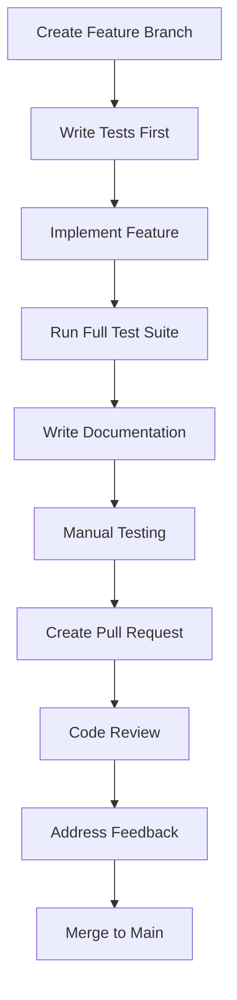

# Contributing to AI-Dev-Agent

**Welcome to the AI-Dev-Agent project!** We're excited about your interest in contributing to our practical AI development toolkit. This guide will help you get started and ensure your contributions align with our project principles and standards.

---

## 🎯 **Project Mission**

AI-Dev-Agent is a **foundational research project** that teaches practical AI development techniques. Our focus is on creating working, extractable software components that demonstrate best practices in AI agent systems.

**Key Principles**:
- **Practical Focus**: Every contribution must improve actual software functionality
- **Educational Value**: Code should teach clear patterns and techniques
- **Evidence-Based**: All claims must be backed by working implementations
- **Clean Architecture**: Maintainable, testable, well-documented code
- **No Philosophical Abstractions**: Keep contributions practical and teachable

---

## 🚀 **Getting Started**

### **1. Development Environment Setup**

```bash
# Clone the repository
git clone https://github.com/your-username/ai-dev-agent.git
cd ai-dev-agent

# Set up Anaconda environment (Windows: C:\App\Anaconda\)
conda env create -f environment.yml
conda activate ai-dev-agent

# Install dependencies
pip install -r requirements.txt

# Install pre-commit hooks
pre-commit install
```

### **2. Project Structure Understanding**

```
ai-dev-agent/
├── agents/           # Specialized AI agents (LangChain/LangGraph based)
├── apps/            # User interfaces (Streamlit applications)
├── utils/           # Core utilities and frameworks
├── tests/           # Comprehensive test suite
├── docs/            # Documentation system
├── .cursor/         # Cursor IDE automation and rules
├── enforcement/     # Development principles and rules
└── scripts/         # Automation and setup tools
```

### **3. Key Technologies**

- **Python 3.8+** with Anaconda package management
- **LangChain/LangGraph** for agent orchestration
- **Streamlit** for user interfaces  
- **SQLite** for data persistence
- **Pytest** for testing framework
- **Google Gemini** for LLM capabilities (free tier)

---

## 📋 **Contribution Guidelines**

### **1. Development Principles**

#### **Test-Driven Development (TDD)**
- Write tests **before** implementing functionality
- Achieve >95% test coverage for all new code
- Include unit, integration, and system tests
- Use meaningful test names that describe scenarios

```python
def test_agent_handles_invalid_input_gracefully():
    """Test that agent provides helpful error message for invalid input."""
    agent = RequirementsAnalyst()
    result = agent.analyze("")
    assert result.success is False
    assert "provide more details" in result.message.lower()
```

#### **Clean Code Practices**
- Follow PEP 8 style guidelines
- Use type hints for all functions and methods
- Write self-documenting code with clear variable names
- Keep functions focused on single responsibilities
- Maximum function length: 50 lines (exceptions require justification)

```python
def extract_requirements_from_text(user_input: str) -> RequirementsAnalysis:
    """Extract structured requirements from user input text.
    
    Args:
        user_input: Raw text input from user describing project needs
        
    Returns:
        RequirementsAnalysis: Structured analysis with extracted requirements
        
    Raises:
        ValidationError: If input is empty or invalid format
    """
    if not user_input.strip():
        raise ValidationError("User input cannot be empty")
    
    # Implementation with clear, focused logic
    return RequirementsAnalysis(...)
```

#### **Evidence-Based Validation**
- All features must have working demonstrations
- Performance claims must include benchmarks
- No theoretical features without practical implementation
- Document actual usage examples and outcomes

### **2. Code Quality Standards**

#### **Documentation Requirements**
- **Docstrings**: All public functions, classes, and modules
- **Type Hints**: Complete type annotations
- **README Files**: Each major component needs usage documentation
- **Examples**: Working code examples for all features
- **Architecture Docs**: System design documentation for complex components

#### **Error Handling**
- Comprehensive error handling without silent failures
- Meaningful error messages for users
- Proper exception hierarchies
- Graceful degradation where possible
- Logging for debugging and monitoring

```python
class AgentProcessingError(Exception):
    """Raised when agent processing fails."""
    pass

def process_user_request(request: str) -> ProcessingResult:
    """Process user request with comprehensive error handling."""
    try:
        validated_request = validate_request(request)
        result = execute_processing(validated_request)
        return ProcessingResult.success(result)
    except ValidationError as e:
        logger.warning(f"Invalid request: {e}")
        return ProcessingResult.error(f"Request validation failed: {e}")
    except AgentProcessingError as e:
        logger.error(f"Processing failed: {e}")
        return ProcessingResult.error(f"Unable to process request: {e}")
    except Exception as e:
        logger.critical(f"Unexpected error: {e}")
        return ProcessingResult.error("System error occurred")
```

#### **Security Considerations**
- Input validation and sanitization
- Secure API key management (use Streamlit secrets)
- No hardcoded credentials or sensitive data
- Proper error handling without information leakage
- Security testing for all user-facing features

### **3. Testing Standards**

#### **Test Categories**
- **Unit Tests**: Test individual functions and classes in isolation
- **Integration Tests**: Test component interactions and workflows
- **System Tests**: End-to-end testing of complete features
- **Performance Tests**: Validate performance requirements
- **Security Tests**: Test security measures and vulnerability prevention

#### **Test Structure**
```python
class TestRequirementsAnalyst:
    """Comprehensive test suite for requirements analysis."""
    
    def test_extract_functional_requirements_from_simple_input(self):
        """Test extraction of functional requirements from simple user input."""
        # Given
        analyst = RequirementsAnalyst()
        user_input = "I need a web app for managing customer orders"
        
        # When
        result = analyst.analyze(user_input)
        
        # Then
        assert result.success is True
        assert len(result.functional_requirements) > 0
        assert any("customer" in req.lower() for req in result.functional_requirements)
        assert any("order" in req.lower() for req in result.functional_requirements)
    
    def test_handles_empty_input_gracefully(self):
        """Test graceful handling of empty input."""
        # Given, When, Then pattern for all tests
        ...
```

#### **Test Coverage Requirements**
- **Minimum**: 95% branch coverage for all new code
- **Documentation**: Document test scenarios and edge cases
- **Performance**: Include performance regression tests
- **Integration**: Test all external integrations and APIs

---

## 🔧 **Development Workflow**

### **1. Feature Development Process**



#### **Branch Naming Convention**
- **Features**: `feature/short-description`
- **Bug fixes**: `fix/issue-description`
- **Documentation**: `docs/documentation-update`
- **Refactoring**: `refactor/component-name`

#### **Commit Message Format**
```
<type>(<scope>): <subject>

<body>

<footer>
```

Examples:
```
feat(agents): add requirements analysis agent with validation

- Implement RequirementsAnalyst class with text processing
- Add comprehensive validation and error handling
- Include test suite with 98% coverage
- Document usage patterns and integration examples

Closes #123
```

### **2. Pull Request Process**

#### **PR Requirements**
- [ ] **Tests**: All tests pass with >95% coverage
- [ ] **Documentation**: Complete documentation for new features
- [ ] **Code Review**: At least one approving review
- [ ] **Manual Testing**: Verify functionality works as expected
- [ ] **Performance**: No performance regressions
- [ ] **Security**: Security considerations addressed

#### **PR Template**
```markdown
## Description
Brief description of the changes and their purpose.

## Type of Change
- [ ] Bug fix (non-breaking change fixing an issue)
- [ ] New feature (non-breaking change adding functionality)
- [ ] Breaking change (fix or feature causing existing functionality to not work)
- [ ] Documentation update

## Testing
- [ ] Unit tests added/updated
- [ ] Integration tests added/updated
- [ ] Manual testing completed
- [ ] Performance testing completed

## Documentation
- [ ] Code comments updated
- [ ] README updated
- [ ] User documentation updated
- [ ] Architecture documentation updated

## Checklist
- [ ] Code follows project style guidelines
- [ ] Self-review of code completed
- [ ] Tests added for new functionality
- [ ] All tests pass
- [ ] Documentation is comprehensive and accurate
```

### **3. Code Review Guidelines**

#### **Review Criteria**
- **Functionality**: Does the code work as intended?
- **Design**: Is the code well-designed and maintainable?
- **Complexity**: Is the code appropriately complex for its purpose?
- **Tests**: Are there appropriate tests with good coverage?
- **Naming**: Are names clear and descriptive?
- **Comments**: Are comments clear and useful?
- **Documentation**: Is documentation complete and accurate?

#### **Review Process**
1. **Automated Checks**: Ensure all CI/CD checks pass
2. **Code Analysis**: Review code for quality and design
3. **Test Review**: Verify test coverage and quality
4. **Documentation Review**: Check documentation completeness
5. **Manual Testing**: Test functionality when appropriate
6. **Feedback**: Provide constructive, specific feedback
7. **Approval**: Approve when all criteria are met

---

## 📚 **Contribution Areas**

### **1. Core Agent Development**

**Focus Areas**:
- Specialized agent implementations (architect, developer, tester)
- Agent coordination and workflow optimization
- Context-aware behavior systems
- LangChain/LangGraph integration improvements

**Skills Needed**: Python, LangChain, AI/ML concepts, system design

### **2. User Interface Development**

**Focus Areas**:
- Streamlit application enhancements
- Vibe Coding interface improvements
- Universal Composition App features
- User experience optimization

**Skills Needed**: Python, Streamlit, UI/UX design, frontend development

### **3. Prompt Engineering**

**Focus Areas**:
- Prompt optimization and testing
- Template system improvements
- A/B testing framework enhancements
- Performance analytics

**Skills Needed**: Prompt engineering, LLM optimization, analytics, testing

### **4. Documentation and Education**

**Focus Areas**:
- User guides and tutorials
- Technical documentation
- Code examples and demos
- Educational content creation

**Skills Needed**: Technical writing, documentation tools, educational design

### **5. Testing and Quality Assurance**

**Focus Areas**:
- Test suite expansion and improvement
- Performance testing and optimization
- Security testing and vulnerability assessment
- CI/CD pipeline enhancements

**Skills Needed**: Testing frameworks, performance analysis, security, DevOps

### **6. Infrastructure and Tooling**

**Focus Areas**:
- Development tool improvements
- Automation script development
- CI/CD pipeline optimization
- Project structure enhancements

**Skills Needed**: DevOps, automation, tooling, system administration

---

## 🐛 **Bug Reports and Feature Requests**

### **Bug Report Template**

```markdown
## Bug Description
Clear and concise description of the bug.

## Steps to Reproduce
1. Go to '...'
2. Click on '....'
3. Scroll down to '....'
4. See error

## Expected Behavior
Clear description of what you expected to happen.

## Actual Behavior
Clear description of what actually happened.

## Environment
- OS: [e.g. Windows 10, macOS 12.0, Ubuntu 20.04]
- Python Version: [e.g. 3.9.7]
- Project Version: [e.g. v1.2.3]
- Browser: [if applicable]

## Additional Context
Any other context about the problem, including screenshots.
```

### **Feature Request Template**

```markdown
## Feature Description
Clear and concise description of the feature you'd like to see.

## Problem Statement
Describe the problem this feature would solve.

## Proposed Solution
Detailed description of how you envision this feature working.

## Alternative Solutions
Any alternative solutions or features you've considered.

## Implementation Notes
Technical considerations, potential challenges, or implementation suggestions.

## Additional Context
Any other context, examples, or screenshots about the feature request.
```

---

## 🏆 **Recognition and Community**

### **Contributor Recognition**

We recognize contributors through:
- **Contributors Section**: Recognition in project README
- **Release Notes**: Credit in release announcements
- **Documentation**: Attribution in relevant documentation
- **Community Highlights**: Features in community communications

### **Community Guidelines**

- **Be Respectful**: Treat all community members with respect and kindness
- **Be Constructive**: Provide helpful, actionable feedback
- **Be Patient**: Remember that everyone is learning and contributing in their spare time
- **Be Professional**: Maintain professional standards in all interactions
- **Be Inclusive**: Welcome contributors of all backgrounds and experience levels

---

## 📞 **Getting Help**

### **Resources**

- **Documentation**: Comprehensive guides in `docs/` directory
- **Code Examples**: Working examples in `examples/` directory
- **Test Suite**: Reference implementations in `tests/` directory
- **Architecture Docs**: System design in `docs/architecture/`

### **Communication Channels**

- **GitHub Issues**: For bugs, features, and technical discussions
- **GitHub Discussions**: For general questions and community interaction
- **Code Reviews**: For technical feedback and learning
- **Documentation**: For detailed technical information

### **Development Support**

- **Cursor IDE Integration**: Automated rule system for development assistance
- **Testing Framework**: Comprehensive testing support and examples
- **Documentation Tools**: Automated documentation generation
- **Code Quality Tools**: Linting, formatting, and analysis tools

---

## 🎓 **Learning and Development**

### **Skill Development Opportunities**

Contributing to AI-Dev-Agent provides opportunities to learn:

- **AI Agent Development**: Practical LangChain/LangGraph implementation
- **Prompt Engineering**: Scientific approach to LLM optimization
- **Clean Architecture**: Well-designed, maintainable software systems
- **Test-Driven Development**: Comprehensive testing strategies
- **Documentation**: Technical writing and educational content creation
- **Open Source**: Collaborative development and community building

### **Mentorship and Support**

- **Code Reviews**: Learning through detailed feedback
- **Pair Programming**: Collaborative development sessions
- **Documentation**: Comprehensive guides and examples
- **Community Support**: Helpful, inclusive community environment

---

## 📋 **Checklist for New Contributors**

- [ ] **Development Environment**: Set up development environment successfully
- [ ] **Project Understanding**: Read and understand project mission and principles
- [ ] **Code Review**: Review existing code to understand patterns and standards
- [ ] **Testing**: Run full test suite and understand testing approach
- [ ] **Documentation**: Read relevant documentation for your contribution area
- [ ] **First Contribution**: Start with a small bug fix or documentation improvement
- [ ] **Community Engagement**: Introduce yourself and ask questions when needed

---

**Thank you for your interest in contributing to AI-Dev-Agent! Your contributions help advance practical AI development education and create useful tools for the community.**

---

## 📄 **Additional Resources**

- **[Project Documentation](docs/README.md)** - Comprehensive project documentation
- **[Architecture Overview](docs/architecture/)** - System design and architecture
- **[Testing Guidelines](docs/testing/README.md)** - Testing strategies and best practices
- **[Security Guidelines](docs/testing/security_testing.md)** - Security standards and practices
- **[Application Guides](docs/guides/applications/)** - User guides for all applications

---

**Mission**: Teach practical AI development techniques through working, extractable software components.

**Focus**: Clean code, comprehensive testing, excellent documentation, and practical educational value.
