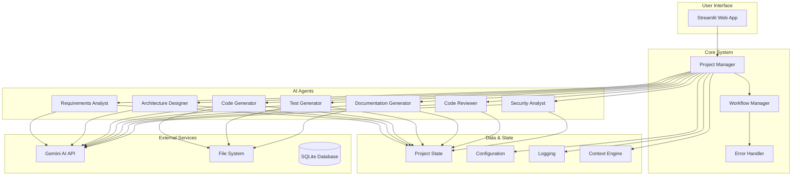

# AI Development Agent

A multi-agent system for automated software development using LangGraph and Google's Gemini API. This system implements a workflow-based approach to streamline software development tasks.

## 🎉 **Generated with Cursor IDE**

This entire project was **fully generated and developed using [Cursor IDE](https://cursor.sh/)**, the world's most advanced AI-powered code editor. Cursor's exceptional AI capabilities, intelligent code completion, and seamless development workflow made it possible to create this comprehensive multi-agent system efficiently and with high quality.

**Special thanks to the amazing Cursor team** for building such an incredible development tool that empowers developers to create sophisticated applications with unprecedented speed and precision. The AI-assisted development experience provided by Cursor has been instrumental in bringing this project to life.

*Built with ❤️ using Cursor IDE*

## 🎯 **Development Philosophy**

This project follows a **comprehensive rule system** that ensures high-quality, efficient, and maintainable code through automated development standards and best practices.

For complete rules and application guide, see [.cursor/rules/RULE_ORGANIZATION_STRUCTURE.md](.cursor/rules/RULE_ORGANIZATION_STRUCTURE.md) and [.cursor/rules/RULE_APPLICATION_GUIDE.md](.cursor/rules/RULE_APPLICATION_GUIDE.md).

## 🚀 Quick Start

### Prerequisites
- Python 3.8+
- Google Gemini API key
- Git

### Installation

1. **Clone the repository**
   ```bash
   git clone <repository-url>
   cd ai-dev-agent
   ```

2. **Create virtual environment**
   ```bash
   python -m venv venv
   source venv/bin/activate  # On Windows: venv\Scripts\activate
   ```

3. **Install dependencies**
   ```bash
   pip install -r requirements.txt
   ```

### Configuration

#### API Key Setup

The system uses **Streamlit's built-in secrets management** for secure API key handling.

**Option 1: .streamlit/secrets.toml (Recommended)**

Create a `.streamlit/secrets.toml` file in the project root:

```toml
# AI Development Agent Secrets Configuration
# This file contains sensitive configuration data
# DO NOT commit this file to version control

GEMINI_API_KEY = "your-actual-gemini-api-key-here"
```

**Security Note**: The `.streamlit/secrets.toml` file is automatically ignored by git.

**Option 2: Environment Variable**

```bash
# Linux/macOS
export GEMINI_API_KEY="your-gemini-api-key-here"

# Windows
set GEMINI_API_KEY=your-gemini-api-key-here
```

**Option 3: Streamlit Cloud Secrets**

When deploying to Streamlit Cloud, add your API key through the Streamlit Cloud dashboard:
1. Go to your app settings in Streamlit Cloud
2. Navigate to "Secrets"
3. Add: `GEMINI_API_KEY = "your-actual-api-key-here"`

**Getting Your Gemini API Key**

1. Visit [Google AI Studio](https://makersuite.google.com/app/apikey)
2. Sign in with your Google account
3. Click "Create API Key"
4. Copy the generated key
5. Add it to your `secrets.toml` file or set it as an environment variable

### Usage

#### Web Interface (Recommended)

The easiest way to use the AI Development Agent is through the Streamlit web interface:

```bash
streamlit run apps/streamlit_app.py
```

This will start the web application at `http://localhost:8501` where you can:

1. Configure your API key if not already set
2. Enter your project description
3. Configure project settings
4. Start the development workflow
5. View generated files and download the complete project
6. Manage system prompts and agent prompts
7. Add and manage RAG documents for enhanced knowledge retrieval

#### Programmatic Usage

You can also use the system programmatically:

```python
import asyncio
from apps.main import AIDevelopmentAgent
from models.config import load_config_from_env

async def main():
    # Initialize the agent
    config = load_config_from_env()
    agent = AIDevelopmentAgent(config)
    
    # Execute workflow
    result = await agent.execute_workflow(
        project_context="Create a REST API for user management...",
        project_name="user-management-api",
        output_dir="./generated_projects/user-management-api"
    )
    
    print(f"Workflow completed: {result.status}")

if __name__ == "__main__":
    asyncio.run(main())
```

## 🏗️ System Architecture

### Overview

The AI Development Agent system uses a workflow-based architecture with specialized AI agents that work together to transform project requirements into complete applications.



### Workflow Process

The system follows a sequential workflow where each agent builds upon the output of previous agents:

1. **Requirements Analysis** → Extract detailed requirements from project description
2. **Architecture Design** → Design system architecture and technology stack
3. **Code Generation** → Generate source code
4. **Test Generation** → Create test suites
5. **Code Review** → Analyze code quality and suggest improvements
6. **Security Analysis** → Identify and fix security vulnerabilities
7. **Documentation** → Generate project documentation

### Specialized Agents

1. **Requirements Analyst**: Transforms project descriptions into detailed specifications
2. **Architecture Designer**: Designs system architecture and technology stack
3. **Code Generator**: Generates source code based on requirements
4. **Test Generator**: Creates test suites with coverage
5. **Code Reviewer**: Analyzes code quality and suggests improvements
6. **Security Analyst**: Identifies vulnerabilities and security issues
7. **Documentation Generator**: Creates project documentation

## 🔍 Features

### Core Capabilities
- **Multi-Agent Architecture**: Specialized agents for different development phases
- **LangGraph Workflow Orchestration**: Workflow management with state persistence
- **Gemini API Integration**: AI-powered code generation and analysis
- **Human-in-the-Loop**: Approval mechanisms for critical decisions
- **Error Recovery**: Retry logic and error handling
- **Context Awareness**: Codebase indexing and context retrieval
- **Streamlit Web Interface**: User-friendly web application
- **Prompt Management System**: Database-driven prompt storage
- **RAG Document Management**: URL scraping and file-based knowledge retrieval
- **Comprehensive Testing**: Test suite with unit, integration, and system tests
- **Structured Output Parsing**: JSON-based parsing with fallback mechanisms
- **Cursor Rules System**: Automated development standards and quality enforcement
- **LangSmith Observability**: Comprehensive agent logging and monitoring

### Web Interface Features

The Streamlit web interface provides four main sections:

1. **🚀 Main App**: Core project generation workflow
2. **🔧 Prompt Manager**: Edit and manage agent prompts
3. **📚 RAG Documents**: Add and manage knowledge documents
4. **⚙️ System Prompts**: Manage system-wide prompts

## 🔍 Monitoring and Observability

### LangSmith Integration

The system includes comprehensive agent logging and observability through **LangSmith**, LangChain's official observability platform.

#### View Agent Logs

All agent executions, workflow steps, and LLM calls are automatically logged and can be viewed at:

**🌐 [https://smith.langchain.com/](https://smith.langchain.com/)**

#### What You Can Monitor

- **Agent Executions**: Detailed logs of each agent's input, output, and execution time
- **Workflow Steps**: Complete workflow progression with state changes
- **LLM Calls**: Individual model calls with prompts and responses
- **Error Tracking**: Comprehensive error logging with context
- **Performance Metrics**: Execution times and performance analytics
- **Session Tracking**: Complete session history for debugging

#### Configuration

LangSmith is configured in `.streamlit/secrets.toml`:

```toml
# LangSmith Configuration
LANGSMITH_TRACING = "true"
LANGSMITH_ENDPOINT = "https://api.smith.langchain.com"
LANGSMITH_API_KEY = "your-langsmith-api-key"
LANGSMITH_PROJECT = "ai-dev-agent"
```

📖 **For detailed LangSmith usage and debugging, see the [LangSmith Tracing Guide](docs/guides/observability/langsmith_tracing_guide.md)**

## 📋 Development Standards

This project implements comprehensive development standards that ensure consistency, quality, and best practices through automated rule enforcement. The rules are stored in `.cursor/rules/` and are automatically applied during development.

### Key Development Standards

#### 🔧 **Core Standards** (Critical Priority)
- **AI Model Selection**: Standardized LLM model selection using Gemini 2.5 Flash/Flash-Lite
- **Framework Standards**: LangChain + LangGraph + LangSmith implementation standards
- **Error Handling**: Zero-tolerance policy for silent errors and fallbacks
- **Security**: Streamlit secrets management for API keys

#### 🧪 **Testing & Quality Assurance** (Critical Priority)
- **Test Organization**: Comprehensive test structure with unit/integration/system tests
- **Test Monitoring**: Automated test monitoring with immediate error detection
- **Test Isolation**: Isolated testing procedures for component isolation
- **No Failing Tests**: Zero-tolerance policy for failing tests

#### 📁 **Project Management** (High Priority)
- **File Organization**: Standardized file structure and naming conventions
- **Task Management**: Comprehensive tasklist management and progress tracking
- **Implementation Roadmap**: Adherence to development plans and roadmaps
- **Requirements Management**: Requirements tracking and validation

#### 📚 **Documentation & Maintenance** (High Priority)
- **Documentation Maintenance**: Comprehensive documentation upkeep and synchronization
- **Naming Standards**: Consistent naming conventions across all project elements
- **Prompt Database Management**: Database-first prompt management system

#### 🤖 **Automation & Environment** (Medium Priority)
- **Full Automation**: Comprehensive automation environment for development
- **Agent Flow Analysis**: Debugging and analysis of agent workflows
- **Streamlit Startup**: Standardized Streamlit application startup procedures

### How Rules Work

#### **Automatic Application**
- Rules are automatically applied based on file patterns and context
- Critical rules are always enforced across the entire project
- High-priority rules apply to relevant file types and scenarios
- Medium-priority rules apply when context is relevant

#### **Rule Enforcement Examples**

**AI Model Selection**:
```python
# ✅ CORRECT: Uses standardized model selection
def get_llm_model(task_complexity="simple"):
    api_key = st.secrets["GEMINI_API_KEY"]
    model = "gemini-2.5-flash-lite" if task_complexity == "simple" else "gemini-2.5-flash"
    return ChatGoogleGenerativeAI(model=model, google_api_key=api_key, temperature=0.1)

# ❌ FORBIDDEN: Direct model selection without standards
def get_llm():
    return ChatGoogleGenerativeAI(model="gemini-2.5-flash-lite")  # No standardization
```

**Test Organization**:
```
tests/
├── unit/                    # ✅ Unit tests for individual components
│   ├── agents/             # Agent unit tests
│   └── models/             # Model unit tests
├── integration/            # ✅ Integration tests for component interactions
│   └── agent_workflows/    # Multi-agent workflow tests
├── system/                 # ✅ System-level end-to-end tests
│   └── complete_workflow/  # Full workflow tests
└── langgraph/              # ✅ LangGraph-specific tests
    └── nodes/              # Individual node tests
```

**Error Handling**:
```python
# ✅ CORRECT: Expose errors immediately
try:
    result = parser.parse(response)
    return result
except Exception as e:
    logger.error(f"Parsing failed: {e}")
    raise OutputParserException(f"Failed to parse response: {e}")

# ❌ FORBIDDEN: Silent error handling with fallbacks
try:
    result = parser.parse(response)
    return result
except Exception as e:
    logger.warning(f"Parsing failed, using fallback: {e}")
    return get_fallback_data()  # Never do this
```

#### **Rule Benefits**

- **Consistency**: Uniform standards across all development activities
- **Quality**: Automated enforcement of best practices and quality standards
- **Efficiency**: Reduced manual review and standardization efforts
- **Reliability**: Consistent error handling and testing practices
- **Maintainability**: Clear standards for code organization and structure
- **Security**: Enforced security practices for API key management
- **Scalability**: Standardized patterns for team collaboration

#### **Rule Management**

- **Location**: All rules stored in `.cursor/rules/` directory
- **Format**: Rules use `.mdc` format with standardized metadata
- **Naming**: Follows `category_action_rule.mdc` convention
- **Priority**: Critical, High, Medium, Low priority levels
- **Application**: Automatic application based on file patterns and context

## 📁 Project Structure

```
ai-dev-agent/
├── .cursor/              # Cursor IDE rules and automation
│   └── rules/            # Development rules and standards
│       ├── ai_model_selection_rule.mdc
│       ├── framework_langchain_langgraph_standards_rule.mdc
│       ├── testing_test_organization_rule.mdc
│       ├── error_handling_no_silent_errors_rule.mdc
│       ├── security_streamlit_secrets_rule.mdc
│       └── [other rules...]
├── agents/                 # Agent implementations
│   ├── base_agent.py      # Base agent class
│   ├── requirements_analyst.py
│   ├── architecture_designer.py
│   ├── code_generator.py
│   ├── test_generator.py
│   ├── code_reviewer.py
│   ├── security_analyst.py
│   ├── documentation_generator.py
│   └── supervisor/        # Supervisor agent implementations
├── apps/                  # Application entry points
│   ├── main.py           # Main application entry point
│   ├── streamlit_app.py  # Streamlit web interface
│   └── prompt_manager_app.py
├── config/               # Configuration files
│   ├── pytest.ini       # Pytest configuration
│   └── .pre-commit-config.yaml
├── context/               # Context management
│   └── context_engine.py
├── docs/                  # Documentation
│   ├── guides/            # Implementation guides
│   │   ├── implementation/ # Project roadmap and implementation guides
│   │   ├── database/      # Database automation guides
│   │   ├── development/   # Development setup guides
│   │   └── observability/ # LangSmith tracing guides
│   ├── architecture/      # Architecture documentation
│   ├── analysis/          # Analysis documents
│   ├── concepts/          # Conceptual papers
│   └── development/       # Development resources
├── generated/             # Generated files
├── generated_projects/    # Complete generated projects
├── logs/                  # Log files
├── models/                # Data models and schemas
│   ├── config.py         # Configuration management
│   ├── state.py          # Workflow state management
│   ├── supervisor_state.py
│   └── responses.py      # Response models
├── prompts/               # Prompt templates and database
│   ├── agent_prompt_loader.py
│   └── prompt_templates.db
├── tests/                 # Test suite
│   ├── unit/             # Unit tests
│   ├── integration/      # Integration tests
│   ├── system/           # System tests
│   ├── langgraph/        # LangGraph tests
│   └── supervisor/       # Supervisor tests
├── tools/                # Development tools
│   └── .pre-commit-config.yaml
├── utils/                # Utility functions
│   ├── enhanced_output_parsers.py
│   ├── file_manager.py
│   ├── helpers.py
│   ├── logging_config.py
│   ├── output_parsers.py
│   ├── prompt_editor.py
│   ├── prompt_manager.py
│   ├── rag_processor.py
│   ├── structured_outputs.py
│   └── toml_config.py
├── workflow/             # Workflow management
│   ├── error_handler.py
│   ├── human_approval.py
│   ├── workflow_graph.py
│   ├── workflow_manager.py
│   ├── langgraph_workflow_manager.py
│   └── langgraph_workflow.py
├── requirements.txt      # Python dependencies
└── README.md             # Project documentation
```

## 🔧 Development

### Development Standards and Rules

This project follows a comprehensive set of automated development rules that ensure consistency, quality, and best practices. All rules are automatically enforced by the Cursor IDE.

#### **Key Development Principles**

1. **Framework-First Approach**: Always use established frameworks (LangChain, LangGraph, LangSmith) over custom implementations
2. **Test-Driven Development**: Write tests before implementing functionality
3. **Error Exposure**: Never use silent error handling or fallbacks - expose all errors immediately
4. **Standardized AI Models**: Use Gemini 2.5 Flash/Flash-Lite with standardized selection criteria
5. **Security Best Practices**: Use Streamlit secrets for all sensitive configuration

#### **Quality Assurance**

- **Zero Failing Tests**: All tests must pass before any code changes
- **Comprehensive Test Coverage**: Unit, integration, and system tests for all components
- **Automated Test Monitoring**: Immediate error detection and bug fixing workflow
- **Code Quality Standards**: Pylint enforcement and naming conventions

#### **Project Organization**

- **Structured File Organization**: Clear separation of concerns and logical file grouping
- **Consistent Naming**: Standardized naming conventions across all project elements
- **Documentation Maintenance**: Automatic synchronization of documentation with code changes
- **Task Management**: Comprehensive task tracking and progress management

### Prompt Management System

The system includes a comprehensive prompt management system:

#### Agent Prompts
- **Database Storage**: All prompts stored in SQLite database (`prompt_templates.db`)
- **Enhanced Prompts**: Structured prompts for optimal AI performance
- **Version Control**: Track prompt changes and performance metrics
- **Web Editor**: Edit prompts through the Streamlit interface

#### System Prompts
- **Category-based Organization**: Organize prompts by workflow, general, error handling
- **Template Management**: Create and edit system-wide prompt templates
- **Performance Tracking**: Monitor prompt usage and success rates

### RAG Document Management

The system supports Retrieval-Augmented Generation (RAG) for enhanced knowledge retrieval:

#### URL Document Processing
- **Web Scraping**: Extract content from web pages
- **Content Cleaning**: Remove ads, navigation, and irrelevant content
- **Metadata Extraction**: Capture titles, descriptions, and source information
- **Agent Association**: Link documents to specific agents

#### File Document Processing
- **Multiple Formats**: Support for TXT, MD, PY, JS, HTML, CSS, JSON files
- **Content Analysis**: Automatic content extraction and processing
- **Tagging System**: Organize documents with custom tags
- **Chunking**: Intelligent text chunking for optimal retrieval

### Running Tests

The project includes a comprehensive test suite:

```bash
# Run all tests
python -m pytest tests/

# Run specific test types
python -m pytest tests/unit/          # Unit tests
python -m pytest tests/integration/   # Integration tests  
python -m pytest tests/system/        # System tests
python -m pytest tests/langgraph/     # LangGraph tests
python -m pytest tests/supervisor/    # Supervisor tests
```

#### Test Organization

- **Unit Tests** (`tests/unit/`): Individual component testing
- **Integration Tests** (`tests/integration/`): Component interaction testing
- **System Tests** (`tests/system/`): End-to-end workflow testing
- **LangGraph Tests** (`tests/langgraph/`): LangGraph-specific functionality
- **Supervisor Tests** (`tests/supervisor/`): Supervisor agent testing

## 🛡️ Security

### Best Practices

- ✅ Use `secrets.toml` for local development
- ✅ Never commit `secrets.toml` to version control
- ✅ Use environment variables in production
- ✅ Rotate API keys regularly

### Troubleshooting

#### "No API key found" Error

1. Check that `secrets.toml` exists and contains a valid API key
2. Verify the API key format: `api_key = "your-key-here"`
3. Ensure the key is not the placeholder value

#### "Invalid API key" Error

1. Verify your API key is correct
2. Check that you have sufficient quota
3. Ensure the key is active in Google AI Studio

## 📊 Performance

The system is optimized for:

- **Concurrent Processing**: Multiple agents can work simultaneously
- **Memory Efficiency**: Streaming responses and efficient state management
- **Error Recovery**: Automatic retry logic with exponential backoff
- **Scalability**: Modular architecture allows for easy scaling
- **Prompt Optimization**: Database-driven prompt management

## 🔧 Recent Improvements

### Cursor Rules System Implementation
- **Automated Development Standards**: Comprehensive rule system for consistent development practices
- **Quality Enforcement**: Automated enforcement of testing, error handling, and security standards
- **Framework Standardization**: Enforced use of LangChain + LangGraph + LangSmith ecosystem
- **AI Model Optimization**: Standardized Gemini model selection for optimal performance and cost

### Enhanced Output Parsing
- **Robust Fallback Mechanisms**: Multiple parsing strategies for AI responses
- **Structured Output Validation**: Comprehensive validation of AI-generated content
- **Error Recovery**: Automatic handling of malformed responses
- **Type Safety**: Strong typing for all structured outputs

### Test Infrastructure
- **Organized Test Structure**: Clear separation of unit, integration, and system tests
- **Comprehensive Coverage**: Full workflow testing with real LLM integration
- **Artifact Verification**: Automated verification of generated artifacts
- **Error Scenario Testing**: Testing of edge cases and error conditions
- **Automated Test Monitoring**: Immediate error detection and bug fixing workflow

### Documentation Enhancement
- **Comprehensive Documentation**: Complete documentation for all system components
- **Structured Organization**: Clear organization and navigation of documentation
- **Updated README Files**: Comprehensive README files for all major directories
- **Usage Examples**: Detailed examples and usage patterns for all components
- **Maintenance Guidelines**: Clear guidelines for documentation maintenance
- **Automated Documentation Review**: Comprehensive documentation review rule integrated into daily end routine

## 🤝 Contributing

### Development Standards

This project follows strict development standards enforced by the Cursor Rules System. Before contributing:

1. **Review the Rules**: Familiarize yourself with the rules in `.cursor/rules/`
2. **Follow Standards**: Ensure your code follows the established patterns and conventions
3. **Test Thoroughly**: All code must pass the comprehensive test suite
4. **Document Changes**: Update documentation to reflect any changes

### Contribution Process

1. Fork the repository
2. Create a feature branch
3. **Follow Development Rules**: Ensure your code adheres to all automated rules
4. **Write Tests**: Add comprehensive tests for new functionality
5. **Run Full Test Suite**: Ensure all tests pass before submitting
6. **Update Documentation**: Keep documentation synchronized with code changes
7. Submit a pull request

### Key Rules to Follow

- **Framework Standards**: Use LangChain + LangGraph + LangSmith over custom implementations
- **Error Handling**: Never use silent error handling - expose all errors immediately
- **AI Model Selection**: Use standardized Gemini model selection patterns
- **Security**: Use Streamlit secrets for all sensitive configuration
- **Testing**: Maintain zero failing tests policy
- **Documentation**: Keep all documentation up-to-date and synchronized

## 📄 License

This project is licensed under the MIT License - see the LICENSE file for details.

## 🙏 Acknowledgments

- Google Gemini API for AI capabilities
- LangGraph for workflow orchestration
- Streamlit for the web interface
- BeautifulSoup4 for web scraping capabilities
- SQLite for reliable database storage

## 📞 Support

For issues and questions:

1. Check the troubleshooting section above
2. Review the logs in the `logs/` directory
3. Open an issue on GitHub with detailed information

---

**Note**: This system generates code based on AI analysis. Always review generated code before deploying to production environments.
