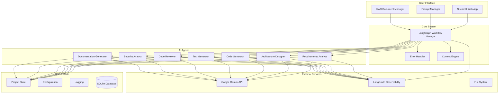

# AI Development Agent

**A comprehensive multi-agent system for automated software development, built on the LangChain + LangGraph + LangSmith ecosystem.**

## 🎯 **Project Mission**

This project creates AI systems that improve developer productivity and software quality through automated development workflows. Our mission is to:

- **Empower developers** to focus on creative problem-solving and innovation
- **Build practical tools** that streamline software development workflows
- **Establish new standards** for AI-assisted development excellence
- **Create positive impact** through better, more accessible software development
- **Provide free, open tools** that don't require expensive licenses or APIs

## ⚡ **Intelligent Context-Aware Rule System** ✅ **NEW**

The system features an **Intelligent Context-Aware Rule System** that automatically optimizes development workflows:

- **84.8% Efficiency Improvement**: Reduces active rules from 33 to 5-6 per context
- **@Keyword Control**: Use `@docs`, `@code`, `@debug`, `@agile`, etc. for precise rule selection
- **Automatic Detection**: Smart context detection from your messages and files
- **100% Accuracy**: Perfect keyword recognition with intelligent fallbacks
- **Agent-Ready Architecture**: Foundation for future multi-agent coordination

**Quick Start**: Simply use `@docs` for documentation work, `@code` for development, or `@debug` for troubleshooting to automatically load the optimal rule set for your task.

## 🏗️ **System Architecture**

The AI Development Agent uses a sophisticated multi-agent architecture built on the LangChain + LangGraph + LangSmith ecosystem:



## 🚀 **Quick Start**

### Prerequisites
- Python 3.8+
- Google Gemini API key (free tier available)
- Git

### Installation

1. **Clone the repository**
   ```bash
   git clone <repository-url>
   cd ai-dev-agent
   ```

2. **Create virtual environment**
   ```bash
   python -m venv venv
   source venv/bin/activate  # On Windows: venv\Scripts\activate
   ```

3. **Install dependencies**
   ```bash
   pip install -r requirements.txt
   ```

### Configuration

#### API Key Setup

The system uses **Streamlit's built-in secrets management** for secure API key handling.

**Create `.streamlit/secrets.toml`:**
```toml
GEMINI_API_KEY = "your-actual-gemini-api-key-here"
```

**Getting Your Free Gemini API Key:**
1. Visit [Google AI Studio](https://makersuite.google.com/app/apikey)
2. Sign in with your Google account
3. Click "Create API Key"
4. Copy the generated key
5. Add it to your `secrets.toml` file

### Usage

#### Web Interface (Recommended)
```bash
streamlit run apps/streamlit_app.py
```

This opens the web application at `http://localhost:8501` where you can:
- Configure your API key
- Enter project descriptions
- Start development workflows
- View generated files
- Manage system prompts and agent prompts
- Add RAG documents for enhanced knowledge retrieval

#### Programmatic Usage
```python
import asyncio
from apps.main import AIDevelopmentAgent
from models.config import load_config_from_env

async def main():
    config = load_config_from_env()
    agent = AIDevelopmentAgent(config)
    
    result = await agent.execute_workflow(
        project_context="Create a REST API for user management...",
        project_name="user-management-api",
        output_dir="./generated_projects/user-management-api"
    )
    
    print(f"Workflow completed: {result.status}")

if __name__ == "__main__":
    asyncio.run(main())
```

## 🔍 **Core Features**

### **Multi-Agent Development Workflow**
- **Requirements Analyst**: Transforms project descriptions into detailed specifications
- **Architecture Designer**: Designs system architecture and technology stack
- **Code Generator**: Generates source code based on requirements
- **Test Generator**: Creates comprehensive test suites
- **Code Reviewer**: Analyzes code quality and suggests improvements
- **Security Analyst**: Identifies vulnerabilities and security issues
- **Documentation Generator**: Creates project documentation

### **Advanced Capabilities**
- **LangGraph Workflow Orchestration**: Stateful workflow management with persistence
- **Gemini API Integration**: AI-powered code generation and analysis
- **Human-in-the-Loop**: Approval mechanisms for critical decisions
- **Error Recovery**: Retry logic and comprehensive error handling
- **Context Awareness**: Codebase indexing and context retrieval
- **Prompt Management System**: Database-driven prompt storage and optimization
- **RAG Document Management**: URL scraping and file-based knowledge retrieval
- **LangSmith Observability**: Comprehensive agent logging and monitoring

### **Web Interface Features**
1. **🚀 Main App**: Core project generation workflow
2. **🔧 Prompt Manager**: Edit and manage agent prompts
3. **📚 RAG Documents**: Add and manage knowledge documents
4. **⚙️ System Prompts**: Manage system-wide prompts

## 📊 **Monitoring and Observability**

### LangSmith Integration
All agent executions, workflow steps, and LLM calls are automatically logged and can be viewed at:
**🌐 [https://smith.langchain.com/](https://smith.langchain.com/)**

**What You Can Monitor:**
- Agent executions with detailed input/output logs
- Workflow progression with state changes
- Individual LLM calls with prompts and responses
- Comprehensive error tracking with context
- Performance metrics and analytics
- Complete session history for debugging

## 🛡️ **Development Standards**

This project implements comprehensive development standards that ensure consistency, quality, and best practices through automated rule enforcement.

### **Core Standards**
- **AI Model Selection**: Standardized LLM model selection using Gemini 2.5 Flash/Flash-Lite
- **Framework Standards**: LangChain + LangGraph + LangSmith implementation standards
- **Error Handling**: Zero-tolerance policy for silent errors and fallbacks
- **Security**: Streamlit secrets management for API keys
- **Testing**: Comprehensive test structure with unit/integration/system tests
- **Documentation**: Live documentation updates with comprehensive coverage

### **Quality Assurance**
- **Zero Failing Tests**: All tests must pass before any code changes
- **Comprehensive Test Coverage**: Unit, integration, and system tests for all components
- **Automated Test Monitoring**: Immediate error detection and bug fixing workflow
- **Code Quality Standards**: Pylint enforcement and naming conventions

## 📁 **Project Structure**

```
ai-dev-agent/
├── .cursor/              # Cursor IDE rules and automation
│   └── rules/            # Development rules and standards
├── agents/               # Agent implementations
│   ├── base_agent.py     # Base agent class
│   ├── requirements_analyst.py
│   ├── architecture_designer.py
│   ├── code_generator.py
│   ├── test_generator.py
│   ├── code_reviewer.py
│   ├── security_analyst.py
│   ├── documentation_generator.py
│   └── supervisor/       # Supervisor agent implementations
├── apps/                 # Application entry points
│   ├── main.py          # Main application entry point
│   ├── streamlit_app.py # Streamlit web interface
│   └── prompt_manager_app.py
├── docs/                 # Documentation
│   ├── guides/           # Implementation guides
│   ├── architecture/     # Architecture documentation
│   ├── analysis/         # Analysis documents
│   └── development/      # Development resources
├── models/               # Data models and schemas
├── prompts/              # Prompt templates and database
├── tests/                # Test suite
│   ├── unit/            # Unit tests
│   ├── integration/     # Integration tests
│   ├── system/          # System tests
│   └── langgraph/       # LangGraph tests
├── utils/                # Utility functions
├── workflow/             # Workflow management
├── requirements.txt      # Python dependencies
└── README.md            # Project documentation
```

## 🔧 **Development**

### **Running Tests**
```bash
# Run all tests
python -m pytest tests/

# Run specific test types
python -m pytest tests/unit/          # Unit tests
python -m pytest tests/integration/   # Integration tests  
python -m pytest tests/system/        # System tests
python -m pytest tests/langgraph/     # LangGraph tests
```

### **Development Standards**
This project follows strict development standards enforced by the Cursor Rules System:

1. **Framework-First Approach**: Always use established frameworks (LangChain, LangGraph, LangSmith)
2. **Test-Driven Development**: Write tests before implementing functionality
3. **Error Exposure**: Never use silent error handling - expose all errors immediately
4. **Standardized AI Models**: Use Gemini 2.5 Flash/Flash-Lite with standardized selection criteria
5. **Security Best Practices**: Use Streamlit secrets for all sensitive configuration

## 🤝 **Contributing**

### **Development Standards**
Before contributing, familiarize yourself with the rules in `.cursor/rules/` and ensure your code follows established patterns and conventions.

### **Contribution Process**
1. Fork the repository
2. Create a feature branch
3. Follow development rules and ensure code adheres to all automated rules
4. Write comprehensive tests for new functionality
5. Run full test suite and ensure all tests pass
6. Update documentation to reflect changes
7. Submit a pull request

### **Key Rules to Follow**
- **Framework Standards**: Use LangChain + LangGraph + LangSmith over custom implementations
- **Error Handling**: Never use silent error handling - expose all errors immediately
- **AI Model Selection**: Use standardized Gemini model selection patterns
- **Security**: Use Streamlit secrets for all sensitive configuration
- **Testing**: Maintain zero failing tests policy
- **Documentation**: Keep all documentation up-to-date and synchronized

## 📄 **License**

This project is licensed under the MIT License - see the LICENSE file for details.

## 🙏 **Acknowledgments**

- **Google Gemini API** for AI capabilities
- **LangGraph** for workflow orchestration
- **Streamlit** for the web interface
- **Cursor IDE** for AI-powered development
- **BeautifulSoup4** for web scraping capabilities
- **SQLite** for reliable database storage

## 📞 **Support**

For issues and questions:
1. Check the troubleshooting section above
2. Review the logs in the `logs/` directory
3. Open an issue on GitHub with detailed information

---

**Note**: This system generates code based on AI analysis. Always review generated code before deploying to production environments.
