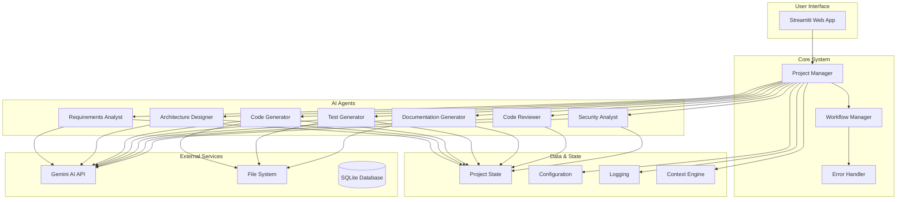

# AI Development Agent

A multi-agent system for automated software development using LangGraph and Google's Gemini API. This system implements a workflow-based approach to streamline software development tasks.

## 🚀 Features

### Core Capabilities
- **Multi-Agent Architecture**: Specialized agents for different development phases
- **LangGraph Workflow Orchestration**: Workflow management with state persistence
- **Gemini API Integration**: AI-powered code generation and analysis
- **Human-in-the-Loop**: Approval mechanisms for critical decisions
- **Error Recovery**: Retry logic and error handling
- **Context Awareness**: Codebase indexing and context retrieval
- **Streamlit Web Interface**: User-friendly web application
- **Prompt Management System**: Database-driven prompt storage
- **RAG Document Management**: URL scraping and file-based knowledge retrieval
- **Comprehensive Testing**: Test suite with unit, integration, and system tests
- **Structured Output Parsing**: JSON-based parsing with fallback mechanisms

### Specialized Agents
1. **Requirements Analyst**: Transforms project descriptions into detailed specifications
2. **Architecture Designer**: Designs system architecture and technology stack
3. **Code Generator**: Generates source code based on requirements
4. **Test Generator**: Creates test suites with coverage
5. **Code Reviewer**: Analyzes code quality and suggests improvements
6. **Security Analyst**: Identifies vulnerabilities and security issues
7. **Documentation Generator**: Creates project documentation

## 🏗️ Architecture

### System Overview

The AI Development Agent system uses a workflow-based architecture with specialized AI agents that work together to transform project requirements into complete applications.



### Workflow Process

The system follows a sequential workflow where each agent builds upon the output of previous agents:

1. **Requirements Analysis** → Extract detailed requirements from project description
2. **Architecture Design** → Design system architecture and technology stack
3. **Code Generation** → Generate source code
4. **Test Generation** → Create test suites
5. **Code Review** → Analyze code quality and suggest improvements
6. **Security Analysis** → Identify and fix security vulnerabilities
7. **Documentation** → Generate project documentation

## 📋 Prerequisites

- Python 3.8+
- Google Gemini API key
- Git

## 🛠️ Installation

1. **Clone the repository**
   ```bash
   git clone <repository-url>
   cd ai-dev-agent
   ```

2. **Create virtual environment**
   ```bash
   python -m venv venv
   source venv/bin/activate  # On Windows: venv\Scripts\activate
   ```

3. **Install dependencies**
   ```bash
   pip install -r requirements.txt
   ```

## ⚙️ Configuration

### API Key Configuration

The system uses a TOML-based configuration system for managing API keys.

#### Option 1: secrets.toml (Recommended)

Create a `secrets.toml` file in the project root:

```toml
# AI Development Agent Secrets Configuration
# This file contains sensitive configuration data
# DO NOT commit this file to version control

[gemini]
api_key = "your-actual-gemini-api-key-here"
```

**Security Note**: The `secrets.toml` file is automatically ignored by git.

#### Option 2: Environment Variable

Set the `GEMINI_API_KEY` environment variable:

```bash
# Linux/macOS
export GEMINI_API_KEY="your-gemini-api-key-here"

# Windows
set GEMINI_API_KEY=your-gemini-api-key-here
```

#### Option 3: Streamlit Interface

When running the Streamlit app, if no API key is found, you'll be prompted to enter it through the web interface.

### Getting Your Gemini API Key

1. Visit [Google AI Studio](https://makersuite.google.com/app/apikey)
2. Sign in with your Google account
3. Click "Create API Key"
4. Copy the generated key
5. Add it to your `secrets.toml` file or set it as an environment variable

## 🚀 Usage

### Web Interface Features

The Streamlit web interface provides four main sections:

1. **🚀 Main App**: Core project generation workflow
2. **🔧 Prompt Manager**: Edit and manage agent prompts
3. **📚 RAG Documents**: Add and manage knowledge documents
4. **⚙️ System Prompts**: Manage system-wide prompts

### Running the Streamlit App (Recommended)

The easiest way to use the AI Development Agent is through the Streamlit web interface:

```bash
streamlit run streamlit_app.py
```

This will start the web application at `http://localhost:8501` where you can:

1. Configure your API key if not already set
2. Enter your project description
3. Configure project settings
4. Start the development workflow
5. View generated files and download the complete project
6. Manage system prompts and agent prompts
7. Add and manage RAG documents for enhanced knowledge retrieval

### Programmatic Usage

You can also use the system programmatically:

```python
import asyncio
from main import AIDevelopmentAgent
from models.config import load_config_from_env

async def main():
    # Initialize the agent
    config = load_config_from_env()
    agent = AIDevelopmentAgent(config)
    
    # Execute workflow
    result = await agent.execute_workflow(
        project_context="Create a REST API for user management...",
        project_name="user-management-api",
        output_dir="./generated_projects/user-management-api"
    )
    
    print(f"Workflow completed: {result.status}")

if __name__ == "__main__":
    asyncio.run(main())
```

## 📁 Project Structure

```
ai-dev-agent/
├── agents/                 # Agent implementations
│   ├── base_agent.py      # Base agent class
│   ├── requirements_analyst.py
│   ├── architecture_designer.py
│   ├── code_generator.py
│   ├── test_generator.py
│   ├── code_reviewer.py
│   ├── security_analyst.py
│   ├── documentation_generator.py
│   └── supervisor/        # Supervisor agent implementations
├── apps/                  # Application entry points
│   └── prompt_manager_app.py
├── context/               # Context management
│   └── context_engine.py
├── docs/                  # Documentation
│   ├── guides/            # Implementation guides
│   ├── architecture/      # Architecture documentation
│   ├── analysis/          # Analysis documents
│   ├── concepts/          # Conceptual papers
│   └── development/       # Development resources
├── generated/             # Generated files
├── generated_projects/    # Complete generated projects
├── logs/                  # Log files
├── models/                # Data models and schemas
│   ├── config.py         # Configuration management
│   ├── state.py          # Workflow state management
│   ├── supervisor_state.py
│   └── responses.py      # Response models
├── prompts/               # Prompt templates and database
│   ├── agent_prompt_loader.py
│   └── prompt_templates.db
├── tests/                 # Test suite
│   ├── unit/             # Unit tests
│   ├── integration/      # Integration tests
│   ├── system/           # System tests
│   ├── langgraph/        # LangGraph tests
│   └── supervisor/       # Supervisor tests
├── utils/                # Utility functions
│   ├── enhanced_output_parsers.py
│   ├── file_manager.py
│   ├── helpers.py
│   ├── logging_config.py
│   ├── output_parsers.py
│   ├── prompt_editor.py
│   ├── prompt_manager.py
│   ├── rag_processor.py
│   ├── structured_outputs.py
│   └── toml_config.py
├── workflow/             # Workflow management
│   ├── error_handler.py
│   ├── human_approval.py
│   ├── workflow_graph.py
│   ├── workflow_manager.py
│   ├── langgraph_workflow_manager.py
│   └── langgraph_workflow.py
├── main.py               # Main application entry point
├── streamlit_app.py      # Streamlit web interface
├── requirements.txt      # Python dependencies
└── README.md             # Project documentation
```

## 🔧 Development

### Prompt Management System

The system includes a comprehensive prompt management system:

#### Agent Prompts
- **Database Storage**: All prompts stored in SQLite database (`prompt_templates.db`)
- **Enhanced Prompts**: Structured prompts for optimal AI performance
- **Version Control**: Track prompt changes and performance metrics
- **Web Editor**: Edit prompts through the Streamlit interface

#### System Prompts
- **Category-based Organization**: Organize prompts by workflow, general, error handling
- **Template Management**: Create and edit system-wide prompt templates
- **Performance Tracking**: Monitor prompt usage and success rates

### RAG Document Management

The system supports Retrieval-Augmented Generation (RAG) for enhanced knowledge retrieval:

#### URL Document Processing
- **Web Scraping**: Extract content from web pages
- **Content Cleaning**: Remove ads, navigation, and irrelevant content
- **Metadata Extraction**: Capture titles, descriptions, and source information
- **Agent Association**: Link documents to specific agents

#### File Document Processing
- **Multiple Formats**: Support for TXT, MD, PY, JS, HTML, CSS, JSON files
- **Content Analysis**: Automatic content extraction and processing
- **Tagging System**: Organize documents with custom tags
- **Chunking**: Intelligent text chunking for optimal retrieval

### Running Tests

The project includes a comprehensive test suite:

```bash
# Run all tests
python -m pytest tests/

# Run specific test types
python -m pytest tests/unit/          # Unit tests
python -m pytest tests/integration/   # Integration tests  
python -m pytest tests/system/        # System tests
python -m pytest tests/langgraph/     # LangGraph tests
python -m pytest tests/supervisor/    # Supervisor tests
```

#### Test Organization

- **Unit Tests** (`tests/unit/`): Individual component testing
- **Integration Tests** (`tests/integration/`): Component interaction testing
- **System Tests** (`tests/system/`): End-to-end workflow testing
- **LangGraph Tests** (`tests/langgraph/`): LangGraph-specific functionality
- **Supervisor Tests** (`tests/supervisor/`): Supervisor agent testing

## 🛡️ Security

### Best Practices

- ✅ Use `secrets.toml` for local development
- ✅ Never commit `secrets.toml` to version control
- ✅ Use environment variables in production
- ✅ Rotate API keys regularly

### Troubleshooting

#### "No API key found" Error

1. Check that `secrets.toml` exists and contains a valid API key
2. Verify the API key format: `api_key = "your-key-here"`
3. Ensure the key is not the placeholder value

#### "Invalid API key" Error

1. Verify your API key is correct
2. Check that you have sufficient quota
3. Ensure the key is active in Google AI Studio

## 📊 Performance

The system is optimized for:

- **Concurrent Processing**: Multiple agents can work simultaneously
- **Memory Efficiency**: Streaming responses and efficient state management
- **Error Recovery**: Automatic retry logic with exponential backoff
- **Scalability**: Modular architecture allows for easy scaling
- **Prompt Optimization**: Database-driven prompt management

## 🔧 Recent Improvements

### Enhanced Output Parsing
- **Robust Fallback Mechanisms**: Multiple parsing strategies for AI responses
- **Structured Output Validation**: Comprehensive validation of AI-generated content
- **Error Recovery**: Automatic handling of malformed responses
- **Type Safety**: Strong typing for all structured outputs

### Test Infrastructure
- **Organized Test Structure**: Clear separation of unit, integration, and system tests
- **Comprehensive Coverage**: Full workflow testing with real LLM integration
- **Artifact Verification**: Automated verification of generated artifacts
- **Error Scenario Testing**: Testing of edge cases and error conditions

## 🤝 Contributing

1. Fork the repository
2. Create a feature branch
3. Make your changes
4. Add tests for new functionality
5. Submit a pull request

## 📄 License

This project is licensed under the MIT License - see the LICENSE file for details.

## 🙏 Acknowledgments

- Google Gemini API for AI capabilities
- LangGraph for workflow orchestration
- Streamlit for the web interface
- BeautifulSoup4 for web scraping capabilities
- SQLite for reliable database storage

## 📞 Support

For issues and questions:

1. Check the troubleshooting section above
2. Review the logs in the `logs/` directory
3. Open an issue on GitHub with detailed information

---

**Note**: This system generates code based on AI analysis. Always review generated code before deploying to production environments.
