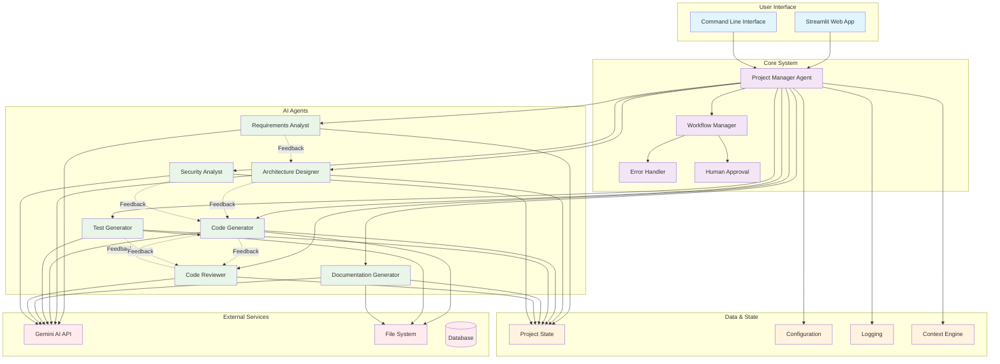
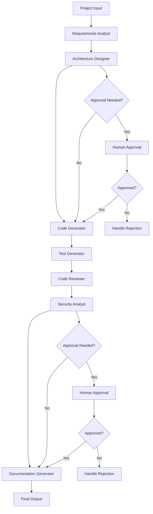
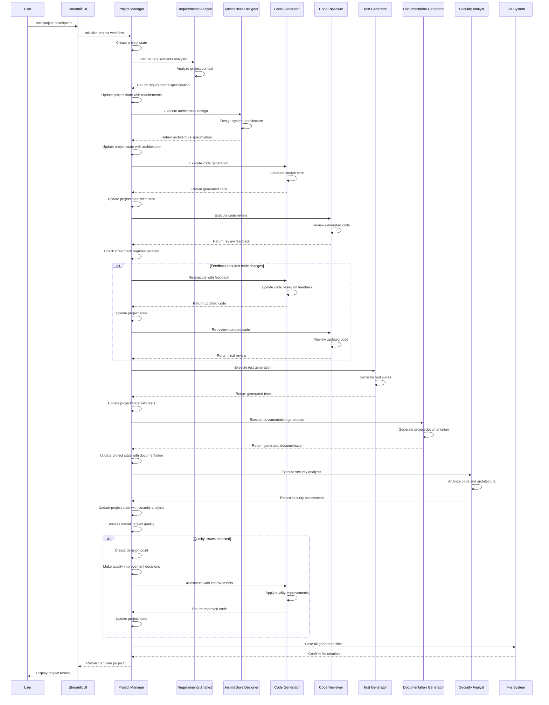
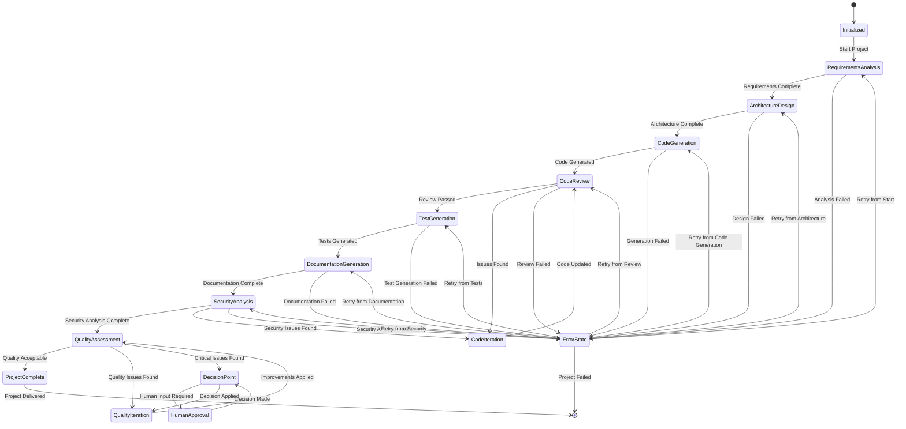

# AI Development Agent

A comprehensive Multi-Agent System (MAS) for automated software development using LangGraph and Google's Gemini API. This system implements the principles outlined in AI-powered software development frameworks to streamline the entire Software Development Lifecycle (SDLC).

## 🚀 Features

### Core Capabilities
- **Multi-Agent Architecture**: Specialized agents for each phase of development
- **LangGraph Workflow Orchestration**: Robust workflow management with state persistence
- **Gemini API Integration**: Advanced AI-powered code generation and analysis
- **Human-in-the-Loop**: Built-in approval mechanisms for critical decisions
- **Error Recovery**: Automatic retry logic and error handling
- **Context Awareness**: Intelligent codebase indexing and context retrieval
- **Streamlit Web Interface**: User-friendly web application for project generation
- **Prompt Management System**: Database-driven prompt storage and editing capabilities
- **RAG Document Management**: Support for URL scraping and file-based knowledge retrieval
- **Enhanced Prompt System**: High-quality, structured prompts for improved AI performance

### Specialized Agents
1. **Requirements Analyst**: Transforms high-level ideas into detailed specifications
2. **Architecture Designer**: Designs optimal system architecture and technology stack
3. **Code Generator**: Generates production-ready code based on requirements
4. **Test Generator**: Creates comprehensive test suites with high coverage
5. **Code Reviewer**: Analyzes code quality and suggests improvements
6. **Security Analyst**: Identifies vulnerabilities and security issues
7. **Documentation Generator**: Creates comprehensive documentation

## 🏗️ Architecture

### System Overview

The AI Development Agent system is a sophisticated multi-agent architecture designed to automate the entire software development lifecycle. The system uses specialized AI agents that work together in a coordinated workflow to transform high-level project requirements into complete, production-ready applications.



### System Components

#### User Interface Layer
- **Streamlit Web App**: Primary web interface for project creation and management
- **Command Line Interface**: Alternative interface for automation and scripting

#### Core System Layer
- **Project Manager Agent**: Orchestrates the entire development workflow
- **Workflow Manager**: Manages the execution flow and agent coordination
- **Error Handler**: Handles errors and exceptions gracefully
- **Human Approval**: Manages points where human intervention is required

#### AI Agents Layer
- **Requirements Analyst**: Analyzes project requirements and creates specifications
- **Architecture Designer**: Designs system architecture and technical decisions
- **Code Generator**: Generates source code based on requirements and architecture
- **Test Generator**: Creates comprehensive test suites
- **Documentation Generator**: Generates project documentation
- **Code Reviewer**: Reviews code quality and provides feedback
- **Security Analyst**: Analyzes security aspects and vulnerabilities

#### Data & State Layer
- **Project State**: Maintains the current state of the project
- **Configuration**: Manages system configuration and settings
- **Logging**: Provides comprehensive logging and monitoring
- **Context Engine**: Manages context and knowledge sharing between agents

#### External Services
- **Gemini AI API**: Provides AI capabilities for all agents
- **File System**: Stores generated project files
- **Database**: Stores project metadata and configurations

### Agent Workflow

The system follows a sequential workflow where each agent builds upon the output of previous agents:



### Workflow Process

### Workflow Process
1. **Requirements Analysis** → Extract detailed requirements from project description
2. **Architecture Design** → Design system architecture and technology stack
3. **Code Generation** → Generate production-ready code
4. **Test Generation** → Create comprehensive test suites
5. **Code Review** → Analyze code quality and suggest improvements
6. **Security Analysis** → Identify and fix security vulnerabilities
7. **Documentation** → Generate comprehensive documentation

### Detailed Workflow Sequence

The following sequence diagram illustrates the detailed interaction flow between all system components:



### Workflow State Management

The system uses a sophisticated state machine to manage the workflow progression and handle various scenarios:



### Key Features

#### Feedback Loops
The system implements sophisticated feedback loops where agents can provide feedback to each other:
- Requirements Analyst → Architecture Designer
- Architecture Designer → Code Generator
- Code Generator → Code Reviewer
- Code Reviewer → Code Generator (iterative improvement)
- Security Analyst → Code Generator
- Test Generator → Code Reviewer

#### Decision Management
The Project Manager Agent can intervene when:
- Agents disagree on technical decisions
- Quality thresholds are not met
- Human approval is required for critical decisions
- Iteration limits are reached

#### State Management
All agents work with a shared Project State that maintains:
- Current requirements and specifications
- Architecture decisions and diagrams
- Generated code and files
- Test results and coverage
- Documentation artifacts
- Review feedback and decisions

## 📋 Prerequisites

- Python 3.8+
- Google Gemini API key
- Git

## 🛠️ Installation

1. **Clone the repository**
   ```bash
   git clone <repository-url>
   cd ai-dev-agent
   ```

2. **Create virtual environment**
   ```bash
   python -m venv venv
   source venv/bin/activate  # On Windows: venv\Scripts\activate
   ```

3. **Install dependencies**
   ```bash
   pip install -r requirements.txt
   ```

## ⚙️ Configuration

### API Key Configuration

The AI Development Agent uses a secure TOML-based configuration system for managing API keys and sensitive data.

#### Option 1: secrets.toml (Recommended)

Create a `secrets.toml` file in the project root:

```toml
# AI Development Agent Secrets Configuration
# This file contains sensitive configuration data
# DO NOT commit this file to version control

[gemini]
api_key = "your-actual-gemini-api-key-here"

# Add other secrets as needed
[secrets]
# Add any other sensitive configuration here
```

**Security Note**: The `secrets.toml` file is automatically ignored by git to prevent accidental commits.

#### Option 2: Environment Variable

Set the `GEMINI_API_KEY` environment variable:

```bash
# Linux/macOS
export GEMINI_API_KEY="your-gemini-api-key-here"

# Windows
set GEMINI_API_KEY=your-gemini-api-key-here
```

#### Option 3: Streamlit Interface

When running the Streamlit app, if no API key is found, you'll be prompted to enter it through the web interface. The key will be automatically saved to `secrets.toml`.

### Configuration Priority

The system loads the API key in the following order:

1. **secrets.toml** (highest priority)
2. **GEMINI_API_KEY environment variable**
3. **Streamlit interface input** (if no key found)

### Getting Your Gemini API Key

1. Visit [Google AI Studio](https://makersuite.google.com/app/apikey)
2. Sign in with your Google account
3. Click "Create API Key"
4. Copy the generated key
5. Add it to your `secrets.toml` file or set it as an environment variable

## 🚀 Usage

### Web Interface Features

The Streamlit web interface provides four main sections:

1. **🚀 Main App**: Core project generation workflow
2. **🔧 Prompt Manager**: Edit and manage agent prompts
3. **📚 RAG Documents**: Add and manage knowledge documents
4. **⚙️ System Prompts**: Manage system-wide prompts

### Prompt Management System

The AI Development Agent includes a comprehensive prompt management system:

#### Agent Prompts
- **Database Storage**: All prompts are stored in SQLite database (`prompt_templates.db`)
- **Enhanced Prompts**: High-quality, structured prompts for optimal AI performance
- **Version Control**: Track prompt changes and performance metrics
- **Web Editor**: Edit prompts directly through the Streamlit interface

#### System Prompts
- **Category-based Organization**: Organize prompts by workflow, general, error handling, etc.
- **Template Management**: Create and edit system-wide prompt templates
- **Performance Tracking**: Monitor prompt usage and success rates

### RAG Document Management

The system supports Retrieval-Augmented Generation (RAG) for enhanced knowledge retrieval:

#### URL Document Processing
- **Web Scraping**: Extract content from web pages
- **Content Cleaning**: Remove ads, navigation, and irrelevant content
- **Metadata Extraction**: Capture titles, descriptions, and source information
- **Agent Association**: Link documents to specific agents for targeted retrieval

#### File Document Processing
- **Multiple Formats**: Support for TXT, MD, PY, JS, HTML, CSS, JSON files
- **Content Analysis**: Automatic content extraction and processing
- **Tagging System**: Organize documents with custom tags
- **Chunking**: Intelligent text chunking for optimal retrieval

#### Document Management Features
- **Search and Filter**: Find documents by agent, tags, or content
- **Content Preview**: View document content before processing
- **Bulk Operations**: Process multiple documents efficiently
- **Performance Metrics**: Track document usage and retrieval success

### Running the Streamlit App (Recommended)

The easiest way to use the AI Development Agent is through the Streamlit web interface:

```bash
streamlit run streamlit_app.py
```

This will start the web application at `http://localhost:8501` where you can:

1. Configure your API key if not already set
2. Enter your project description
3. Configure project settings
4. Start the development workflow
5. View generated files and download the complete project
6. Manage system prompts and agent prompts
7. Add and manage RAG documents for enhanced knowledge retrieval

### Programmatic Usage

You can also use the system programmatically:

```python
import asyncio
from main import AIDevelopmentAgent
from models.config import load_config_from_env

async def main():
    # Initialize the agent
    config = load_config_from_env()
    agent = AIDevelopmentAgent(config)
    
    # Execute workflow
    result = await agent.execute_workflow(
        project_context="Create a REST API for user management...",
        project_name="user-management-api",
        output_dir="./generated_projects/user-management-api"
    )
    
    print(f"Workflow completed: {result.status}")

if __name__ == "__main__":
    asyncio.run(main())
```

## 📁 Project Structure

### Object-Oriented Architecture

The system follows a clean object-oriented design with clear separation of concerns:

```mermaid
classDiagram
    %% Base Classes
    class BaseAgent {
        <<abstract>>
        +config: Dict[str, Any]
        +name: str
        +logger: Logger
        +logs: List[Dict]
        +decisions: List[Dict]
        +artifacts: List[Dict]
        +execute(state: ProjectState): AgentResult*
        +_log(message: str, level: str)
        +_add_decision(decision: Dict)
        +_add_artifact(artifact: Dict)
    }
    
    %% Agent Classes
    class RequirementsAnalyst {
        +execute(state: ProjectState): AgentResult
        +_analyze_requirements(context: str): Dict
        +_validate_requirements(requirements: Dict): bool
    }
    
    class ArchitectureDesigner {
        +execute(state: ProjectState): AgentResult
        +_design_architecture(requirements: Dict): Dict
        +_validate_architecture(architecture: Dict): bool
    }
    
    class CodeGenerator {
        +execute(state: ProjectState): AgentResult
        +_generate_code(requirements: Dict, architecture: Dict): Dict
        +_validate_code(code: Dict): bool
    }
    
    class TestGenerator {
        +execute(state: ProjectState): AgentResult
        +_generate_tests(code: Dict, requirements: Dict): Dict
        +_validate_tests(tests: Dict): bool
    }
    
    class DocumentationGenerator {
        +execute(state: ProjectState): AgentResult
        +_generate_documentation(project_data: Dict): Dict
        +_validate_documentation(docs: Dict): bool
    }
    
    class CodeReviewer {
        +execute(state: ProjectState): AgentResult
        +_review_code(code: Dict): Dict
        +_validate_review(review: Dict): bool
    }
    
    class SecurityAnalyst {
        +execute(state: ProjectState): AgentResult
        +_analyze_security(code: Dict, architecture: Dict): Dict
        +_validate_security_analysis(analysis: Dict): bool
    }
    
    class ProjectManagerAgent {
        +feedback_requests: List[FeedbackRequest]
        +decision_points: List[DecisionPoint]
        +agent_feedback_history: Dict[str, List[Dict]]
        +iteration_count: int
        +max_iterations: int
        +execute(state: ProjectState): AgentResult
        +_execute_development_workflow(state: ProjectState): ProjectState
        +_execute_iteration(state: ProjectState): ProjectState
        +_assess_feedback_needs(state: ProjectState): bool
        +_process_feedback_loop(state: ProjectState): ProjectState
        +_resolve_decision_points(state: ProjectState): ProjectState
        +_make_decision(decision_point: DecisionPoint): Dict
    }
    
    %% Data Classes
    class ProjectState {
        +project_name: str
        +project_context: str
        +requirements: Dict[str, Any]
        +architecture: Dict[str, Any]
        +code_files: Dict[str, str]
        +test_files: Dict[str, str]
        +documentation_files: Dict[str, str]
        +configuration_files: Dict[str, str]
        +to_dict(): Dict[str, Any]
        +from_dict(data: Dict[str, Any]): ProjectState
    }
    
    class AgentResult {
        +status: AgentStatus
        +output: Dict[str, Any]
        +documentation: Dict[str, Any]
        +execution_time: float
        +logs: List[Dict[str, Any]]
        +decisions: List[Dict[str, Any]]
        +artifacts: List[Dict[str, Any]]
    }
    
    %% Inheritance
    BaseAgent <|-- RequirementsAnalyst
    BaseAgent <|-- ArchitectureDesigner
    BaseAgent <|-- CodeGenerator
    BaseAgent <|-- TestGenerator
    BaseAgent <|-- DocumentationGenerator
    BaseAgent <|-- CodeReviewer
    BaseAgent <|-- SecurityAnalyst
    BaseAgent <|-- ProjectManagerAgent
    
    %% Relationships
    ProjectManagerAgent --> ProjectState
    RequirementsAnalyst --> ProjectState
    ArchitectureDesigner --> ProjectState
    CodeGenerator --> ProjectState
    TestGenerator --> ProjectState
    DocumentationGenerator --> ProjectState
    CodeReviewer --> ProjectState
    SecurityAnalyst --> ProjectState
    
    ProjectManagerAgent --> AgentResult
    RequirementsAnalyst --> AgentResult
    ArchitectureDesigner --> AgentResult
    CodeGenerator --> AgentResult
    TestGenerator --> AgentResult
    DocumentationGenerator --> AgentResult
    CodeReviewer --> AgentResult
    SecurityAnalyst --> AgentResult
```



### Directory Structure

```
ai-dev-agent/
├── agents/                 # Specialized agent implementations
│   ├── base_agent.py      # Base agent class
│   ├── requirements_analyst.py
│   ├── architecture_designer.py
│   ├── code_generator.py
│   ├── test_generator.py
│   ├── code_reviewer.py
│   ├── security_analyst.py
│   └── documentation_generator.py
├── models/                # Data models and configurations
│   ├── config.py         # Configuration management
│   ├── state.py          # Workflow state management
│   └── responses.py      # Response models
├── workflow/              # Workflow orchestration
│   └── workflow_graph.py # LangGraph workflow definition
├── context/              # Context engine
│   └── context_engine.py # Codebase indexing and retrieval
├── utils/                # Utility functions
│   ├── logging_config.py # Logging configuration
│   ├── file_manager.py   # File management utilities
│   ├── toml_config.py    # TOML configuration loader
│   ├── prompt_manager.py # Prompt management and database operations
│   ├── prompt_editor.py  # Prompt editing and management interface
│   └── rag_processor.py  # RAG document processing utilities
├── prompts/              # Prompt management
│   ├── agent_prompt_loader.py # Agent prompt loading system
│   └── __init__.py       # Prompt module initialization
├── streamlit_app.py      # Streamlit web interface
├── main.py              # Main application entry point
├── requirements.txt     # Python dependencies
├── secrets.toml        # API keys and secrets (create this)
├── prompt_templates.db # SQLite database for prompt storage
└── README.md           # This file
```

## 🔧 Development

### Enhanced Prompt System

The AI Development Agent uses an advanced prompt management system that prioritizes quality and performance:

#### Prompt Hierarchy
1. **Enhanced Prompts**: High-quality, structured prompts stored in the database
2. **Best Performing Prompts**: Automatically selected based on success rates
3. **Default Prompts**: Fallback prompts for basic functionality

#### Prompt Features
- **JSON Structure**: Structured output format for consistent responses
- **Variable Substitution**: Dynamic prompt customization
- **Performance Tracking**: Monitor prompt effectiveness
- **Version Management**: Track prompt changes and improvements

#### Database Schema
The `prompt_templates.db` contains:
- **Agent Prompts**: Specialized prompts for each agent
- **System Prompts**: General system prompts
- **RAG Documents**: Knowledge base documents
- **Performance Metrics**: Usage statistics and success rates

### Running Tests

```bash
python -m pytest tests/
```

### Code Quality

The project follows Python best practices and includes:

- Type hints throughout the codebase
- Comprehensive error handling
- Structured logging
- Clean architecture patterns
- Extensive documentation

## 🛡️ Security

### Best Practices

- ✅ Use `secrets.toml` for local development
- ✅ Never commit `secrets.toml` to version control
- ✅ Use environment variables in production
- ✅ Rotate API keys regularly
- ✅ Use different keys for development and production

### Troubleshooting

#### "No API key found" Error

1. Check that `secrets.toml` exists and contains a valid API key
2. Verify the API key format: `api_key = "your-key-here"`
3. Ensure the key is not the placeholder value: `"your-gemini-api-key-here"`

#### "Invalid API key" Error

1. Verify your API key is correct
2. Check that you have sufficient quota
3. Ensure the key is active in Google AI Studio

#### Prompt Management Issues

1. **Database Connection**: Ensure `prompt_templates.db` is accessible
2. **Prompt Loading**: Check that prompts are properly stored in the database
3. **Enhanced Prompts**: Verify enhanced prompts are marked with `enhanced: true` flag

#### RAG Document Issues

1. **URL Access**: Ensure URLs are accessible and not blocked
2. **File Permissions**: Check file upload permissions
3. **Content Processing**: Verify document content is in supported formats

## 📊 Performance

The system is optimized for:

- **Concurrent Processing**: Multiple agents can work simultaneously
- **Memory Efficiency**: Streaming responses and efficient state management
- **Error Recovery**: Automatic retry logic with exponential backoff
- **Scalability**: Modular architecture allows for easy scaling
- **Prompt Optimization**: Database-driven prompt management for improved performance
- **RAG Efficiency**: Intelligent document chunking and retrieval optimization

## 🤝 Contributing

1. Fork the repository
2. Create a feature branch
3. Make your changes
4. Add tests for new functionality
5. Submit a pull request

## 📄 License

This project is licensed under the MIT License - see the LICENSE file for details.

## 🙏 Acknowledgments

- Google Gemini API for AI capabilities
- LangGraph for workflow orchestration
- Streamlit for the web interface
- BeautifulSoup4 for web scraping capabilities
- SQLite for reliable database storage
- The open-source community for inspiration and tools

## 📞 Support

For issues and questions:

1. Check the troubleshooting section above
2. Review the logs in the `logs/` directory
3. Open an issue on GitHub with detailed information

---

**Note**: This system generates code based on AI analysis. Always review generated code before deploying to production environments.
