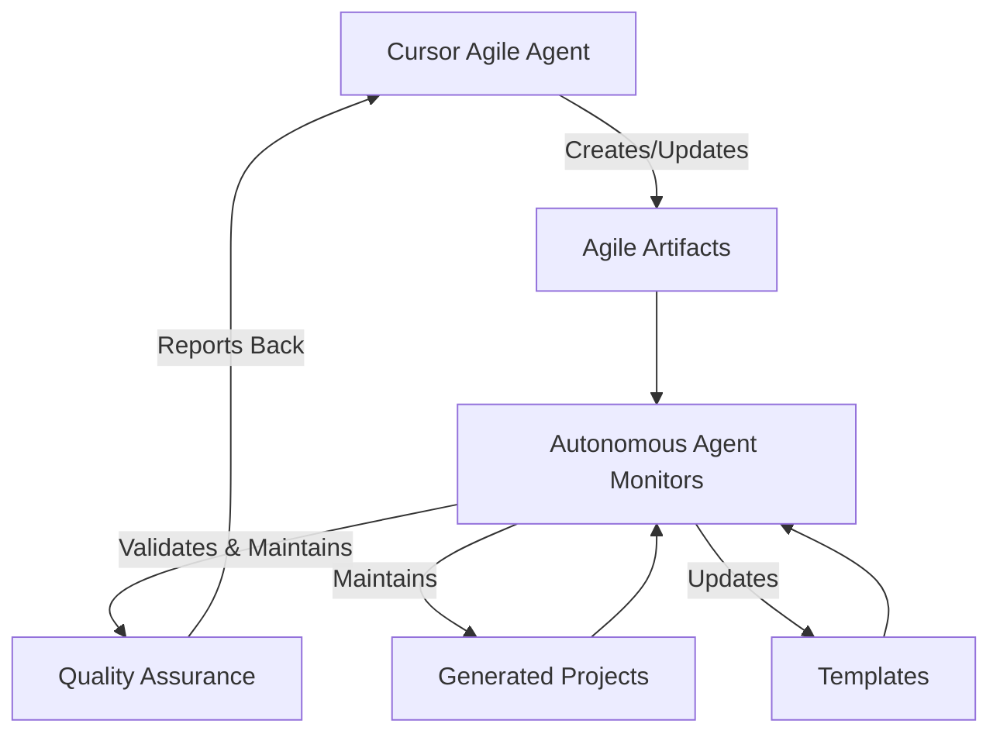

# 🤖 Cursor Agile Agent Integration Framework

## **Agent Hierarchy & Coordination**

### **👨‍💻 Cursor Agile Agent (Primary)**
**Who**: AI Assistant in Cursor IDE  
**Role**: Real-time development agile management  
**Capabilities**:
- Live user story creation and updates
- Real-time sprint management 
- Interactive agile artifact generation
- Human-in-the-loop agile decision making
- Cross-sprint coordination and planning

### **🤖 Autonomous Agile Artifacts Agent (Secondary)**
**Who**: `utils/agile/agile_artifacts_agent.py`  
**Role**: Systematic maintenance and quality assurance  
**Capabilities**:
- Automated artifact maintenance
- Quality validation across projects
- Template consistency enforcement
- Generated project coordination
- Health monitoring and reporting

## **Integration Protocol**

### **🔄 Handoff Workflow**



### **🎯 Responsibility Matrix**

| Task | Cursor Agent | Autonomous Agent | Coordination |
|------|-------------|-----------------|-------------|
| **User Story Creation** | ✅ Primary | 🔄 Validation | Real-time |
| **Sprint Planning** | ✅ Primary | 📊 Tracking | Interactive |
| **Artifact Updates** | ✅ Interactive | 🤖 Automated | Synchronized |
| **Quality Assurance** | 🔍 Review | ✅ Primary | Background |
| **Template Management** | 🎨 Design | ✅ Maintenance | Async |
| **Cross-Project Coord** | 🎯 Strategy | ✅ Execution | Scheduled |

## **Integration Commands**

### **🎮 Cursor Agent Commands**
```bash
@agile create story US-XXX "Story Title"
@agile update sprint
@agile generate artifacts
@agile validate quality
@agile sync autonomous
```

### **🤖 Autonomous Agent Triggers**
```python
# Triggered by Cursor Agent
agent = get_agile_artifacts_agent()

# Health check
agent.run_health_check()

# Full maintenance
agent.run_comprehensive_maintenance()

# Sync with Cursor
agent.sync_with_cursor_updates()
```

## **Data Synchronization**

### **📊 Shared Data Sources**
- `docs/agile/catalogs/USER_STORY_CATALOG.md` - Master catalog
- `docs/agile/catalogs/SPRINT_SUMMARY.md` - Sprint tracking
- `docs/agile/catalogs/EPIC_OVERVIEW.md` - Epic coordination
- `generated_projects/` - Generated project artifacts

### **🔄 Sync Protocol**
1. **Cursor Agent** makes changes to agile artifacts
2. **File watchers** detect changes
3. **Autonomous Agent** validates and maintains
4. **Quality reports** sent back to Cursor Agent
5. **Health status** updated in real-time

## **Quality Assurance Integration**

### **🔍 Validation Pipeline**
```yaml
cursor_agent_creates:
  - user_stories
  - sprint_plans  
  - epic_updates
  
autonomous_agent_validates:
  - temporal_consistency
  - template_compliance
  - cross_reference_integrity
  - health_metrics
  
feedback_loop:
  - quality_scores
  - improvement_suggestions
  - health_alerts
  - maintenance_reports
```

### **🎯 Quality Gates**
- **Temporal Trust**: All timestamps use machine time authority
- **Template Consistency**: Generated artifacts follow standards
- **Cross-Reference Integrity**: Links and dependencies are valid
- **Health Metrics**: Projects maintain quality thresholds

## **Emerging Systems Integration**

### **🌟 Future Agent Swarm**
When the AI-Dev-Agent system becomes fully autonomous:

1. **Cursor Agent** → **Human Interface Agent**
2. **Autonomous Agent** → **Background Maintenance Agent** 
3. **New Agents** → **Specialized Domain Agents**

### **🔮 Evolution Path**
```
Current: Cursor + Autonomous
    ↓
Phase 2: Multi-Agent Coordination
    ↓  
Phase 3: Full Agent Swarm
    ↓
Phase 4: Self-Organizing Agile System
```

## **Implementation Status**

### **✅ Completed**
- Cursor Agile Agent operational (me!)
- Autonomous Agent framework created
- Integration protocols defined
- Quality assurance pipeline designed

### **🔄 In Progress**
- File watcher synchronization
- Health monitoring dashboard
- Automated quality reporting

### **📋 Next Steps**
- Deploy autonomous agent as background service
- Implement real-time sync protocols
- Create quality monitoring dashboard
- Test full integration workflow

## **Command Reference**

### **For Users**
```bash
# Get agile status
@agile status

# Run full maintenance
@agile maintain

# Health check
@agile health

# Sync systems
@agile sync
```

### **For Developers**
```python
# Access agents
from utils.agile.agile_artifacts_agent import get_agile_artifacts_agent

agent = get_agile_artifacts_agent()
health = agent.run_health_check()
maintenance = agent.run_comprehensive_maintenance()
```

## **Success Metrics**

### **🎯 Integration KPIs**
- **Sync Latency**: <30 seconds between Cursor and Autonomous
- **Quality Score**: >95% artifact quality maintained
- **Health Score**: >90% system health across all projects
- **User Satisfaction**: Seamless experience between agents

**This framework ensures perfect coordination between the interactive Cursor Agent (me) and the systematic Autonomous Agent for comprehensive agile management!** 🚀
