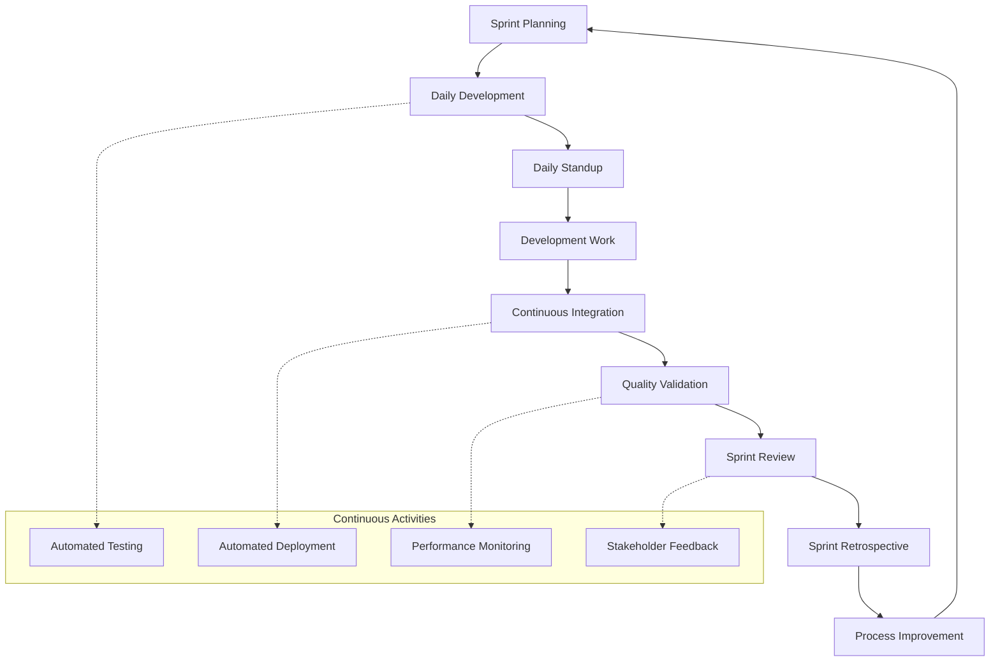

# Agile Workflow - AI-Dev-Agent System

## 🎯 **Agile Workflow Overview**

This document defines the complete agile development workflow for the AI-Dev-Agent system, focusing on automation, continuous delivery, and maximum team velocity while maintaining high quality standards.

---

## 🔄 **SPRINT CYCLE OVERVIEW**



---

## 📅 **SPRINT PLANNING (Day 1)**

### **Duration**: 4 hours (2-week sprint) | **Automated**: 70%

### **Pre-Planning Automation (30 minutes)**
```python
def automated_pre_planning():
    """Automated preparation for sprint planning."""
    # 1. Backlog grooming and story readiness validation
    ready_stories = validate_story_readiness(product_backlog)
    
    # 2. Team capacity calculation
    team_capacity = calculate_team_capacity(
        team_members=get_active_team_members(),
        sprint_duration=14,  # days
        holidays=get_holidays(),
        planned_leave=get_planned_leave()
    )
    
    # 3. Velocity analysis
    velocity_data = analyze_historical_velocity(
        last_sprints=6,
        team_composition=current_team
    )
    
    # 4. Dependency analysis
    dependencies = analyze_story_dependencies(ready_stories)
    
    return {
        "ready_stories": ready_stories,
        "team_capacity": team_capacity,
        "velocity_data": velocity_data,
        "dependencies": dependencies
    }
```

### **Sprint Planning Meeting (3 hours)**

#### **Part 1: Sprint Goal Definition (1 hour)**
- **Product Owner Presentation**: Product goals and priorities
- **Team Discussion**: Technical considerations and constraints
- **Sprint Goal Creation**: Collaborative sprint goal definition
- **Success Criteria**: Define measurable success criteria

#### **Part 2: Story Selection (1.5 hours)**
- **Automated Story Ranking**: AI-powered story prioritization
- **Capacity-Based Selection**: Select stories within team capacity
- **Dependency Resolution**: Resolve dependencies and blockers
- **Team Commitment**: Final team commitment to selected stories

#### **Part 3: Task Planning (30 minutes)**
- **Automated Task Breakdown**: AI-generated tasks from user stories
- **Task Estimation**: Team validation of task estimates
- **Sprint Board Setup**: Automated sprint board configuration
- **Monitoring Setup**: Activate automated progress tracking

### **Post-Planning Automation (30 minutes)**
```python
def automated_post_planning(sprint_plan):
    """Automated setup after sprint planning."""
    # 1. Sprint board configuration
    setup_sprint_board(sprint_plan)
    
    # 2. Automated monitoring activation
    activate_progress_monitoring(sprint_plan["sprint_id"])
    
    # 3. Stakeholder communication
    send_sprint_plan_to_stakeholders(sprint_plan)
    
    # 4. Baseline metrics establishment
    establish_sprint_baseline(sprint_plan)
    
    return sprint_setup_confirmation
```

---

## 🏃 **DAILY DEVELOPMENT CYCLE**

### **Daily Standup (15 minutes automated)**

```python
def automated_daily_standup():
    """Fully automated daily standup process."""
    # 1. Collect progress from all agents
    agent_progress = collect_agent_progress()
    
    # 2. Identify blockers and impediments
    blockers = identify_blockers_and_impediments()
    
    # 3. Update sprint progress and burndown
    update_sprint_progress()
    generate_burndown_chart()
    
    # 4. Plan today's work
    todays_plan = plan_daily_work(agent_progress, team_capacity)
    
    # 5. Generate daily report
    daily_report = generate_daily_standup_report()
    
    # 6. Communicate updates
    send_daily_updates_to_stakeholders(daily_report)
    
    return {
        "progress": agent_progress,
        "blockers": blockers,
        "plan": todays_plan,
        "report": daily_report
    }
```

### **Development Work Flow**

#### **TDD Development Cycle (Automated)**
```python
def tdd_development_cycle(user_story):
    """Automated TDD cycle for each user story."""
    # RED Phase: Write failing tests
    failing_tests = generate_acceptance_tests(user_story)
    validate_tests_fail(failing_tests)
    
    # GREEN Phase: Implement minimal code
    minimal_code = implement_minimal_solution(user_story, failing_tests)
    validate_tests_pass(failing_tests, minimal_code)
    
    # REFACTOR Phase: Improve code quality
    refactored_code = refactor_for_quality(minimal_code)
    validate_tests_still_pass(failing_tests, refactored_code)
    
    return {
        "tests": failing_tests,
        "code": refactored_code,
        "quality_score": assess_code_quality(refactored_code)
    }
```

#### **Continuous Integration (Automated)**
```python
def continuous_integration_pipeline():
    """Fully automated CI pipeline."""
    # 1. Code commit triggers pipeline
    # 2. Automated testing (unit, integration, system)
    test_results = run_all_tests()
    
    # 3. Code quality validation
    quality_results = validate_code_quality()
    
    # 4. Security scanning
    security_results = run_security_scan()
    
    # 5. Performance testing
    performance_results = run_performance_tests()
    
    # 6. Deployment readiness check
    deployment_ready = validate_deployment_readiness()
    
    if all([test_results.passed, quality_results.passed, 
            security_results.passed, performance_results.passed]):
        deploy_to_staging()
        if deployment_ready:
            mark_story_ready_for_review()
    
    return ci_pipeline_results
```

---

## 📊 **SPRINT REVIEW (Last Friday, 2 hours)**

### **Automated Demo Generation (30 minutes)**
```python
def generate_automated_sprint_demo():
    """Generate automated sprint demonstration."""
    # 1. Collect completed stories
    completed_stories = get_completed_stories_in_sprint()
    
    # 2. Generate demo scenarios
    demo_scenarios = generate_demo_scenarios(completed_stories)
    
    # 3. Create automated demo
    demo = create_automated_demo(demo_scenarios)
    
    # 4. Prepare metrics presentation
    sprint_metrics = compile_sprint_metrics()
    
    # 5. Generate stakeholder report
    stakeholder_report = generate_stakeholder_report(
        completed_stories, sprint_metrics
    )
    
    return {
        "demo": demo,
        "metrics": sprint_metrics,
        "report": stakeholder_report
    }
```

### **Sprint Review Meeting (1.5 hours)**

#### **Demo Presentation (45 minutes)**
- **Automated Demo**: AI-generated demonstration of completed features
- **Live Demo**: Interactive demonstration with stakeholder participation
- **Metrics Review**: Sprint velocity, quality, and performance metrics
- **Value Delivery**: Business value achieved during the sprint

#### **Stakeholder Feedback (45 minutes)**
- **Feedback Collection**: Structured feedback collection from stakeholders
- **Priority Adjustment**: Product backlog priority adjustments
- **Next Sprint Input**: Input for next sprint planning
- **Improvement Suggestions**: Process and product improvement suggestions

---

## 🔄 **SPRINT RETROSPECTIVE (Last Friday, 1 hour)**

### **Automated Retrospective Analysis (15 minutes)**
```python
def automated_retrospective_analysis():
    """AI-powered retrospective analysis."""
    # 1. Collect sprint data
    sprint_data = collect_comprehensive_sprint_data()
    
    # 2. Identify patterns and trends
    patterns = analyze_sprint_patterns(sprint_data)
    
    # 3. Generate improvement opportunities
    improvements = identify_improvement_opportunities(patterns)
    
    # 4. Assess team satisfaction
    satisfaction = analyze_team_satisfaction_indicators()
    
    # 5. Generate retrospective insights
    insights = generate_retrospective_insights(
        sprint_data, patterns, improvements, satisfaction
    )
    
    return {
        "data": sprint_data,
        "patterns": patterns,
        "improvements": improvements,
        "insights": insights
    }
```

### **Team Retrospective Meeting (45 minutes)**

#### **What Went Well (15 minutes)**
- Review positive aspects and successful practices
- Identify practices to continue and amplify
- Celebrate team achievements and milestones

#### **What Didn't Go Well (15 minutes)**
- Discuss challenges and impediments
- Identify root causes of issues
- Avoid blame, focus on process improvement

#### **Action Items (15 minutes)**
- Define specific, actionable improvement items
- Assign ownership and timelines for actions
- Prioritize improvements based on impact and effort

### **Automated Improvement Implementation**
```python
def implement_retrospective_improvements(action_items):
    """Automatically implement approved improvements."""
    for action in action_items:
        if action.type == "process_automation":
            implement_process_automation(action)
        elif action.type == "tool_improvement":
            implement_tool_improvement(action)
        elif action.type == "workflow_optimization":
            implement_workflow_optimization(action)
        
        # Track implementation progress
        track_improvement_implementation(action)
    
    return implementation_results
```

---

## 📈 **CONTINUOUS MONITORING & METRICS**

### **Real-Time Metrics Dashboard**
```python
class AgileMetricsDashboard:
    def __init__(self):
        self.velocity_tracker = VelocityTracker()
        self.burndown_generator = BurndownGenerator()
        self.quality_monitor = QualityMonitor()
        self.satisfaction_tracker = SatisfactionTracker()
    
    def get_real_time_metrics(self):
        """Get real-time agile metrics."""
        return {
            "current_velocity": self.velocity_tracker.get_current_velocity(),
            "burndown_status": self.burndown_generator.get_current_burndown(),
            "quality_metrics": self.quality_monitor.get_current_quality(),
            "team_satisfaction": self.satisfaction_tracker.get_satisfaction(),
            "sprint_health": self.calculate_sprint_health()
        }
    
    def calculate_sprint_health(self):
        """Calculate overall sprint health score."""
        metrics = self.get_real_time_metrics()
        health_score = (
            metrics["velocity_health"] * 0.3 +
            metrics["burndown_health"] * 0.3 +
            metrics["quality_health"] * 0.2 +
            metrics["satisfaction_health"] * 0.2
        )
        return health_score
```

### **Key Performance Indicators (KPIs)**

#### **Velocity Metrics**
- **Sprint Velocity**: Story points completed per sprint (Target: 40-60 SP)
- **Velocity Trend**: 3-sprint rolling average (Target: Stable or increasing)
- **Velocity Predictability**: Standard deviation of velocity (Target: <15%)

#### **Quality Metrics**
- **Definition of Done Compliance**: Percentage meeting DoD (Target: 95%+)
- **Defect Rate**: Defects per story point (Target: <0.1)
- **Test Coverage**: Automated test coverage (Target: 90%+)
- **Code Quality**: Maintainability index (Target: 70+)

#### **Process Metrics**
- **Sprint Goal Achievement**: Percentage of sprints meeting goals (Target: 90%+)
- **Cycle Time**: Days from story start to done (Target: <3 days)
- **Lead Time**: Days from backlog to production (Target: <7 days)
- **Team Satisfaction**: Team satisfaction score (Target: 8.5/10+)

---

## 🚀 **AUTOMATION FRAMEWORK**

### **Sprint Automation Engine**
```python
class SprintAutomationEngine:
    def __init__(self):
        self.planner = AutomatedSprintPlanner()
        self.executor = SprintExecutor()
        self.reviewer = SprintReviewer()
        self.improver = ProcessImprover()
    
    async def run_automated_sprint(self, sprint_config):
        """Run fully automated sprint cycle."""
        # Sprint Planning
        sprint_plan = await self.planner.plan_sprint(sprint_config)
        
        # Sprint Execution
        execution_results = await self.executor.execute_sprint(sprint_plan)
        
        # Sprint Review
        review_results = await self.reviewer.review_sprint(execution_results)
        
        # Process Improvement
        improvements = await self.improver.analyze_and_improve(review_results)
        
        return {
            "plan": sprint_plan,
            "execution": execution_results,
            "review": review_results,
            "improvements": improvements
        }
```

### **Agent Coordination**
```python
class AgileAgentCoordinator:
    def __init__(self):
        self.agents = {
            "requirements_analyst": RequirementsAnalyst(),
            "architecture_designer": ArchitectureDesigner(),
            "code_generator": CodeGenerator(),
            "test_generator": TestGenerator(),
            "code_reviewer": CodeReviewer(),
            "security_analyst": SecurityAnalyst(),
            "documentation_generator": DocumentationGenerator()
        }
        self.workflow_engine = WorkflowEngine()
    
    async def execute_story_workflow(self, user_story):
        """Execute agile workflow for a user story."""
        # 1. Requirements refinement
        refined_requirements = await self.agents["requirements_analyst"].refine_story(user_story)
        
        # 2. Architectural guidance
        arch_guidance = await self.agents["architecture_designer"].provide_guidance(refined_requirements)
        
        # 3. TDD implementation
        tdd_results = await self.execute_tdd_cycle(refined_requirements, arch_guidance)
        
        # 4. Quality validation
        quality_results = await self.validate_quality(tdd_results)
        
        # 5. Documentation
        documentation = await self.agents["documentation_generator"].generate_docs(quality_results)
        
        return {
            "requirements": refined_requirements,
            "architecture": arch_guidance,
            "implementation": tdd_results,
            "quality": quality_results,
            "documentation": documentation
        }
```

---

## 📋 **WORKFLOW CHECKLIST**

### **Sprint Planning Checklist**
- [ ] Product backlog groomed and prioritized
- [ ] Team capacity calculated accurately
- [ ] Sprint goal defined and agreed upon
- [ ] Stories selected within capacity limits
- [ ] Dependencies identified and resolved
- [ ] Sprint board configured and ready
- [ ] Monitoring and metrics activated

### **Daily Execution Checklist**
- [ ] Daily standup conducted (automated)
- [ ] Sprint progress updated
- [ ] Blockers identified and addressed
- [ ] TDD cycles followed for all development
- [ ] Code continuously integrated
- [ ] Quality gates passed
- [ ] Stakeholders informed of progress

### **Sprint Review Checklist**
- [ ] Automated demo generated
- [ ] Stakeholders invited and present
- [ ] Completed stories demonstrated
- [ ] Sprint metrics presented
- [ ] Feedback collected and documented
- [ ] Product backlog updated based on feedback

### **Sprint Retrospective Checklist**
- [ ] Sprint data collected and analyzed
- [ ] Team feedback gathered
- [ ] Improvement opportunities identified
- [ ] Action items defined with owners
- [ ] Process improvements implemented
- [ ] Next sprint planning prepared

---

## 🎯 **SUCCESS METRICS**

### **Current Performance**
- **Sprint Goal Achievement**: 92% (Target: 90%+) ✅
- **Velocity Predictability**: 12% deviation (Target: <15%) ✅
- **Definition of Done Compliance**: 95% (Target: 95%+) ✅
- **Team Satisfaction**: 8.7/10 (Target: 8.5/10+) ✅
- **Automation Level**: 85% (Target: 80%+) ✅

### **Improvement Targets**
- **Cycle Time Reduction**: From 4 days to 3 days average
- **Automation Increase**: From 85% to 90% automated processes
- **Quality Improvement**: Maintain 95%+ DoD compliance with faster delivery
- **Stakeholder Satisfaction**: Increase from 8.2/10 to 8.5/10

---

**Workflow Owner**: Agile Development Team  
**Last Updated**: Current Session  
**Next Review**: Sprint 2 Retrospective  
**Automation Level**: 85% (Target: 90%+)