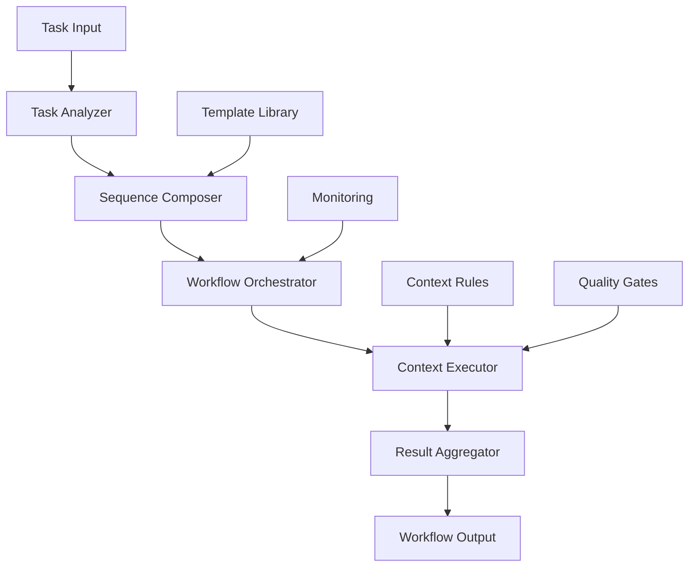

# Keyword Sequence System Design

**Document Type**: Technical Design  
**Epic**: Epic 6 - Full Cursor Automation & Intelligent Workflow Orchestration  
**User Story**: US-AUTO-001 - Full Cursor Automation with Workflow Composition  
**Status**: 📋 **DRAFT**  
**Version**: 1.0  
**Last Updated**: 2025-01-31

## 🎯 **Design Overview**

This document defines the technical design for the **Keyword Sequence System** - the core engine that intelligently composes different @keyword contexts, roles, and perspectives in optimal sequences to transform single task requests into complete development workflows.

## 🏗️ **System Architecture**

### **High-Level Architecture**



### **Core Components**

#### **1. Task Analysis Engine**
**Purpose**: Understand task requirements and determine needed contexts
**Location**: `workflow/analysis/task_analyzer.py`

```python
class TaskAnalyzer:
    """
    Analyzes natural language task descriptions to extract requirements,
    complexity, and determine optimal @keyword sequence composition.
    """
    
    def analyze_task(self, task_description: str) -> TaskAnalysis:
        """
        Analyze task and extract structured information.
        
        Returns:
            TaskAnalysis with type, complexity, entities, and requirements
        """
        
    def determine_required_contexts(self, analysis: TaskAnalysis) -> List[str]:
        """
        Determine which @keyword contexts are needed for task completion.
        
        Returns:
            List of required context names (e.g., ['AGILE', 'CODE', 'TEST'])
        """
        
    def assess_complexity(self, task_description: str) -> ComplexityLevel:
        """
        Assess task complexity to guide sequence optimization.
        
        Returns:
            ComplexityLevel (SIMPLE, MEDIUM, COMPLEX, ENTERPRISE)
        """
```

#### **2. Sequence Composition Engine**
**Purpose**: Compose optimal sequences of @keyword contexts
**Location**: `workflow/composition/sequence_composer.py`

```python
class SequenceComposer:
    """
    Intelligently composes optimal sequences of @keyword contexts
    based on task analysis, dependencies, and proven patterns.
    """
    
    def compose_sequence(self, required_contexts: List[str], 
                        task_analysis: TaskAnalysis) -> WorkflowSequence:
        """
        Compose optimal sequence of contexts for task execution.
        
        Returns:
            WorkflowSequence with ordered phases and dependencies
        """
        
    def optimize_sequence(self, sequence: WorkflowSequence) -> WorkflowSequence:
        """
        Optimize sequence for efficiency and quality.
        
        Returns:
            Optimized WorkflowSequence
        """
        
    def validate_sequence(self, sequence: WorkflowSequence) -> ValidationResult:
        """
        Validate sequence completeness and correctness.
        
        Returns:
            ValidationResult with success status and issues
        """
```

#### **3. Context Orchestration Engine**
**Purpose**: Execute workflows across multiple @keyword contexts
**Location**: `workflow/orchestration/context_orchestrator.py`

```python
class ContextOrchestrator:
    """
    Manages execution of workflows across multiple @keyword contexts
    with state management, result propagation, and error handling.
    """
    
    def execute_workflow(self, sequence: WorkflowSequence) -> WorkflowResult:
        """
        Execute complete workflow sequence with context transitions.
        
        Returns:
            WorkflowResult with outputs from all phases
        """
        
    def transition_context(self, from_context: str, to_context: str, 
                          state: WorkflowState) -> TransitionResult:
        """
        Manage transition between contexts with state preservation.
        
        Returns:
            TransitionResult with updated state and status
        """
        
    def handle_failure(self, context: str, error: Exception, 
                      state: WorkflowState) -> RecoveryAction:
        """
        Handle context execution failures with recovery strategies.
        
        Returns:
            RecoveryAction (RETRY, SKIP, ROLLBACK, ABORT)
        """
```

## 📋 **Data Models**

### **Task Analysis Model**

```python
@dataclass
class TaskAnalysis:
    """Structured analysis of task requirements."""
    task_id: str
    task_type: TaskType  # FEATURE, BUG_FIX, REFACTOR, RESEARCH, etc.
    complexity: ComplexityLevel  # SIMPLE, MEDIUM, COMPLEX, ENTERPRISE
    description: str
    entities: List[Entity]  # Technologies, components, requirements
    requirements: List[Requirement]
    constraints: List[Constraint]
    estimated_effort: int  # Story points
    risk_level: RiskLevel  # LOW, MEDIUM, HIGH, CRITICAL

@dataclass
class Entity:
    """Key entity extracted from task description."""
    name: str
    type: EntityType  # TECHNOLOGY, COMPONENT, FEATURE, etc.
    confidence: float
    context_relevance: Dict[str, float]  # Relevance to each context

@dataclass
class Requirement:
    """Functional or non-functional requirement."""
    description: str
    type: RequirementType  # FUNCTIONAL, PERFORMANCE, SECURITY, etc.
    priority: Priority  # MUST_HAVE, SHOULD_HAVE, COULD_HAVE
    contexts: List[str]  # Contexts that address this requirement
```

### **Workflow Sequence Model**

```python
@dataclass
class WorkflowSequence:
    """Ordered sequence of workflow phases."""
    sequence_id: str
    task_analysis: TaskAnalysis
    phases: List[WorkflowPhase]
    dependencies: Dict[str, List[str]]  # Phase dependencies
    parallel_groups: List[List[str]]  # Phases that can run in parallel
    estimated_duration: int  # Minutes
    quality_gates: List[QualityGate]

@dataclass
class WorkflowPhase:
    """Individual phase in workflow sequence."""
    phase_id: str
    context: str  # @keyword context (AGILE, CODE, TEST, etc.)
    description: str
    inputs: List[str]  # Required inputs from previous phases
    outputs: List[str]  # Expected outputs
    quality_criteria: List[str]
    estimated_duration: int  # Minutes
    retry_policy: RetryPolicy

@dataclass
class QualityGate:
    """Quality validation checkpoint."""
    gate_id: str
    phase_id: str
    criteria: List[str]
    validation_method: str  # AUTOMATED, MANUAL, HYBRID
    blocking: bool  # Whether failure blocks progression
```

### **Execution State Model**

```python
@dataclass
class WorkflowState:
    """Current state of workflow execution."""
    workflow_id: str
    current_phase: str
    completed_phases: List[str]
    phase_outputs: Dict[str, Any]  # Outputs from completed phases
    context_data: Dict[str, Any]  # Context-specific data
    execution_history: List[ExecutionEvent]
    error_count: int
    start_time: datetime
    last_update: datetime

@dataclass
class ExecutionEvent:
    """Event in workflow execution history."""
    event_id: str
    timestamp: datetime
    event_type: EventType  # PHASE_START, PHASE_COMPLETE, ERROR, etc.
    phase_id: str
    context: str
    details: Dict[str, Any]
    duration: Optional[int]  # Milliseconds
```

## 🔄 **Workflow Templates**

### **Template Structure**

```yaml
template_name: "feature_development"
description: "Complete feature implementation from requirements to deployment"
version: "1.0"
author: "AI-Dev-Agent Team"
tags: ["feature", "development", "full-cycle"]

# Task matching criteria
applies_to:
  task_types: ["FEATURE", "ENHANCEMENT"]
  complexity: ["MEDIUM", "COMPLEX"]
  entities: ["api", "frontend", "backend"]

# Workflow sequence definition
sequence:
  - phase: "requirements_analysis"
    context: "AGILE"
    description: "Analyze requirements and create user stories"
    inputs: ["task_description"]
    outputs: ["user_stories", "acceptance_criteria", "story_points"]
    quality_gates: ["requirements_completeness", "stakeholder_approval"]
    estimated_duration: 30
    
  - phase: "architecture_design"
    context: "ARCHITECTURE"
    description: "Design system architecture and API specifications"
    inputs: ["user_stories", "acceptance_criteria"]
    outputs: ["architecture_design", "api_specs", "component_diagram"]
    quality_gates: ["design_review", "scalability_check"]
    estimated_duration: 45
    dependencies: ["requirements_analysis"]
    
  - phase: "implementation"
    context: "CODE"
    description: "Implement feature with TDD approach"
    inputs: ["architecture_design", "api_specs"]
    outputs: ["source_code", "unit_tests", "integration_points"]
    quality_gates: ["code_review", "test_coverage"]
    estimated_duration: 120
    dependencies: ["architecture_design"]
    
  - phase: "testing"
    context: "TEST"
    description: "Create comprehensive test suite"
    inputs: ["source_code", "acceptance_criteria"]
    outputs: ["test_suite", "test_results", "coverage_report"]
    quality_gates: ["test_completeness", "coverage_threshold"]
    estimated_duration: 60
    dependencies: ["implementation"]
    
  - phase: "security_review"
    context: "SECURITY"
    description: "Security analysis and vulnerability assessment"
    inputs: ["source_code", "architecture_design"]
    outputs: ["security_report", "vulnerability_scan", "recommendations"]
    quality_gates: ["security_approval", "vulnerability_threshold"]
    estimated_duration: 30
    dependencies: ["implementation"]
    parallel_with: ["testing"]
    
  - phase: "documentation"
    context: "DOCUMENTATION"
    description: "Update documentation and API specs"
    inputs: ["source_code", "api_specs", "user_stories"]
    outputs: ["api_documentation", "user_guide", "changelog"]
    quality_gates: ["documentation_completeness", "accuracy_review"]
    estimated_duration: 45
    dependencies: ["implementation"]
    
  - phase: "deployment_prep"
    context: "GIT"
    description: "Prepare for deployment with version control"
    inputs: ["source_code", "test_results", "documentation"]
    outputs: ["commit_hash", "pull_request", "deployment_package"]
    quality_gates: ["all_tests_passing", "code_review_approved"]
    estimated_duration: 15
    dependencies: ["testing", "security_review", "documentation"]

# Quality requirements
quality_requirements:
  test_coverage: 80
  security_score: 85
  documentation_completeness: 90
  code_quality_score: 85

# Success criteria
success_criteria:
  - "All acceptance criteria met"
  - "Test coverage above threshold"
  - "Security review passed"
  - "Documentation complete and accurate"
  - "Code review approved"
```

### **Template Library Organization**

```
workflow/templates/
├── core/                           # Core development workflows
│   ├── feature_development.yaml   # Complete feature implementation
│   ├── bug_fix.yaml               # Bug investigation and resolution
│   ├── refactoring.yaml           # Code refactoring and optimization
│   └── research_spike.yaml        # Research and prototyping
├── quality/                        # Quality-focused workflows
│   ├── code_review.yaml           # Comprehensive code review
│   ├── security_audit.yaml        # Security assessment
│   ├── performance_optimization.yaml # Performance tuning
│   └── technical_debt.yaml        # Technical debt resolution
├── deployment/                     # Deployment and release workflows
│   ├── release_preparation.yaml   # Release preparation
│   ├── hotfix_deployment.yaml     # Emergency hotfix
│   └── rollback_procedure.yaml    # Rollback and recovery
├── maintenance/                    # Maintenance workflows
│   ├── dependency_update.yaml     # Dependency management
│   ├── documentation_update.yaml  # Documentation maintenance
│   └── monitoring_setup.yaml      # Monitoring and alerting
└── custom/                         # Project-specific templates
    ├── project_a_workflow.yaml    # Custom workflow for project A
    └── team_specific.yaml          # Team-specific patterns
```

## 🧠 **Intelligent Sequence Composition**

### **Context Dependency Matrix**

```python
CONTEXT_DEPENDENCIES = {
    "AGILE": {
        "prerequisites": [],
        "enables": ["ARCHITECTURE", "CODE", "TEST"],
        "quality_impact": "requirements_clarity"
    },
    "ARCHITECTURE": {
        "prerequisites": ["AGILE"],
        "enables": ["CODE", "SECURITY", "DOCUMENTATION"],
        "quality_impact": "system_design"
    },
    "CODE": {
        "prerequisites": ["ARCHITECTURE"],
        "enables": ["TEST", "SECURITY", "DOCUMENTATION"],
        "quality_impact": "implementation_quality"
    },
    "TEST": {
        "prerequisites": ["CODE"],
        "enables": ["GIT", "DOCUMENTATION"],
        "quality_impact": "quality_assurance"
    },
    "SECURITY": {
        "prerequisites": ["CODE"],
        "enables": ["GIT"],
        "quality_impact": "security_posture"
    },
    "DOCUMENTATION": {
        "prerequisites": ["CODE"],
        "enables": ["GIT"],
        "quality_impact": "knowledge_transfer"
    },
    "GIT": {
        "prerequisites": ["TEST", "SECURITY", "DOCUMENTATION"],
        "enables": [],
        "quality_impact": "deployment_readiness"
    }
}
```

### **Sequence Optimization Algorithms**

#### **1. Dependency-Based Ordering**
```python
def optimize_by_dependencies(contexts: List[str]) -> List[str]:
    """
    Order contexts based on dependency relationships.
    Uses topological sorting to ensure prerequisites are met.
    """
    
def find_parallel_opportunities(sequence: List[str]) -> List[List[str]]:
    """
    Identify contexts that can be executed in parallel.
    Returns groups of contexts with no mutual dependencies.
    """
```

#### **2. Efficiency-Based Optimization**
```python
def optimize_for_efficiency(sequence: List[str], 
                          task_analysis: TaskAnalysis) -> List[str]:
    """
    Optimize sequence for minimum total execution time.
    Considers context switching overhead and parallel execution.
    """
    
def minimize_context_switches(sequence: List[str]) -> List[str]:
    """
    Reduce context switching overhead by grouping related contexts.
    """
```

#### **3. Quality-Based Optimization**
```python
def optimize_for_quality(sequence: List[str], 
                        quality_requirements: Dict[str, float]) -> List[str]:
    """
    Optimize sequence to maximize quality outcomes.
    Places quality-critical contexts at optimal positions.
    """
    
def insert_quality_gates(sequence: List[str]) -> List[QualityGate]:
    """
    Insert quality validation checkpoints at optimal positions.
    """
```

## 🔄 **Context Transition Management**

### **State Preservation Strategy**

```python
class StateManager:
    """
    Manages workflow state across context transitions.
    Ensures data integrity and progress tracking.
    """
    
    def preserve_state(self, from_context: str, to_context: str, 
                      state: WorkflowState) -> PreservationResult:
        """
        Preserve relevant state data during context transition.
        """
        
    def restore_state(self, context: str, 
                     preserved_data: Dict[str, Any]) -> WorkflowState:
        """
        Restore state data for new context execution.
        """
        
    def validate_state_integrity(self, state: WorkflowState) -> bool:
        """
        Validate state data integrity after transition.
        """
```

### **Result Propagation Framework**

```python
class ResultPropagator:
    """
    Manages propagation of results between workflow phases.
    Handles data transformation and validation.
    """
    
    def propagate_results(self, from_phase: str, to_phase: str, 
                         results: Dict[str, Any]) -> PropagationResult:
        """
        Propagate results from completed phase to next phase.
        """
        
    def transform_data(self, data: Any, from_format: str, 
                      to_format: str) -> Any:
        """
        Transform data between different context formats.
        """
        
    def validate_inputs(self, phase: str, inputs: Dict[str, Any]) -> bool:
        """
        Validate that phase inputs meet requirements.
        """
```

## 📊 **Monitoring and Analytics**

### **Execution Monitoring**

```python
class WorkflowMonitor:
    """
    Real-time monitoring of workflow execution.
    Tracks progress, performance, and quality metrics.
    """
    
    def track_execution(self, workflow_id: str, event: ExecutionEvent):
        """
        Track workflow execution events and metrics.
        """
        
    def detect_bottlenecks(self, workflow_history: List[WorkflowExecution]) -> List[Bottleneck]:
        """
        Identify performance bottlenecks in workflow execution.
        """
        
    def generate_alerts(self, workflow_id: str, metrics: ExecutionMetrics):
        """
        Generate alerts for execution issues or anomalies.
        """
```

### **Performance Analytics**

```python
class PerformanceAnalyzer:
    """
    Analyzes workflow performance and provides optimization insights.
    """
    
    def analyze_execution_patterns(self, executions: List[WorkflowExecution]) -> PatternAnalysis:
        """
        Analyze execution patterns to identify optimization opportunities.
        """
        
    def benchmark_sequences(self, sequences: List[WorkflowSequence]) -> BenchmarkResult:
        """
        Benchmark different sequence compositions for performance.
        """
        
    def suggest_optimizations(self, workflow_id: str) -> List[OptimizationSuggestion]:
        """
        Suggest sequence optimizations based on historical data.
        """
```

## 🔧 **Implementation Plan**

### **Phase 1: Core Engine (Sprint 3.1)**
1. **Task Analysis Engine**: Basic task understanding and context identification
2. **Sequence Composer**: Simple dependency-based sequence generation
3. **Template Library**: 5 core workflow templates
4. **Basic Orchestration**: Sequential execution with state management

### **Phase 2: Intelligence (Sprint 3.2)**
1. **Advanced Analysis**: Complex task understanding with entity extraction
2. **Optimization Algorithms**: Efficiency and quality-based optimization
3. **Parallel Execution**: Support for concurrent context execution
4. **Quality Gates**: Automated validation checkpoints

### **Phase 3: Learning (Sprint 4.1)**
1. **Performance Analytics**: Execution pattern analysis and optimization
2. **Adaptive Sequences**: Learning from successful executions
3. **Predictive Optimization**: Proactive sequence improvement
4. **Advanced Templates**: 15+ comprehensive workflow templates

### **Phase 4: Enterprise (Sprint 4.2)**
1. **Custom Templates**: User-defined workflow creation
2. **Enterprise Integration**: Multi-team and governance features
3. **Advanced Monitoring**: Real-time dashboards and alerting
4. **API Framework**: External tool integration capabilities

## 🎯 **Success Criteria**

### **Technical Success Criteria**
- **Sequence Generation**: <5 seconds for any task complexity
- **Execution Efficiency**: 60-80% time savings vs manual orchestration
- **Quality Maintenance**: No degradation vs manual processes
- **Reliability**: 95%+ successful workflow completion rate

### **User Experience Success Criteria**
- **Ease of Use**: Single task description → complete workflow
- **Transparency**: Clear progress visibility and decision explanations
- **Customization**: Easy template modification and creation
- **Learning Curve**: <2 hours training for effective use

### **Business Success Criteria**
- **Adoption Rate**: 90%+ of development tasks use automation
- **Productivity Gain**: 40-60% improvement in development velocity
- **Quality Improvement**: 30%+ reduction in defects and rework
- **Knowledge Transfer**: 80%+ faster team onboarding

---

**Design Status**: 📋 **DRAFT**  
**Next Phase**: Technical Architecture Review and Implementation Planning  
**Review Required**: Epic 6 Technical Team and Stakeholders

---

*This design document provides the technical foundation for transforming single task requests into complete, automated development workflows through intelligent keyword sequence composition.*
