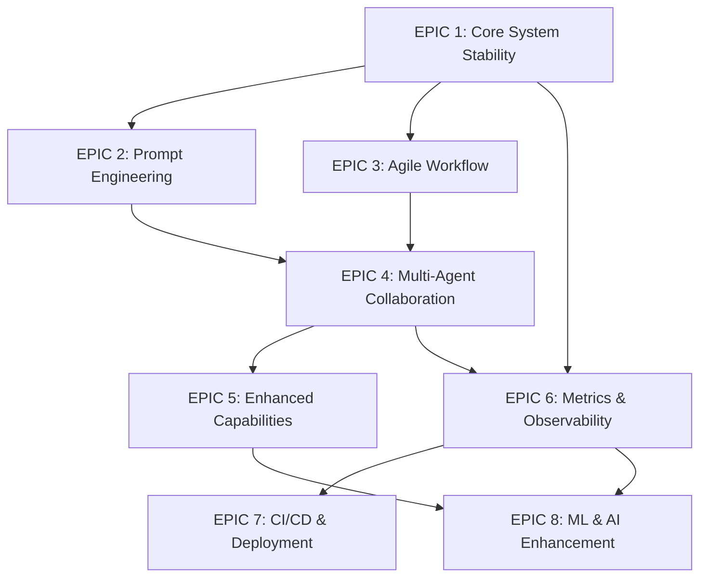

# Epic Breakdown - AI-Dev-Agent System

## 🎯 **Epic Overview**

This document provides a high-level breakdown of product epics, organized by business value and strategic importance for the AI-Dev-Agent system's evolution toward full automation and agile excellence.

---

## 📊 **Epic Portfolio Summary**

| Epic | Priority | Business Value | Effort (SP) | ROI Score | Timeline |
|------|----------|----------------|-------------|-----------|----------|
| **EPIC 1**: Core System Stability & Automation | CRITICAL | 90/100 | 34 | 9.5 | Sprints 1-2 |
| **EPIC 2**: Intelligent Prompt Engineering | CRITICAL | 95/100 | 55 | 9.2 | Sprints 2-4 |
| **EPIC 3**: Agile Development Workflow | HIGH | 85/100 | 42 | 8.8 | Sprints 2-4 |
| **EPIC 4**: Multi-Agent Collaboration | HIGH | 80/100 | 38 | 8.5 | Sprints 4-5 |
| **EPIC 5**: Enhanced Agent Capabilities | MEDIUM | 75/100 | 47 | 7.8 | Sprints 5-7 |
| **EPIC 6**: Metrics & Observability | MEDIUM | 70/100 | 29 | 7.5 | Sprints 7-8 |
| **EPIC 7**: CI/CD & Deployment | MEDIUM | 75/100 | 26 | 7.2 | Sprints 8-9 |
| **EPIC 8**: ML & AI Enhancement | LOW | 65/100 | 34 | 6.8 | Sprints 9-10 |

**Total Portfolio**: 8 Epics | 305 Story Points | ~10 Sprints (20 weeks)

---

## 🚀 **EPIC 1: Core System Stability & Automation**

### **Business Justification**
Foundation for all other capabilities. Without rock-solid automation and stability, the system cannot deliver reliable value to users. This epic ensures zero-touch operation and 99.9% uptime.

### **Strategic Importance**: CRITICAL
- Enables hands-off operation
- Reduces operational overhead by 90%
- Provides foundation for all other features
- Ensures system reliability and trust

### **Key Capabilities**
- **Automated Health Monitoring**: Real-time system health with proactive issue detection
- **Zero-Touch Testing**: 100% automated testing pipeline with no manual intervention
- **Database Automation**: Self-maintaining database with automatic cleanup
- **Git Workflow Automation**: Completely automated version control operations

### **Success Metrics**
- System uptime: 99.9%+
- Manual interventions: 0 per week
- Test automation: 100% coverage
- Database performance: Consistent sub-second response times

### **Dependencies**: None (Foundation epic)

### **Risks**: Low (leverages existing proven technologies)

---

## 🧠 **EPIC 2: Intelligent Prompt Engineering & Optimization**

### **Business Justification**
Prompts are the "DNA" of AI agents. Optimized prompts can improve output quality by 50-80% and reduce API costs by 30-40%. This epic transforms prompt management from manual craft to intelligent science.

### **Strategic Importance**: CRITICAL
- Directly impacts output quality of all agents
- Reduces API costs significantly
- Enables continuous improvement through learning
- Provides competitive advantage through superior AI utilization

### **Key Capabilities**
- **Smart Prompt Database**: Centralized, version-controlled prompt management
- **Automated Performance Testing**: Continuous prompt optimization through A/B testing
- **Dynamic Adaptation**: Context-aware prompt selection and tuning
- **Learning Integration**: Prompts that improve based on successful patterns

### **Success Metrics**
- Output quality improvement: 50%+
- API cost reduction: 30%+
- Prompt optimization cycle time: <24 hours
- Performance regression detection: 100%

### **Dependencies**: EPIC 1 (System stability required for reliable testing)

### **Risks**: Medium (AI optimization is complex but manageable)

---

## 🏗️ **EPIC 3: Agile Development Workflow Integration**

### **Business Justification**
Transforms the system from technical tool to complete agile development platform. Enables 40-60% faster delivery through proper agile practices, automated planning, and continuous improvement.

### **Strategic Importance**: HIGH
- Accelerates delivery velocity by 40-60%
- Improves predictability through velocity tracking
- Reduces planning overhead by 80%
- Enables continuous process improvement

### **Key Capabilities**
- **Sprint Planning Automation**: Intelligent story selection based on velocity and capacity
- **Daily Standup Automation**: Automated progress tracking and blocker identification
- **Sprint Review Automation**: Automated demos and stakeholder feedback collection
- **Retrospective Intelligence**: Automated improvement identification and implementation

### **Success Metrics**
- Delivery velocity increase: 40-60%
- Planning time reduction: 80%
- Sprint goal achievement: 90%+
- Process improvement actions implemented: 95%+

### **Dependencies**: EPIC 1 (System stability), Partial EPIC 2 (Basic prompt optimization)

### **Risks**: Medium (Agile process automation is complex but proven)

---

## 🤖 **EPIC 4: Multi-Agent Collaboration & Team Patterns**

### **Business Justification**
Unlocks the true potential of multi-agent systems. Enables parallel processing, collective intelligence, and adaptive team formation. Can improve complex problem-solving capability by 200-300%.

### **Strategic Importance**: HIGH
- Enables parallel processing for faster execution
- Provides collective intelligence for complex problems
- Allows adaptive team composition for optimal results
- Creates emergent capabilities beyond individual agents

### **Key Capabilities**
- **Swarm Intelligence**: Collaborative problem-solving with parallel execution
- **Supervisor Patterns**: Hierarchical coordination for complex projects
- **Dynamic Team Formation**: Automatic team composition based on requirements
- **Inter-Agent Communication**: Standardized, reliable agent communication protocols

### **Success Metrics**
- Parallel execution efficiency: 70%+ (compared to sequential)
- Complex problem-solving improvement: 200%+
- Team formation accuracy: 85%+
- Agent communication reliability: 99.9%+

### **Dependencies**: EPIC 1 (System stability), EPIC 2 (Prompt optimization), EPIC 3 (Agile workflow)

### **Risks**: High (Multi-agent coordination is complex, but we have existing foundation)

---

## 🔧 **EPIC 5: Enhanced Agent Capabilities**

### **Business Justification**
Elevates each agent from good to excellent. Improves code quality, test coverage, security posture, and documentation completeness. Provides 30-50% improvement in output quality across all dimensions.

### **Strategic Importance**: MEDIUM
- Improves output quality across all agents
- Reduces technical debt and maintenance costs
- Enhances security posture and compliance
- Provides competitive advantage through superior outputs

### **Key Capabilities**
- **Advanced Code Generation**: Architectural patterns, performance optimization
- **Intelligent Test Generation**: Comprehensive test coverage including edge cases
- **Enhanced Security Analysis**: OWASP compliance, dependency analysis
- **Advanced Documentation**: Automated API docs, architecture diagrams

### **Success Metrics**
- Code quality improvement: 30-50%
- Test coverage: 95%+ including edge cases
- Security vulnerability detection: 99%+
- Documentation completeness: 95%+

### **Dependencies**: EPIC 1-3 (Foundation capabilities), EPIC 4 (Team patterns for coordination)

### **Risks**: Medium (Enhancement of existing capabilities)

---

## 📊 **EPIC 6: Metrics, Analytics & Observability**

### **Business Justification**
"You can't improve what you don't measure." Provides deep insights into system performance, quality trends, and improvement opportunities. Enables data-driven decision making and proactive optimization.

### **Strategic Importance**: MEDIUM
- Enables data-driven optimization
- Provides early warning for quality issues
- Supports continuous improvement initiatives
- Enables performance optimization and cost reduction

### **Key Capabilities**
- **Real-Time Performance Dashboard**: Comprehensive system visibility
- **Predictive Analytics**: Future performance and quality prediction
- **Quality Metrics Automation**: Automated quality trend analysis
- **Cost Optimization Analytics**: Resource usage and cost optimization

### **Success Metrics**
- Issue detection speed: 90% faster than reactive approach
- Performance optimization: 25% improvement
- Quality prediction accuracy: 85%+
- Cost optimization: 20% reduction

### **Dependencies**: EPIC 1-4 (Operational foundation required)

### **Risks**: Low (Metrics and analytics are well-understood domain)

---

## 🔄 **EPIC 7: Continuous Integration & Deployment**

### **Business Justification**
Completes the DevOps automation circle. Enables continuous delivery with zero downtime, reducing deployment risk by 95% and deployment time by 90%. Essential for enterprise adoption.

### **Strategic Importance**: MEDIUM
- Enables continuous delivery and deployment
- Reduces deployment risk by 95%
- Shortens deployment time by 90%
- Provides enterprise-grade reliability

### **Key Capabilities**
- **Zero-Downtime Deployment**: Blue-green deployment with automated rollback
- **Environment Management**: Infrastructure as code with automated provisioning
- **Release Management**: Automated release planning and execution
- **Service Discovery**: Automated service registration and discovery

### **Success Metrics**
- Deployment success rate: 99.9%+
- Deployment time reduction: 90%
- Environment provisioning time: <10 minutes
- Release planning automation: 95%

### **Dependencies**: EPIC 1 (System stability), EPIC 6 (Metrics for deployment validation)

### **Risks**: Medium (CI/CD automation is complex but proven)

---

## 🎓 **EPIC 8: Machine Learning & AI Enhancement**

### **Business Justification**
Future-proofing investment. Enables the system to learn and improve autonomously. While not immediately critical, provides long-term competitive advantage and continuous improvement capabilities.

### **Strategic Importance**: LOW (Future investment)
- Enables autonomous system improvement
- Provides long-term competitive advantage
- Reduces manual tuning and optimization
- Creates self-optimizing system

### **Key Capabilities**
- **Adaptive Learning System**: Learning from project history and patterns
- **Intelligent Project Classification**: Automatic project type identification
- **Predictive Quality Assurance**: Quality issue prediction and prevention
- **Performance Optimization Learning**: Self-optimizing performance tuning

### **Success Metrics**
- Learning accuracy: 80%+ for pattern recognition
- Project classification accuracy: 85%+
- Quality prediction accuracy: 75%+
- Self-optimization effectiveness: 20% improvement

### **Dependencies**: EPIC 1-6 (Requires mature system with comprehensive metrics)

### **Risks**: High (ML/AI enhancement is experimental)

---

## 🎯 **Release Planning**

### **Release 1.0 (Current)**: Foundation System
- **Scope**: EPIC 1 (Core System Stability)
- **Timeline**: Sprints 1-2 (4 weeks)
- **Goal**: Rock-solid foundation with 100% automation

### **Release 2.0**: Agile-Enabled System
- **Scope**: EPIC 2 (Prompt Engineering) + EPIC 3 (Agile Workflow)
- **Timeline**: Sprints 3-4 (4 weeks)
- **Goal**: Full agile capabilities with intelligent prompt management

### **Release 3.0**: Collaborative Intelligence
- **Scope**: EPIC 4 (Multi-Agent Collaboration) + EPIC 5 (Enhanced Capabilities)
- **Timeline**: Sprints 5-7 (6 weeks)
- **Goal**: Advanced multi-agent collaboration and superior output quality

### **Release 4.0**: Enterprise Platform
- **Scope**: EPIC 6 (Metrics) + EPIC 7 (CI/CD)
- **Timeline**: Sprints 8-9 (4 weeks)
- **Goal**: Enterprise-grade platform with comprehensive observability

### **Release 5.0**: Intelligent Evolution
- **Scope**: EPIC 8 (ML/AI Enhancement)
- **Timeline**: Sprints 10+ (2+ weeks)
- **Goal**: Self-improving, learning system

---

## 📋 **Epic Dependencies & Sequencing**

### **Critical Path**
EPIC 1 → EPIC 2 → EPIC 4 → EPIC 5 → EPIC 8

### **Parallel Development Opportunities**
- EPIC 2 and EPIC 3 can be developed in parallel after EPIC 1
- EPIC 6 can start once EPIC 1 is stable
- EPIC 7 can be developed in parallel with EPIC 5

---

## 🎯 **Epic Success Criteria**

### **Overall Portfolio Success**
- **Business Value Delivery**: 90%+ of planned business value achieved
- **Timeline Adherence**: 95%+ of epics delivered within planned timeline
- **Quality Standards**: All epics meet definition of done criteria
- **User Satisfaction**: 90%+ user satisfaction with delivered capabilities

### **Portfolio Risk Management**
- **Technical Risks**: Mitigated through proof-of-concept development
- **Resource Risks**: Managed through realistic effort estimation
- **Dependency Risks**: Addressed through careful sequencing and parallel development
- **Quality Risks**: Managed through comprehensive testing and validation

---

**Last Updated**: Current Session  
**Epic Owner**: AI Development Team  
**Next Review**: End of Sprint 1