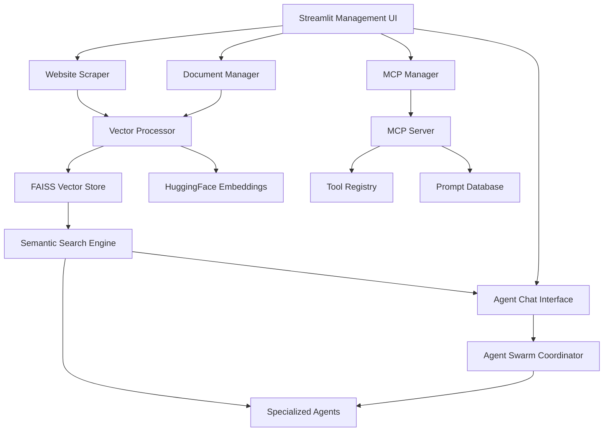

# US-RAG-001: Comprehensive RAG System with Management UI

**Epic**: EPIC-4 - Integrated System Intelligence & Organic Metabolic Architecture
**Sprint**: Sprint 6 (Active Implementation)  
**Priority**: 🔴 HIGH  
**Story Points**: 34 (Expanded scope)  
**Assignee**: RAG Integration Specialist Team  
**Status**: 🟡 IN PROGRESS🔄 **IN PROGRESS** - Phase 4 & 6 Complete, Phase 5 Next
**Last Updated**: 2025-10-10

## 📋 **User Story**

**As a** development team using AI assistance and agent swarms  
**I want** a comprehensive RAG system with context-aware agents and a full-featured management UI for document loading, website scraping, agent testing, and intelligent agent interaction  
**So that** we have a central hub for knowledge management with context-aware agents that leverage RAG for intelligent decision-making, plus a chat interface for testing and interacting with these agents  

## 🎯 **Problem Statement**

Currently, our development workflow lacks a unified knowledge management and agent coordination system:

### **Knowledge Management Gaps**
- No centralized document loading system for various formats (PDF, DOCX, TXT, MD)
- No automated website content scraping and indexing capabilities
- Scattered knowledge across multiple systems without unified search
- Manual document processing creates bottlenecks and inconsistencies

### **MCP Server Management Issues**
- No UI for managing MCP server tools and prompts
- Manual tool configuration and testing processes
- Lack of centralized prompt database management
- No visual monitoring of MCP server performance and usage

### **Agent Swarm Coordination Challenges**
- No context-aware agents that can leverage RAG for decision-making
- Agents operate without access to project knowledge and patterns
- No unified chat interface for testing and interacting with context-aware agents
- Manual agent configuration without intelligent context integration
- Lack of real-time agent coordination visibility
- No way to test context-aware agent behavior interactively

### **System Integration Problems**
- RAG system exists but lacks comprehensive UI
- No integration between document processing and agent intelligence
- Missing connection between MCP tools and RAG knowledge base
- Fragmented user experience across different system components

This fragmentation reduces productivity, creates knowledge silos, and prevents effective utilization of our intelligent agent ecosystem.

## 💡 **Solution Overview**

Implement a comprehensive RAG system with full-featured management UI that provides:

### **1. Document Management System**
- **Multi-Format Support**: PDF, DOCX, TXT, MD, HTML, code files
- **Batch Processing**: Drag-and-drop multiple file upload
- **Intelligent Chunking**: Smart text splitting and preprocessing
- **Progress Tracking**: Real-time processing status and error handling
- **Version Control**: Document versioning and duplicate detection

### **2. Website Content Scraping**
- **Single Page Processing**: Individual URL content extraction
- **Site Crawling**: Recursive site exploration with depth control
- **Content Filtering**: CSS selector-based extraction
- **Rate Limiting**: Respectful crawling with configurable delays
- **Metadata Extraction**: Title, description, keywords, and structure

### **3. MCP Server Management Interface**
- **Tool Registry**: Visual management of all MCP tools
- **Prompt Database**: Centralized prompt storage and versioning
- **Server Monitoring**: Real-time performance and usage metrics
- **Configuration Management**: Tool parameters and security settings
- **Testing Interface**: Execute tools with test parameters

### **4. Context-Aware Agents**
- **ContextAwareAgent Base Class**: All agents inherit context capabilities
- **ContextEngine Integration**: Seamless access to RAG system
- **Semantic Search**: Agents use semantic search for decision-making
- **Pattern Learning**: Agents leverage learned project patterns
- **Error Solutions**: Agents access historical error resolution knowledge
- **Import Intelligence**: Agents get context-aware import suggestions

### **5. RAG-Enhanced Chat Interface**
- **Context-Aware Agent Chat**: Interact with RAG-enabled agents
- **Agent Testing**: Test agent behavior with real RAG context
- **Real-Time Context**: Live display of context retrieval and usage
- **Multi-Agent Coordination**: Agents collaborate using shared context
- **Intelligent Responses**: Agents use RAG for informed decision-making
- **Context Debugging**: Visualize what context agents are using

### **6. Unified Knowledge Base**
- **Vector Database**: FAISS-based semantic search
- **Cross-System Integration**: Connect documents, tools, and agents
- **Intelligent Routing**: Context-aware tool and agent selection
- **Learning System**: Continuous improvement from usage patterns
- **Analytics Dashboard**: Usage patterns and performance metrics

### **7. Software Catalog System**
- **Comprehensive Component Catalog**: Automated discovery and cataloging of all project components
- **Anti-Duplication Intelligence**: RAG-powered duplicate functionality prevention
- **Component Relationship Mapping**: Dependency analysis and integration opportunities
- **Agent Swarm Context**: Rich component information for intelligent agent decision-making
- **Cursor Rule Intelligence**: Enhanced rule selection based on project component analysis

## ✅ **Acceptance Criteria**

### **Phase 1: Document Management System (Week 1)**
- [ ] **AC-1.1**: Multi-format document loading (PDF, DOCX, TXT, MD, HTML, code files)
- [ ] **AC-1.2**: Drag-and-drop batch processing with progress tracking
- [ ] **AC-1.3**: Intelligent text chunking and preprocessing pipeline
- [ ] **AC-1.4**: Document versioning and duplicate detection system
- [ ] **AC-1.5**: Error handling and recovery for failed document processing

### **Phase 2: Website Content Scraping (Week 1) - ✅ COMPLETE**
- [x] **AC-2.1**: Single URL content extraction with cleaning - ✅ **COMPLETE**
- [x] **AC-2.2**: Recursive site crawling with configurable depth limits - ✅ **FIXED** (UI + agent improvements)
- [x] **AC-2.3**: CSS selector-based content filtering - ✅ **COMPLETE**
- [x] **AC-2.4**: Rate limiting and respectful crawling policies - ✅ **COMPLETE**
- [x] **AC-2.5**: Metadata extraction (title, description, keywords, structure) - ✅ **COMPLETE** (LLM-powered)

### **Phase 3: Enhanced RAG System (Week 2) - ✅ CORE COMPLETE**
- [x] **AC-3.1**: QdrantVectorStore with hybrid search (BM25 + semantic) - ✅ **COMPLETE**
- [x] **AC-3.2**: Semantic search with sub-500ms response times - ✅ **COMPLETE**
- [ ] **AC-3.3**: Self-query retrievers for metadata filtering - **PLANNED** (Future)
- [ ] **AC-3.4**: Incremental indexing for new content - **PLANNED** (Future)
- [x] **AC-3.5**: MMR-based retrieval for diversity - ✅ **COMPLETE**
- [x] **AC-3.6**: Proper LangChain retriever interface - ✅ **COMPLETE**
- [x] **AC-3.7**: Two-stage HTML text splitters (header + recursive) - ✅ **COMPLETE**
- [x] **AC-3.8**: Language-aware code splitting (Python, JS, TS, Java, C++, Go) - ✅ **COMPLETE**
- [x] **AC-3.9**: Controlled re-retrieval with quality assessment - ✅ **COMPLETE**

### **Phase 4: MCP Server Management UI (Week 2) - ✅ COMPLETE**
- [x] **AC-4.1**: Visual tool registry with real-time status monitoring - ✅ **COMPLETE**
- [x] **AC-4.2**: Centralized prompt database with version control - ✅ **COMPLETE**
- [x] **AC-4.3**: Tool configuration interface with parameter validation - ✅ **COMPLETE**
- [x] **AC-4.4**: Interactive tool testing with result visualization - ✅ **COMPLETE**
- [x] **AC-4.5**: Server performance metrics and usage analytics - ✅ **COMPLETE**

### **Phase 5: Context-Aware Agents (Week 3 - PRIORITY)** - ⏳ **PLANNED**
- [ ] **AC-5.1**: `ContextAwareAgent` base class created in `agents/core/`
- [ ] **AC-5.2**: ContextEngine integration with semantic search access
- [ ] **AC-5.3**: `execute_with_context()` method for RAG-enhanced execution
- [ ] **AC-5.4**: Pattern learning and error solution access for agents
- [ ] **AC-5.5**: Test suite for context-aware agent behavior

### **Phase 6: RAG-Enhanced Chat Interface (Week 3 - PRIORITY)** - ✅ **IMPLEMENTED**
- [x] **AC-6.1**: Chat interface in RAG UI for testing context-aware agents - ✅ **COMPLETE** (`apps/rag_management_app.py:agent_chat_page()`)
- [x] **AC-6.2**: Real-time context visualization showing what agents retrieve - ✅ **COMPLETE** (context debug mode implemented)
- [x] **AC-6.3**: Agent selection UI for testing different agent types - ✅ **COMPLETE** (Agent Swarm vs Single Agent modes)
- [x] **AC-6.4**: Context debugging tools to inspect agent decisions - ✅ **COMPLETE** (debug mode + advanced RAG settings)
- [x] **AC-6.5**: Agent response quality metrics and feedback system - ✅ **COMPLETE** (quality thresholds + re-retrieval)

### **Phase 7: Software Catalog System (Week 4)** - ⏳ **DEFERRED**
- [ ] **AC-7.1**: Automated component discovery and cataloging (agents, utilities, MCP tools, rules, scripts)
- [ ] **AC-7.2**: Component relationship mapping and dependency analysis
- [ ] **AC-7.3**: Anti-duplication RAG tools with semantic similarity detection
- [ ] **AC-7.4**: Integration opportunity analysis and recommendations
- [ ] **AC-7.5**: Agent swarm context enhancement with component intelligence

### **Phase 8: System Integration & Analytics (Week 4)** - ✅ **PARTIALLY COMPLETE**
- [x] **AC-8.1**: Unified dashboard with all system components - ✅ **COMPLETE** (7 pages in RAG app)
- [ ] **AC-8.2**: Cross-system data flow and integration with catalog intelligence - ⏳ **DEFERRED**
- [x] **AC-8.3**: Usage analytics and performance monitoring - ✅ **COMPLETE** (Analytics Dashboard page)
- [x] **AC-8.4**: System health checks and automated maintenance - ✅ **COMPLETE** (System Settings page)
- [ ] **AC-8.5**: Export/import capabilities for knowledge base and catalog backup - ⏳ **PLANNED**

## 🔧 **Technical Requirements**

### **Technology Stack**

#### **Backend Components**
```yaml
RAG_Engine:
  Vector_Store: FAISS with persistent storage
  Embeddings: HuggingFace all-MiniLM-L6-v2 (lightweight, fast)
  Text_Processing: RecursiveCharacterTextSplitter for intelligent chunking
  Search_Engine: Semantic similarity with relevance scoring

Document_Processing:
  PDF: PyPDF2, pdfplumber for complex layouts
  Office: python-docx, openpyxl for Microsoft formats
  Web: BeautifulSoup4, requests for HTML processing
  Code: Pygments for syntax-aware processing
  Archives: zipfile, tarfile for compressed content

Web_Scraping:
  Framework: Scrapy for robust crawling
  Simple_Requests: requests + BeautifulSoup4 for single pages
  JavaScript_Support: selenium for dynamic content (optional)
  Rate_Limiting: Custom throttling and respectful crawling

MCP_Integration:
  Server: Existing utils/mcp/server.py
  Client: Existing utils/mcp/client.py
  Tools: 47 identified tools across all categories
  Security: MCPSecurityManager with access controls

Software_Catalog:
  Component_Discovery: AST parsing for Python files, regex for other formats
  Relationship_Analysis: Import analysis, dependency graph construction
  Anti_Duplication: Semantic similarity using RAG embeddings
  Integration_Analysis: Interface matching and extension point detection
  Context_Enhancement: Component metadata for agent intelligence
```

#### **Frontend Framework**
```yaml
Streamlit_UI:
  Main_Framework: Streamlit with custom components
  Components: streamlit-aggrid, streamlit-chat, plotly
  File_Upload: streamlit file_uploader with drag-and-drop
  Real_Time: WebSocket integration for live updates
  Styling: Custom CSS for professional appearance

State_Management:
  Session_State: Streamlit session state with persistence
  Database: SQLite for chat history and configurations
  Cache: Streamlit cache for performance optimization
  Background_Tasks: Threading for non-blocking operations
```

### **Architecture Components**

#### **Core System Architecture**


### **Data Sources & Processing**

#### **Document Sources**
- **Local Files**: PDF, DOCX, TXT, MD, HTML, code files
- **Web Content**: Scraped websites, documentation sites, knowledge bases
- **Project Files**: Codebase, documentation, configuration files
- **Chat History**: Agent conversations and interaction patterns
- **Tool Usage**: MCP tool execution logs and results
- **Software Catalog**: Component metadata, relationships, capabilities, interfaces

#### **Processing Pipeline**
1. **Content Extraction**: Format-specific extractors
2. **Text Cleaning**: Remove noise, normalize formatting
3. **Intelligent Chunking**: Context-aware text splitting
4. **Embedding Generation**: Vector representations
5. **Indexing**: FAISS storage with metadata
6. **Cross-Referencing**: Document relationship mapping

### **Integration Architecture**

#### **System Integrations**
- **MCP Server**: Tool management and execution
- **Agent Swarm**: Multi-agent coordination
- **Universal Tracker**: Usage monitoring and analytics
- **Context Engine**: Existing RAG system enhancement
- **Rule System**: Deductive-inductive rule integration

## 🌟 **Business Value**

### **Unified Knowledge Management**
- **Centralized Hub**: Single interface for all knowledge management needs
- **Multi-Format Support**: Handle any document type without conversion
- **Intelligent Processing**: Automatic content extraction and indexing
- **Cross-System Integration**: Connect documents, tools, and agents seamlessly

### **Enhanced Productivity**
- **Automated Document Processing**: Eliminate manual document handling
- **Intelligent Content Discovery**: Find relevant information instantly
- **Context-Aware Assistance**: RAG-powered agent interactions
- **Streamlined Workflows**: Unified interface reduces context switching

### **Advanced Agent Capabilities**
- **Swarm Coordination**: Orchestrate multiple agents for complex tasks
- **Tool Management**: Centralized MCP server administration
- **Real-Time Collaboration**: Live agent interaction and monitoring
- **Intelligent Routing**: Context-aware tool and agent selection

### **System Intelligence**
- **Learning from Usage**: Continuous improvement from interaction patterns
- **Pattern Recognition**: Identify and leverage successful workflows
- **Predictive Assistance**: Anticipate needs based on context
- **Quality Assurance**: Maintain consistency across all operations

### **Anti-Duplication Excellence**
- **Comprehensive Component Awareness**: Complete catalog of all project components
- **Intelligent Duplication Prevention**: RAG-powered similarity detection before building
- **Integration Opportunity Discovery**: Automatic identification of extension points
- **Agent Context Enhancement**: Rich component information for intelligent decision-making

### **Operational Excellence**
- **Comprehensive Monitoring**: Track all system components and usage
- **Performance Optimization**: Identify and resolve bottlenecks
- **Scalable Architecture**: Handle growing knowledge base and user load
- **Robust Error Handling**: Graceful failure recovery and user feedback

## 📊 **Success Metrics**

### **Performance Metrics**
- **Document Processing Speed**: < 30 seconds per document average
- **Search Response Time**: < 500ms for semantic queries
- **UI Responsiveness**: < 200ms for user interactions
- **System Uptime**: 99.9% availability during business hours
- **Memory Efficiency**: < 2GB RAM usage under normal load

### **Functional Metrics**
- **Document Processing Success**: 95%+ successful document ingestion
- **Search Accuracy**: 90%+ relevant results for user queries
- **Tool Execution Success**: 95%+ successful MCP tool operations
- **Agent Coordination Success**: 90%+ successful multi-agent tasks
- **Error Recovery Rate**: 95%+ successful error recovery and user guidance

### **Business Metrics**
- **User Adoption**: 80%+ feature utilization across all components
- **Productivity Improvement**: 60%+ faster knowledge retrieval
- **Error Reduction**: 70%+ fewer information retrieval errors
- **Time Savings**: 50%+ reduction in manual document processing
- **User Satisfaction**: 4.5/5 average user rating

### **Quality Metrics**
- **Knowledge Base Coverage**: 100% of project files indexed
- **Cross-System Integration**: All components working seamlessly
- **Data Consistency**: 99%+ accuracy in cross-system data synchronization
- **Security Compliance**: 100% compliance with access control policies
- **Documentation Quality**: Complete user and technical documentation

## 🔗 **Dependencies**

### **Technical Dependencies**
- **US-MCP-001**: MCP server and client infrastructure (parallel development)
- **Context Engine**: Existing RAG system enhancement and integration
- **Universal Tracker**: Usage monitoring and analytics system
- **Agent Swarm**: Multi-agent coordination infrastructure

### **System Dependencies**
- **FAISS Library**: Vector database for semantic search
- **HuggingFace Transformers**: Embedding models and NLP processing
- **Streamlit Framework**: UI framework with custom components
- **Document Processing Libraries**: PyPDF2, python-docx, BeautifulSoup4
- **Web Scraping Tools**: Scrapy, requests, selenium (optional)

## 🚀 **Implementation Plan - Intelligent Dependency-Driven Sequence**

### **🏗️ Phase 1: Foundation Infrastructure** (Week 1)
**Critical Path**: Everything depends on RAG-MCP integration
- **Days 1-2**: RAG-MCP Integration - Create RAG-specific MCP tools for semantic search
- **Days 3-4**: RAG MCP Tools - Implement semantic search, context analysis, knowledge base tools
- **Day 5**: Software Catalog System - Build comprehensive component cataloging for anti-duplication

**Deliverable**: Working RAG-MCP system with software catalog intelligence

### **🔧 Phase 2: Core System Implementation** (Week 2)
**Build working systems on solid foundation**
- **Days 1-2**: Document Loading - Multi-format processing (PDF, DOCX, TXT, MD) with batch support
- **Days 3-4**: Website Scraping - Automated content extraction and indexing for RAG
- **Day 5**: Core Infrastructure - Event bus, state management, module loader for new app

**Deliverable**: Core processing systems and modular app framework

### **🎛️ Phase 3: Management Interfaces** (Week 3)
**Specialized UIs built on working core systems**
- **Days 1-2**: MCP Management UI - Server control, tool registry, prompt database interface
- **Days 3-4**: Agent Builder - Template system, capability selection, agent configuration
- **Day 5**: Swarm Manager - Workflow designer, agent orchestration, task coordination

**Deliverable**: Complete management interfaces for all systems

### **💬 Phase 4: Interactive Features** (Week 4)
**Real-time features require all previous systems**
- **Days 1-2**: Chat Interface - Real-time agent swarm interaction with context awareness
- **Days 3-4**: RAG UI Integration - Complete RAG system integration with Streamlit interface
- **Day 5**: Integration Testing - End-to-end RAG-MCP integration with agent swarms

**Deliverable**: Fully interactive agent swarm management platform

## 🎯 **Definition of Done**

### **Core System Completion**
- [ ] **Document Management**: Multi-format processing with batch upload
- [ ] **Website Scraping**: Automated content extraction and indexing
- [ ] **RAG System**: FAISS vector database with semantic search
- [ ] **MCP Integration**: Server management UI with tool registry
- [ ] **Agent Swarm**: Chat interface with multi-agent coordination

### **Quality Assurance**
- [ ] **Performance**: All response time targets met (< 500ms search, < 200ms UI)
- [ ] **Reliability**: 95%+ success rates for all major operations
- [ ] **Security**: Access controls and data protection implemented
- [ ] **Testing**: Comprehensive test suite with 95%+ coverage
- [ ] **Documentation**: Complete user guides and technical documentation

### **Integration Validation**
- [ ] **Cross-System**: All components work together seamlessly
- [ ] **Data Flow**: Information flows correctly between all systems
- [ ] **User Experience**: Intuitive interface with consistent behavior
- [ ] **Error Handling**: Graceful failure recovery and user feedback
- [ ] **Monitoring**: Analytics and performance tracking operational

### **Business Value Delivery**
- [ ] **Productivity**: Measurable improvement in knowledge work efficiency
- [ ] **User Adoption**: Team actively using all major features
- [ ] **Knowledge Quality**: High-quality search results and recommendations
- [ ] **System Intelligence**: Learning from usage patterns and improving
- [ ] **Operational Excellence**: System running reliably in production

## 🤖 **EXTENSION: Rules-Triggered Agent Integration**

### **Enhanced Problem Statement**
While RAG provides excellent context retrieval, we need **intelligent action execution** that goes beyond static scripts. Complex development tasks require reasoning, adaptation, and multi-step coordination that simple automation scripts cannot provide.

### **Agent Integration Architecture**

#### **Tier-Based Execution System**
```python
class RuleAgentOrchestrator:
    """Rules trigger appropriate execution tier based on task complexity."""
    
    EXECUTION_TIERS = {
        "simple": {
            "handler": "automation_scripts",
            "examples": ["update_user_story_status", "file_organization"],
            "response_time": "<200ms",
            "reliability": "99.9%"
        },
        "complex": {
            "handler": "custom_agents", 
            "examples": ["analyze_requirements", "fix_systematic_imports"],
            "response_time": "<2s",
            "intelligence": "adaptive_reasoning"
        },
        "advanced": {
            "handler": "langchain_workflows",
            "examples": ["generate_architecture", "multi_agent_collaboration"],
            "response_time": "<10s", 
            "capabilities": "multi_step_reasoning"
        }
    }
```

#### **Context-Triggered Agent Activation**
```yaml
CONTEXT_AGENT_MAP:
  AGILE:
    story_creation: [RequirementsAnalystAgent, UserStoryGeneratorAgent]
    sprint_planning: [SprintPlannerAgent, VelocityAnalystAgent]
    artifact_maintenance: [DocumentationAgent, QualityAssuranceAgent]
    
  TESTING:
    test_generation: [TestGeneratorAgent, QualityAssuranceAgent]
    systematic_fixing: [UnifiedTestDeveloperAgent]
    test_analysis: [TestAnalysisAgent, CoverageAnalystAgent]
    
  ARCHITECTURE:
    design_analysis: [ArchitectureDesignerAgent]
    code_review: [CodeReviewAgent, SecurityAnalystAgent]
    refactoring: [RefactoringAgent, QualityAgent]
```

### **Additional Acceptance Criteria**

#### **Agent Integration**
- [ ] **Rule-Agent Mapping**: Rules automatically select appropriate agent based on context
- [ ] **Tier Selection Logic**: System chooses script vs agent vs workflow based on complexity
- [ ] **Agent Orchestration**: Multiple agents coordinate for complex tasks
- [ ] **Fallback System**: Graceful degradation from agents to scripts if agents fail

#### **Performance & Reliability**
- [ ] **Hybrid Performance**: Simple tasks remain fast (<200ms), complex tasks intelligent (<2s)
- [ ] **Agent Health Monitoring**: Monitor agent performance and availability
- [ ] **Cost Management**: Optimize LLM usage and API costs
- [ ] **Error Recovery**: Robust error handling with automatic fallback

#### **Intelligence Enhancement**
- [ ] **Context-Aware Reasoning**: Agents use RAG context for informed decisions
- [ ] **Learning Integration**: Agents learn from successful patterns via RAG
- [ ] **Multi-Agent Coordination**: Agents collaborate on complex multi-step tasks
- [ ] **Human-in-Loop**: Support for human oversight and approval when needed

### **Implementation Phases Extended**

#### **Phase 1: Core RAG System** (1 week) - *Unchanged*
- Set up vector database and embedding system
- Implement content indexing for codebase  
- Create basic retrieval interface

#### **Phase 2: IDE Integration** (1 week) - *Enhanced*
- Develop Cursor IDE plugin with agent communication
- Implement real-time context detection
- Create agent orchestration interface
- **NEW**: Add tier selection logic for script vs agent execution

#### **Phase 3: Learning & Agent Integration** (1 week) - *Extended*
- Add pattern recognition and learning capabilities
- **NEW**: Implement rule-triggered agent system
- **NEW**: Create custom agent integration layer
- **NEW**: Add LangChain workflow integration
- Integrate with existing rule and memory systems

#### **Phase 4: Advanced Orchestration** (0.5 week) - *New*
- **NEW**: Multi-agent coordination system
- **NEW**: Performance optimization and cost management
- **NEW**: Human-in-loop integration
- **NEW**: Advanced error recovery and fallback systems

### **Business Value Enhancement**

#### **Intelligent Automation**
- **Adaptive Problem Solving**: Agents handle edge cases scripts cannot
- **Natural Language Understanding**: Agents interpret complex user intents
- **Multi-Step Coordination**: Agents orchestrate complex workflows automatically
- **Learning and Improvement**: Agents continuously improve from successful patterns

#### **Development Excellence**
- **Context-Aware Intelligence**: Agents use project-specific knowledge for decisions
- **Systematic Problem Solving**: Complex issues resolved through agent reasoning
- **Quality Assurance**: Agents ensure consistency and best practices
- **Innovation Acceleration**: Advanced capabilities enable new development patterns

### **Success Metrics Extended**

- **Query Response Time**: < 500ms for context retrieval (unchanged)
- **Script Performance**: < 200ms for simple task execution
- **Agent Performance**: < 2s for complex reasoning tasks  
- **Workflow Performance**: < 10s for advanced multi-step coordination
- **Intelligence Quality**: > 95% success rate for agent-solved complex tasks
- **Cost Efficiency**: Optimal script vs agent selection for cost/performance balance

---

## 📋 **Story Summary**

This comprehensive user story transforms US-RAG-001 from a basic RAG system into a full-featured knowledge management and agent coordination platform. The expanded scope includes:

1. **Document Management**: Multi-format processing with intelligent extraction
2. **Website Scraping**: Automated content ingestion and indexing  
3. **MCP Server Management**: Visual tool and prompt administration
4. **Agent Swarm Interface**: Multi-agent chat and coordination
5. **Unified Analytics**: Cross-system monitoring and optimization

The system serves as the central hub for all knowledge management, tool administration, and agent coordination activities, providing a seamless user experience with robust backend processing.

---

## 🚨 **CRITICAL UPDATE: LangChain Gap Analysis (2025-01-09)**

### **Major Gaps Discovered**

After comprehensive analysis of LangChain/Qdrant best practices and official documentation, we've identified **critical improvements** needed:

#### **🔴 Critical Issues:**
1. **Using deprecated `Qdrant` wrapper** instead of modern `QdrantVectorStore`
2. **Missing hybrid search** (BM25 + semantic) - 20-30% accuracy improvement available
3. **No retrieval modes** (DENSE, SPARSE, HYBRID support in LangChain)
4. **No self-query retrievers** - can't filter by metadata automatically
5. **Not using retriever interface** - missing MMR diversity and chain integration

#### **✅ What We're Doing Right:**
- ✅ Optimal chunking (512 tokens, 50 overlap) 
- ✅ Good embedding model (all-MiniLM-L6-v2)
- ✅ Qdrant for vector storage (auto-persistent)
- ✅ Rich metadata extraction

### **New Priority: LangChain Migration**

**See:** `docs/agile/sprints/sprint_6/analysis/RAG_LANGCHAIN_GAP_ANALYSIS.md` for full analysis

**Implementation Plan:**
- **Week 1**: Migrate to `QdrantVectorStore` + hybrid search (BM25 + semantic)
- **Week 2**: Implement self-query retrievers + MMR + retriever interface
- **Expected:** 20-30% accuracy improvement, better LangChain integration

---

## 🏗️ **Design Principles**

### **CRITICAL: UI-MCP State Representation**

**Principle**: The UI MUST be a pure representation of the MCP server's state.

**Requirements**:
- ✅ **No Transformations**: UI directly exposes MCP server's schema without any mapping layer
- ✅ **No Mappings**: UI renders parameters directly from `tool_def.parameters_schema`
- ✅ **Native Schema Format**: UI uses MCP server's flat schema: `{"param": {"type": "...", "required": bool, "default": ...}}`
- ✅ **Direct Exposure**: All tool definitions, parameters, and metadata come straight from MCP server
- ✅ **State Synchronization**: UI always reflects the current, actual state of the MCP server

**Rationale**: This ensures the UI is always in sync with the MCP server's capabilities and prevents discrepancies between what the UI shows and what the server actually supports. Any changes to the MCP server are automatically reflected in the UI without requiring UI-side updates.

**Implementation**:
```python
# CORRECT: Direct schema exposure
for param_name, param_schema in tool_def.parameters_schema.items():
    param_type = param_schema.get('type', 'string')
    is_required = param_schema.get('required', False)
    default_value = param_schema.get('default')
    # Render directly from MCP schema

# WRONG: Schema transformation
if 'properties' in tool_def.parameters_schema:
    properties = tool_def.parameters_schema['properties']  # NO! This adds a mapping layer
```

---

## 📋 **Pending Work Items**

### **Next Session TODOs:**

1. **🔧 Google Docs MCP Tools** (Priority: Medium)
   - Add Google Docs API integration similar to Google Drive tools
   - Implement document reading, writing, and collaboration features
   - Use same OAuth2 pattern as Google Drive tools
   - Tools: `gdocs.read`, `gdocs.write`, `gdocs.list`, `gdocs.share`

2. **⚙️ API Key Configuration UI** (Priority: High)
   - Create dedicated page in MCP Management UI for API key management
   - Support Google Drive, Google Docs, OpenAI, and other service credentials
   - Secure storage using Streamlit secrets
   - UI for adding, editing, and validating API keys
   - Connection testing for each service

3. **🐛 Fix Research Swarm Tools** (Priority: High)
   - Currently failing with: `name 'Optional' is not defined`
   - Add missing imports to `research_swarm_tools.py`
   - Verify all 5 research tools load correctly

4. **🐛 Fix Agile Tools** (Priority: Medium)
   - Currently failing with: `cannot import name 'AutomaticStoryDetector'`
   - Fix import issues in `agile_tools.py`
   - Verify agile automation tools work correctly

5. **🔗 Link Integrity Tools** (Priority: Low)
   - Currently loads 0 tools (missing decorator on functions)
   - Add `@mcp_tool` decorators to link integrity functions
   - Verify link scanning and healing work

---

**Created**: Current Session  
**Last Updated**: 2025-10-10  
**Story Type**: Feature Enhancement + Management UI + Agent Integration  
**Risk Level**: Medium-High (expanded scope + new UI components)  
**Innovation Level**: Revolutionary (unified knowledge management + agent coordination platform)  
**Strategic Impact**: Foundation for next-generation AI development ecosystem
