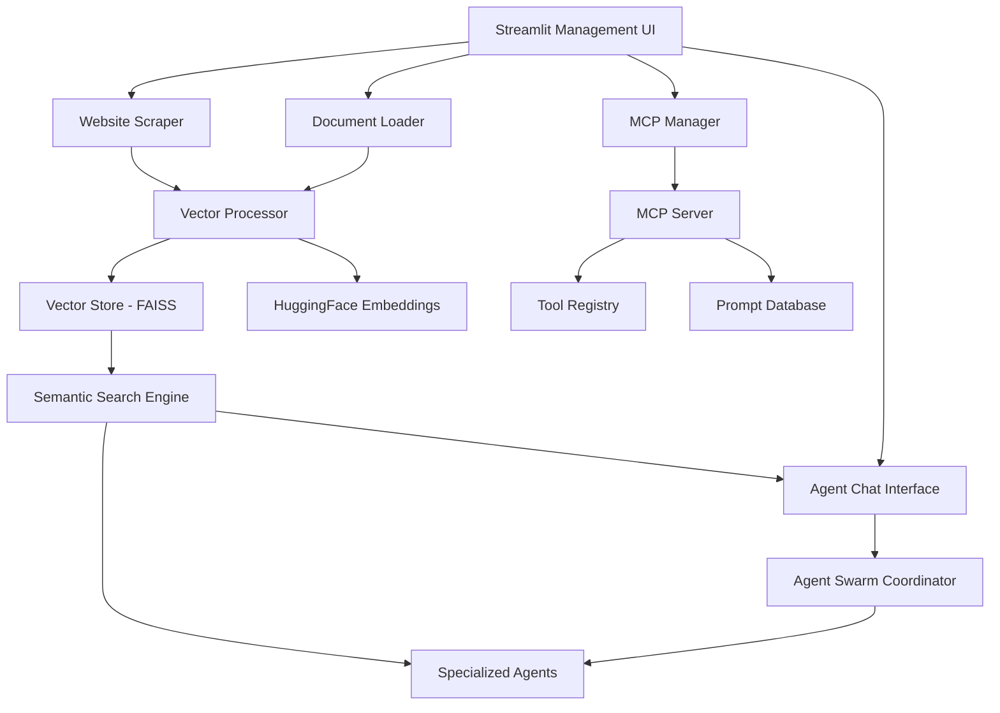
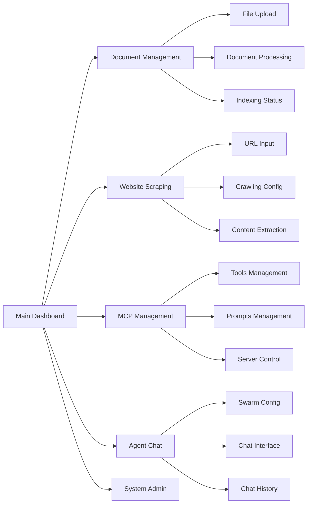

# Comprehensive RAG System with Management UI
## Architecture Design Document

**Created**: 2025-01-02  
**Purpose**: Design comprehensive RAG system with document loading, website scraping, MCP management, and agent swarm chat interface

## System Overview

This document outlines the architecture for a comprehensive RAG (Retrieval-Augmented Generation) system with a full-featured management UI that serves as the central hub for:

1. **Document Management**: Loading, processing, and indexing various document types
2. **Website Content Scraping**: Automated web content ingestion and indexing
3. **MCP Server Management**: Tools and prompts management interface
4. **Agent Swarm Chat**: Configurable agent swarm interaction interface
5. **Knowledge Base Maintenance**: RAG system administration and monitoring

## Architecture Components

### Core RAG System

### UI Component Architecture

## Feature Specifications

### 1. Document Loading System

#### Supported Formats
- **PDF**: PyPDF2, pdfplumber for complex layouts
- **Text Files**: .txt, .md, .rst
- **Microsoft Office**: .docx, .xlsx, .pptx
- **Web Formats**: .html, .xml
- **Code Files**: .py, .js, .java, .cpp, etc.
- **Archives**: .zip extraction and processing

#### Processing Pipeline
1. **File Upload**: Drag-and-drop or file browser
2. **Format Detection**: Automatic MIME type detection
3. **Content Extraction**: Format-specific extractors
4. **Text Preprocessing**: Cleaning, normalization
5. **Chunking**: Intelligent text splitting
6. **Embedding Generation**: Vector embeddings
7. **Indexing**: FAISS vector store storage
8. **Metadata Storage**: Document metadata and relationships

#### Features
- **Batch Processing**: Multiple file upload and processing
- **Progress Tracking**: Real-time processing status
- **Error Handling**: Graceful failure recovery
- **Duplicate Detection**: Content deduplication
- **Version Control**: Document version tracking

### 2. Website Scraping System

#### Scraping Capabilities
- **Single Page**: Individual URL processing
- **Site Crawling**: Recursive site exploration
- **Sitemap Processing**: XML sitemap parsing
- **Content Filtering**: CSS selector-based extraction
- **Rate Limiting**: Respectful crawling with delays

#### Content Processing
- **HTML Cleaning**: Remove navigation, ads, footers
- **Text Extraction**: Main content identification
- **Link Processing**: Internal/external link handling
- **Media Handling**: Image alt-text extraction
- **Metadata Extraction**: Title, description, keywords

#### Configuration Options
- **Crawl Depth**: Maximum recursion levels
- **Domain Restrictions**: Stay within domain boundaries
- **Content Filters**: Include/exclude patterns
- **Update Frequency**: Automatic re-crawling schedules
- **Storage Policies**: Retention and archiving rules

### 3. MCP Server Management UI

#### Tools Management
- **Tool Registry**: View all available MCP tools
- **Tool Configuration**: Modify tool parameters
- **Tool Testing**: Execute tools with test parameters
- **Tool Monitoring**: Usage statistics and performance
- **Tool Development**: Create and deploy new tools

#### Prompts Management
- **Prompt Database**: Centralized prompt storage
- **Prompt Editor**: Rich text editor with syntax highlighting
- **Version Control**: Prompt versioning and rollback
- **Template System**: Reusable prompt templates
- **A/B Testing**: Compare prompt effectiveness

#### Server Administration
- **Server Status**: Real-time server monitoring
- **Connection Management**: Client connections overview
- **Performance Metrics**: Throughput, latency, errors
- **Security Settings**: Access control and permissions
- **Backup/Restore**: Configuration backup and recovery

### 4. Agent Swarm Chat Interface

#### Swarm Configuration
- **Agent Selection**: Choose specialized agents for swarm
- **Role Assignment**: Define agent roles and responsibilities
- **Workflow Definition**: Create agent interaction workflows
- **Resource Allocation**: Assign tools and capabilities
- **Performance Tuning**: Optimize swarm parameters

#### Chat Interface
- **Multi-Agent Chat**: Interact with entire swarm
- **Agent-Specific Chat**: Direct communication with individual agents
- **Context Awareness**: RAG-enhanced conversation context
- **Tool Integration**: Agents can execute MCP tools during chat
- **Real-time Collaboration**: Live agent coordination display

#### Advanced Features
- **Conversation Branching**: Multiple conversation threads
- **Agent Handoff**: Seamless agent-to-agent transitions
- **Task Decomposition**: Automatic task splitting across agents
- **Progress Tracking**: Visual workflow progress indicators
- **Result Aggregation**: Combine multi-agent outputs

### 5. System Administration

#### Knowledge Base Management
- **Vector Store Statistics**: Index size, document count
- **Search Performance**: Query response times, accuracy
- **Content Analytics**: Most accessed documents, search patterns
- **Data Quality**: Duplicate detection, content freshness
- **Maintenance Tools**: Reindexing, cleanup, optimization

#### System Monitoring
- **Resource Usage**: CPU, memory, disk utilization
- **Performance Metrics**: Response times, throughput
- **Error Tracking**: System errors and recovery actions
- **User Analytics**: Usage patterns and feature adoption
- **Health Checks**: Automated system health monitoring

## Technical Implementation

### Technology Stack

#### Backend Components
- **RAG Engine**: Enhanced context_engine.py with FAISS + HuggingFace
- **Document Processing**: PyPDF2, python-docx, beautifulsoup4
- **Web Scraping**: Scrapy, requests, selenium (for JS-heavy sites)
- **Vector Database**: FAISS with persistent storage
- **MCP Integration**: Existing MCP server and client
- **Agent Framework**: Enhanced agent swarm system

#### Frontend Framework
- **Streamlit**: Main UI framework with custom components
- **Components**: streamlit-aggrid, streamlit-chat, plotly
- **Styling**: Custom CSS for professional appearance
- **State Management**: Streamlit session state with persistence
- **Real-time Updates**: WebSocket integration for live updates

#### Data Storage
- **Vector Store**: FAISS indices with metadata
- **Document Storage**: File system with organized structure
- **Configuration**: TOML/JSON configuration files
- **Chat History**: SQLite database for conversation persistence
- **Logs**: Structured logging with rotation

### Performance Optimization

#### Caching Strategy
- **Embedding Cache**: Cache document embeddings
- **Search Cache**: Cache frequent search results
- **UI Cache**: Cache UI components and data
- **Tool Cache**: Cache MCP tool execution results

#### Scalability Features
- **Async Processing**: Non-blocking document processing
- **Background Tasks**: Queue-based background job processing
- **Incremental Updates**: Update only changed content
- **Lazy Loading**: Load content on-demand
- **Resource Pooling**: Efficient resource utilization

## Security Considerations

### Access Control
- **Authentication**: User login and session management
- **Authorization**: Role-based access control
- **API Security**: Secure MCP server communication
- **Data Protection**: Encryption for sensitive content
- **Audit Logging**: Comprehensive action logging

### Data Privacy
- **Content Sanitization**: Remove sensitive information
- **Access Logging**: Track document access patterns
- **Data Retention**: Configurable retention policies
- **Export Controls**: Secure data export capabilities
- **Compliance**: GDPR/privacy regulation compliance

## Implementation Phases

### Phase 1: Core RAG System (Week 1)
- Enhanced document loading with multiple formats
- Improved vector processing and indexing
- Basic web scraping capabilities
- Foundation UI with document management

### Phase 2: Advanced Features (Week 2)
- MCP server management interface
- Agent swarm chat interface
- Advanced web scraping with crawling
- System administration tools

### Phase 3: Integration & Polish (Week 3)
- RAG-MCP integration
- Performance optimization
- Security hardening
- Comprehensive testing

## Success Metrics

### Functional Metrics
- **Document Processing**: 95%+ successful document ingestion
- **Search Accuracy**: 90%+ relevant search results
- **System Uptime**: 99.9% availability
- **User Satisfaction**: 4.5/5 user rating

### Performance Metrics
- **Document Processing Speed**: <30 seconds per document
- **Search Response Time**: <500ms average
- **UI Responsiveness**: <200ms interaction response
- **Memory Efficiency**: <2GB RAM usage

### Business Metrics
- **User Adoption**: 80%+ feature utilization
- **Productivity Gain**: 60%+ improvement in knowledge work
- **Error Reduction**: 70%+ reduction in information retrieval errors
- **Time Savings**: 50%+ reduction in document search time

This comprehensive RAG system will serve as the intelligent foundation for our MCP-powered agent ecosystem, providing robust document management, intelligent search, and seamless agent interaction capabilities.
