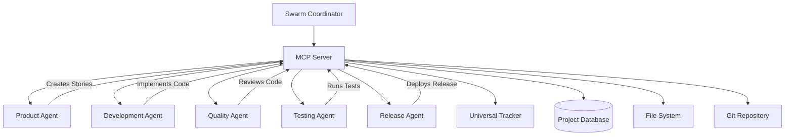

# MCP-Powered Agent Swarm Architecture
## Software Development Sprint Execution Swarm

**Created**: 2025-01-02 (US-MCP-001 Phase 3)  
**Purpose**: Demonstrate MCP-powered agent coordination for complex workflows

## Overview

This document outlines the architecture for an MCP-powered agent swarm that executes complete software development sprints through coordinated agent collaboration.

## Swarm Architecture

### Core Components



### Agent Roles

1. **Swarm Coordinator Agent**
   - Orchestrates the entire workflow
   - Assigns tasks to specialized agents
   - Monitors progress and handles failures
   - Coordinates inter-agent communication

2. **Product Agent** (Agile Focus)
   - Creates and manages user stories
   - Updates agile artifacts
   - Manages sprint planning
   - Tracks story completion

3. **Development Agent** (Code Focus)
   - Implements user stories
   - Creates and manages files
   - Follows coding standards
   - Integrates with existing codebase

4. **Quality Agent** (Review Focus)
   - Reviews code quality
   - Enforces coding standards
   - Validates architecture compliance
   - Ensures documentation quality

5. **Testing Agent** (Validation Focus)
   - Creates and runs tests
   - Validates functionality
   - Generates test reports
   - Ensures test coverage

6. **Release Agent** (Deployment Focus)
   - Manages git operations
   - Handles releases and deployments
   - Updates project catalogs
   - Manages version control

## Workflow Execution

### Phase 1: Sprint Initialization
1. **Swarm Coordinator** receives sprint requirements
2. **Product Agent** creates user stories via MCP
3. **Development Agent** analyzes technical requirements
4. **Testing Agent** plans test strategies
5. **Quality Agent** defines quality gates

### Phase 2: Development Execution
1. **Development Agent** implements user stories
2. **Quality Agent** reviews code in real-time
3. **Testing Agent** creates and runs tests
4. **Product Agent** updates story status
5. **Swarm Coordinator** monitors progress

### Phase 3: Integration & Release
1. **Quality Agent** performs final review
2. **Testing Agent** runs full test suite
3. **Release Agent** handles git operations
4. **Product Agent** updates sprint artifacts
5. **Swarm Coordinator** completes sprint

## MCP Tool Utilization

### Agent-Tool Mapping

| Agent | Primary MCP Tools | Purpose |
|-------|------------------|---------|
| Swarm Coordinator | `db.track_agent_session`, `system.configure_logging` | Orchestration & Monitoring |
| Product Agent | `agile.create_user_story`, `agile.update_artifacts`, `agile.update_catalogs` | Agile Management |
| Development Agent | `file.manage_files`, `file.enforce_organization`, `ai.edit_prompts` | Code Implementation |
| Quality Agent | `system.platform_commands`, `file.manage_files` | Quality Assurance |
| Testing Agent | `test.run_pipeline`, `test.generate_catalogue` | Test Management |
| Release Agent | `git.automate_workflow`, `db.log_multi_database` | Release Management |

### Inter-Agent Communication

Agents communicate through MCP tools:
- **Status Updates**: Via `db.track_agent_session`
- **File Sharing**: Via `file.manage_files`
- **Progress Tracking**: Via `agile.update_artifacts`
- **Quality Gates**: Via `test.run_pipeline`

## Swarm Coordination Patterns

### 1. Sequential Workflow
```
Product Agent → Development Agent → Quality Agent → Testing Agent → Release Agent
```

### 2. Parallel Processing
```
Product Agent ┐
               ├→ Swarm Coordinator → Release Agent
Development Agent ┘
Quality Agent ┐
              ├→ Testing Agent
Testing Agent ┘
```

### 3. Feedback Loops
```
Development Agent ↔ Quality Agent
Testing Agent → Development Agent (on failures)
Product Agent ← All Agents (status updates)
```

## Error Handling & Recovery

### Failure Scenarios
1. **Agent Failure**: Swarm Coordinator reassigns tasks
2. **Tool Failure**: Graceful degradation to manual processes
3. **Communication Failure**: Retry mechanisms with exponential backoff
4. **Quality Gate Failure**: Automatic rollback and retry

### Recovery Strategies
- **Checkpoint System**: Save state at each phase
- **Task Redistribution**: Failed tasks reassigned to available agents
- **Graceful Degradation**: Continue with reduced functionality
- **Human Escalation**: Alert human operators for critical failures

## Performance Optimization

### Parallel Execution
- Multiple agents work simultaneously where possible
- MCP server handles concurrent tool requests
- Universal Tracker monitors performance bottlenecks

### Caching Strategy
- Tool results cached for repeated operations
- Agent state cached for quick recovery
- File operations optimized through MCP caching

### Resource Management
- Agent pool management for optimal resource usage
- MCP connection pooling for efficiency
- Automatic scaling based on workload

## Monitoring & Observability

### Metrics Collected
- **Agent Performance**: Execution times, success rates
- **Tool Usage**: Frequency, performance, errors
- **Workflow Progress**: Phase completion, bottlenecks
- **Quality Metrics**: Code quality, test coverage

### Dashboards
- **Swarm Overview**: Real-time agent status
- **Workflow Progress**: Sprint execution timeline
- **Performance Metrics**: Agent and tool performance
- **Quality Dashboard**: Code quality and test results

## Security & Compliance

### Access Control
- Agent-specific tool access permissions
- MCP security manager enforces access policies
- Audit logging for all agent actions

### Data Protection
- Sensitive data encrypted in transit
- Agent communication secured through MCP
- Compliance with data protection regulations

## Scalability Considerations

### Horizontal Scaling
- Add more specialized agents as needed
- MCP server scales to handle increased load
- Database partitioning for large projects

### Vertical Scaling
- Increase agent processing power
- Optimize MCP tool performance
- Enhanced caching strategies

## Implementation Phases

### Phase 1: Core Swarm (Week 1)
- Implement Swarm Coordinator
- Create basic specialized agents
- Establish MCP communication

### Phase 2: Advanced Features (Week 2)
- Add error handling and recovery
- Implement parallel processing
- Add performance monitoring

### Phase 3: Production Optimization (Week 3)
- Optimize performance and scalability
- Add comprehensive monitoring
- Implement security features

## Success Metrics

### Functional Metrics
- **Sprint Completion Rate**: % of sprints completed successfully
- **Story Implementation Rate**: % of stories implemented correctly
- **Quality Gate Pass Rate**: % of quality checks passed
- **Test Coverage**: % of code covered by tests

### Performance Metrics
- **Sprint Execution Time**: Time to complete full sprint
- **Agent Utilization**: % of time agents are productive
- **Tool Performance**: Average tool execution time
- **Error Recovery Time**: Time to recover from failures

### Quality Metrics
- **Code Quality Score**: Automated quality assessment
- **Bug Detection Rate**: % of bugs caught before release
- **Documentation Coverage**: % of code documented
- **Compliance Score**: % of compliance requirements met

## Future Enhancements

### Advanced AI Features
- **Predictive Analytics**: Predict sprint bottlenecks
- **Intelligent Task Assignment**: AI-optimized task distribution
- **Adaptive Workflows**: Self-optimizing workflow patterns
- **Learning Agents**: Agents that improve over time

### Integration Capabilities
- **External Tool Integration**: Connect to external development tools
- **CI/CD Pipeline Integration**: Seamless deployment workflows
- **Project Management Integration**: Connect to Jira, Asana, etc.
- **Communication Integration**: Slack, Teams notifications

This architecture provides a robust foundation for demonstrating the power of MCP-coordinated agent swarms in complex, real-world workflows.
