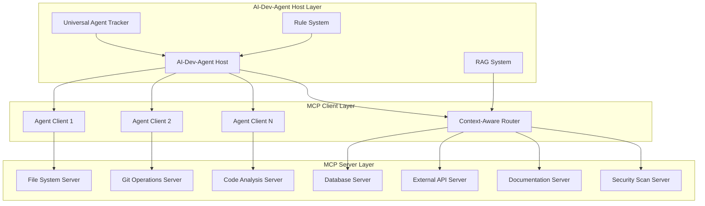

# MCP Architecture Concept Paper: State-of-the-Art Design for AI-Dev-Agent

**Document**: MCP Architecture Design Concept  
**Version**: 1.0  
**Status**: Research & Design Phase  
**Last Updated**: 2025-01-02  
**Authors**: AI Development Agent Project Team

## Executive Summary

This concept paper outlines the design and implementation strategy for integrating **Model Context Protocol (MCP)** into the AI-Dev-Agent system, leveraging state-of-the-art technologies and architectural patterns. The proposed architecture combines MCP's standardized tool access with our existing RAG-enhanced agent system, creating a powerful, extensible, and secure AI development platform.

## 1. Introduction

### 1.1 What is Model Context Protocol (MCP)?

The **Model Context Protocol (MCP)** is an open standard introduced by Anthropic in November 2024 that standardizes the integration of Large Language Models (LLMs) with external tools, systems, and data sources. MCP provides:

- **Universal Interface**: Standardized communication between AI systems and external resources
- **Security Controls**: Built-in access controls, user consent, and data privacy
- **Extensible Design**: Easy addition of new tools and capabilities
- **Protocol Compliance**: JSON-RPC 2.0 based communication standard

### 1.2 Strategic Vision

Our MCP integration builds upon the successful completion of **US-RAG-001** (RAG-Enhanced IDE Integration) to create a unified **RAG + MCP** architecture that provides:

- **Intelligent Tool Selection**: RAG-guided context-aware tool routing
- **Standardized External Access**: MCP-compliant tool integration
- **Enhanced Agent Capabilities**: All existing agents gain external tool access
- **Secure Operations**: Built-in security and user consent mechanisms

## 2. Current State Analysis

### 2.1 Existing Components in AI-Dev-Agent

Based on our codebase analysis, we already have:

#### ✅ **Foundation Components**
- **Universal Agent Tracker**: Context switching and session management
- **RAG System**: FAISS vector database with semantic search
- **Agent Swarm Architecture**: Specialized development agents
- **Rule-Based Context System**: Dynamic rule activation and monitoring
- **Streamlit UI**: User interface for agent interaction

#### ✅ **Existing MCP Documentation**
- `docs/concepts/integration/mcp_integration.md` - Integration summary
- `docs/concepts/integration/mcp_server_concept.md` - Server concept design
- `docs/architecture/strategic_integration_roadmap.md` - RAG-MCP roadmap
- **US-MCP-001** user story with detailed acceptance criteria

#### 🔄 **Current Status**
- **US-RAG-001**: ✅ **COMPLETED** - RAG foundation operational
- **US-MCP-001**: 🟡 **Ready for Sprint Planning** - 18 story points, 3-week implementation

### 2.2 Architecture Gaps

**Missing Components for MCP Integration**:
1. MCP Server implementation
2. MCP Client library integration
3. Tool registry and management system
4. Security and authorization framework
5. LangChain-MCP adapter layer

## 3. State-of-the-Art MCP Architecture Design

### 3.1 Core MCP Architecture Pattern

Based on the official MCP specification, we'll implement the standard **Client-Host-Server** architecture:



### 3.2 Enhanced Architecture Components

#### **3.2.1 RAG-Enhanced MCP Host**
```python
class RAGEnhancedMCPHost:
    """
    MCP Host with RAG intelligence for context-aware tool routing
    """
    def __init__(self):
        self.universal_tracker = get_universal_tracker()
        self.rag_system = get_rag_system()
        self.rule_engine = get_rule_engine()
        self.clients = {}
        self.security_manager = MCPSecurityManager()
    
    async def route_tool_request(self, agent_context, tool_request):
        # Use RAG to analyze context and suggest optimal tools
        context_analysis = await self.rag_system.analyze_context(agent_context)
        optimal_tools = await self.rag_system.suggest_tools(tool_request, context_analysis)
        
        # Apply security policies
        authorized_tools = self.security_manager.filter_authorized_tools(
            optimal_tools, agent_context.permissions
        )
        
        # Route to appropriate MCP server
        return await self.execute_tool_chain(authorized_tools, tool_request)
```

#### **3.2.2 LangChain-MCP Integration Layer**
```python
from langchain_mcp import MCPToolkit
from langchain.agents import AgentExecutor

class LangChainMCPAdapter:
    """
    Adapter for integrating LangChain agents with MCP servers
    """
    def __init__(self, mcp_host):
        self.mcp_host = mcp_host
        self.toolkit = MCPToolkit(mcp_host)
    
    def create_agent_with_mcp_tools(self, agent_type):
        # Get MCP tools available for this agent type
        available_tools = self.toolkit.get_tools_for_agent(agent_type)
        
        # Create LangChain agent with MCP tools
        agent = AgentExecutor.from_agent_and_tools(
            agent=agent_type,
            tools=available_tools,
            verbose=True,
            handle_parsing_errors=True
        )
        
        return agent
```

### 3.3 State-of-the-Art Technology Stack

#### **3.3.1 Core Technologies**
- **Protocol**: JSON-RPC 2.0 (MCP standard)
- **Transport**: HTTP/WebSocket for remote, stdio for local
- **Security**: OAuth 2.0 + Zero Trust model
- **Serialization**: JSON with schema validation
- **Async Framework**: asyncio/aiohttp for Python

#### **3.3.2 Advanced Features**
- **Capability Negotiation**: Dynamic feature discovery
- **Event-Driven Architecture**: Real-time notifications
- **Containerization**: Docker/Kubernetes deployment
- **Monitoring**: Prometheus/Grafana integration
- **Caching**: Redis for tool result caching

## 4. Detailed Implementation Strategy

### 4.1 Phase 1: MCP Foundation (Week 1)

#### **4.1.1 MCP Server Architecture**
```python
# utils/mcp/server.py
class AIDevelopmentMCPServer:
    """
    Custom MCP Server for AI Development tools
    """
    def __init__(self):
        self.tools = {
            "file_operations": FileOperationsToolset(),
            "git_operations": GitOperationsToolset(),
            "code_analysis": CodeAnalysisToolset(),
            "database_operations": DatabaseToolset(),
            "documentation": DocumentationToolset(),
            "security_scan": SecurityToolset()
        }
    
    async def handle_tool_request(self, tool_name, parameters):
        # Validate request
        if not self.validate_tool_request(tool_name, parameters):
            raise MCPValidationError(f"Invalid request for {tool_name}")
        
        # Execute tool
        toolset = self.tools.get(tool_name.split('_')[0])
        if not toolset:
            raise MCPToolNotFoundError(f"Tool {tool_name} not found")
        
        result = await toolset.execute(tool_name, parameters)
        
        # Log to Universal Agent Tracker
        await self.log_tool_execution(tool_name, parameters, result)
        
        return result
```

#### **4.1.2 MCP Client Integration**
```python
# utils/mcp/client.py
class MCPAgentClient:
    """
    MCP Client for AI agents
    """
    def __init__(self, agent_id, server_config):
        self.agent_id = agent_id
        self.server_config = server_config
        self.session = None
        self.capabilities = {}
    
    async def connect(self):
        # Establish connection to MCP server
        self.session = await self.create_session()
        
        # Negotiate capabilities
        self.capabilities = await self.negotiate_capabilities()
        
        # Register with Universal Agent Tracker
        await self.register_session()
    
    async def execute_tool(self, tool_name, parameters):
        # Check capabilities
        if not self.can_execute_tool(tool_name):
            raise MCPCapabilityError(f"Tool {tool_name} not available")
        
        # Execute via MCP protocol
        result = await self.session.call_tool(tool_name, parameters)
        
        # Update context in Universal Agent Tracker
        await self.update_context(tool_name, result)
        
        return result
```

### 4.2 Phase 2: RAG-MCP Integration (Week 2)

#### **4.2.1 Context-Aware Tool Router**
```python
# utils/mcp/rag_router.py
class RAGContextualToolRouter:
    """
    RAG-enhanced tool routing for optimal tool selection
    """
    def __init__(self, rag_system, mcp_host):
        self.rag_system = rag_system
        self.mcp_host = mcp_host
        self.tool_usage_patterns = {}
    
    async def route_request(self, agent_context, user_request):
        # Analyze request context using RAG
        context_embedding = await self.rag_system.embed_context(
            agent_context, user_request
        )
        
        # Find similar historical patterns
        similar_patterns = await self.rag_system.find_similar_contexts(
            context_embedding, threshold=0.8
        )
        
        # Suggest optimal tool chain
        tool_chain = await self.suggest_tool_chain(
            similar_patterns, user_request
        )
        
        # Execute with error recovery
        return await self.execute_with_recovery(tool_chain)
```

#### **4.2.2 Pattern Learning System**
```python
# utils/mcp/pattern_learner.py
class MCPPatternLearner:
    """
    Learns from tool usage patterns to improve future routing
    """
    def __init__(self, rag_system):
        self.rag_system = rag_system
        self.pattern_db = "utils/database/mcp_patterns.db"
    
    async def learn_from_execution(self, context, tool_chain, result):
        # Extract features from successful execution
        features = self.extract_execution_features(context, tool_chain, result)
        
        # Store in RAG knowledge base
        await self.rag_system.add_pattern(
            context=context,
            tool_chain=tool_chain,
            success_metrics=result.metrics,
            features=features
        )
        
        # Update routing weights
        await self.update_routing_weights(features, result.success_score)
```

### 4.3 Phase 3: Agent Enhancement (Week 3)

#### **4.3.1 Enhanced Agent Base Class**
```python
# agents/mcp_enhanced_agent.py
class MCPEnhancedAgent(BaseAgent):
    """
    Base class for agents with MCP tool capabilities
    """
    def __init__(self, agent_type, mcp_client):
        super().__init__(agent_type)
        self.mcp_client = mcp_client
        self.available_tools = {}
    
    async def initialize(self):
        # Connect to MCP server
        await self.mcp_client.connect()
        
        # Discover available tools
        self.available_tools = await self.mcp_client.get_available_tools()
        
        # Register capabilities with Universal Agent Tracker
        await self.register_mcp_capabilities()
    
    async def execute_with_tools(self, task):
        # Analyze task requirements
        required_tools = await self.analyze_tool_requirements(task)
        
        # Execute tool chain
        results = []
        for tool_name, parameters in required_tools:
            result = await self.mcp_client.execute_tool(tool_name, parameters)
            results.append(result)
        
        # Synthesize final result
        return await self.synthesize_results(task, results)
```

## 5. Security and Trust Framework

### 5.1 Zero Trust Security Model

```python
# utils/mcp/security.py
class MCPSecurityManager:
    """
    Zero Trust security manager for MCP operations
    """
    def __init__(self):
        self.auth_provider = OAuth2Provider()
        self.permission_engine = PermissionEngine()
        self.audit_logger = AuditLogger()
    
    async def authorize_tool_access(self, agent_id, tool_name, parameters):
        # Verify agent identity
        agent_identity = await self.auth_provider.verify_agent(agent_id)
        
        # Check permissions
        has_permission = await self.permission_engine.check_permission(
            agent_identity, tool_name, parameters
        )
        
        if not has_permission:
            await self.audit_logger.log_unauthorized_access(
                agent_id, tool_name, parameters
            )
            raise MCPUnauthorizedError("Access denied")
        
        # Log authorized access
        await self.audit_logger.log_authorized_access(
            agent_id, tool_name, parameters
        )
        
        return True
```

### 5.2 User Consent Framework

```python
# utils/mcp/consent.py
class UserConsentManager:
    """
    Manages user consent for MCP tool operations
    """
    def __init__(self):
        self.consent_db = "utils/database/user_consent.db"
        self.ui_manager = ConsentUIManager()
    
    async def request_consent(self, operation_type, details):
        # Check existing consent
        existing_consent = await self.check_existing_consent(
            operation_type, details
        )
        
        if existing_consent:
            return existing_consent
        
        # Request user consent via UI
        consent_response = await self.ui_manager.request_consent(
            operation_type, details
        )
        
        # Store consent decision
        await self.store_consent(operation_type, details, consent_response)
        
        return consent_response
```

## 6. Performance and Scalability

### 6.1 Caching Strategy

```python
# utils/mcp/cache.py
class MCPResultCache:
    """
    Intelligent caching for MCP tool results
    """
    def __init__(self):
        self.redis_client = redis.Redis()
        self.cache_policies = {
            "file_operations": {"ttl": 300, "invalidate_on_change": True},
            "git_operations": {"ttl": 60, "invalidate_on_change": True},
            "code_analysis": {"ttl": 1800, "invalidate_on_change": False},
        }
    
    async def get_cached_result(self, tool_name, parameters):
        cache_key = self.generate_cache_key(tool_name, parameters)
        cached_result = await self.redis_client.get(cache_key)
        
        if cached_result:
            return json.loads(cached_result)
        
        return None
    
    async def cache_result(self, tool_name, parameters, result):
        cache_key = self.generate_cache_key(tool_name, parameters)
        policy = self.cache_policies.get(tool_name.split('_')[0], {})
        ttl = policy.get('ttl', 600)
        
        await self.redis_client.setex(
            cache_key, ttl, json.dumps(result)
        )
```

### 6.2 Load Balancing and Scaling

```python
# utils/mcp/load_balancer.py
class MCPLoadBalancer:
    """
    Load balancer for MCP server instances
    """
    def __init__(self):
        self.server_pool = []
        self.health_checker = HealthChecker()
        self.metrics_collector = MetricsCollector()
    
    async def route_request(self, tool_request):
        # Get healthy servers
        healthy_servers = await self.health_checker.get_healthy_servers()
        
        # Select server based on load and capabilities
        selected_server = await self.select_optimal_server(
            healthy_servers, tool_request
        )
        
        # Route request
        result = await selected_server.execute_tool(tool_request)
        
        # Update metrics
        await self.metrics_collector.record_execution(
            selected_server, tool_request, result
        )
        
        return result
```

## 7. Monitoring and Observability

### 7.1 Comprehensive Monitoring

```python
# utils/mcp/monitoring.py
class MCPMonitoringSystem:
    """
    Comprehensive monitoring for MCP operations
    """
    def __init__(self):
        self.prometheus_client = PrometheusClient()
        self.grafana_client = GrafanaClient()
        self.alert_manager = AlertManager()
    
    async def track_tool_execution(self, tool_name, execution_time, success):
        # Record metrics
        await self.prometheus_client.record_counter(
            "mcp_tool_executions_total",
            labels={"tool": tool_name, "status": "success" if success else "error"}
        )
        
        await self.prometheus_client.record_histogram(
            "mcp_tool_execution_duration_seconds",
            execution_time,
            labels={"tool": tool_name}
        )
        
        # Check for anomalies
        if execution_time > self.get_threshold(tool_name):
            await self.alert_manager.send_alert(
                f"Slow execution detected for {tool_name}: {execution_time}s"
            )
```

## 8. Implementation Roadmap

### 8.1 Sprint Planning Integration

**Integration with US-MCP-001**:
- **Week 1**: MCP Foundation → AC-1.1 through AC-1.4
- **Week 2**: RAG-MCP Integration → AC-2.1 through AC-2.4  
- **Week 3**: Agent Enhancement → AC-3.1 through AC-3.4

### 8.2 Success Metrics

**Technical Metrics**:
- Tool execution latency < 500ms (95th percentile)
- System availability > 99.9%
- Security incident rate < 0.1%
- Agent productivity improvement > 40%

**Business Metrics**:
- Development velocity increase > 30%
- Error reduction > 70%
- New team member productivity < 2 days
- User satisfaction score > 8.5/10

## 9. Risk Assessment and Mitigation

### 9.1 Technical Risks

| Risk | Impact | Probability | Mitigation |
|------|--------|-------------|------------|
| MCP Protocol Changes | High | Medium | Version compatibility layer |
| Performance Bottlenecks | Medium | High | Comprehensive caching + load balancing |
| Security Vulnerabilities | High | Low | Zero Trust + regular security audits |
| Integration Complexity | Medium | Medium | Phased implementation + extensive testing |

### 9.2 Operational Risks

| Risk | Impact | Probability | Mitigation |
|------|--------|-------------|------------|
| Tool Server Failures | Medium | Medium | Health checks + failover mechanisms |
| Data Privacy Issues | High | Low | Strict consent management + audit trails |
| User Adoption Resistance | Medium | Low | Comprehensive training + gradual rollout |

## 10. Future Enhancements

### 10.1 Advanced AI Integration

- **Multi-Modal Tool Support**: Image, audio, video processing tools
- **Federated Learning**: Cross-agent knowledge sharing
- **Autonomous Tool Discovery**: AI-driven tool recommendation
- **Natural Language Tool Creation**: Generate tools from descriptions

### 10.2 Enterprise Features

- **Multi-Tenant Architecture**: Isolated environments per organization
- **Advanced Analytics**: Detailed usage analytics and insights
- **Compliance Framework**: SOC2, GDPR, HIPAA compliance
- **Enterprise SSO**: Integration with corporate identity providers

## 11. Conclusion

The proposed MCP architecture for AI-Dev-Agent represents a state-of-the-art integration of standardized tool access with intelligent context awareness. By combining MCP's robust protocol with our existing RAG system and Universal Agent Tracker, we create a powerful, secure, and extensible platform for AI-driven development.

**Key Benefits**:
- **Standardized Integration**: MCP compliance ensures interoperability
- **Intelligent Routing**: RAG-enhanced tool selection and optimization
- **Security First**: Zero Trust model with comprehensive consent management
- **Scalable Architecture**: Designed for enterprise-scale deployments
- **Extensible Design**: Easy addition of new tools and capabilities

**Next Steps**:
1. **Sprint Planning**: Schedule US-MCP-001 for immediate implementation
2. **Team Preparation**: Technical architecture review and team training
3. **Security Review**: Comprehensive security assessment and approval
4. **Implementation Kickoff**: Begin Phase 1 development with MCP foundation

This architecture positions AI-Dev-Agent as a leader in AI-driven development tools, providing a robust foundation for next-generation intelligent development assistance.

---

**Document Status**: ✅ **READY FOR REVIEW**  
**Implementation Priority**: 🔴 **HIGH** (Following US-RAG-001 completion)  
**Strategic Impact**: Foundation for next-generation AI development platform
