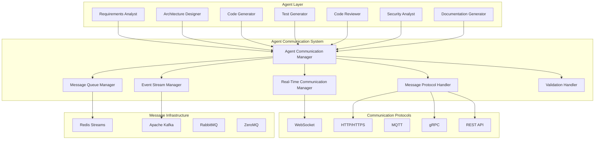

# Agent Communication System

## Executive Summary

The Agent Communication System is the foundational component that enables seamless, reliable, and scalable communication between AI agents in our multi-agent development system. This system implements cutting-edge communication patterns and protocols to support complex workflows, real-time collaboration, and dynamic agent interactions.

### Key Benefits
- **Seamless Inter-Agent Communication**: Enables agents to communicate efficiently without tight coupling
- **Real-Time Collaboration**: Supports synchronous and asynchronous communication patterns
- **Scalable Architecture**: Handles increasing agent complexity and communication volume
- **Reliable Message Delivery**: Ensures message delivery with proper error handling and retry mechanisms
- **Dynamic Workflow Support**: Enables flexible workflow orchestration and agent handoffs

### Technology Stack
- **Primary Framework**: LangGraph with built-in communication primitives
- **Message Queue**: Redis Streams for reliable message delivery
- **Event Streaming**: Apache Kafka for high-throughput event processing
- **Real-Time Communication**: WebSockets for immediate agent interactions
- **Protocol Buffers**: For efficient message serialization and deserialization

### Integration Points
- **LangGraph Workflow Manager**: Primary integration for workflow orchestration
- **State Management System**: For maintaining communication context and state
- **Memory Management System**: For storing communication history and patterns
- **Quality Assurance Framework**: For validating communication protocols and patterns
- **Performance Monitoring System**: For tracking communication performance metrics

## Technical Architecture

### Core Architecture



### Design Patterns

#### 1. Publisher/Subscriber Pattern
```python
class AgentCommunicationManager:
    """Manages communication between agents using pub/sub pattern."""
    
    def __init__(self, redis_client: Redis, kafka_producer: KafkaProducer):
        self.redis_client = redis_client
        self.kafka_producer = kafka_producer
        self.subscribers = defaultdict(list)
        self.message_handlers = {}
    
    async def publish_message(self, topic: str, message: AgentMessage) -> str:
        """Publish message to a specific topic."""
        message_id = str(uuid.uuid4())
        message.timestamp = datetime.utcnow()
        message.message_id = message_id
        
        # Store in Redis for immediate access
        await self.redis_client.xadd(
            f"agent_messages:{topic}",
            message.model_dump()
        )
        
        # Publish to Kafka for persistence and replay
        await self.kafka_producer.send(
            topic=f"agent_communication.{topic}",
            value=message.model_dump_json().encode()
        )
        
        return message_id
    
    async def subscribe_to_topic(self, agent_id: str, topic: str, handler: Callable):
        """Subscribe an agent to a specific topic."""
        self.subscribers[topic].append({
            'agent_id': agent_id,
            'handler': handler
        })
        
        # Start listening for messages
        await self._start_message_listener(agent_id, topic)
```

#### 2. Request/Response Pattern
```python
class RequestResponseManager:
    """Manages request/response communication between agents."""
    
    def __init__(self, redis_client: Redis):
        self.redis_client = redis_client
        self.pending_requests = {}
        self.response_handlers = {}
    
    async def send_request(self, from_agent: str, to_agent: str, 
                          request: AgentRequest, timeout: int = 30) -> AgentResponse:
        """Send a request to another agent and wait for response."""
        request_id = str(uuid.uuid4())
        request.request_id = request_id
        request.from_agent = from_agent
        request.to_agent = to_agent
        request.timestamp = datetime.utcnow()
        
        # Store request for tracking
        self.pending_requests[request_id] = {
            'request': request,
            'timestamp': datetime.utcnow(),
            'timeout': timeout
        }
        
        # Send request via Redis
        await self.redis_client.xadd(
            f"agent_requests:{to_agent}",
            request.model_dump()
        )
        
        # Wait for response with timeout
        response = await self._wait_for_response(request_id, timeout)
        return response
    
    async def handle_request(self, agent_id: str, handler: Callable):
        """Register a request handler for an agent."""
        self.response_handlers[agent_id] = handler
        
        # Start listening for requests
        await self._start_request_listener(agent_id)
```

#### 3. Event Sourcing Pattern
```python
class EventSourcingManager:
    """Manages event sourcing for agent communication."""
    
    def __init__(self, kafka_producer: KafkaProducer, kafka_consumer: KafkaConsumer):
        self.kafka_producer = kafka_producer
        self.kafka_consumer = kafka_consumer
        self.event_store = {}
        self.event_handlers = {}
    
    async def publish_event(self, event: AgentEvent) -> str:
        """Publish an event to the event stream."""
        event_id = str(uuid.uuid4())
        event.event_id = event_id
        event.timestamp = datetime.utcnow()
        
        # Publish to Kafka event stream
        await self.kafka_producer.send(
            topic="agent_events",
            value=event.model_dump_json().encode(),
            key=event_id.encode()
        )
        
        # Store in local event store
        self.event_store[event_id] = event
        
        return event_id
    
    async def replay_events(self, agent_id: str, from_timestamp: datetime = None):
        """Replay events for an agent from a specific timestamp."""
        events = await self._get_events_since(from_timestamp or datetime.min)
        
        for event in events:
            if event.target_agent == agent_id:
                await self._handle_event(event)
```

### Data Flow

#### Message Flow Architecture
```python
@dataclass
class AgentMessage:
    """Standard message format for agent communication."""
    message_id: str
    from_agent: str
    to_agent: str
    message_type: str  # 'request', 'response', 'event', 'notification'
    payload: Dict[str, Any]
    timestamp: datetime
    correlation_id: Optional[str] = None
    priority: int = 0
    ttl: Optional[int] = None  # Time to live in seconds
    
    class Config:
        json_encoders = {
            datetime: lambda v: v.isoformat()
        }

@dataclass
class AgentRequest:
    """Request format for agent communication."""
    request_id: str
    from_agent: str
    to_agent: str
    method: str
    parameters: Dict[str, Any]
    timeout: int = 30
    timestamp: datetime = field(default_factory=datetime.utcnow)

@dataclass
class AgentResponse:
    """Response format for agent communication."""
    response_id: str
    request_id: str
    from_agent: str
    to_agent: str
    status: str  # 'success', 'error', 'timeout'
    data: Optional[Dict[str, Any]] = None
    error: Optional[str] = None
    timestamp: datetime = field(default_factory=datetime.utcnow)

@dataclass
class AgentEvent:
    """Event format for agent communication."""
    event_id: str
    event_type: str
    source_agent: str
    target_agent: Optional[str] = None
    data: Dict[str, Any]
    timestamp: datetime = field(default_factory=datetime.utcnow)
```

## Implementation Guidelines

### Core Implementation

#### Agent Communication Manager
```python
class AgentCommunicationManager:
    """Main communication manager for the agent system."""
    
    def __init__(self, config: CommunicationConfig):
        self.config = config
        self.redis_client = Redis.from_url(config.redis_url)
        self.kafka_producer = KafkaProducer(
            bootstrap_servers=config.kafka_bootstrap_servers,
            value_serializer=lambda v: json.dumps(v).encode('utf-8')
        )
        self.kafka_consumer = KafkaConsumer(
            bootstrap_servers=config.kafka_bootstrap_servers,
            value_deserializer=lambda v: json.loads(v.decode('utf-8'))
        )
        
        # Initialize managers
        self.pubsub_manager = PublisherSubscriberManager(self.redis_client, self.kafka_producer)
        self.request_response_manager = RequestResponseManager(self.redis_client)
        self.event_sourcing_manager = EventSourcingManager(self.kafka_producer, self.kafka_consumer)
        self.realtime_manager = RealTimeCommunicationManager()
        
        # Message validation
        self.validator = MessageValidator()
        self.rate_limiter = RateLimiter(config.rate_limit_config)
        
    async def initialize(self):
        """Initialize the communication system."""
        await self.redis_client.ping()
        await self._setup_kafka_topics()
        await self._start_background_tasks()
        
    async def send_message(self, from_agent: str, to_agent: str, 
                          message_type: str, payload: Dict[str, Any]) -> str:
        """Send a message from one agent to another."""
        # Rate limiting
        if not self.rate_limiter.allow_message(from_agent):
            raise RateLimitExceeded(f"Rate limit exceeded for agent {from_agent}")
        
        # Create message
        message = AgentMessage(
            message_id=str(uuid.uuid4()),
            from_agent=from_agent,
            to_agent=to_agent,
            message_type=message_type,
            payload=payload,
            timestamp=datetime.utcnow()
        )
        
        # Validate message
        if not self.validator.validate_message(message):
            raise InvalidMessageError("Message validation failed")
        
        # Send via appropriate channel
        if message_type in ['request', 'response']:
            return await self.request_response_manager.send_request(
                from_agent, to_agent, message
            )
        elif message_type == 'event':
            return await self.event_sourcing_manager.publish_event(message)
        else:
            return await self.pubsub_manager.publish_message(
                f"agent.{to_agent}", message
            )
    
    async def broadcast_message(self, from_agent: str, message_type: str, 
                               payload: Dict[str, Any], topic: str = "broadcast") -> str:
        """Broadcast a message to all agents or a specific topic."""
        message = AgentMessage(
            message_id=str(uuid.uuid4()),
            from_agent=from_agent,
            to_agent="*",  # Broadcast
            message_type=message_type,
            payload=payload,
            timestamp=datetime.utcnow()
        )
        
        return await self.pubsub_manager.publish_message(topic, message)
    
    async def subscribe_to_messages(self, agent_id: str, handler: Callable):
        """Subscribe an agent to receive messages."""
        await self.pubsub_manager.subscribe_to_topic(agent_id, f"agent.{agent_id}", handler)
        await self.request_response_manager.handle_request(agent_id, handler)
        await self.event_sourcing_manager.subscribe_to_events(agent_id, handler)
```

#### Message Validation and Security
```python
class MessageValidator:
    """Validates messages for security and integrity."""
    
    def __init__(self):
        self.allowed_message_types = {
            'request', 'response', 'event', 'notification', 'handoff', 'escalation'
        }
        self.max_payload_size = 1024 * 1024  # 1MB
        self.required_fields = {'message_id', 'from_agent', 'to_agent', 'message_type', 'payload'}
    
    def validate_message(self, message: AgentMessage) -> bool:
        """Validate a message for security and integrity."""
        try:
            # Check required fields
            if not all(hasattr(message, field) for field in self.required_fields):
                return False
            
            # Validate message type
            if message.message_type not in self.allowed_message_types:
                return False
            
            # Validate payload size
            payload_size = len(json.dumps(message.payload))
            if payload_size > self.max_payload_size:
                return False
            
            # Validate agent IDs
            if not self._validate_agent_id(message.from_agent):
                return False
            if message.to_agent != "*" and not self._validate_agent_id(message.to_agent):
                return False
            
            # Validate timestamp
            if message.timestamp > datetime.utcnow() + timedelta(minutes=5):
                return False  # Future timestamp not allowed
            
            return True
            
        except Exception:
            return False
    
    def _validate_agent_id(self, agent_id: str) -> bool:
        """Validate agent ID format."""
        return bool(re.match(r'^[a-zA-Z0-9_-]+$', agent_id))

class RateLimiter:
    """Implements rate limiting for agent communication."""
    
    def __init__(self, config: RateLimitConfig):
        self.config = config
        self.redis_client = Redis.from_url(config.redis_url)
        self.windows = {}
    
    def allow_message(self, agent_id: str) -> bool:
        """Check if an agent can send a message based on rate limits."""
        current_time = time.time()
        window_key = f"rate_limit:{agent_id}:{int(current_time / self.config.window_size)}"
        
        # Get current count
        current_count = self.redis_client.get(window_key)
        if current_count is None:
            current_count = 0
        else:
            current_count = int(current_count)
        
        # Check if limit exceeded
        if current_count >= self.config.max_messages_per_window:
            return False
        
        # Increment counter
        self.redis_client.incr(window_key)
        self.redis_client.expire(window_key, self.config.window_size)
        
        return True
```

### Configuration and Setup

#### Communication Configuration
```python
@dataclass
class CommunicationConfig:
    """Configuration for the agent communication system."""
    
    # Redis Configuration
    redis_url: str = "redis://localhost:6379"
    redis_max_connections: int = 20
    redis_socket_timeout: int = 5
    
    # Kafka Configuration
    kafka_bootstrap_servers: List[str] = field(default_factory=lambda: ["localhost:9092"])
    kafka_security_protocol: str = "PLAINTEXT"
    kafka_sasl_mechanism: Optional[str] = None
    kafka_username: Optional[str] = None
    kafka_password: Optional[str] = None
    
    # WebSocket Configuration
    websocket_url: str = "ws://localhost:8080/ws"
    websocket_ping_interval: int = 30
    websocket_ping_timeout: int = 10
    
    # Message Configuration
    max_message_size: int = 1024 * 1024  # 1MB
    message_ttl: int = 3600  # 1 hour
    retry_attempts: int = 3
    retry_delay: int = 1  # seconds
    
    # Rate Limiting
    rate_limit_config: RateLimitConfig = field(default_factory=RateLimitConfig)
    
    # Security
    enable_encryption: bool = True
    encryption_key: Optional[str] = None
    enable_authentication: bool = True
    jwt_secret: Optional[str] = None

@dataclass
class RateLimitConfig:
    """Configuration for rate limiting."""
    max_messages_per_window: int = 100
    window_size: int = 60  # seconds
    redis_url: str = "redis://localhost:6379"
```

#### Setup Instructions
```python
# Example setup and initialization
async def setup_agent_communication():
    """Setup the agent communication system."""
    
    # Load configuration
    config = CommunicationConfig(
        redis_url=os.getenv("REDIS_URL", "redis://localhost:6379"),
        kafka_bootstrap_servers=os.getenv("KAFKA_BOOTSTRAP_SERVERS", "localhost:9092").split(","),
        enable_encryption=True,
        encryption_key=os.getenv("ENCRYPTION_KEY"),
        enable_authentication=True,
        jwt_secret=os.getenv("JWT_SECRET")
    )
    
    # Initialize communication manager
    comm_manager = AgentCommunicationManager(config)
    await comm_manager.initialize()
    
    # Register agents
    agents = [
        "requirements_analyst",
        "architecture_designer", 
        "code_generator",
        "test_generator",
        "code_reviewer",
        "security_analyst",
        "documentation_generator"
    ]
    
    for agent_id in agents:
        await comm_manager.subscribe_to_messages(agent_id, handle_agent_message)
    
    return comm_manager

async def handle_agent_message(message: AgentMessage):
    """Handle incoming messages for agents."""
    logger.info(f"Received message: {message.message_id} from {message.from_agent}")
    
    # Process message based on type
    if message.message_type == "request":
        await handle_request(message)
    elif message.message_type == "event":
        await handle_event(message)
    elif message.message_type == "notification":
        await handle_notification(message)
    else:
        logger.warning(f"Unknown message type: {message.message_type}")
```

## Integration Patterns

### LangGraph Integration
```python
class LangGraphCommunicationAdapter:
    """Adapter for integrating with LangGraph communication primitives."""
    
    def __init__(self, comm_manager: AgentCommunicationManager):
        self.comm_manager = comm_manager
        self.state_graph = None
    
    def integrate_with_langgraph(self, state_graph: StateGraph):
        """Integrate communication system with LangGraph state graph."""
        self.state_graph = state_graph
        
        # Add communication nodes
        state_graph.add_node("send_message", self._send_message_node)
        state_graph.add_node("receive_message", self._receive_message_node)
        state_graph.add_node("broadcast_message", self._broadcast_message_node)
        
        # Add communication edges
        state_graph.add_edge("send_message", "receive_message")
        state_graph.add_edge("broadcast_message", "receive_message")
    
    async def _send_message_node(self, state: AgentState) -> AgentState:
        """LangGraph node for sending messages."""
        if "message_to_send" in state:
            message_data = state["message_to_send"]
            message_id = await self.comm_manager.send_message(
                from_agent=state["current_agent"],
                to_agent=message_data["to_agent"],
                message_type=message_data["type"],
                payload=message_data["payload"]
            )
            
            # Update state with message ID
            state["last_message_id"] = message_id
            state["messages_sent"].append({
                "message_id": message_id,
                "to_agent": message_data["to_agent"],
                "timestamp": datetime.utcnow()
            })
        
        return state
    
    async def _receive_message_node(self, state: AgentState) -> AgentState:
        """LangGraph node for receiving messages."""
        # Check for pending messages
        pending_messages = await self.comm_manager.get_pending_messages(
            state["current_agent"]
        )
        
        if pending_messages:
            state["received_messages"] = pending_messages
            state["last_message_received"] = datetime.utcnow()
        
        return state
```

### State Management Integration
```python
class StateManagementIntegration:
    """Integration with the state management system."""
    
    def __init__(self, comm_manager: AgentCommunicationManager, state_manager: StateManager):
        self.comm_manager = comm_manager
        self.state_manager = state_manager
    
    async def update_communication_state(self, agent_id: str, message: AgentMessage):
        """Update state management with communication events."""
        state_update = {
            "agent_id": agent_id,
            "communication_events": [{
                "message_id": message.message_id,
                "type": message.message_type,
                "timestamp": message.timestamp,
                "direction": "outbound" if message.from_agent == agent_id else "inbound"
            }],
            "last_communication": message.timestamp
        }
        
        await self.state_manager.update_agent_state(agent_id, state_update)
    
    async def get_communication_history(self, agent_id: str, 
                                       since: datetime = None) -> List[Dict]:
        """Get communication history for an agent."""
        return await self.state_manager.get_agent_state(
            agent_id, 
            fields=["communication_events"],
            since=since
        )
```

## Performance Specifications

### Performance Requirements
- **Message Latency**: < 10ms for local communication, < 100ms for distributed
- **Throughput**: 10,000+ messages per second per agent
- **Reliability**: 99.9% message delivery success rate
- **Scalability**: Support 100+ concurrent agents
- **Memory Usage**: < 100MB per agent for communication overhead

### Optimization Strategies
```python
class CommunicationOptimizer:
    """Optimizes communication performance."""
    
    def __init__(self, comm_manager: AgentCommunicationManager):
        self.comm_manager = comm_manager
        self.message_cache = LRUCache(maxsize=1000)
        self.connection_pool = ConnectionPool()
    
    async def optimize_message_delivery(self, message: AgentMessage) -> str:
        """Optimize message delivery based on type and priority."""
        
        # Check cache for duplicate messages
        cache_key = self._generate_cache_key(message)
        if cache_key in self.message_cache:
            return self.message_cache[cache_key]
        
        # Choose optimal delivery method
        if message.priority > 8:  # High priority
            # Use real-time WebSocket
            message_id = await self.comm_manager.realtime_manager.send_immediate(message)
        elif message.message_type == "event":
            # Use Kafka for events
            message_id = await self.comm_manager.event_sourcing_manager.publish_event(message)
        else:
            # Use Redis for regular messages
            message_id = await self.comm_manager.pubsub_manager.publish_message(
                f"agent.{message.to_agent}", message
            )
        
        # Cache message ID
        self.message_cache[cache_key] = message_id
        return message_id
    
    def _generate_cache_key(self, message: AgentMessage) -> str:
        """Generate cache key for message deduplication."""
        return hashlib.md5(
            f"{message.from_agent}:{message.to_agent}:{message.message_type}:{json.dumps(message.payload)}".encode()
        ).hexdigest()
```

### Monitoring and Metrics
```python
class CommunicationMetrics:
    """Tracks communication performance metrics."""
    
    def __init__(self):
        self.metrics = {
            "messages_sent": Counter(),
            "messages_received": Counter(),
            "message_latency": Histogram(),
            "error_rate": Counter(),
            "throughput": Gauge()
        }
    
    def record_message_sent(self, agent_id: str, message_type: str, latency: float):
        """Record metrics for sent messages."""
        self.metrics["messages_sent"].inc()
        self.metrics["message_latency"].observe(latency)
        
        # Record per-agent metrics
        self.metrics[f"messages_sent_{agent_id}"].inc()
        self.metrics[f"latency_{agent_id}"].observe(latency)
    
    def record_message_received(self, agent_id: str, message_type: str):
        """Record metrics for received messages."""
        self.metrics["messages_received"].inc()
        self.metrics[f"messages_received_{agent_id}"].inc()
    
    def record_error(self, error_type: str, agent_id: str = None):
        """Record communication errors."""
        self.metrics["error_rate"].inc()
        if agent_id:
            self.metrics[f"error_rate_{agent_id}"].inc()
    
    def get_performance_report(self) -> Dict[str, Any]:
        """Generate performance report."""
        return {
            "total_messages_sent": self.metrics["messages_sent"].value(),
            "total_messages_received": self.metrics["messages_received"].value(),
            "average_latency": self.metrics["message_latency"].mean(),
            "error_rate": self.metrics["error_rate"].value(),
            "current_throughput": self.metrics["throughput"].value()
        }
```

## Security Considerations

### Security Requirements
- **Message Encryption**: All messages encrypted in transit and at rest
- **Authentication**: JWT-based authentication for agent communication
- **Authorization**: Role-based access control for message types
- **Audit Logging**: Complete audit trail of all communications
- **Rate Limiting**: Prevent abuse and DoS attacks

### Security Implementation
```python
class CommunicationSecurity:
    """Implements security measures for agent communication."""
    
    def __init__(self, config: SecurityConfig):
        self.config = config
        self.encryption_key = config.encryption_key
        self.jwt_secret = config.jwt_secret
        self.audit_logger = AuditLogger()
    
    def encrypt_message(self, message: AgentMessage) -> AgentMessage:
        """Encrypt message payload."""
        if not self.config.enable_encryption:
            return message
        
        # Encrypt payload
        encrypted_payload = self._encrypt_data(message.payload)
        message.payload = {"encrypted": True, "data": encrypted_payload}
        
        return message
    
    def decrypt_message(self, message: AgentMessage) -> AgentMessage:
        """Decrypt message payload."""
        if not self.config.enable_encryption:
            return message
        
        if message.payload.get("encrypted"):
            # Decrypt payload
            decrypted_payload = self._decrypt_data(message.payload["data"])
            message.payload = decrypted_payload
        
        return message
    
    def authenticate_agent(self, agent_id: str, token: str) -> bool:
        """Authenticate agent using JWT token."""
        try:
            payload = jwt.decode(token, self.jwt_secret, algorithms=["HS256"])
            return payload.get("agent_id") == agent_id
        except jwt.InvalidTokenError:
            return False
    
    def authorize_message(self, from_agent: str, to_agent: str, 
                         message_type: str) -> bool:
        """Authorize message based on agent roles and permissions."""
        # Check if agent has permission to send this message type
        if not self._check_message_permission(from_agent, message_type):
            return False
        
        # Check if agent can communicate with target
        if not self._check_communication_permission(from_agent, to_agent):
            return False
        
        return True
    
    def audit_communication(self, message: AgentMessage, action: str):
        """Log communication for audit purposes."""
        audit_entry = {
            "timestamp": datetime.utcnow(),
            "action": action,
            "message_id": message.message_id,
            "from_agent": message.from_agent,
            "to_agent": message.to_agent,
            "message_type": message.message_type,
            "user_id": getattr(message, 'user_id', None),
            "ip_address": getattr(message, 'ip_address', None)
        }
        
        self.audit_logger.log(audit_entry)
    
    def _encrypt_data(self, data: Dict[str, Any]) -> str:
        """Encrypt data using Fernet."""
        f = Fernet(self.encryption_key.encode())
        return f.encrypt(json.dumps(data).encode()).decode()
    
    def _decrypt_data(self, encrypted_data: str) -> Dict[str, Any]:
        """Decrypt data using Fernet."""
        f = Fernet(self.encryption_key.encode())
        decrypted = f.decrypt(encrypted_data.encode())
        return json.loads(decrypted.decode())
```

## Operational Guidelines

### Deployment Configuration
```yaml
# docker-compose.yml for communication infrastructure
version: '3.8'
services:
  redis:
    image: redis:7-alpine
    ports:
      - "6379:6379"
    volumes:
      - redis_data:/data
    command: redis-server --appendonly yes
    
  kafka:
    image: confluentinc/cp-kafka:7.4.0
    ports:
      - "9092:9092"
    environment:
      KAFKA_ZOOKEEPER_CONNECT: zookeeper:2181
      KAFKA_ADVERTISED_LISTENERS: PLAINTEXT://localhost:9092
      KAFKA_OFFSETS_TOPIC_REPLICATION_FACTOR: 1
    depends_on:
      - zookeeper
      
  zookeeper:
    image: confluentinc/cp-zookeeper:7.4.0
    environment:
      ZOOKEEPER_CLIENT_PORT: 2181
      
  websocket-server:
    image: nginx:alpine
    ports:
      - "8080:80"
    volumes:
      - ./websocket.conf:/etc/nginx/nginx.conf

volumes:
  redis_data:
```

### Monitoring and Alerting
```python
class CommunicationMonitor:
    """Monitors communication system health and performance."""
    
    def __init__(self, comm_manager: AgentCommunicationManager):
        self.comm_manager = comm_manager
        self.health_checks = [
            self._check_redis_health,
            self._check_kafka_health,
            self._check_websocket_health,
            self._check_message_delivery
        ]
    
    async def run_health_check(self) -> HealthStatus:
        """Run comprehensive health check."""
        health_status = HealthStatus()
        
        for check in self.health_checks:
            try:
                result = await check()
                health_status.add_check(check.__name__, result)
            except Exception as e:
                health_status.add_check(check.__name__, False, str(e))
        
        return health_status
    
    async def _check_redis_health(self) -> bool:
        """Check Redis connectivity and performance."""
        try:
            await self.comm_manager.redis_client.ping()
            return True
        except Exception:
            return False
    
    async def _check_kafka_health(self) -> bool:
        """Check Kafka connectivity and performance."""
        try:
            topics = self.comm_manager.kafka_consumer.topics()
            return len(topics) > 0
        except Exception:
            return False
    
    async def _check_websocket_health(self) -> bool:
        """Check WebSocket connectivity."""
        try:
            # Implement WebSocket health check
            return True
        except Exception:
            return False
    
    async def _check_message_delivery(self) -> bool:
        """Check message delivery performance."""
        try:
            # Send test message and verify delivery
            test_message = AgentMessage(
                message_id=str(uuid.uuid4()),
                from_agent="health_check",
                to_agent="health_check",
                message_type="test",
                payload={"test": True},
                timestamp=datetime.utcnow()
            )
            
            message_id = await self.comm_manager.send_message(
                "health_check", "health_check", "test", {"test": True}
            )
            
            return message_id is not None
        except Exception:
            return False
```

### Troubleshooting Guide
```python
class CommunicationTroubleshooter:
    """Provides troubleshooting capabilities for communication issues."""
    
    def __init__(self, comm_manager: AgentCommunicationManager):
        self.comm_manager = comm_manager
        self.diagnostic_tools = {
            "message_trace": self._trace_message,
            "connection_test": self._test_connections,
            "performance_analysis": self._analyze_performance,
            "error_analysis": self._analyze_errors
        }
    
    async def diagnose_issue(self, issue_type: str, **kwargs) -> DiagnosticResult:
        """Diagnose communication issues."""
        if issue_type in self.diagnostic_tools:
            return await self.diagnostic_tools[issue_type](**kwargs)
        else:
            raise ValueError(f"Unknown issue type: {issue_type}")
    
    async def _trace_message(self, message_id: str) -> DiagnosticResult:
        """Trace a specific message through the system."""
        result = DiagnosticResult()
        
        # Check Redis for message
        redis_result = await self.comm_manager.redis_client.get(f"message:{message_id}")
        if redis_result:
            result.add_check("redis_storage", True, "Message found in Redis")
        else:
            result.add_check("redis_storage", False, "Message not found in Redis")
        
        # Check Kafka for message
        # Implementation for Kafka message tracing
        
        return result
    
    async def _test_connections(self) -> DiagnosticResult:
        """Test all communication connections."""
        result = DiagnosticResult()
        
        # Test Redis connection
        try:
            await self.comm_manager.redis_client.ping()
            result.add_check("redis_connection", True, "Redis connection successful")
        except Exception as e:
            result.add_check("redis_connection", False, f"Redis connection failed: {e}")
        
        # Test Kafka connection
        try:
            topics = self.comm_manager.kafka_consumer.topics()
            result.add_check("kafka_connection", True, f"Kafka connection successful, {len(topics)} topics")
        except Exception as e:
            result.add_check("kafka_connection", False, f"Kafka connection failed: {e}")
        
        return result
```

## Future Evolution

### Roadmap and Evolution Plans
1. **Phase 1 (Current)**: Basic communication with Redis and Kafka
2. **Phase 2 (Q2 2024)**: Advanced routing and load balancing
3. **Phase 3 (Q3 2024)**: Machine learning-based message optimization
4. **Phase 4 (Q4 2024)**: Distributed communication with service mesh

### Migration Strategies
```python
class CommunicationMigrationManager:
    """Manages migration between communication system versions."""
    
    def __init__(self, old_system: AgentCommunicationManager, 
                 new_system: AgentCommunicationManager):
        self.old_system = old_system
        self.new_system = new_system
        self.migration_state = {}
    
    async def migrate_agents(self, agent_ids: List[str], 
                           migration_strategy: str = "gradual") -> MigrationResult:
        """Migrate agents to new communication system."""
        result = MigrationResult()
        
        if migration_strategy == "gradual":
            # Migrate agents one by one
            for agent_id in agent_ids:
                try:
                    await self._migrate_single_agent(agent_id)
                    result.successful_migrations.append(agent_id)
                except Exception as e:
                    result.failed_migrations.append((agent_id, str(e)))
        
        elif migration_strategy == "all_at_once":
            # Migrate all agents simultaneously
            await self._migrate_all_agents(agent_ids, result)
        
        return result
    
    async def _migrate_single_agent(self, agent_id: str):
        """Migrate a single agent to the new system."""
        # Stop agent communication on old system
        await self.old_system.unsubscribe_agent(agent_id)
        
        # Initialize agent on new system
        await self.new_system.subscribe_to_messages(agent_id, self._handle_migrated_message)
        
        # Update migration state
        self.migration_state[agent_id] = {
            "migrated_at": datetime.utcnow(),
            "old_system": "disconnected",
            "new_system": "connected"
        }
    
    async def _handle_migrated_message(self, message: AgentMessage):
        """Handle messages for migrated agents."""
        # Process message in new system
        await self.new_system.process_message(message)
```

### Extension Points
```python
class CommunicationPlugin:
    """Base class for communication system plugins."""
    
    def __init__(self, name: str, version: str):
        self.name = name
        self.version = version
        self.hooks = {}
    
    def register_hook(self, hook_name: str, callback: Callable):
        """Register a hook for the plugin."""
        if hook_name not in self.hooks:
            self.hooks[hook_name] = []
        self.hooks[hook_name].append(callback)
    
    async def execute_hook(self, hook_name: str, *args, **kwargs):
        """Execute all registered hooks for a given hook name."""
        if hook_name in self.hooks:
            for callback in self.hooks[hook_name]:
                await callback(*args, **kwargs)

class MessageFilterPlugin(CommunicationPlugin):
    """Plugin for filtering messages based on custom rules."""
    
    def __init__(self):
        super().__init__("message_filter", "1.0.0")
        self.filter_rules = []
    
    def add_filter_rule(self, rule: Callable):
        """Add a filter rule."""
        self.filter_rules.append(rule)
    
    async def filter_message(self, message: AgentMessage) -> bool:
        """Apply all filter rules to a message."""
        for rule in self.filter_rules:
            if not await rule(message):
                return False
        return True

class MessageTransformPlugin(CommunicationPlugin):
    """Plugin for transforming messages."""
    
    def __init__(self):
        super().__init__("message_transform", "1.0.0")
        self.transformers = {}
    
    def register_transformer(self, message_type: str, transformer: Callable):
        """Register a transformer for a message type."""
        self.transformers[message_type] = transformer
    
    async def transform_message(self, message: AgentMessage) -> AgentMessage:
        """Transform a message using registered transformers."""
        if message.message_type in self.transformers:
            return await self.transformers[message.message_type](message)
        return message
```

---

**Component Status**: Designed and Documented  
**Technology Stack**: LangGraph, Redis, Apache Kafka, WebSockets  
**Integration Points**: State Management, Memory Management, Quality Assurance  
**Performance**: < 10ms latency, 10,000+ messages/second  
**Security**: Encryption, Authentication, Authorization, Audit Logging  
**Scalability**: 100+ concurrent agents  
**Future Evolution**: ML-based optimization, distributed communication
