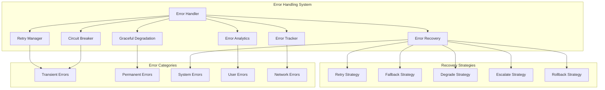

# Error Handling System

## Executive Summary

The Error Handling System is a comprehensive component that provides robust error management, recovery, and resilience capabilities for the AI Development Agent system. This system implements advanced error handling patterns including circuit breakers, retry mechanisms, graceful degradation, and comprehensive error tracking to ensure system reliability and user experience.

### Key Benefits
- **Robust Error Recovery**: Automatic recovery from transient and permanent failures
- **Graceful Degradation**: System continues operating with reduced functionality during failures
- **Comprehensive Error Tracking**: Complete error lifecycle management and analytics
- **Circuit Breaker Protection**: Prevents cascading failures and system overload
- **User-Friendly Error Messages**: Clear, actionable error messages for users
- **Developer Insights**: Detailed error information for debugging and improvement

### Technology Stack
- **Primary Framework**: Custom error handling engine with industry-standard patterns
- **Error Tracking**: Structured logging with error categorization and severity levels
- **Circuit Breaker**: Custom implementation with configurable thresholds
- **Retry Mechanisms**: Exponential backoff with jitter for transient failures
- **Error Analytics**: Local error analytics with optional cloud integration
- **Recovery Strategies**: Multiple recovery strategies based on error types

### Integration Points
- **Agent Communication System**: For error propagation and recovery coordination
- **State Management System**: For error state persistence and recovery
- **Workflow Orchestration Engine**: For error handling in workflows
- **Quality Assurance Framework**: For error quality analysis and prevention
- **Performance Monitoring System**: For error performance impact tracking

## Technical Architecture

### Core Architecture



### Design Patterns

#### 1. Circuit Breaker Pattern
```python
class CircuitBreaker:
    """Implements circuit breaker pattern for error handling."""
    
    def __init__(self, config: CircuitBreakerConfig):
        self.config = config
        self.state = CircuitState.CLOSED
        self.failure_count = 0
        self.last_failure_time = None
        self.next_attempt_time = None
    
    async def call(self, func: Callable, *args, **kwargs) -> Any:
        """Execute function with circuit breaker protection."""
        if self.state == CircuitState.OPEN:
            if self._should_attempt_reset():
                self._set_half_open()
            else:
                raise CircuitBreakerOpenError("Circuit breaker is open")
        
        try:
            result = await func(*args, **kwargs)
            self._on_success()
            return result
        except Exception as e:
            self._on_failure(e)
            raise
    
    def _on_success(self):
        """Handle successful execution."""
        self.failure_count = 0
        self.state = CircuitState.CLOSED
        self.last_failure_time = None
    
    def _on_failure(self, error: Exception):
        """Handle execution failure."""
        self.failure_count += 1
        self.last_failure_time = datetime.utcnow()
        
        if self.failure_count >= self.config.failure_threshold:
            self.state = CircuitState.OPEN
            self.next_attempt_time = datetime.utcnow() + self.config.timeout
    
    def _should_attempt_reset(self) -> bool:
        """Check if circuit breaker should attempt reset."""
        return (self.next_attempt_time and 
                datetime.utcnow() >= self.next_attempt_time)
    
    def _set_half_open(self):
        """Set circuit breaker to half-open state."""
        self.state = CircuitState.HALF_OPEN
        self.next_attempt_time = None
```

#### 2. Retry Pattern with Exponential Backoff
```python
class RetryManager:
    """Manages retry logic with exponential backoff."""
    
    def __init__(self, config: RetryConfig):
        self.config = config
        self.retry_counters = {}
    
    async def execute_with_retry(self, func: Callable, *args, **kwargs) -> Any:
        """Execute function with retry logic."""
        last_exception = None
        
        for attempt in range(self.config.max_retries + 1):
            try:
                return await func(*args, **kwargs)
            except Exception as e:
                last_exception = e
                
                if not self._should_retry(e, attempt):
                    break
                
                if attempt < self.config.max_retries:
                    delay = self._calculate_delay(attempt)
                    await asyncio.sleep(delay)
        
        raise last_exception
    
    def _should_retry(self, error: Exception, attempt: int) -> bool:
        """Determine if error should be retried."""
        # Check if error is retryable
        if not self._is_retryable_error(error):
            return False
        
        # Check retry count
        if attempt >= self.config.max_retries:
            return False
        
        return True
    
    def _is_retryable_error(self, error: Exception) -> bool:
        """Check if error is retryable."""
        retryable_errors = {
            ConnectionError, TimeoutError, NetworkError,
            TemporaryError, RateLimitError
        }
        
        return any(isinstance(error, error_type) for error_type in retryable_errors)
    
    def _calculate_delay(self, attempt: int) -> float:
        """Calculate delay with exponential backoff and jitter."""
        base_delay = self.config.base_delay * (2 ** attempt)
        max_delay = min(base_delay, self.config.max_delay)
        
        # Add jitter to prevent thundering herd
        jitter = random.uniform(0, max_delay * 0.1)
        
        return max_delay + jitter
```

#### 3. Graceful Degradation Pattern
```python
class GracefulDegradation:
    """Implements graceful degradation for system resilience."""
    
    def __init__(self, config: DegradationConfig):
        self.config = config
        self.degradation_levels = self._initialize_degradation_levels()
        self.current_level = DegradationLevel.NORMAL
    
    async def execute_with_degradation(self, func: Callable, 
                                     fallback_func: Callable = None,
                                     *args, **kwargs) -> Any:
        """Execute function with graceful degradation."""
        try:
            return await func(*args, **kwargs)
        except Exception as e:
            if self._should_degrade(e):
                return await self._degrade_and_execute(fallback_func, *args, **kwargs)
            else:
                raise
    
    def _should_degrade(self, error: Exception) -> bool:
        """Determine if system should degrade."""
        degradation_errors = {
            ResourceExhaustedError, ServiceUnavailableError,
            DatabaseConnectionError, ExternalServiceError
        }
        
        return any(isinstance(error, error_type) for error_type in degradation_errors)
    
    async def _degrade_and_execute(self, fallback_func: Callable, 
                                 *args, **kwargs) -> Any:
        """Execute fallback function with degraded functionality."""
        if not fallback_func:
            raise DegradationError("No fallback function available")
        
        # Set degradation level
        self.current_level = DegradationLevel.DEGRADED
        
        # Execute fallback
        try:
            result = await fallback_func(*args, **kwargs)
            return result
        except Exception as e:
            # Further degradation if fallback fails
            self.current_level = DegradationLevel.CRITICAL
            raise DegradationError(f"Fallback execution failed: {e}")
    
    def _initialize_degradation_levels(self) -> Dict[DegradationLevel, DegradationConfig]:
        """Initialize degradation level configurations."""
        return {
            DegradationLevel.NORMAL: DegradationConfig(
                max_response_time=5000,
                enable_caching=True,
                enable_compression=True
            ),
            DegradationLevel.DEGRADED: DegradationConfig(
                max_response_time=10000,
                enable_caching=True,
                enable_compression=False
            ),
            DegradationLevel.CRITICAL: DegradationConfig(
                max_response_time=30000,
                enable_caching=False,
                enable_compression=False
            )
        }
```

### Data Models

#### Error Models
```python
@dataclass
class ErrorInfo:
    """Comprehensive error information."""
    error_id: str
    error_type: str
    error_message: str
    severity: ErrorSeverity
    timestamp: datetime
    source: str
    context: Dict[str, Any] = field(default_factory=dict)
    stack_trace: Optional[str] = None
    user_id: Optional[str] = None
    session_id: Optional[str] = None
    
    class Config:
        json_encoders = {
            datetime: lambda v: v.isoformat()
        }

@dataclass
class ErrorContext:
    """Context information for error handling."""
    request_id: str
    agent_id: str
    workflow_id: Optional[str] = None
    step_id: Optional[str] = None
    input_data: Dict[str, Any] = field(default_factory=dict)
    environment: str = "development"
    version: str = "1.0.0"

@dataclass
class ErrorRecovery:
    """Error recovery information."""
    recovery_id: str
    error_id: str
    recovery_strategy: RecoveryStrategy
    recovery_status: RecoveryStatus
    recovery_time: datetime
    recovery_duration: float
    recovery_result: Optional[Dict[str, Any]] = None

@dataclass
class CircuitBreakerConfig:
    """Configuration for circuit breaker."""
    failure_threshold: int = 5
    timeout: timedelta = field(default_factory=lambda: timedelta(minutes=1))
    success_threshold: int = 2
    monitoring_window: timedelta = field(default_factory=lambda: timedelta(minutes=5))

@dataclass
class RetryConfig:
    """Configuration for retry mechanism."""
    max_retries: int = 3
    base_delay: float = 1.0  # seconds
    max_delay: float = 60.0  # seconds
    backoff_multiplier: float = 2.0
    jitter_factor: float = 0.1

@dataclass
class DegradationConfig:
    """Configuration for graceful degradation."""
    max_response_time: int = 5000  # milliseconds
    enable_caching: bool = True
    enable_compression: bool = True
    fallback_enabled: bool = True
```

## Implementation Guidelines

### Core Implementation

#### Error Handler
```python
class ErrorHandler:
    """Main error handler for the agent system."""
    
    def __init__(self, config: ErrorHandlerConfig):
        self.config = config
        self.circuit_breaker = CircuitBreaker(config.circuit_breaker_config)
        self.retry_manager = RetryManager(config.retry_config)
        self.graceful_degradation = GracefulDegradation(config.degradation_config)
        self.error_tracker = ErrorTracker(config.tracking_config)
        self.error_recovery = ErrorRecoveryManager(config.recovery_config)
        self.error_analytics = ErrorAnalytics(config.analytics_config)
        
    async def handle_error(self, error: Exception, context: ErrorContext) -> ErrorResult:
        """Handle an error with comprehensive error management."""
        
        # Create error info
        error_info = ErrorInfo(
            error_id=str(uuid.uuid4()),
            error_type=type(error).__name__,
            error_message=str(error),
            severity=self._determine_severity(error),
            timestamp=datetime.utcnow(),
            source=context.agent_id,
            context=context.__dict__,
            stack_trace=traceback.format_exc(),
            user_id=getattr(context, 'user_id', None),
            session_id=getattr(context, 'session_id', None)
        )
        
        # Track error
        await self.error_tracker.track_error(error_info)
        
        # Attempt recovery
        recovery_result = await self.error_recovery.attempt_recovery(error_info, context)
        
        # Update analytics
        await self.error_analytics.record_error(error_info, recovery_result)
        
        return ErrorResult(
            error_info=error_info,
            recovery_result=recovery_result,
            handled=True
        )
    
    async def execute_with_error_handling(self, func: Callable, 
                                        context: ErrorContext,
                                        *args, **kwargs) -> Any:
        """Execute function with comprehensive error handling."""
        
        try:
            # Execute with circuit breaker
            result = await self.circuit_breaker.call(
                lambda: self.retry_manager.execute_with_retry(func, *args, **kwargs)
            )
            return result
            
        except Exception as e:
            # Handle error
            error_result = await self.handle_error(e, context)
            
            # Attempt graceful degradation
            if error_result.recovery_result.status == RecoveryStatus.FAILED:
                return await self.graceful_degradation.execute_with_degradation(
                    func, self._get_fallback_function(context), *args, **kwargs
                )
            
            # Re-raise if not handled
            raise
    
    def _determine_severity(self, error: Exception) -> ErrorSeverity:
        """Determine error severity based on error type."""
        critical_errors = {SystemError, MemoryError, DatabaseError}
        high_errors = {ConnectionError, TimeoutError, AuthenticationError}
        medium_errors = {ValidationError, ConfigurationError}
        
        if any(isinstance(error, error_type) for error_type in critical_errors):
            return ErrorSeverity.CRITICAL
        elif any(isinstance(error, error_type) for error_type in high_errors):
            return ErrorSeverity.HIGH
        elif any(isinstance(error, error_type) for error_type in medium_errors):
            return ErrorSeverity.MEDIUM
        else:
            return ErrorSeverity.LOW
    
    def _get_fallback_function(self, context: ErrorContext) -> Callable:
        """Get appropriate fallback function based on context."""
        # Return appropriate fallback based on agent type and context
        return self._default_fallback
```

#### Error Recovery Manager
```python
class ErrorRecoveryManager:
    """Manages error recovery strategies."""
    
    def __init__(self, config: RecoveryConfig):
        self.config = config
        self.recovery_strategies = self._initialize_recovery_strategies()
    
    async def attempt_recovery(self, error_info: ErrorInfo, 
                             context: ErrorContext) -> ErrorRecovery:
        """Attempt to recover from an error."""
        
        recovery_id = str(uuid.uuid4())
        start_time = time.time()
        
        # Determine recovery strategy
        strategy = self._determine_recovery_strategy(error_info, context)
        
        try:
            # Execute recovery strategy
            recovery_result = await self._execute_recovery_strategy(strategy, error_info, context)
            
            recovery_duration = time.time() - start_time
            
            return ErrorRecovery(
                recovery_id=recovery_id,
                error_id=error_info.error_id,
                recovery_strategy=strategy,
                recovery_status=RecoveryStatus.SUCCESS,
                recovery_time=datetime.utcnow(),
                recovery_duration=recovery_duration,
                recovery_result=recovery_result
            )
            
        except Exception as recovery_error:
            recovery_duration = time.time() - start_time
            
            return ErrorRecovery(
                recovery_id=recovery_id,
                error_id=error_info.error_id,
                recovery_strategy=strategy,
                recovery_status=RecoveryStatus.FAILED,
                recovery_time=datetime.utcnow(),
                recovery_duration=recovery_duration,
                recovery_result={"error": str(recovery_error)}
            )
    
    def _determine_recovery_strategy(self, error_info: ErrorInfo, 
                                   context: ErrorContext) -> RecoveryStrategy:
        """Determine appropriate recovery strategy."""
        
        # Network errors - retry
        if "Connection" in error_info.error_type or "Network" in error_info.error_type:
            return RecoveryStrategy.RETRY
        
        # Resource errors - degrade
        if "Resource" in error_info.error_type or "Memory" in error_info.error_type:
            return RecoveryStrategy.DEGRADE
        
        # System errors - escalate
        if "System" in error_info.error_type or "Database" in error_info.error_type:
            return RecoveryStrategy.ESCALATE
        
        # User errors - fallback
        if "Validation" in error_info.error_type or "User" in error_info.error_type:
            return RecoveryStrategy.FALLBACK
        
        # Default to retry
        return RecoveryStrategy.RETRY
    
    async def _execute_recovery_strategy(self, strategy: RecoveryStrategy,
                                       error_info: ErrorInfo,
                                       context: ErrorContext) -> Dict[str, Any]:
        """Execute the determined recovery strategy."""
        
        if strategy == RecoveryStrategy.RETRY:
            return await self._execute_retry_strategy(error_info, context)
        elif strategy == RecoveryStrategy.FALLBACK:
            return await self._execute_fallback_strategy(error_info, context)
        elif strategy == RecoveryStrategy.DEGRADE:
            return await self._execute_degrade_strategy(error_info, context)
        elif strategy == RecoveryStrategy.ESCALATE:
            return await self._execute_escalate_strategy(error_info, context)
        elif strategy == RecoveryStrategy.ROLLBACK:
            return await self._execute_rollback_strategy(error_info, context)
        else:
            raise ValueError(f"Unknown recovery strategy: {strategy}")
```

### Configuration and Setup

#### Error Handler Configuration
```python
@dataclass
class ErrorHandlerConfig:
    """Configuration for the error handling system."""
    
    # Circuit Breaker Configuration
    circuit_breaker_config: CircuitBreakerConfig = field(default_factory=CircuitBreakerConfig)
    
    # Retry Configuration
    retry_config: RetryConfig = field(default_factory=RetryConfig)
    
    # Degradation Configuration
    degradation_config: DegradationConfig = field(default_factory=DegradationConfig)
    
    # Error Tracking Configuration
    tracking_config: TrackingConfig = field(default_factory=TrackingConfig)
    
    # Recovery Configuration
    recovery_config: RecoveryConfig = field(default_factory=RecoveryConfig)
    
    # Analytics Configuration
    analytics_config: AnalyticsConfig = field(default_factory=AnalyticsConfig)
    
    # General Settings
    enable_error_handling: bool = True
    enable_error_tracking: bool = True
    enable_error_analytics: bool = True
    enable_automatic_recovery: bool = True
    max_error_history: int = 1000

@dataclass
class TrackingConfig:
    """Configuration for error tracking."""
    enable_detailed_logging: bool = True
    enable_error_persistence: bool = True
    error_log_file: str = "./error_logs.json"
    max_log_file_size: int = 10 * 1024 * 1024  # 10MB
    log_retention_days: int = 30

@dataclass
class RecoveryConfig:
    """Configuration for error recovery."""
    enable_automatic_recovery: bool = True
    max_recovery_attempts: int = 3
    recovery_timeout: int = 300  # 5 minutes
    enable_escalation: bool = True
    escalation_threshold: int = 5

@dataclass
class AnalyticsConfig:
    """Configuration for error analytics."""
    enable_error_analytics: bool = True
    analytics_file: str = "./error_analytics.json"
    enable_trend_analysis: bool = True
    trend_analysis_window: int = 7  # days
```

## Integration Patterns

### Agent Integration
```python
class AgentErrorHandler:
    """Error handler specifically for agent operations."""
    
    def __init__(self, error_handler: ErrorHandler):
        self.error_handler = error_handler
    
    async def execute_agent_with_error_handling(self, agent: BaseAgent, 
                                              input_data: Dict[str, Any]) -> AgentResult:
        """Execute agent with comprehensive error handling."""
        
        context = ErrorContext(
            request_id=str(uuid.uuid4()),
            agent_id=agent.agent_id,
            input_data=input_data
        )
        
        try:
            result = await self.error_handler.execute_with_error_handling(
                agent.execute, context, input_data
            )
            
            return AgentResult(
                success=True,
                data=result,
                error_info=None
            )
            
        except Exception as e:
            error_result = await self.error_handler.handle_error(e, context)
            
            return AgentResult(
                success=False,
                data=None,
                error_info=error_result.error_info
            )
```

### Workflow Integration
```python
class WorkflowErrorHandler:
    """Error handler for workflow operations."""
    
    def __init__(self, error_handler: ErrorHandler):
        self.error_handler = error_handler
    
    async def execute_workflow_with_error_handling(self, workflow: Workflow,
                                                 initial_state: Dict[str, Any]) -> WorkflowResult:
        """Execute workflow with comprehensive error handling."""
        
        context = ErrorContext(
            request_id=str(uuid.uuid4()),
            agent_id="workflow_orchestrator",
            workflow_id=workflow.workflow_id,
            input_data=initial_state
        )
        
        try:
            result = await self.error_handler.execute_with_error_handling(
                workflow.execute, context, initial_state
            )
            
            return WorkflowResult(
                success=True,
                data=result,
                error_info=None
            )
            
        except Exception as e:
            error_result = await self.error_handler.handle_error(e, context)
            
            return WorkflowResult(
                success=False,
                data=None,
                error_info=error_result.error_info
            )
```

## Performance Specifications

### Performance Requirements
- **Error Handling Latency**: < 10ms for error processing
- **Recovery Time**: < 30 seconds for automatic recovery
- **Error Tracking**: < 5ms for error logging
- **Circuit Breaker Response**: < 1ms for circuit breaker decisions
- **Retry Overhead**: < 100ms additional latency per retry
- **Memory Usage**: < 50MB for error handling system

### Optimization Strategies
```python
class ErrorHandlingOptimizer:
    """Optimizes error handling performance."""
    
    def __init__(self, error_handler: ErrorHandler):
        self.error_handler = error_handler
        self.performance_metrics = ErrorPerformanceMetrics()
    
    async def optimize_error_handling(self, error_patterns: List[ErrorPattern]) -> OptimizationResult:
        """Optimize error handling based on error patterns."""
        
        # Analyze error patterns
        analysis = self._analyze_error_patterns(error_patterns)
        
        # Optimize circuit breaker settings
        circuit_breaker_optimization = self._optimize_circuit_breaker(analysis)
        
        # Optimize retry settings
        retry_optimization = self._optimize_retry_settings(analysis)
        
        # Optimize recovery strategies
        recovery_optimization = self._optimize_recovery_strategies(analysis)
        
        return OptimizationResult(
            circuit_breaker_optimization=circuit_breaker_optimization,
            retry_optimization=retry_optimization,
            recovery_optimization=recovery_optimization,
            expected_improvements=self._calculate_improvements(analysis)
        )
```

## Security Considerations

### Security Requirements
- **Error Information Protection**: Sanitize error messages to prevent information leakage
- **Error Access Control**: Control access to error logs and analytics
- **Error Data Encryption**: Encrypt sensitive error information
- **Error Audit Logging**: Log all error handling activities for audit purposes
- **Error Rate Limiting**: Prevent error handling system abuse

### Security Implementation
```python
class ErrorSecurity:
    """Implements security measures for error handling."""
    
    def __init__(self, config: SecurityConfig):
        self.config = config
        self.error_sanitizer = ErrorSanitizer()
        self.access_control = ErrorAccessControl()
    
    def sanitize_error_message(self, error: Exception) -> str:
        """Sanitize error message to prevent information leakage."""
        return self.error_sanitizer.sanitize(str(error))
    
    def sanitize_error_context(self, context: Dict[str, Any]) -> Dict[str, Any]:
        """Sanitize error context to remove sensitive information."""
        return self.error_sanitizer.sanitize_context(context)
    
    async def authorize_error_access(self, user_id: str, error_id: str) -> bool:
        """Authorize access to error information."""
        return await self.access_control.check_permission(user_id, error_id)
    
    def encrypt_error_data(self, error_data: Dict[str, Any]) -> Dict[str, Any]:
        """Encrypt sensitive error data."""
        if not self.config.enable_encryption:
            return error_data
        
        encrypted_data = {}
        for key, value in error_data.items():
            if self._is_sensitive_field(key):
                encrypted_data[key] = self._encrypt_value(value)
            else:
                encrypted_data[key] = value
        
        return encrypted_data
```

## Operational Guidelines

### Deployment Configuration
```yaml
# error-handling-config.yaml
error_handling:
  # Circuit Breaker Configuration
  circuit_breaker:
    failure_threshold: 5
    timeout_minutes: 1
    success_threshold: 2
    monitoring_window_minutes: 5
  
  # Retry Configuration
  retry:
    max_retries: 3
    base_delay_seconds: 1.0
    max_delay_seconds: 60.0
    backoff_multiplier: 2.0
    jitter_factor: 0.1
  
  # Degradation Configuration
  degradation:
    max_response_time_ms: 5000
    enable_caching: true
    enable_compression: true
    fallback_enabled: true
  
  # Tracking Configuration
  tracking:
    enable_detailed_logging: true
    enable_error_persistence: true
    error_log_file: "./error_logs.json"
    max_log_file_size_mb: 10
    log_retention_days: 30
  
  # Recovery Configuration
  recovery:
    enable_automatic_recovery: true
    max_recovery_attempts: 3
    recovery_timeout_seconds: 300
    enable_escalation: true
    escalation_threshold: 5
  
  # Analytics Configuration
  analytics:
    enable_error_analytics: true
    analytics_file: "./error_analytics.json"
    enable_trend_analysis: true
    trend_analysis_window_days: 7
  
  # Security Configuration
  security:
    enable_encryption: true
    enable_access_control: true
    enable_audit_logging: true
    sanitize_error_messages: true
```

### Monitoring and Alerting
```python
class ErrorMonitor:
    """Monitors error handling system performance and health."""
    
    def __init__(self, error_handler: ErrorHandler):
        self.error_handler = error_handler
        self.metrics = ErrorMetrics()
    
    async def monitor_error_handling(self):
        """Monitor error handling performance."""
        
        # Track error rates
        error_rate = await self.metrics.get_error_rate()
        if error_rate > 0.1:  # 10% error rate threshold
            await self._alert_high_error_rate(error_rate)
        
        # Track recovery success rate
        recovery_rate = await self.metrics.get_recovery_success_rate()
        if recovery_rate < 0.8:  # 80% recovery success threshold
            await self._alert_low_recovery_rate(recovery_rate)
        
        # Track circuit breaker status
        circuit_breaker_status = await self.metrics.get_circuit_breaker_status()
        if circuit_breaker_status.open_count > 5:
            await self._alert_circuit_breaker_issues(circuit_breaker_status)
    
    async def _alert_high_error_rate(self, error_rate: float):
        """Alert when error rate is high."""
        alert_message = f"High error rate detected: {error_rate:.2%}"
        logger.warning(alert_message)
        # Send alert to monitoring system
    
    async def _alert_low_recovery_rate(self, recovery_rate: float):
        """Alert when recovery success rate is low."""
        alert_message = f"Low recovery success rate: {recovery_rate:.2%}"
        logger.warning(alert_message)
        # Send alert to monitoring system
```

## Future Evolution

### Roadmap and Evolution Plans
1. **Phase 1 (Current)**: Basic error handling with circuit breakers and retry
2. **Phase 2 (Q2 2024)**: Advanced recovery strategies and AI-powered error analysis
3. **Phase 3 (Q3 2024)**: Predictive error prevention and automated resolution
4. **Phase 4 (Q4 2024)**: Distributed error handling and global error intelligence

### Migration Strategies
```python
class ErrorHandlingMigrationManager:
    """Manages migration between error handling versions."""
    
    def __init__(self, old_handler: ErrorHandler, new_handler: ErrorHandler):
        self.old_handler = old_handler
        self.new_handler = new_handler
    
    async def migrate_error_config(self, old_config: ErrorHandlerConfig) -> ErrorHandlerConfig:
        """Migrate error handling configuration."""
        
        # Transform old configuration to new format
        new_config = ErrorHandlerConfig(
            circuit_breaker_config=self._migrate_circuit_breaker_config(old_config),
            retry_config=self._migrate_retry_config(old_config),
            degradation_config=self._migrate_degradation_config(old_config),
            tracking_config=self._migrate_tracking_config(old_config),
            recovery_config=self._migrate_recovery_config(old_config),
            analytics_config=self._migrate_analytics_config(old_config)
        )
        
        return new_config
```

---

**Component Status**: Designed and Documented  
**Technology Stack**: Custom Error Handling Engine, Circuit Breakers, Retry Mechanisms  
**Integration Points**: Agent Communication, State Management, Workflow Orchestration  
**Performance**: < 10ms error processing, < 30s recovery time  
**Security**: Error sanitization, access control, encryption  
**Scalability**: Distributed error handling, global error intelligence  
**Future Evolution**: AI-powered analysis, predictive prevention, automated resolution
