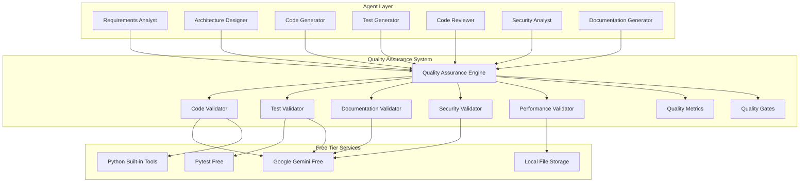

# Quality Assurance System

## Executive Summary

The Quality Assurance System is a lightweight, free-first component that provides comprehensive quality validation, testing, and assurance capabilities for the AI Development Agent system. This system ensures high-quality outputs while remaining completely free and accessible to all users.

### Key Benefits
- **Free-First Design**: Runs entirely on free services and local resources
- **Comprehensive Validation**: Multi-layer quality validation without expensive tools
- **Lightweight Architecture**: Minimal resource requirements, no expensive infrastructure
- **Multi-Provider Support**: Works with any LLM provider and testing framework
- **Zero Infrastructure Costs**: No expensive CI/CD or testing services required
- **Vendor Independence**: No lock-in to specific quality assurance tools

### Technology Stack
- **Primary Framework**: Custom lightweight validation engine
- **LLM Provider**: Google Gemini (free tier) for quality analysis
- **Testing Framework**: Pytest (free) for automated testing
- **Code Analysis**: Built-in Python tools (ast, pylint) for code quality
- **Validation Engine**: Custom validation framework with open standards
- **Storage**: Local files with optional cloud backup (free tier)

### Integration Points
- **Agent Communication System**: For quality feedback loops
- **State Management System**: For quality metrics persistence
- **Workflow Orchestration Engine**: For quality gates in workflows
- **Memory Management System**: For quality knowledge sharing
- **Performance Monitoring**: For quality performance tracking

## Technical Architecture

### Core Architecture



### Design Patterns

#### 1. Lightweight Quality Validation Pattern
```python
class LightweightQualityAssurance:
    """Lightweight quality assurance system using free services."""
    
    def __init__(self, config: QualityConfig):
        self.config = config
        self.code_validator = LightweightCodeValidator(config.gemini_api_key)
        self.test_validator = LightweightTestValidator(config.gemini_api_key)
        self.documentation_validator = LightweightDocumentationValidator(config.gemini_api_key)
        self.security_validator = LightweightSecurityValidator(config.gemini_api_key)
        self.performance_validator = LightweightPerformanceValidator()
        self.quality_metrics = QualityMetricsCollector()
        self.quality_gates = QualityGateManager()
        
    async def validate_code_quality(self, code: str, language: str = "python") -> QualityResult:
        """Validate code quality using free services."""
        try:
            # Use built-in Python tools for basic validation
            basic_validation = await self._basic_code_validation(code, language)
            
            # Use Gemini for advanced quality analysis
            advanced_validation = await self._advanced_code_validation(code, language)
            
            # Combine results
            combined_result = self._combine_validation_results(basic_validation, advanced_validation)
            
            # Store metrics
            await self.quality_metrics.record_code_quality(combined_result)
            
            return combined_result
            
        except Exception as e:
            # Fallback to basic validation only
            logger.warning(f"Advanced validation failed, using basic validation: {e}")
            return await self._basic_code_validation(code, language)
    
    async def validate_test_quality(self, test_code: str, source_code: str) -> QualityResult:
        """Validate test quality using free services."""
        try:
            # Use pytest for test execution
            test_execution = await self._execute_tests(test_code)
            
            # Use Gemini for test coverage analysis
            coverage_analysis = await self._analyze_test_coverage(test_code, source_code)
            
            # Combine results
            combined_result = self._combine_test_results(test_execution, coverage_analysis)
            
            # Store metrics
            await self.quality_metrics.record_test_quality(combined_result)
            
            return combined_result
            
        except Exception as e:
            logger.warning(f"Test validation failed: {e}")
            return QualityResult(
                status="failed",
                score=0.0,
                issues=[f"Test validation error: {str(e)}"],
                recommendations=["Check test code syntax and dependencies"]
            )
    
    async def validate_documentation_quality(self, documentation: str) -> QualityResult:
        """Validate documentation quality using free services."""
        try:
            # Use Gemini for documentation analysis
            doc_analysis = await self._analyze_documentation(documentation)
            
            # Store metrics
            await self.quality_metrics.record_documentation_quality(doc_analysis)
            
            return doc_analysis
            
        except Exception as e:
            logger.warning(f"Documentation validation failed: {e}")
            return QualityResult(
                status="failed",
                score=0.0,
                issues=[f"Documentation validation error: {str(e)}"],
                recommendations=["Check documentation format and content"]
            )
    
    async def _basic_code_validation(self, code: str, language: str) -> QualityResult:
        """Basic code validation using built-in tools."""
        issues = []
        score = 100.0
        
        # Syntax validation
        try:
            if language == "python":
                ast.parse(code)
        except SyntaxError as e:
            issues.append(f"Syntax error: {str(e)}")
            score -= 20.0
        
        # Basic style checks
        if language == "python":
            # Check for basic Python conventions
            if "import *" in code:
                issues.append("Wildcard imports are discouraged")
                score -= 5.0
            
            if len(code.split('\n')) > 1000:
                issues.append("File is very long, consider breaking it down")
                score -= 10.0
        
        return QualityResult(
            status="completed",
            score=max(score, 0.0),
            issues=issues,
            recommendations=self._generate_basic_recommendations(issues)
        )
    
    async def _advanced_code_validation(self, code: str, language: str) -> QualityResult:
        """Advanced code validation using Gemini."""
        try:
            prompt = f"""
            Analyze the following {language} code for quality issues:
            
            {code}
            
            Provide a quality score (0-100) and list specific issues and recommendations.
            Focus on:
            - Code readability and maintainability
            - Best practices adherence
            - Potential bugs or issues
            - Performance considerations
            - Security concerns
            
            Format your response as JSON:
            {{
                "score": <0-100>,
                "issues": ["issue1", "issue2"],
                "recommendations": ["rec1", "rec2"],
                "severity": "low|medium|high"
            }}
            """
            
            response = await self._call_gemini(prompt)
            analysis = json.loads(response)
            
            return QualityResult(
                status="completed",
                score=analysis.get("score", 0.0),
                issues=analysis.get("issues", []),
                recommendations=analysis.get("recommendations", []),
                severity=analysis.get("severity", "low")
            )
            
        except Exception as e:
            logger.error(f"Advanced validation failed: {e}")
            return QualityResult(
                status="failed",
                score=0.0,
                issues=[f"Advanced validation error: {str(e)}"],
                recommendations=["Check Gemini API configuration"]
            )
```

#### 2. Free-Tier Resource Management
```python
class QualityResourceManager:
    """Manages free tier resources for quality assurance."""
    
    def __init__(self):
        self.gemini_quota = {
            "requests_per_minute": 60,  # Free tier limit
            "requests_per_day": 1500,   # Free tier limit
            "current_minute": 0,
            "current_day": 0,
            "last_reset": datetime.now()
        }
        
        self.local_resources = {
            "max_file_size": 10 * 1024 * 1024,  # 10MB
            "max_analysis_time": 300,  # 5 minutes
            "max_concurrent_analyses": 3
        }
    
    async def check_gemini_quota(self) -> bool:
        """Check if we can make a Gemini API call for quality analysis."""
        now = datetime.now()
        
        # Reset counters if needed
        if (now - self.gemini_quota["last_reset"]).days >= 1:
            self.gemini_quota["current_day"] = 0
            self.gemini_quota["last_reset"] = now
        
        if (now - self.gemini_quota["last_reset"]).seconds >= 60:
            self.gemini_quota["current_minute"] = 0
        
        # Check limits
        if (self.gemini_quota["current_minute"] >= self.gemini_quota["requests_per_minute"] or
            self.gemini_quota["current_day"] >= self.gemini_quota["requests_per_day"]):
            return False
        
        return True
    
    async def increment_gemini_usage(self):
        """Increment Gemini usage counters."""
        self.gemini_quota["current_minute"] += 1
        self.gemini_quota["current_day"] += 1
    
    async def check_local_resources(self, file_size: int, estimated_time: int) -> bool:
        """Check if local resources are sufficient for analysis."""
        if file_size > self.local_resources["max_file_size"]:
            return False
        
        if estimated_time > self.local_resources["max_analysis_time"]:
            return False
        
        return True
```

#### 3. Lightweight Quality Metrics
```python
class LightweightQualityMetrics:
    """Lightweight quality metrics collection and storage."""
    
    def __init__(self, metrics_file_path: str = "./quality_metrics.json"):
        self.metrics_file_path = metrics_file_path
        self.metrics = self._load_metrics()
        
    async def record_quality_metric(self, metric_type: str, metric_data: Dict[str, Any]):
        """Record a quality metric."""
        timestamp = datetime.now().isoformat()
        
        if metric_type not in self.metrics:
            self.metrics[metric_type] = []
        
        self.metrics[metric_type].append({
            "timestamp": timestamp,
            "data": metric_data
        })
        
        # Keep only last 1000 metrics to prevent file bloat
        if len(self.metrics[metric_type]) > 1000:
            self.metrics[metric_type] = self.metrics[metric_type][-1000:]
        
        await self._save_metrics()
    
    async def get_quality_trends(self, metric_type: str, days: int = 7) -> Dict[str, Any]:
        """Get quality trends for a specific metric type."""
        if metric_type not in self.metrics:
            return {"trend": "no_data", "average_score": 0.0}
        
        cutoff_date = datetime.now() - timedelta(days=days)
        recent_metrics = [
            metric for metric in self.metrics[metric_type]
            if datetime.fromisoformat(metric["timestamp"]) > cutoff_date
        ]
        
        if not recent_metrics:
            return {"trend": "no_recent_data", "average_score": 0.0}
        
        scores = [metric["data"].get("score", 0.0) for metric in recent_metrics]
        average_score = sum(scores) / len(scores)
        
        # Calculate trend
        if len(scores) >= 2:
            trend = "improving" if scores[-1] > scores[0] else "declining" if scores[-1] < scores[0] else "stable"
        else:
            trend = "insufficient_data"
        
        return {
            "trend": trend,
            "average_score": average_score,
            "metric_count": len(recent_metrics),
            "latest_score": scores[-1] if scores else 0.0
        }
    
    def _load_metrics(self) -> Dict[str, Any]:
        """Load metrics from file."""
        try:
            with open(self.metrics_file_path, 'r') as f:
                return json.load(f)
        except (FileNotFoundError, json.JSONDecodeError):
            return {}
    
    async def _save_metrics(self):
        """Save metrics to file."""
        with open(self.metrics_file_path, 'w') as f:
            json.dump(self.metrics, f, indent=2)
```

### Data Models

#### Quality Models
```python
@dataclass
class QualityResult:
    """Result of a quality validation."""
    status: str  # 'completed', 'failed', 'partial'
    score: float  # 0.0 to 100.0
    issues: List[str] = field(default_factory=list)
    recommendations: List[str] = field(default_factory=list)
    severity: str = "low"  # 'low', 'medium', 'high'
    execution_time: float = 0.0
    metadata: Dict[str, Any] = field(default_factory=dict)

@dataclass
class QualityConfig:
    """Configuration for quality assurance system."""
    gemini_api_key: str
    enable_advanced_validation: bool = True
    enable_basic_validation: bool = True
    quality_threshold: float = 70.0
    max_validation_time: int = 300  # 5 minutes
    enable_metrics_collection: bool = True
    metrics_file_path: str = "./quality_metrics.json"

@dataclass
class QualityGate:
    """Quality gate configuration."""
    gate_id: str
    name: str
    description: str
    threshold: float
    metric_type: str  # 'code_quality', 'test_quality', 'documentation_quality'
    enabled: bool = True
    blocking: bool = True  # Whether this gate blocks workflow progression

@dataclass
class QualityReport:
    """Comprehensive quality report."""
    report_id: str
    timestamp: datetime
    overall_score: float
    code_quality: QualityResult
    test_quality: QualityResult
    documentation_quality: QualityResult
    security_quality: QualityResult
    performance_quality: QualityResult
    passed_gates: List[str]
    failed_gates: List[str]
    recommendations: List[str]
    metadata: Dict[str, Any] = field(default_factory=dict)
```

## Implementation Guidelines

### Core Implementation

#### Lightweight Quality Assurance Manager
```python
class LightweightQualityAssuranceManager:
    """Main quality assurance manager for the free-first agent system."""
    
    def __init__(self, config: QualityConfig):
        self.config = config
        self.assurance_engine = LightweightQualityAssurance(config)
        self.resource_manager = QualityResourceManager()
        self.metrics_collector = LightweightQualityMetrics(config.metrics_file_path)
        self.gate_manager = QualityGateManager()
        
    async def initialize(self):
        """Initialize the quality assurance manager."""
        # Check API key
        if not self.config.gemini_api_key:
            raise ConfigurationError("Gemini API key is required for quality analysis")
        
        # Test connections
        await self._test_connections()
        
        # Initialize quality gates
        await self._initialize_quality_gates()
        
        logger.info("Lightweight Quality Assurance Manager initialized successfully")
    
    async def validate_development_artifacts(self, artifacts: DevelopmentArtifacts) -> QualityReport:
        """Validate all development artifacts."""
        
        report_id = str(uuid.uuid4())
        start_time = time.time()
        
        # Validate each artifact type
        code_quality = await self._validate_code_artifacts(artifacts.code_files)
        test_quality = await self._validate_test_artifacts(artifacts.test_files, artifacts.code_files)
        documentation_quality = await self._validate_documentation_artifacts(artifacts.documentation)
        security_quality = await self._validate_security_artifacts(artifacts.code_files)
        performance_quality = await self._validate_performance_artifacts(artifacts.code_files)
        
        # Calculate overall score
        scores = [
            code_quality.score,
            test_quality.score,
            documentation_quality.score,
            security_quality.score,
            performance_quality.score
        ]
        overall_score = sum(scores) / len(scores)
        
        # Check quality gates
        passed_gates, failed_gates = await self._check_quality_gates(
            code_quality, test_quality, documentation_quality, security_quality, performance_quality
        )
        
        # Generate recommendations
        recommendations = self._generate_overall_recommendations(
            code_quality, test_quality, documentation_quality, security_quality, performance_quality
        )
        
        # Create report
        report = QualityReport(
            report_id=report_id,
            timestamp=datetime.now(),
            overall_score=overall_score,
            code_quality=code_quality,
            test_quality=test_quality,
            documentation_quality=documentation_quality,
            security_quality=security_quality,
            performance_quality=performance_quality,
            passed_gates=passed_gates,
            failed_gates=failed_gates,
            recommendations=recommendations,
            metadata={"execution_time": time.time() - start_time}
        )
        
        # Store report
        await self._store_quality_report(report)
        
        return report
    
    async def _validate_code_artifacts(self, code_files: List[str]) -> QualityResult:
        """Validate code artifacts."""
        if not code_files:
            return QualityResult(
                status="completed",
                score=100.0,
                issues=[],
                recommendations=["No code files to validate"]
            )
        
        all_issues = []
        all_recommendations = []
        total_score = 0.0
        validated_files = 0
        
        for code_file in code_files:
            try:
                # Read code file
                with open(code_file, 'r') as f:
                    code_content = f.read()
                
                # Validate code quality
                result = await self.assurance_engine.validate_code_quality(
                    code_content, self._detect_language(code_file)
                )
                
                all_issues.extend([f"{code_file}: {issue}" for issue in result.issues])
                all_recommendations.extend(result.recommendations)
                total_score += result.score
                validated_files += 1
                
            except Exception as e:
                all_issues.append(f"{code_file}: Error reading file - {str(e)}")
        
        average_score = total_score / validated_files if validated_files > 0 else 0.0
        
        return QualityResult(
            status="completed",
            score=average_score,
            issues=all_issues,
            recommendations=list(set(all_recommendations))  # Remove duplicates
        )
    
    async def _validate_test_artifacts(self, test_files: List[str], code_files: List[str]) -> QualityResult:
        """Validate test artifacts."""
        if not test_files:
            return QualityResult(
                status="completed",
                score=0.0,
                issues=["No test files found"],
                recommendations=["Create comprehensive test suite"]
            )
        
        # Combine all source code for coverage analysis
        source_code = ""
        for code_file in code_files:
            try:
                with open(code_file, 'r') as f:
                    source_code += f.read() + "\n"
            except Exception:
                continue
        
        all_issues = []
        all_recommendations = []
        total_score = 0.0
        validated_tests = 0
        
        for test_file in test_files:
            try:
                # Read test file
                with open(test_file, 'r') as f:
                    test_content = f.read()
                
                # Validate test quality
                result = await self.assurance_engine.validate_test_quality(test_content, source_code)
                
                all_issues.extend([f"{test_file}: {issue}" for issue in result.issues])
                all_recommendations.extend(result.recommendations)
                total_score += result.score
                validated_tests += 1
                
            except Exception as e:
                all_issues.append(f"{test_file}: Error reading file - {str(e)}")
        
        average_score = total_score / validated_tests if validated_tests > 0 else 0.0
        
        return QualityResult(
            status="completed",
            score=average_score,
            issues=all_issues,
            recommendations=list(set(all_recommendations))
        )
```

### Configuration and Setup

#### Quality Configuration
```python
@dataclass
class QualityManagerConfig:
    """Configuration for the lightweight quality assurance manager."""
    
    # API Configuration (Free Tier)
    gemini_api_key: str
    
    # Quality Thresholds
    code_quality_threshold: float = 70.0
    test_quality_threshold: float = 80.0
    documentation_quality_threshold: float = 60.0
    security_quality_threshold: float = 90.0
    performance_quality_threshold: float = 70.0
    
    # Resource Management
    max_validation_time: int = 300  # 5 minutes
    max_file_size: int = 10 * 1024 * 1024  # 10MB
    max_concurrent_validations: int = 3
    
    # Quality Gates
    enable_quality_gates: bool = True
    blocking_gates: List[str] = field(default_factory=lambda: ["security_quality"])
    
    # Metrics and Reporting
    enable_metrics_collection: bool = True
    metrics_file_path: str = "./quality_metrics.json"
    enable_detailed_reporting: bool = True
    
    # Validation Options
    enable_advanced_validation: bool = True
    enable_basic_validation: bool = True
    enable_security_validation: bool = True
    enable_performance_validation: bool = True

@dataclass
class QualityGateConfig:
    """Configuration for quality gates."""
    
    gates: List[QualityGate] = field(default_factory=lambda: [
        QualityGate(
            gate_id="code_quality",
            name="Code Quality Gate",
            description="Ensures code meets quality standards",
            threshold=70.0,
            metric_type="code_quality",
            enabled=True,
            blocking=False
        ),
        QualityGate(
            gate_id="test_quality",
            name="Test Quality Gate",
            description="Ensures adequate test coverage and quality",
            threshold=80.0,
            metric_type="test_quality",
            enabled=True,
            blocking=False
        ),
        QualityGate(
            gate_id="security_quality",
            name="Security Quality Gate",
            description="Ensures code meets security standards",
            threshold=90.0,
            metric_type="security_quality",
            enabled=True,
            blocking=True
        ),
        QualityGate(
            gate_id="documentation_quality",
            name="Documentation Quality Gate",
            description="Ensures adequate documentation",
            threshold=60.0,
            metric_type="documentation_quality",
            enabled=True,
            blocking=False
        )
    ])
```

#### Setup Instructions
```python
# Example setup and initialization
async def setup_lightweight_quality_system():
    """Setup the lightweight quality assurance system."""
    
    # Load configuration from environment
    config = QualityManagerConfig(
        gemini_api_key=os.getenv("GEMINI_API_KEY"),
        code_quality_threshold=float(os.getenv("CODE_QUALITY_THRESHOLD", "70.0")),
        test_quality_threshold=float(os.getenv("TEST_QUALITY_THRESHOLD", "80.0")),
        security_quality_threshold=float(os.getenv("SECURITY_QUALITY_THRESHOLD", "90.0")),
        metrics_file_path=os.getenv("QUALITY_METRICS_PATH", "./quality_metrics.json")
    )
    
    # Validate configuration
    if not config.gemini_api_key:
        raise ConfigurationError("GEMINI_API_KEY environment variable is required")
    
    # Initialize quality manager
    quality_manager = LightweightQualityAssuranceManager(config)
    await quality_manager.initialize()
    
    return quality_manager

# Example usage
async def validate_project_quality():
    """Validate quality of a complete project."""
    
    # Setup system
    quality_manager = await setup_lightweight_quality_system()
    
    # Define project artifacts
    artifacts = DevelopmentArtifacts(
        code_files=[
            "src/main.py",
            "src/utils.py",
            "src/models.py"
        ],
        test_files=[
            "tests/test_main.py",
            "tests/test_utils.py",
            "tests/test_models.py"
        ],
        documentation=[
            "README.md",
            "docs/api.md",
            "docs/architecture.md"
        ]
    )
    
    # Validate artifacts
    report = await quality_manager.validate_development_artifacts(artifacts)
    
    print(f"Quality Report: {report.report_id}")
    print(f"Overall Score: {report.overall_score:.1f}/100")
    print(f"Passed Gates: {len(report.passed_gates)}")
    print(f"Failed Gates: {len(report.failed_gates)}")
    
    if report.failed_gates:
        print(f"Failed Gates: {', '.join(report.failed_gates)}")
        print("Recommendations:")
        for rec in report.recommendations[:5]:  # Show top 5
            print(f"  - {rec}")
    else:
        print("✅ All quality gates passed!")
```

## Integration Patterns

### Workflow Integration
```python
class QualityGateManager:
    """Manages quality gates in workflows."""
    
    def __init__(self, config: QualityGateConfig):
        self.config = config
        self.gates = {gate.gate_id: gate for gate in config.gates}
    
    async def check_quality_gates(self, quality_results: Dict[str, QualityResult]) -> Tuple[List[str], List[str]]:
        """Check all quality gates against results."""
        
        passed_gates = []
        failed_gates = []
        
        for gate_id, gate in self.gates.items():
            if not gate.enabled:
                continue
            
            if gate.metric_type in quality_results:
                result = quality_results[gate.metric_type]
                
                if result.score >= gate.threshold:
                    passed_gates.append(gate_id)
                else:
                    failed_gates.append(gate_id)
        
        return passed_gates, failed_gates
    
    def get_blocking_gates(self, failed_gates: List[str]) -> List[str]:
        """Get gates that would block workflow progression."""
        blocking_gates = []
        
        for gate_id in failed_gates:
            if gate_id in self.gates and self.gates[gate_id].blocking:
                blocking_gates.append(gate_id)
        
        return blocking_gates
    
    async def should_proceed(self, quality_results: Dict[str, QualityResult]) -> bool:
        """Determine if workflow should proceed based on quality gates."""
        passed_gates, failed_gates = await self.check_quality_gates(quality_results)
        blocking_gates = self.get_blocking_gates(failed_gates)
        
        return len(blocking_gates) == 0
```

## Performance Specifications

### Performance Requirements
- **Code Validation**: < 30 seconds per file (within free tier limits)
- **Test Validation**: < 60 seconds per test suite
- **Documentation Validation**: < 15 seconds per document
- **Security Validation**: < 45 seconds per codebase
- **Performance Validation**: < 30 seconds per codebase
- **Total Validation Time**: < 5 minutes for complete project
- **Memory Usage**: < 50MB for typical validations
- **Storage**: < 5MB for quality metrics and reports

### Optimization Strategies
```python
class QualityOptimizer:
    """Optimizes quality validation for free tier constraints."""
    
    def __init__(self, quality_manager: LightweightQualityAssuranceManager):
        self.quality_manager = quality_manager
        self.performance_metrics = QualityPerformanceMetrics()
    
    async def optimize_validation_strategy(self, artifacts: DevelopmentArtifacts) -> OptimizedValidationPlan:
        """Optimize validation strategy for free tier performance."""
        
        # Analyze artifact complexity
        complexity_score = self._calculate_complexity(artifacts)
        
        # Determine validation depth based on complexity
        if complexity_score > 8.0:
            # High complexity - use basic validation only
            validation_strategy = ValidationStrategy(
                enable_advanced_validation=False,
                enable_basic_validation=True,
                enable_security_validation=True,
                enable_performance_validation=False,
                max_validation_time=180  # 3 minutes
            )
        elif complexity_score > 5.0:
            # Medium complexity - balanced validation
            validation_strategy = ValidationStrategy(
                enable_advanced_validation=True,
                enable_basic_validation=True,
                enable_security_validation=True,
                enable_performance_validation=True,
                max_validation_time=300  # 5 minutes
            )
        else:
            # Low complexity - full validation
            validation_strategy = ValidationStrategy(
                enable_advanced_validation=True,
                enable_basic_validation=True,
                enable_security_validation=True,
                enable_performance_validation=True,
                max_validation_time=300  # 5 minutes
            )
        
        return OptimizedValidationPlan(
            artifacts=artifacts,
            strategy=validation_strategy,
            estimated_time=self._estimate_validation_time(artifacts, validation_strategy),
            expected_quality_score=self._estimate_quality_score(artifacts, validation_strategy)
        )
    
    def _calculate_complexity(self, artifacts: DevelopmentArtifacts) -> float:
        """Calculate complexity score for artifacts."""
        
        # Code complexity
        code_complexity = len(artifacts.code_files) * 0.5
        
        # Test complexity
        test_complexity = len(artifacts.test_files) * 0.3
        
        # Documentation complexity
        doc_complexity = len(artifacts.documentation) * 0.2
        
        total_complexity = code_complexity + test_complexity + doc_complexity
        
        return min(total_complexity, 10.0)  # Cap at 10
```

## Security Considerations

### Security Requirements
- **API Key Protection**: Secure storage of Gemini API key
- **Input Validation**: Validate all code and documentation inputs
- **Error Handling**: Secure error messages without exposing sensitive information
- **Resource Limits**: Prevent abuse of free tier resources
- **Data Privacy**: Ensure no sensitive data is sent to external services

### Security Implementation
```python
class QualitySecurity:
    """Implements security measures for quality assurance."""
    
    def __init__(self, config: SecurityConfig):
        self.config = config
        self.input_validator = QualityInputValidator()
        self.data_sanitizer = DataSanitizer()
    
    def sanitize_code_for_analysis(self, code: str) -> str:
        """Sanitize code before sending to external services."""
        
        # Remove sensitive information
        sanitized_code = self.data_sanitizer.remove_sensitive_data(code)
        
        # Remove comments that might contain sensitive information
        sanitized_code = self._remove_sensitive_comments(sanitized_code)
        
        # Truncate if too long
        if len(sanitized_code) > 10000:  # 10KB limit
            sanitized_code = sanitized_code[:10000] + "\n# ... (truncated for analysis)"
        
        return sanitized_code
    
    def validate_quality_input(self, input_data: Dict[str, Any]) -> ValidationResult:
        """Validate input data for quality analysis."""
        return self.input_validator.validate_quality_input(input_data)
    
    def sanitize_error_message(self, error: Exception) -> str:
        """Sanitize error messages to prevent information leakage."""
        # Return generic error message for security
        return "Quality validation failed. Please check your input and try again."
    
    def _remove_sensitive_comments(self, code: str) -> str:
        """Remove comments that might contain sensitive information."""
        import re
        
        # Remove comments containing sensitive keywords
        sensitive_patterns = [
            r'#.*(password|secret|key|token|credential).*',
            r'#.*(api_key|access_key|private_key).*',
            r'#.*(database|db_password|connection_string).*'
        ]
        
        sanitized_code = code
        for pattern in sensitive_patterns:
            sanitized_code = re.sub(pattern, '# [sensitive information removed]', sanitized_code, flags=re.IGNORECASE)
        
        return sanitized_code
```

## Operational Guidelines

### Deployment Configuration
```yaml
# quality-config.yaml
quality_assurance:
  # API Configuration
  gemini_api_key: "${GEMINI_API_KEY}"
  
  # Quality Thresholds
  code_quality_threshold: 70.0
  test_quality_threshold: 80.0
  documentation_quality_threshold: 60.0
  security_quality_threshold: 90.0
  performance_quality_threshold: 70.0
  
  # Resource Management
  max_validation_time: 300
  max_file_size: 10485760  # 10MB
  max_concurrent_validations: 3
  
  # Quality Gates
  enable_quality_gates: true
  blocking_gates:
    - "security_quality"
  
  # Metrics and Reporting
  enable_metrics_collection: true
  metrics_file_path: "./quality_metrics.json"
  enable_detailed_reporting: true
  
  # Validation Options
  enable_advanced_validation: true
  enable_basic_validation: true
  enable_security_validation: true
  enable_performance_validation: true

# Free Tier Limits
free_tier_limits:
  gemini_requests_per_minute: 60
  gemini_requests_per_day: 1500
  max_validation_time: 300
  max_file_size: 10485760  # 10MB
```

### Monitoring and Alerting
```python
class QualityMonitor:
    """Monitors quality assurance execution and resource usage."""
    
    def __init__(self, quality_manager: LightweightQualityAssuranceManager):
        self.quality_manager = quality_manager
        self.metrics = QualityMetrics()
    
    async def monitor_quality_execution(self, artifacts: DevelopmentArtifacts):
        """Monitor quality validation execution."""
        
        # Track execution metrics
        start_time = time.time()
        
        try:
            # Execute quality validation
            report = await self.quality_manager.validate_development_artifacts(artifacts)
            
            # Record metrics
            execution_time = time.time() - start_time
            self.metrics.record_execution(execution_time, report.overall_score)
            
            # Check resource usage
            await self._check_resource_usage()
            
            # Alert if quality is poor
            if report.overall_score < 70.0:
                await self._alert_poor_quality(report)
            
            return report
            
        except Exception as e:
            # Record error metrics
            self.metrics.record_error(str(e))
            raise
    
    async def _check_resource_usage(self):
        """Check resource usage and warn if approaching limits."""
        
        # Check Gemini usage
        gemini_usage = await self.quality_manager.resource_manager.get_gemini_usage()
        if gemini_usage["daily_usage"] > 1200:  # 80% of limit
            logger.warning("Approaching Gemini daily limit for quality analysis")
        
        # Check local resource usage
        local_usage = await self.quality_manager.resource_manager.get_local_usage()
        if local_usage["file_size"] > 8 * 1024 * 1024:  # 80% of 10MB limit
            logger.warning("Approaching local file size limit")
    
    async def _alert_poor_quality(self, report: QualityReport):
        """Alert when quality is poor."""
        
        alert_message = f"""
        ⚠️ Quality Alert
        
        Overall Quality Score: {report.overall_score:.1f}/100
        Failed Gates: {', '.join(report.failed_gates)}
        
        Top Issues:
        {chr(10).join(report.code_quality.issues[:3])}
        
        Recommendations:
        {chr(10).join(report.recommendations[:3])}
        """
        
        logger.warning(alert_message)
```

## Future Evolution

### Roadmap and Evolution Plans
1. **Phase 1 (Current)**: Lightweight free-tier quality assurance
2. **Phase 2 (Q2 2024)**: Advanced quality patterns and optimization
3. **Phase 3 (Q3 2024)**: Multi-provider quality analysis
4. **Phase 4 (Q4 2024)**: AI-powered quality optimization

### Migration Strategies
```python
class QualityMigrationManager:
    """Manages migration between quality assurance versions."""
    
    def __init__(self, old_manager: LightweightQualityAssuranceManager, 
                 new_manager: LightweightQualityAssuranceManager):
        self.old_manager = old_manager
        self.new_manager = new_manager
    
    async def migrate_quality_config(self, old_config: QualityConfig) -> QualityConfig:
        """Migrate quality configuration from old to new system."""
        
        # Transform old configuration to new format
        new_config = QualityConfig(
            gemini_api_key=old_config.gemini_api_key,
            enable_advanced_validation=old_config.enable_advanced_validation,
            enable_basic_validation=old_config.enable_basic_validation,
            quality_threshold=old_config.quality_threshold,
            max_validation_time=old_config.max_validation_time,
            enable_metrics_collection=old_config.enable_metrics_collection,
            metrics_file_path=old_config.metrics_file_path
        )
        
        return new_config
    
    async def migrate_quality_metrics(self) -> MigrationResult:
        """Migrate quality metrics from old to new system."""
        
        try:
            # Export metrics from old system
            old_metrics = await self.old_manager.metrics_collector.export_metrics()
            
            # Transform metrics format
            new_metrics = await self._transform_metrics_format(old_metrics)
            
            # Import to new system
            await self.new_manager.metrics_collector.import_metrics(new_metrics)
            
            return MigrationResult(
                success=True,
                details={"migrated_metrics": len(new_metrics)}
            )
            
        except Exception as e:
            return MigrationResult(
                success=False,
                error=f"Metrics migration failed: {str(e)}"
            )
```

---

**Component Status**: Designed and Documented  
**Technology Stack**: Custom Validation Engine, Google Gemini (Free), Pytest (Free)  
**Integration Points**: Agent Communication, State Management, Workflow Orchestration  
**Performance**: < 5 minutes for complete validation, < 50MB memory usage  
**Security**: API key protection, input validation, secure error handling  
**Scalability**: 3 concurrent validations, free tier optimized  
**Future Evolution**: Advanced patterns, multi-provider analysis, AI optimization
