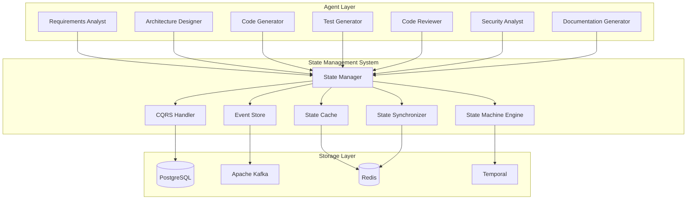

# State Management System

## Executive Summary

The State Management System is a critical component that provides advanced state management capabilities for the AI Development Agent system. It implements modern state management patterns including event sourcing, CQRS (Command Query Responsibility Segregation), and distributed state management to ensure reliable, scalable, and persistent state handling across all agents and workflows.

### Key Benefits
- **Persistent State Management**: Ensures state persistence and recovery across system restarts
- **Event Sourcing**: Complete audit trail and state reconstruction capabilities
- **Distributed State**: Handles state across multiple agents and services
- **CQRS Pattern**: Optimized read and write operations for different use cases
- **State Recovery**: Automatic recovery from failures and system restarts
- **Scalable Architecture**: Handles increasing state complexity and volume

### Technology Stack
- **Primary Database**: PostgreSQL for persistent state storage
- **Event Store**: Apache Kafka for event sourcing and event stream processing
- **Cache Layer**: Redis for high-performance state caching
- **State Machine**: Temporal for complex state machine orchestration
- **Event Processing**: Apache Flink for real-time event processing
- **State Synchronization**: CRDTs (Conflict-Free Replicated Data Types) for distributed state

### Integration Points
- **Agent Communication System**: For state synchronization between agents
- **Workflow Orchestration Engine**: For workflow state management
- **Memory Management System**: For state persistence and retrieval
- **Quality Assurance Framework**: For state validation and consistency checks
- **Performance Monitoring System**: For state performance metrics

## Technical Architecture

### Core Architecture



### Design Patterns

#### 1. Event Sourcing Pattern
```python
class EventSourcedStateManager:
    """Manages state using event sourcing pattern."""
    
    def __init__(self, event_store: EventStore, state_repository: StateRepository):
        self.event_store = event_store
        self.state_repository = state_repository
        self.event_handlers = {}
        self.snapshots = {}
    
    async def apply_event(self, aggregate_id: str, event: StateEvent) -> str:
        """Apply an event to update state."""
        event_id = str(uuid.uuid4())
        event.event_id = event_id
        event.aggregate_id = aggregate_id
        event.timestamp = datetime.utcnow()
        
        # Store event in event store
        await self.event_store.append_event(aggregate_id, event)
        
        # Apply event to current state
        current_state = await self.get_state(aggregate_id)
        updated_state = await self._apply_event_to_state(current_state, event)
        
        # Update state repository
        await self.state_repository.save_state(aggregate_id, updated_state)
        
        return event_id
    
    async def get_state(self, aggregate_id: str) -> AgentState:
        """Get current state for an aggregate."""
        # Try to get from cache first
        cached_state = await self._get_cached_state(aggregate_id)
        if cached_state:
            return cached_state
        
        # Get from repository
        state = await self.state_repository.get_state(aggregate_id)
        if state:
            # Cache the state
            await self._cache_state(aggregate_id, state)
            return state
        
        # Reconstruct state from events if not found
        return await self._reconstruct_state_from_events(aggregate_id)
    
    async def _reconstruct_state_from_events(self, aggregate_id: str) -> AgentState:
        """Reconstruct state from event stream."""
        events = await self.event_store.get_events(aggregate_id)
        
        # Start with initial state
        state = AgentState(aggregate_id=aggregate_id)
        
        # Apply all events in order
        for event in events:
            state = await self._apply_event_to_state(state, event)
        
        # Save reconstructed state
        await self.state_repository.save_state(aggregate_id, state)
        await self._cache_state(aggregate_id, state)
        
        return state
```

#### 2. CQRS Pattern
```python
class CQRSStateManager:
    """Implements CQRS pattern for state management."""
    
    def __init__(self, command_handler: CommandHandler, query_handler: QueryHandler):
        self.command_handler = command_handler
        self.query_handler = query_handler
        self.event_bus = EventBus()
    
    async def execute_command(self, command: StateCommand) -> str:
        """Execute a command to modify state."""
        # Validate command
        if not self._validate_command(command):
            raise InvalidCommandError(f"Invalid command: {command}")
        
        # Execute command
        event = await self.command_handler.handle_command(command)
        
        # Publish event
        await self.event_bus.publish_event(event)
        
        return event.event_id
    
    async def execute_query(self, query: StateQuery) -> QueryResult:
        """Execute a query to read state."""
        # Optimize query for read performance
        optimized_query = await self._optimize_query(query)
        
        # Execute query
        result = await self.query_handler.handle_query(optimized_query)
        
        return result
    
    async def _validate_command(self, command: StateCommand) -> bool:
        """Validate command before execution."""
        # Check command structure
        if not hasattr(command, 'command_type') or not hasattr(command, 'aggregate_id'):
            return False
        
        # Check business rules
        return await self._check_business_rules(command)
    
    async def _optimize_query(self, query: StateQuery) -> StateQuery:
        """Optimize query for better performance."""
        # Add caching hints
        query.cache_hint = self._determine_cache_strategy(query)
        
        # Add indexing hints
        query.index_hint = self._determine_index_strategy(query)
        
        return query
```

#### 3. State Machine Pattern
```python
class StateMachineManager:
    """Manages complex state machines for workflows."""
    
    def __init__(self, temporal_client: TemporalClient):
        self.temporal_client = temporal_client
        self.state_machines = {}
        self.workflows = {}
    
    async def create_state_machine(self, machine_id: str, 
                                  definition: StateMachineDefinition) -> str:
        """Create a new state machine."""
        # Register state machine with Temporal
        workflow_id = await self.temporal_client.register_workflow(
            machine_id, definition
        )
        
        self.state_machines[machine_id] = {
            'definition': definition,
            'workflow_id': workflow_id,
            'current_state': definition.initial_state
        }
        
        return workflow_id
    
    async def transition_state(self, machine_id: str, 
                              event: str, data: Dict[str, Any]) -> StateTransition:
        """Trigger a state transition."""
        if machine_id not in self.state_machines:
            raise StateMachineNotFoundError(f"State machine {machine_id} not found")
        
        machine = self.state_machines[machine_id]
        current_state = machine['current_state']
        definition = machine['definition']
        
        # Find valid transition
        transition = self._find_valid_transition(definition, current_state, event)
        if not transition:
            raise InvalidTransitionError(f"No valid transition for event {event} in state {current_state}")
        
        # Execute transition
        new_state = transition.target_state
        actions = transition.actions
        
        # Execute actions
        for action in actions:
            await self._execute_action(action, data)
        
        # Update state
        machine['current_state'] = new_state
        
        return StateTransition(
            machine_id=machine_id,
            from_state=current_state,
            to_state=new_state,
            event=event,
            timestamp=datetime.utcnow()
        )
    
    def _find_valid_transition(self, definition: StateMachineDefinition, 
                              current_state: str, event: str) -> Optional[StateTransition]:
        """Find valid transition for current state and event."""
        for transition in definition.transitions:
            if (transition.from_state == current_state and 
                transition.event == event):
                return transition
        return None
```

### Data Models

#### State Models
```python
@dataclass
class AgentState:
    """Represents the state of an agent."""
    aggregate_id: str
    agent_type: str
    status: str  # 'idle', 'working', 'completed', 'failed'
    current_task: Optional[str] = None
    task_progress: float = 0.0
    last_activity: datetime = field(default_factory=datetime.utcnow)
    metadata: Dict[str, Any] = field(default_factory=dict)
    version: int = 1
    
    class Config:
        json_encoders = {
            datetime: lambda v: v.isoformat()
        }

@dataclass
class WorkflowState:
    """Represents the state of a workflow."""
    workflow_id: str
    status: str  # 'running', 'completed', 'failed', 'paused'
    current_step: str
    completed_steps: List[str] = field(default_factory=list)
    failed_steps: List[str] = field(default_factory=list)
    start_time: datetime = field(default_factory=datetime.utcnow)
    end_time: Optional[datetime] = None
    metadata: Dict[str, Any] = field(default_factory=dict)
    version: int = 1

@dataclass
class StateEvent:
    """Represents a state change event."""
    event_id: str
    aggregate_id: str
    event_type: str
    data: Dict[str, Any]
    timestamp: datetime = field(default_factory=datetime.utcnow)
    version: int = 1

@dataclass
class StateCommand:
    """Represents a command to change state."""
    command_id: str
    command_type: str
    aggregate_id: str
    data: Dict[str, Any]
    timestamp: datetime = field(default_factory=datetime.utcnow)

@dataclass
class StateQuery:
    """Represents a query to read state."""
    query_id: str
    query_type: str
    aggregate_id: Optional[str] = None
    filters: Dict[str, Any] = field(default_factory=dict)
    sort_by: Optional[str] = None
    limit: Optional[int] = None
    offset: Optional[int] = None
```

## Implementation Guidelines

### Core Implementation

#### State Manager
```python
class StateManager:
    """Main state manager for the agent system."""
    
    def __init__(self, config: StateConfig):
        self.config = config
        self.event_sourced_manager = EventSourcedStateManager(
            EventStore(config.kafka_config),
            StateRepository(config.postgres_config)
        )
        self.cqrs_manager = CQRSStateManager(
            CommandHandler(config.postgres_config),
            QueryHandler(config.postgres_config)
        )
        self.state_machine_manager = StateMachineManager(
            TemporalClient(config.temporal_config)
        )
        self.cache_manager = StateCacheManager(config.redis_config)
        self.sync_manager = StateSynchronizer(config.redis_config)
        
    async def initialize(self):
        """Initialize the state management system."""
        await self.event_sourced_manager.initialize()
        await self.cqrs_manager.initialize()
        await self.state_machine_manager.initialize()
        await self.cache_manager.initialize()
        await self.sync_manager.initialize()
    
    async def update_agent_state(self, agent_id: str, 
                                updates: Dict[str, Any]) -> str:
        """Update agent state."""
        # Create state change event
        event = StateEvent(
            event_id=str(uuid.uuid4()),
            aggregate_id=agent_id,
            event_type="agent_state_updated",
            data=updates
        )
        
        # Apply event
        event_id = await self.event_sourced_manager.apply_event(agent_id, event)
        
        # Invalidate cache
        await self.cache_manager.invalidate_cache(agent_id)
        
        # Synchronize with other agents
        await self.sync_manager.synchronize_state(agent_id, updates)
        
        return event_id
    
    async def get_agent_state(self, agent_id: str) -> AgentState:
        """Get current agent state."""
        # Try cache first
        cached_state = await self.cache_manager.get_state(agent_id)
        if cached_state:
            return cached_state
        
        # Get from event sourced manager
        state = await self.event_sourced_manager.get_state(agent_id)
        
        # Cache the state
        await self.cache_manager.cache_state(agent_id, state)
        
        return state
    
    async def create_workflow_state(self, workflow_id: str, 
                                   definition: WorkflowDefinition) -> str:
        """Create a new workflow state machine."""
        return await self.state_machine_manager.create_state_machine(
            workflow_id, definition
        )
    
    async def transition_workflow_state(self, workflow_id: str, 
                                       event: str, data: Dict[str, Any]) -> StateTransition:
        """Transition workflow state."""
        return await self.state_machine_manager.transition_state(
            workflow_id, event, data
        )
```

#### State Cache Manager
```python
class StateCacheManager:
    """Manages state caching for performance optimization."""
    
    def __init__(self, redis_config: RedisConfig):
        self.redis_client = Redis.from_url(redis_config.url)
        self.cache_ttl = redis_config.cache_ttl
        self.max_cache_size = redis_config.max_cache_size
    
    async def cache_state(self, key: str, state: Any, ttl: int = None):
        """Cache a state object."""
        ttl = ttl or self.cache_ttl
        
        # Serialize state
        serialized_state = json.dumps(state, default=self._serialize_datetime)
        
        # Store in Redis with TTL
        await self.redis_client.setex(
            f"state:{key}",
            ttl,
            serialized_state
        )
        
        # Update cache metadata
        await self._update_cache_metadata(key)
    
    async def get_state(self, key: str) -> Optional[Any]:
        """Get state from cache."""
        try:
            serialized_state = await self.redis_client.get(f"state:{key}")
            if serialized_state:
                return json.loads(serialized_state, object_hook=self._deserialize_datetime)
        except Exception as e:
            logger.warning(f"Cache retrieval failed for {key}: {e}")
        
        return None
    
    async def invalidate_cache(self, key: str):
        """Invalidate cached state."""
        await self.redis_client.delete(f"state:{key}")
        await self._update_cache_metadata(key, invalidated=True)
    
    async def clear_cache(self):
        """Clear all cached states."""
        pattern = "state:*"
        keys = await self.redis_client.keys(pattern)
        if keys:
            await self.redis_client.delete(*keys)
    
    def _serialize_datetime(self, obj):
        """Serialize datetime objects for JSON."""
        if isinstance(obj, datetime):
            return obj.isoformat()
        raise TypeError(f"Object of type {type(obj)} is not JSON serializable")
    
    def _deserialize_datetime(self, obj):
        """Deserialize datetime objects from JSON."""
        for key, value in obj.items():
            if isinstance(value, str) and 'T' in value and value.endswith('Z'):
                try:
                    obj[key] = datetime.fromisoformat(value.replace('Z', '+00:00'))
                except ValueError:
                    pass
        return obj
```

### Configuration and Setup

#### State Configuration
```python
@dataclass
class StateConfig:
    """Configuration for the state management system."""
    
    # PostgreSQL Configuration
    postgres_config: PostgresConfig
    
    # Kafka Configuration
    kafka_config: KafkaConfig
    
    # Redis Configuration
    redis_config: RedisConfig
    
    # Temporal Configuration
    temporal_config: TemporalConfig
    
    # State Management Settings
    enable_event_sourcing: bool = True
    enable_cqrs: bool = True
    enable_caching: bool = True
    enable_synchronization: bool = True
    
    # Performance Settings
    cache_ttl: int = 3600  # 1 hour
    max_cache_size: int = 10000
    batch_size: int = 100
    snapshot_interval: int = 100  # events

@dataclass
class PostgresConfig:
    """PostgreSQL configuration."""
    host: str = "localhost"
    port: int = 5432
    database: str = "agent_state"
    username: str = "postgres"
    password: str = "password"
    max_connections: int = 20
    ssl_mode: str = "prefer"

@dataclass
class KafkaConfig:
    """Kafka configuration."""
    bootstrap_servers: List[str] = field(default_factory=lambda: ["localhost:9092"])
    topic_prefix: str = "agent_state"
    replication_factor: int = 1
    partitions: int = 3

@dataclass
class RedisConfig:
    """Redis configuration."""
    url: str = "redis://localhost:6379"
    cache_ttl: int = 3600
    max_cache_size: int = 10000
    connection_pool_size: int = 10

@dataclass
class TemporalConfig:
    """Temporal configuration."""
    host: str = "localhost"
    port: int = 7233
    namespace: str = "agent_workflows"
    task_queue: str = "state_machines"
```

## Integration Patterns

### LangGraph Integration
```python
class LangGraphStateAdapter:
    """Adapter for integrating state management with LangGraph."""
    
    def __init__(self, state_manager: StateManager):
        self.state_manager = state_manager
    
    def integrate_with_langgraph(self, state_graph: StateGraph):
        """Integrate state management with LangGraph state graph."""
        # Add state management nodes
        state_graph.add_node("update_state", self._update_state_node)
        state_graph.add_node("get_state", self._get_state_node)
        state_graph.add_node("persist_state", self._persist_state_node)
        
        # Add state management edges
        state_graph.add_edge("update_state", "persist_state")
        state_graph.add_edge("get_state", "update_state")
    
    async def _update_state_node(self, state: AgentState) -> AgentState:
        """LangGraph node for updating state."""
        if "state_updates" in state:
            updates = state["state_updates"]
            event_id = await self.state_manager.update_agent_state(
                state["agent_id"], updates
            )
            
            # Update state with event ID
            state["last_state_event_id"] = event_id
            state["state_updated_at"] = datetime.utcnow()
        
        return state
    
    async def _get_state_node(self, state: AgentState) -> AgentState:
        """LangGraph node for getting state."""
        agent_state = await self.state_manager.get_agent_state(state["agent_id"])
        
        # Merge agent state with workflow state
        state.update(agent_state.model_dump())
        
        return state
```

## Performance Specifications

### Performance Requirements
- **State Read Latency**: < 5ms for cached state, < 50ms for database queries
- **State Write Latency**: < 10ms for event storage, < 100ms for full persistence
- **Throughput**: 1,000+ state updates per second
- **Cache Hit Rate**: > 90% for frequently accessed states
- **Event Processing**: 10,000+ events per second
- **State Recovery**: < 30 seconds for full state reconstruction

### Optimization Strategies
```python
class StateOptimizer:
    """Optimizes state management performance."""
    
    def __init__(self, state_manager: StateManager):
        self.state_manager = state_manager
        self.performance_metrics = StatePerformanceMetrics()
    
    async def optimize_state_access(self, agent_id: str) -> OptimizationResult:
        """Optimize state access patterns for an agent."""
        # Analyze access patterns
        access_patterns = await self._analyze_access_patterns(agent_id)
        
        # Optimize caching strategy
        cache_strategy = self._optimize_cache_strategy(access_patterns)
        
        # Optimize query patterns
        query_optimization = self._optimize_query_patterns(access_patterns)
        
        # Apply optimizations
        await self._apply_optimizations(agent_id, cache_strategy, query_optimization)
        
        return OptimizationResult(
            agent_id=agent_id,
            cache_strategy=cache_strategy,
            query_optimization=query_optimization,
            expected_improvement=self._calculate_improvement(access_patterns)
        )
    
    async def _analyze_access_patterns(self, agent_id: str) -> AccessPatterns:
        """Analyze state access patterns for optimization."""
        # Get access logs
        access_logs = await self.state_manager.get_access_logs(agent_id)
        
        # Analyze patterns
        patterns = AccessPatterns(
            read_frequency=self._calculate_read_frequency(access_logs),
            write_frequency=self._calculate_write_frequency(access_logs),
            hot_keys=self._identify_hot_keys(access_logs),
            cold_keys=self._identify_cold_keys(access_logs)
        )
        
        return patterns
```

## Security Considerations

### Security Requirements
- **State Encryption**: Encrypt sensitive state data at rest
- **Access Control**: Role-based access control for state operations
- **Audit Logging**: Complete audit trail of all state changes
- **Data Integrity**: Ensure state consistency and prevent corruption
- **Backup and Recovery**: Regular state backups and recovery procedures

### Security Implementation
```python
class StateSecurity:
    """Implements security measures for state management."""
    
    def __init__(self, config: SecurityConfig):
        self.config = config
        self.encryption_key = config.encryption_key
        self.access_control = AccessControl(config.access_config)
        self.audit_logger = AuditLogger()
    
    def encrypt_state(self, state: Dict[str, Any]) -> Dict[str, Any]:
        """Encrypt sensitive state data."""
        if not self.config.enable_encryption:
            return state
        
        encrypted_state = {}
        for key, value in state.items():
            if self._is_sensitive_field(key):
                encrypted_state[key] = self._encrypt_value(value)
            else:
                encrypted_state[key] = value
        
        return encrypted_state
    
    def decrypt_state(self, state: Dict[str, Any]) -> Dict[str, Any]:
        """Decrypt sensitive state data."""
        if not self.config.enable_encryption:
            return state
        
        decrypted_state = {}
        for key, value in state.items():
            if self._is_sensitive_field(key):
                decrypted_state[key] = self._decrypt_value(value)
            else:
                decrypted_state[key] = value
        
        return decrypted_state
    
    async def authorize_state_access(self, user_id: str, agent_id: str, 
                                   operation: str) -> bool:
        """Authorize state access based on user permissions."""
        return await self.access_control.check_permission(
            user_id, agent_id, operation
        )
    
    def audit_state_operation(self, operation: str, agent_id: str, 
                            user_id: str, details: Dict[str, Any]):
        """Log state operations for audit purposes."""
        audit_entry = {
            "timestamp": datetime.utcnow(),
            "operation": operation,
            "agent_id": agent_id,
            "user_id": user_id,
            "details": details
        }
        
        self.audit_logger.log(audit_entry)
```

## Operational Guidelines

### Deployment Configuration
```yaml
# docker-compose.yml for state management infrastructure
version: '3.8'
services:
  postgres:
    image: postgres:15-alpine
    environment:
      POSTGRES_DB: agent_state
      POSTGRES_USER: postgres
      POSTGRES_PASSWORD: password
    ports:
      - "5432:5432"
    volumes:
      - postgres_data:/var/lib/postgresql/data
      
  kafka:
    image: confluentinc/cp-kafka:7.4.0
    ports:
      - "9092:9092"
    environment:
      KAFKA_ZOOKEEPER_CONNECT: zookeeper:2181
      KAFKA_ADVERTISED_LISTENERS: PLAINTEXT://localhost:9092
      KAFKA_OFFSETS_TOPIC_REPLICATION_FACTOR: 1
    depends_on:
      - zookeeper
      
  redis:
    image: redis:7-alpine
    ports:
      - "6379:6379"
    volumes:
      - redis_data:/data
      
  temporal:
    image: temporalio/auto-setup:1.22.0
    ports:
      - "7233:7233"
    environment:
      DB: postgresql
      DB_PORT: 5432
      POSTGRES_USER: postgres
      POSTGRES_PWD: password
      POSTGRES_SEEDS: postgres

volumes:
  postgres_data:
  redis_data:
```

### Monitoring and Alerting
```python
class StateMonitor:
    """Monitors state management system health and performance."""
    
    def __init__(self, state_manager: StateManager):
        self.state_manager = state_manager
        self.health_checks = [
            self._check_postgres_health,
            self._check_kafka_health,
            self._check_redis_health,
            self._check_temporal_health
        ]
    
    async def run_health_check(self) -> HealthStatus:
        """Run comprehensive health check."""
        health_status = HealthStatus()
        
        for check in self.health_checks:
            try:
                result = await check()
                health_status.add_check(check.__name__, result)
            except Exception as e:
                health_status.add_check(check.__name__, False, str(e))
        
        return health_status
    
    async def get_performance_metrics(self) -> StatePerformanceMetrics:
        """Get state management performance metrics."""
        return await self.state_manager.get_performance_metrics()
```

## Future Evolution

### Roadmap and Evolution Plans
1. **Phase 1 (Current)**: Basic event sourcing and CQRS implementation
2. **Phase 2 (Q2 2024)**: Advanced state machine orchestration
3. **Phase 3 (Q3 2024)**: Distributed state management with CRDTs
4. **Phase 4 (Q4 2024)**: AI-powered state optimization

### Migration Strategies
```python
class StateMigrationManager:
    """Manages migration between state management versions."""
    
    def __init__(self, old_system: StateManager, new_system: StateManager):
        self.old_system = old_system
        self.new_system = new_system
    
    async def migrate_state(self, agent_ids: List[str]) -> MigrationResult:
        """Migrate state from old system to new system."""
        result = MigrationResult()
        
        for agent_id in agent_ids:
            try:
                # Get state from old system
                old_state = await self.old_system.get_agent_state(agent_id)
                
                # Transform state for new system
                new_state = await self._transform_state(old_state)
                
                # Save to new system
                await self.new_system.save_agent_state(agent_id, new_state)
                
                result.successful_migrations.append(agent_id)
            except Exception as e:
                result.failed_migrations.append((agent_id, str(e)))
        
        return result
```

---

**Component Status**: Designed and Documented  
**Technology Stack**: PostgreSQL, Apache Kafka, Redis, Temporal  
**Integration Points**: Agent Communication, Workflow Orchestration, Memory Management  
**Performance**: < 5ms read latency, 1,000+ updates/second  
**Security**: Encryption, Access Control, Audit Logging  
**Scalability**: Distributed state management, CRDTs  
**Future Evolution**: AI-powered optimization, distributed state
