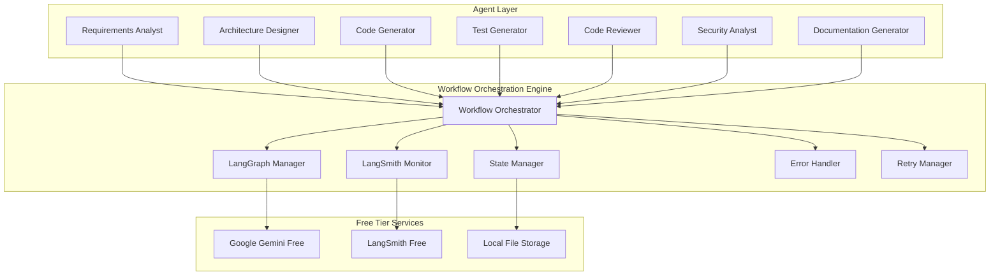

# Workflow Orchestration Engine

## Executive Summary

The Workflow Orchestration Engine is a lightweight, free-first component that orchestrates multi-agent workflows using LangGraph and LangSmith's free tier capabilities. This system enables complex workflow orchestration without requiring expensive infrastructure, making it accessible to all users with free accounts.

### Key Benefits
- **Free-First Design**: Runs entirely on free Gemini and LangSmith accounts
- **Lightweight Architecture**: Minimal resource requirements, no expensive infrastructure
- **LangGraph Integration**: Native integration with LangGraph for workflow orchestration
- **LangSmith Observability**: Free monitoring and debugging through LangSmith
- **Scalable Patterns**: Can scale from simple to complex workflows as needed
- **Zero Infrastructure Costs**: No databases, message queues, or cloud services required

### Technology Stack
- **Primary Framework**: LangGraph for workflow orchestration
- **LLM Provider**: Google Gemini (free tier) for agent reasoning
- **Observability**: LangSmith (free tier) for workflow monitoring
- **State Management**: In-memory with optional file persistence
- **Configuration**: Simple JSON/YAML files
- **Error Handling**: Built-in retry and fallback mechanisms

### Integration Points
- **Agent Communication System**: For inter-agent coordination
- **State Management System**: For workflow state persistence
- **Memory Management System**: For context and knowledge sharing
- **Quality Assurance Framework**: For workflow validation
- **Performance Monitoring**: For workflow performance tracking

## Technical Architecture

### Core Architecture



### Design Patterns

#### 1. Lightweight Workflow Pattern
```python
class LightweightWorkflowOrchestrator:
    """Lightweight workflow orchestrator using LangGraph and free services."""
    
    def __init__(self, config: WorkflowConfig):
        self.config = config
        self.langgraph_manager = LangGraphManager(config.gemini_api_key)
        self.langsmith_monitor = LangSmithMonitor(config.langsmith_api_key)
        self.state_manager = LocalStateManager(config.state_file_path)
        self.error_handler = LightweightErrorHandler()
        self.retry_manager = RetryManager(max_retries=3)
        
    async def create_workflow(self, workflow_definition: WorkflowDefinition) -> str:
        """Create a new lightweight workflow."""
        workflow_id = str(uuid.uuid4())
        
        # Create LangGraph state graph
        state_graph = StateGraph(AgentState)
        
        # Add nodes for each agent
        for agent in workflow_definition.agents:
            state_graph.add_node(agent.name, self._create_agent_node(agent))
        
        # Add edges for workflow flow
        for edge in workflow_definition.edges:
            state_graph.add_edge(edge.from_agent, edge.to_agent)
        
        # Compile workflow
        workflow = state_graph.compile()
        
        # Store workflow definition locally
        await self.state_manager.save_workflow(workflow_id, workflow_definition)
        
        return workflow_id
    
    async def execute_workflow(self, workflow_id: str, initial_state: Dict[str, Any]) -> WorkflowResult:
        """Execute a workflow with retry and error handling."""
        try:
            # Get workflow definition
            workflow_def = await self.state_manager.get_workflow(workflow_id)
            
            # Create LangGraph workflow
            workflow = self._create_langgraph_workflow(workflow_def)
            
            # Execute with retry logic
            result = await self.retry_manager.execute_with_retry(
                lambda: workflow.ainvoke(initial_state)
            )
            
            # Monitor with LangSmith
            await self.langsmith_monitor.log_execution(workflow_id, result)
            
            return WorkflowResult(
                workflow_id=workflow_id,
                status="completed",
                result=result,
                execution_time=time.time() - start_time
            )
            
        except Exception as e:
            # Handle errors gracefully
            error_result = await self.error_handler.handle_workflow_error(
                workflow_id, e, initial_state
            )
            return error_result
```

#### 2. Free-Tier Resource Management
```python
class FreeTierResourceManager:
    """Manages free tier resources efficiently."""
    
    def __init__(self):
        self.gemini_quota = {
            "requests_per_minute": 60,  # Free tier limit
            "requests_per_day": 1500,   # Free tier limit
            "current_minute": 0,
            "current_day": 0,
            "last_reset": datetime.now()
        }
        
        self.langsmith_quota = {
            "traces_per_day": 1000,     # Free tier limit
            "current_day": 0,
            "last_reset": datetime.now()
        }
    
    async def check_gemini_quota(self) -> bool:
        """Check if we can make a Gemini API call."""
        now = datetime.now()
        
        # Reset counters if needed
        if (now - self.gemini_quota["last_reset"]).days >= 1:
            self.gemini_quota["current_day"] = 0
            self.gemini_quota["last_reset"] = now
        
        if (now - self.gemini_quota["last_reset"]).seconds >= 60:
            self.gemini_quota["current_minute"] = 0
        
        # Check limits
        if (self.gemini_quota["current_minute"] >= self.gemini_quota["requests_per_minute"] or
            self.gemini_quota["current_day"] >= self.gemini_quota["requests_per_day"]):
            return False
        
        return True
    
    async def increment_gemini_usage(self):
        """Increment Gemini usage counters."""
        self.gemini_quota["current_minute"] += 1
        self.gemini_quota["current_day"] += 1
    
    async def check_langsmith_quota(self) -> bool:
        """Check if we can log to LangSmith."""
        now = datetime.now()
        
        # Reset counter if needed
        if (now - self.langsmith_quota["last_reset"]).days >= 1:
            self.langsmith_quota["current_day"] = 0
            self.langsmith_quota["last_reset"] = now
        
        return self.langsmith_quota["current_day"] < self.langsmith_quota["traces_per_day"]
```

#### 3. Lightweight State Management
```python
class LocalStateManager:
    """Lightweight state management using local files."""
    
    def __init__(self, state_file_path: str):
        self.state_file_path = state_file_path
        self.workflows_file = os.path.join(state_file_path, "workflows.json")
        self.executions_file = os.path.join(state_file_path, "executions.json")
        
        # Ensure directory exists
        os.makedirs(state_file_path, exist_ok=True)
        
        # Initialize files if they don't exist
        self._initialize_files()
    
    def _initialize_files(self):
        """Initialize state files if they don't exist."""
        if not os.path.exists(self.workflows_file):
            with open(self.workflows_file, 'w') as f:
                json.dump({}, f)
        
        if not os.path.exists(self.executions_file):
            with open(self.executions_file, 'w') as f:
                json.dump({}, f)
    
    async def save_workflow(self, workflow_id: str, workflow_def: WorkflowDefinition):
        """Save workflow definition to local file."""
        workflows = self._load_workflows()
        workflows[workflow_id] = {
            "definition": workflow_def.model_dump(),
            "created_at": datetime.now().isoformat(),
            "status": "active"
        }
        self._save_workflows(workflows)
    
    async def get_workflow(self, workflow_id: str) -> WorkflowDefinition:
        """Get workflow definition from local file."""
        workflows = self._load_workflows()
        if workflow_id not in workflows:
            raise WorkflowNotFoundError(f"Workflow {workflow_id} not found")
        
        return WorkflowDefinition(**workflows[workflow_id]["definition"])
    
    async def save_execution(self, execution_id: str, execution_data: Dict[str, Any]):
        """Save execution data to local file."""
        executions = self._load_executions()
        executions[execution_id] = {
            "data": execution_data,
            "timestamp": datetime.now().isoformat()
        }
        self._save_executions(executions)
    
    def _load_workflows(self) -> Dict[str, Any]:
        """Load workflows from file."""
        try:
            with open(self.workflows_file, 'r') as f:
                return json.load(f)
        except (FileNotFoundError, json.JSONDecodeError):
            return {}
    
    def _save_workflows(self, workflows: Dict[str, Any]):
        """Save workflows to file."""
        with open(self.workflows_file, 'w') as f:
            json.dump(workflows, f, indent=2)
    
    def _load_executions(self) -> Dict[str, Any]:
        """Load executions from file."""
        try:
            with open(self.executions_file, 'r') as f:
                return json.load(f)
        except (FileNotFoundError, json.JSONDecodeError):
            return {}
    
    def _save_executions(self, executions: Dict[str, Any]):
        """Save executions to file."""
        with open(self.executions_file, 'w') as f:
            json.dump(executions, f, indent=2)
```

### Data Models

#### Workflow Models
```python
@dataclass
class WorkflowDefinition:
    """Definition of a lightweight workflow."""
    workflow_id: str
    name: str
    description: str
    agents: List[AgentDefinition]
    edges: List[WorkflowEdge]
    config: WorkflowConfig
    created_at: datetime = field(default_factory=datetime.now)
    
    class Config:
        json_encoders = {
            datetime: lambda v: v.isoformat()
        }

@dataclass
class AgentDefinition:
    """Definition of an agent in a workflow."""
    name: str
    agent_type: str
    config: Dict[str, Any]
    input_schema: Dict[str, Any]
    output_schema: Dict[str, Any]
    timeout: int = 300  # 5 minutes default
    retry_count: int = 2

@dataclass
class WorkflowEdge:
    """Edge between agents in a workflow."""
    from_agent: str
    to_agent: str
    condition: Optional[str] = None  # Optional condition for edge
    transform: Optional[str] = None  # Optional data transformation

@dataclass
class WorkflowConfig:
    """Configuration for a workflow."""
    max_execution_time: int = 3600  # 1 hour
    enable_monitoring: bool = True
    enable_retry: bool = True
    max_retries: int = 3
    retry_delay: int = 5  # seconds
    save_intermediate_results: bool = True

@dataclass
class WorkflowResult:
    """Result of a workflow execution."""
    workflow_id: str
    status: str  # 'completed', 'failed', 'timeout'
    result: Dict[str, Any]
    execution_time: float
    error_message: Optional[str] = None
    intermediate_results: List[Dict[str, Any]] = field(default_factory=list)
```

## Implementation Guidelines

### Core Implementation

#### Lightweight Workflow Manager
```python
class LightweightWorkflowManager:
    """Main workflow manager for the free-first agent system."""
    
    def __init__(self, config: WorkflowManagerConfig):
        self.config = config
        self.orchestrator = LightweightWorkflowOrchestrator(config)
        self.resource_manager = FreeTierResourceManager()
        self.state_manager = LocalStateManager(config.state_path)
        self.monitor = LangSmithMonitor(config.langsmith_api_key)
        
    async def initialize(self):
        """Initialize the workflow manager."""
        # Check API keys
        if not self.config.gemini_api_key:
            raise ConfigurationError("Gemini API key is required")
        
        # Test connections
        await self._test_connections()
        
        # Initialize state directory
        os.makedirs(self.config.state_path, exist_ok=True)
        
        logger.info("Lightweight Workflow Manager initialized successfully")
    
    async def create_development_workflow(self) -> str:
        """Create a standard development workflow."""
        workflow_def = WorkflowDefinition(
            workflow_id=str(uuid.uuid4()),
            name="Standard Development Workflow",
            description="Complete development workflow from requirements to deployment",
            agents=[
                AgentDefinition(
                    name="requirements_analyst",
                    agent_type="requirements_analyst",
                    config={"model": "gemini-2.5-flash-lite"},
                    input_schema={"user_request": "string"},
                    output_schema={"requirements": "dict", "user_stories": "list"}
                ),
                AgentDefinition(
                    name="architecture_designer",
                    agent_type="architecture_designer",
                    config={"model": "gemini-2.5-flash-lite"},
                    input_schema={"requirements": "dict"},
                    output_schema={"architecture": "dict", "components": "list"}
                ),
                AgentDefinition(
                    name="code_generator",
                    agent_type="code_generator",
                    config={"model": "gemini-2.5-flash-lite"},
                    input_schema={"architecture": "dict", "requirements": "dict"},
                    output_schema={"code": "dict", "files": "list"}
                ),
                AgentDefinition(
                    name="test_generator",
                    agent_type="test_generator",
                    config={"model": "gemini-2.5-flash-lite"},
                    input_schema={"code": "dict", "requirements": "dict"},
                    output_schema={"tests": "dict", "test_files": "list"}
                ),
                AgentDefinition(
                    name="code_reviewer",
                    agent_type="code_reviewer",
                    config={"model": "gemini-2.5-flash-lite"},
                    input_schema={"code": "dict", "tests": "dict"},
                    output_schema={"review": "dict", "issues": "list"}
                ),
                AgentDefinition(
                    name="documentation_generator",
                    agent_type="documentation_generator",
                    config={"model": "gemini-2.5-flash-lite"},
                    input_schema={"code": "dict", "architecture": "dict"},
                    output_schema={"documentation": "dict", "docs": "list"}
                )
            ],
            edges=[
                WorkflowEdge("requirements_analyst", "architecture_designer"),
                WorkflowEdge("architecture_designer", "code_generator"),
                WorkflowEdge("code_generator", "test_generator"),
                WorkflowEdge("test_generator", "code_reviewer"),
                WorkflowEdge("code_reviewer", "documentation_generator")
            ],
            config=WorkflowConfig(
                max_execution_time=1800,  # 30 minutes
                enable_monitoring=True,
                enable_retry=True,
                max_retries=2,
                save_intermediate_results=True
            )
        )
        
        return await self.orchestrator.create_workflow(workflow_def)
    
    async def execute_development_workflow(self, user_request: str) -> WorkflowResult:
        """Execute the standard development workflow."""
        # Create workflow
        workflow_id = await self.create_development_workflow()
        
        # Prepare initial state
        initial_state = {
            "user_request": user_request,
            "workflow_id": workflow_id,
            "start_time": datetime.now().isoformat(),
            "current_step": "requirements_analysis"
        }
        
        # Execute workflow
        result = await self.orchestrator.execute_workflow(workflow_id, initial_state)
        
        return result
    
    async def _test_connections(self):
        """Test connections to free services."""
        # Test Gemini API
        try:
            # Simple test call
            test_response = await self._test_gemini_connection()
            logger.info("Gemini API connection successful")
        except Exception as e:
            logger.error(f"Gemini API connection failed: {e}")
            raise ConnectionError("Cannot connect to Gemini API")
        
        # Test LangSmith (optional)
        if self.config.langsmith_api_key:
            try:
                await self._test_langsmith_connection()
                logger.info("LangSmith connection successful")
            except Exception as e:
                logger.warning(f"LangSmith connection failed: {e}")
                logger.info("Continuing without LangSmith monitoring")
```

### Configuration and Setup

#### Workflow Configuration
```python
@dataclass
class WorkflowManagerConfig:
    """Configuration for the lightweight workflow manager."""
    
    # API Keys (Free Tier)
    gemini_api_key: str
    langsmith_api_key: Optional[str] = None  # Optional for free tier
    
    # Local Storage
    state_path: str = "./workflow_state"
    logs_path: str = "./workflow_logs"
    
    # Resource Management
    max_concurrent_workflows: int = 3  # Conservative for free tier
    max_workflow_duration: int = 3600  # 1 hour max
    
    # Monitoring
    enable_langsmith_monitoring: bool = True
    enable_local_logging: bool = True
    
    # Error Handling
    enable_retry: bool = True
    max_retries: int = 2
    retry_delay: int = 5  # seconds
    
    # Performance
    enable_caching: bool = True
    cache_ttl: int = 3600  # 1 hour

@dataclass
class FreeTierLimits:
    """Free tier limits for resource management."""
    
    # Gemini Free Tier Limits
    gemini_requests_per_minute: int = 60
    gemini_requests_per_day: int = 1500
    
    # LangSmith Free Tier Limits
    langsmith_traces_per_day: int = 1000
    
    # Local Storage Limits
    max_state_file_size: int = 10 * 1024 * 1024  # 10MB
    max_log_file_size: int = 5 * 1024 * 1024     # 5MB
```

#### Setup Instructions
```python
# Example setup and initialization
async def setup_lightweight_workflow_system():
    """Setup the lightweight workflow system."""
    
    # Load configuration from environment
    config = WorkflowManagerConfig(
        gemini_api_key=os.getenv("GEMINI_API_KEY"),
        langsmith_api_key=os.getenv("LANGSMITH_API_KEY"),  # Optional
        state_path=os.getenv("WORKFLOW_STATE_PATH", "./workflow_state"),
        logs_path=os.getenv("WORKFLOW_LOGS_PATH", "./workflow_logs")
    )
    
    # Validate configuration
    if not config.gemini_api_key:
        raise ConfigurationError("GEMINI_API_KEY environment variable is required")
    
    # Initialize workflow manager
    workflow_manager = LightweightWorkflowManager(config)
    await workflow_manager.initialize()
    
    return workflow_manager

# Example usage
async def run_development_workflow():
    """Run a complete development workflow."""
    
    # Setup system
    workflow_manager = await setup_lightweight_workflow_system()
    
    # User request
    user_request = """
    Create a simple web application for task management with the following features:
    - User authentication
    - Create, read, update, delete tasks
    - Task categories and priorities
    - Due date tracking
    - Simple dashboard
    """
    
    # Execute workflow
    result = await workflow_manager.execute_development_workflow(user_request)
    
    print(f"Workflow completed with status: {result.status}")
    print(f"Execution time: {result.execution_time:.2f} seconds")
    
    if result.status == "completed":
        print("Development workflow completed successfully!")
        print("Generated files and documentation available in the result.")
    else:
        print(f"Workflow failed: {result.error_message}")
```

## Integration Patterns

### LangGraph Integration
```python
class LangGraphWorkflowAdapter:
    """Adapter for integrating with LangGraph workflows."""
    
    def __init__(self, workflow_manager: LightweightWorkflowManager):
        self.workflow_manager = workflow_manager
    
    def create_langgraph_workflow(self, workflow_def: WorkflowDefinition) -> StateGraph:
        """Create a LangGraph workflow from definition."""
        
        # Create state graph
        state_graph = StateGraph(AgentState)
        
        # Add nodes for each agent
        for agent_def in workflow_def.agents:
            node_function = self._create_agent_node(agent_def)
            state_graph.add_node(agent_def.name, node_function)
        
        # Add edges
        for edge in workflow_def.edges:
            if edge.condition:
                # Conditional edge
                state_graph.add_conditional_edges(
                    edge.from_agent,
                    self._create_condition_function(edge.condition),
                    {True: edge.to_agent, False: "end"}
                )
            else:
                # Direct edge
                state_graph.add_edge(edge.from_agent, edge.to_agent)
        
        # Set entry point
        state_graph.set_entry_point(workflow_def.agents[0].name)
        
        return state_graph
    
    def _create_agent_node(self, agent_def: AgentDefinition):
        """Create a LangGraph node for an agent."""
        
        async def agent_node(state: AgentState) -> AgentState:
            """Node function for agent execution."""
            
            # Check resource limits
            if not await self.workflow_manager.resource_manager.check_gemini_quota():
                raise ResourceLimitError("Gemini API quota exceeded")
            
            try:
                # Execute agent
                agent_result = await self._execute_agent(agent_def, state)
                
                # Update state
                state.agent_results[agent_def.name] = agent_result
                state.current_agent = agent_def.name
                state.last_update = datetime.now().isoformat()
                
                # Increment usage
                await self.workflow_manager.resource_manager.increment_gemini_usage()
                
                return state
                
            except Exception as e:
                # Handle agent execution error
                state.errors[agent_def.name] = str(e)
                state.status = "failed"
                return state
        
        return agent_node
    
    async def _execute_agent(self, agent_def: AgentDefinition, state: AgentState) -> Dict[str, Any]:
        """Execute an agent with the given state."""
        
        # Prepare input for agent
        agent_input = self._prepare_agent_input(agent_def, state)
        
        # Create agent instance
        agent = self._create_agent_instance(agent_def)
        
        # Execute agent
        result = await agent.execute(agent_input)
        
        return result
    
    def _create_condition_function(self, condition: str):
        """Create a condition function for conditional edges."""
        
        def condition_function(state: AgentState) -> bool:
            """Evaluate condition based on state."""
            try:
                # Simple condition evaluation
                # In a real implementation, you might use a more sophisticated evaluator
                return eval(condition, {"state": state, "True": True, "False": False})
            except Exception:
                # Default to True if condition evaluation fails
                return True
        
        return condition_function
```

## Performance Specifications

### Performance Requirements
- **Workflow Creation**: < 1 second for simple workflows
- **Agent Execution**: < 30 seconds per agent (within free tier limits)
- **Total Workflow Time**: < 30 minutes for complete development workflow
- **Memory Usage**: < 100MB for typical workflows
- **Storage**: < 10MB for workflow state and logs
- **Concurrent Workflows**: 3 simultaneous workflows (free tier conservative)

### Optimization Strategies
```python
class WorkflowOptimizer:
    """Optimizes workflow performance for free tier constraints."""
    
    def __init__(self, workflow_manager: LightweightWorkflowManager):
        self.workflow_manager = workflow_manager
        self.performance_metrics = WorkflowPerformanceMetrics()
    
    async def optimize_workflow(self, workflow_def: WorkflowDefinition) -> OptimizedWorkflow:
        """Optimize workflow for free tier performance."""
        
        # Analyze workflow complexity
        complexity_score = self._calculate_complexity(workflow_def)
        
        # Optimize agent configurations
        optimized_agents = []
        for agent in workflow_def.agents:
            optimized_agent = await self._optimize_agent_config(agent, complexity_score)
            optimized_agents.append(optimized_agent)
        
        # Optimize workflow structure
        optimized_edges = self._optimize_workflow_structure(workflow_def.edges)
        
        # Create optimized workflow
        optimized_workflow = WorkflowDefinition(
            workflow_id=workflow_def.workflow_id,
            name=workflow_def.name,
            description=workflow_def.description,
            agents=optimized_agents,
            edges=optimized_edges,
            config=self._optimize_workflow_config(workflow_def.config, complexity_score)
        )
        
        return OptimizedWorkflow(
            original=workflow_def,
            optimized=optimized_workflow,
            expected_improvements=self._calculate_improvements(workflow_def, optimized_workflow)
        )
    
    def _calculate_complexity(self, workflow_def: WorkflowDefinition) -> float:
        """Calculate workflow complexity score."""
        agent_count = len(workflow_def.agents)
        edge_count = len(workflow_def.edges)
        max_depth = self._calculate_max_depth(workflow_def.edges)
        
        # Simple complexity formula
        complexity = (agent_count * 0.3) + (edge_count * 0.2) + (max_depth * 0.5)
        return min(complexity, 10.0)  # Cap at 10
    
    async def _optimize_agent_config(self, agent: AgentDefinition, complexity: float) -> AgentDefinition:
        """Optimize agent configuration for performance."""
        
        # Use lighter model for complex workflows to stay within limits
        if complexity > 7.0:
            agent.config["model"] = "gemini-2.5-flash-lite"
            agent.timeout = 180  # 3 minutes
        else:
            agent.config["model"] = "gemini-2.5-flash-lite"
            agent.timeout = 300  # 5 minutes
        
        # Reduce retry count for free tier
        agent.retry_count = min(agent.retry_count, 1)
        
        return agent
```

## Security Considerations

### Security Requirements
- **API Key Protection**: Secure storage of Gemini and LangSmith API keys
- **Local Data Protection**: Encrypt sensitive workflow data
- **Input Validation**: Validate all workflow inputs and configurations
- **Error Handling**: Secure error messages without exposing sensitive information
- **Resource Limits**: Prevent abuse of free tier resources

### Security Implementation
```python
class WorkflowSecurity:
    """Implements security measures for workflow orchestration."""
    
    def __init__(self, config: SecurityConfig):
        self.config = config
        self.encryption_key = config.encryption_key
        self.input_validator = InputValidator()
    
    def encrypt_sensitive_data(self, data: Dict[str, Any]) -> Dict[str, Any]:
        """Encrypt sensitive workflow data."""
        if not self.config.enable_encryption:
            return data
        
        encrypted_data = {}
        for key, value in data.items():
            if self._is_sensitive_field(key):
                encrypted_data[key] = self._encrypt_value(value)
            else:
                encrypted_data[key] = value
        
        return encrypted_data
    
    def validate_workflow_input(self, workflow_input: Dict[str, Any]) -> ValidationResult:
        """Validate workflow input for security."""
        return self.input_validator.validate_workflow_input(workflow_input)
    
    def sanitize_error_message(self, error: Exception) -> str:
        """Sanitize error messages to prevent information leakage."""
        # Return generic error message for security
        return "Workflow execution failed. Please check your configuration and try again."
    
    def _is_sensitive_field(self, field_name: str) -> bool:
        """Check if a field contains sensitive information."""
        sensitive_fields = {
            "api_key", "password", "secret", "token", "credential",
            "private_key", "access_key", "session_id"
        }
        return any(sensitive in field_name.lower() for sensitive in sensitive_fields)
```

## Operational Guidelines

### Deployment Configuration
```yaml
# workflow-config.yaml
workflow_manager:
  # API Configuration
  gemini_api_key: "${GEMINI_API_KEY}"
  langsmith_api_key: "${LANGSMITH_API_KEY}"  # Optional
  
  # Local Storage
  state_path: "./workflow_state"
  logs_path: "./workflow_logs"
  
  # Resource Management
  max_concurrent_workflows: 3
  max_workflow_duration: 3600
  
  # Monitoring
  enable_langsmith_monitoring: true
  enable_local_logging: true
  
  # Error Handling
  enable_retry: true
  max_retries: 2
  retry_delay: 5
  
  # Security
  enable_encryption: true
  encryption_key: "${ENCRYPTION_KEY}"

# Free Tier Limits
free_tier_limits:
  gemini_requests_per_minute: 60
  gemini_requests_per_day: 1500
  langsmith_traces_per_day: 1000
  max_state_file_size: 10485760  # 10MB
  max_log_file_size: 5242880     # 5MB
```

### Monitoring and Alerting
```python
class WorkflowMonitor:
    """Monitors workflow execution and resource usage."""
    
    def __init__(self, workflow_manager: LightweightWorkflowManager):
        self.workflow_manager = workflow_manager
        self.metrics = WorkflowMetrics()
    
    async def monitor_workflow_execution(self, workflow_id: str):
        """Monitor a workflow execution."""
        
        # Track execution metrics
        start_time = time.time()
        
        try:
            # Execute workflow
            result = await self.workflow_manager.execute_workflow(workflow_id)
            
            # Record metrics
            execution_time = time.time() - start_time
            self.metrics.record_execution(workflow_id, execution_time, result.status)
            
            # Check resource usage
            await self._check_resource_usage()
            
            return result
            
        except Exception as e:
            # Record error metrics
            self.metrics.record_error(workflow_id, str(e))
            raise
    
    async def _check_resource_usage(self):
        """Check resource usage and warn if approaching limits."""
        
        # Check Gemini usage
        gemini_usage = await self.workflow_manager.resource_manager.get_gemini_usage()
        if gemini_usage["daily_usage"] > 1200:  # 80% of limit
            logger.warning("Approaching Gemini daily limit")
        
        # Check LangSmith usage
        if self.workflow_manager.config.langsmith_api_key:
            langsmith_usage = await self.workflow_manager.resource_manager.get_langsmith_usage()
            if langsmith_usage["daily_usage"] > 800:  # 80% of limit
                logger.warning("Approaching LangSmith daily limit")
```

## Future Evolution

### Roadmap and Evolution Plans
1. **Phase 1 (Current)**: Lightweight free-tier workflow orchestration
2. **Phase 2 (Q2 2024)**: Advanced workflow patterns and optimization
3. **Phase 3 (Q3 2024)**: Distributed workflow execution
4. **Phase 4 (Q4 2024)**: AI-powered workflow optimization

### Migration Strategies
```python
class WorkflowMigrationManager:
    """Manages migration between workflow versions."""
    
    def __init__(self, old_manager: LightweightWorkflowManager, 
                 new_manager: LightweightWorkflowManager):
        self.old_manager = old_manager
        self.new_manager = new_manager
    
    async def migrate_workflows(self, workflow_ids: List[str]) -> MigrationResult:
        """Migrate workflows from old to new system."""
        result = MigrationResult()
        
        for workflow_id in workflow_ids:
            try:
                # Export workflow from old system
                workflow_data = await self.old_manager.export_workflow(workflow_id)
                
                # Transform for new system
                transformed_data = await self._transform_workflow_data(workflow_data)
                
                # Import to new system
                new_workflow_id = await self.new_manager.import_workflow(transformed_data)
                
                result.successful_migrations.append((workflow_id, new_workflow_id))
                
            except Exception as e:
                result.failed_migrations.append((workflow_id, str(e)))
        
        return result
```

---

**Component Status**: Designed and Documented  
**Technology Stack**: LangGraph, Google Gemini (Free), LangSmith (Free)  
**Integration Points**: Agent Communication, State Management, Memory Management  
**Performance**: < 30 minutes for complete workflows, < 100MB memory usage  
**Security**: API key protection, input validation, secure error handling  
**Scalability**: 3 concurrent workflows, free tier optimized  
**Future Evolution**: Advanced patterns, distributed execution, AI optimization
