# Class Diagram

```mermaid
classDiagram
    %% Base Classes
    class BaseAgent {
        <<abstract>>
        +config: Dict[str, Any]
        +name: str
        +logger: Logger
        +logs: List[Dict]
        +decisions: List[Dict]
        +artifacts: List[Dict]
        +execute(state: ProjectState): AgentResult*
        +_log(message: str, level: str)
        +_add_decision(decision: Dict)
        +_add_artifact(artifact: Dict)
    }
    
    %% Agent Classes
    class RequirementsAnalyst {
        +execute(state: ProjectState): AgentResult
        +_analyze_requirements(context: str): Dict
        +_validate_requirements(requirements: Dict): bool
    }
    
    class ArchitectureDesigner {
        +execute(state: ProjectState): AgentResult
        +_design_architecture(requirements: Dict): Dict
        +_validate_architecture(architecture: Dict): bool
    }
    
    class CodeGenerator {
        +execute(state: ProjectState): AgentResult
        +_generate_code(requirements: Dict, architecture: Dict): Dict
        +_validate_code(code: Dict): bool
    }
    
    class TestGenerator {
        +execute(state: ProjectState): AgentResult
        +_generate_tests(code: Dict, requirements: Dict): Dict
        +_validate_tests(tests: Dict): bool
    }
    
    class DocumentationGenerator {
        +execute(state: ProjectState): AgentResult
        +_generate_documentation(project_data: Dict): Dict
        +_validate_documentation(docs: Dict): bool
    }
    
    class CodeReviewer {
        +execute(state: ProjectState): AgentResult
        +_review_code(code: Dict): Dict
        +_validate_review(review: Dict): bool
    }
    
    class SecurityAnalyst {
        +execute(state: ProjectState): AgentResult
        +_analyze_security(code: Dict, architecture: Dict): Dict
        +_validate_security_analysis(analysis: Dict): bool
    }
    
    class ProjectManagerAgent {
        +feedback_requests: List[FeedbackRequest]
        +decision_points: List[DecisionPoint]
        +agent_feedback_history: Dict[str, List[Dict]]
        +iteration_count: int
        +max_iterations: int
        +execute(state: ProjectState): AgentResult
        +_execute_development_workflow(state: ProjectState): ProjectState
        +_execute_iteration(state: ProjectState): ProjectState
        +_assess_feedback_needs(state: ProjectState): bool
        +_process_feedback_loop(state: ProjectState): ProjectState
        +_resolve_decision_points(state: ProjectState): ProjectState
        +_make_decision(decision_point: DecisionPoint): Dict
    }
    
    %% Data Classes
    class ProjectState {
        +project_name: str
        +project_context: str
        +requirements: Dict[str, Any]
        +architecture: Dict[str, Any]
        +code_files: Dict[str, str]
        +test_files: Dict[str, str]
        +documentation_files: Dict[str, str]
        +configuration_files: Dict[str, str]
        +to_dict(): Dict[str, Any]
        +from_dict(data: Dict[str, Any]): ProjectState
    }
    
    class AgentResult {
        +status: AgentStatus
        +output: Dict[str, Any]
        +documentation: Dict[str, Any]
        +execution_time: float
        +logs: List[Dict[str, Any]]
        +decisions: List[Dict[str, Any]]
        +artifacts: List[Dict[str, Any]]
    }
    
    class FeedbackRequest {
        +from_agent: str
        +to_agent: str
        +artifact_type: str
        +artifact_content: Dict[str, Any]
        +feedback_type: str
        +priority: str
        +timestamp: datetime
        +status: str
    }
    
    class DecisionPoint {
        +decision_id: str
        +description: str
        +options: List[Dict[str, Any]]
        +context: Dict[str, Any]
        +priority: str
        +timestamp: datetime
        +status: str
        +resolution: Optional[Dict[str, Any]]
    }
    
    %% Workflow Classes
    class WorkflowManager {
        +agents: Dict[str, BaseAgent]
        +state: ProjectState
        +execute_workflow(context: str, output_dir: str): WorkflowResult
        +_create_agents(): Dict[str, BaseAgent]
        +_execute_agent_sequence(): WorkflowResult
        +_handle_errors(error: Exception): WorkflowResult
    }
    
    class WorkflowResult {
        +project_name: str
        +status: WorkflowStatus
        +total_execution_time: float
        +start_time: datetime
        +end_time: datetime
        +agent_results: Dict[str, AgentResult]
        +generated_files: Dict[str, str]
        +code_files: Dict[str, str]
        +test_files: Dict[str, str]
        +documentation_files: Dict[str, str]
        +configuration_files: Dict[str, str]
        +errors: List[str]
        +warnings: List[str]
    }
    
    %% Configuration Classes
    class Config {
        +gemini_api_key: str
        +model_name: str
        +temperature: float
        +max_tokens: int
        +output_dir: str
        +enable_logging: bool
        +log_level: str
    }
    
    %% Main Application Class
    class AIDevelopmentAgent {
        +config: Config
        +workflow_manager: WorkflowManager
        +execute_workflow(context: str, output_dir: str): WorkflowResult
        +_initialize_workflow_manager(): WorkflowManager
        +_validate_config(): bool
    }
    
    %% Inheritance Relationships
    BaseAgent <|-- RequirementsAnalyst
    BaseAgent <|-- ArchitectureDesigner
    BaseAgent <|-- CodeGenerator
    BaseAgent <|-- TestGenerator
    BaseAgent <|-- DocumentationGenerator
    BaseAgent <|-- CodeReviewer
    BaseAgent <|-- SecurityAnalyst
    BaseAgent <|-- ProjectManagerAgent
    
    %% Composition Relationships
    AIDevelopmentAgent *-- WorkflowManager
    WorkflowManager *-- ProjectState
    WorkflowManager *-- BaseAgent
    ProjectManagerAgent *-- FeedbackRequest
    ProjectManagerAgent *-- DecisionPoint
    WorkflowManager --> AgentResult
    WorkflowManager --> WorkflowResult
    
    %% Association Relationships
    BaseAgent --> ProjectState
    BaseAgent --> AgentResult
    WorkflowManager --> Config
    AIDevelopmentAgent --> Config
```

## Class Descriptions

### Base Classes

#### BaseAgent (Abstract)
The base class for all AI agents in the system. Provides common functionality for:
- Configuration management
- Logging and monitoring
- Decision tracking
- Artifact management
- Common execution interface

### Agent Classes

#### RequirementsAnalyst
Specialized agent for analyzing project requirements and creating detailed specifications.

#### ArchitectureDesigner
Designs system architecture based on requirements and technical constraints.

#### CodeGenerator
Generates source code based on requirements and architecture specifications.

#### TestGenerator
Creates comprehensive test suites for the generated code.

#### DocumentationGenerator
Generates project documentation including README, API docs, and user guides.

#### CodeReviewer
Reviews generated code for quality, best practices, and potential issues.

#### SecurityAnalyst
Analyzes code and architecture for security vulnerabilities and compliance.

#### ProjectManagerAgent
Orchestrates the entire development workflow, manages feedback loops, and makes critical decisions.

### Data Classes

#### ProjectState
Maintains the current state of the project throughout the development process.

#### AgentResult
Represents the result of an agent's execution including output, documentation, and metadata.

#### FeedbackRequest
Represents a feedback request between agents for iterative improvement.

#### DecisionPoint
Represents a decision point that requires project manager intervention.

### Workflow Classes

#### WorkflowManager
Manages the execution of the agent workflow and coordinates between agents.

#### WorkflowResult
Contains the final result of the entire workflow execution.

### Configuration Classes

#### Config
Manages system configuration including API keys, model settings, and output directories.

### Main Application Class

#### AIDevelopmentAgent
The main application class that orchestrates the entire AI development process.

## Key Design Patterns

### Strategy Pattern
Each agent implements a specific strategy for their domain (requirements analysis, code generation, etc.).

### Observer Pattern
The ProjectManagerAgent observes the execution of other agents and can intervene when needed.

### State Pattern
The ProjectState maintains the current state of the project and allows agents to update it.

### Factory Pattern
The WorkflowManager creates and manages agent instances based on configuration.

### Command Pattern
Each agent execution is encapsulated as a command that can be executed, logged, and potentially undone.
