# LangGraph Workflow System - Activity Diagram

This diagram shows the decision points, error handling, and process flow of the LangGraph workflow system.

```mermaid
flowchart TD
    A[Start] --> B[Initialize LangGraph Workflow Manager]
    B --> C[Setup LLM Configuration]
    C --> D[Create StateGraph with AgentState]
    D --> E[Initialize Memory Manager]
    E --> F[Initialize Handoff Manager]
    F --> G[Create Initial State]
    G --> H[Add Workflow Nodes]
    H --> I[Add Workflow Edges]
    I --> J[Compile Workflow]
    
    %% Requirements Analysis Phase
    J --> K[Load Relevant Memories]
    K --> L[Create Memory Context]
    L --> M[Execute Requirements Analysis]
    M --> N{Analysis Successful?}
    N -->|yes| O[Save Analysis to Memory]
    N -->|no| P[Log Error]
    O --> Q[Extract Knowledge Triples]
    Q --> R[Update State with Requirements]
    P --> S[Add to Error List]
    S --> T[Continue with Fallback]
    R --> U[Load Architecture Memories]
    T --> U
    
    %% Architecture Design Phase
    U --> V[Create Memory Context]
    V --> W[Execute Architecture Design]
    W --> X{Design Valid?}
    X -->|yes| Y[Save Design to Memory]
    X -->|no| Z[Request Handoff]
    Y --> AA[Update State with Architecture]
    Z --> BB[Suggest Alternative Agents]
    AA --> CC[Load Code Generation Memories]
    BB --> CC
    
    %% Code Generation Phase
    CC --> DD[Create Memory Context]
    DD --> EE[Execute Code Generation]
    EE --> FF{Code Generated Successfully?}
    FF -->|yes| GG[Save Code to Memory]
    FF -->|no| HH[Log Generation Error]
    GG --> II[Update State with Code Files]
    HH --> JJ[Add to Warnings]
    II --> KK[Load Test Generation Memories]
    JJ --> KK
    
    %% Test Generation Phase
    KK --> LL[Create Memory Context]
    LL --> MM[Execute Test Generation]
    MM --> NN{Tests Generated?}
    NN -->|yes| OO[Save Tests to Memory]
    NN -->|no| PP[Log Test Generation Error]
    OO --> QQ[Update State with Tests]
    PP --> QQ
    
    %% Code Review Phase
    QQ --> RR[Load Code Review Memories]
    RR --> SS[Create Memory Context]
    SS --> TT[Execute Code Review]
    TT --> UU{Review Passed?}
    UU -->|yes| VV[Save Review to Memory]
    UU -->|no| WW[Add Issues to State]
    VV --> XX[Update State with Review]
    WW --> YY[Request Code Fixes]
    XX --> ZZ[Load Security Memories]
    YY --> ZZ
    
    %% Security Analysis Phase
    ZZ --> AAA[Create Memory Context]
    AAA --> BBB[Execute Security Analysis]
    BBB --> CCC{Security Issues Found?}
    CCC -->|yes| DDD[Add Security Issues to State]
    CCC -->|no| EEE[Mark as Security Compliant]
    DDD --> FFF[Generate Security Report]
    EEE --> FFF
    FFF --> GGG[Save Security Analysis to Memory]
    
    %% Documentation Generation Phase
    GGG --> HHH[Load Documentation Memories]
    HHH --> III[Create Memory Context]
    III --> JJJ[Execute Documentation Generation]
    JJJ --> KKK{Documentation Complete?}
    KKK -->|yes| LLL[Save Documentation to Memory]
    KKK -->|no| MMM[Log Documentation Error]
    LLL --> NNN[Update State with Documentation]
    MMM --> NNN
    
    %% Workflow Completion
    NNN --> OOO[Validate Final State]
    OOO --> PPP{State Valid?}
    PPP -->|yes| QQQ[Process Handoff Queue]
    PPP -->|no| RRR[Log Validation Errors]
    QQQ --> SSS[Generate Memory Statistics]
    RRR --> TTT[Add to Error List]
    SSS --> UUU[Create Final Report]
    TTT --> VVV[Generate Error Report]
    UUU --> WWW[Workflow Complete]
    VVV --> WWW
    WWW --> XXX[Return Final State and Artifacts]
    XXX --> YYY[Stop]
    
    %% Styling
    classDef phase fill:#e1f5fe,stroke:#01579b,stroke-width:2px
    classDef decision fill:#fff3e0,stroke:#e65100,stroke-width:2px
    classDef error fill:#ffebee,stroke:#c62828,stroke-width:2px
    classDef success fill:#e8f5e8,stroke:#2e7d32,stroke-width:2px
    
    class B,C,D,E,F,G,H,I,J phase
    class N,X,FF,NN,UU,CCC,KKK,PPP decision
    class P,S,T,Z,HH,JJ,PP,WW,YY,DDD,MMM,RRR,TTT,VVV error
    class O,Q,R,Y,AA,GG,II,OO,QQ,VV,XX,EEE,FFF,LLL,NNN,QQQ,SSS,UUU,WWW success
```

## Process Flow Description

### Initialization Phase
1. **Workflow Manager Initialization**: Sets up the main workflow orchestrator
2. **LLM Configuration**: Configures language model settings and API connections
3. **StateGraph Creation**: Creates the workflow graph with AgentState
4. **Memory Manager Setup**: Initializes Chroma vector store with embeddings
5. **Handoff Manager Setup**: Loads agent capabilities and validation rules
6. **Initial State Creation**: Sets project context, session ID, and timestamps
7. **Node Addition**: Adds all workflow nodes (requirements, architecture, code, etc.)
8. **Edge Addition**: Creates linear flow with optional handoffs
9. **Workflow Compilation**: Compiles with MemorySaver checkpointer

### Requirements Analysis Phase
1. **Memory Loading**: Searches vector store for similar requirements
2. **Context Creation**: Formats memories for agent consumption
3. **Analysis Execution**: Executes requirements analysis with LLM
4. **Success Path**: Saves analysis, extracts knowledge triples, updates state
5. **Error Path**: Logs errors, adds to error list, continues with fallback

### Architecture Design Phase
1. **Memory Loading**: Loads architecture-related memories
2. **Context Creation**: Creates memory context for architecture design
3. **Design Execution**: Executes architecture design based on requirements
4. **Success Path**: Saves design to memory, updates state
5. **Error Path**: Requests handoff, suggests alternative agents

### Code Generation Phase
1. **Memory Loading**: Loads code generation memories
2. **Context Creation**: Creates memory context for code generation
3. **Code Execution**: Generates code based on architecture and requirements
4. **Success Path**: Saves code to memory, updates state with code files
5. **Error Path**: Logs generation errors, adds to warnings

### Test Generation Phase
1. **Memory Loading**: Loads test generation memories
2. **Context Creation**: Creates memory context for test generation
3. **Test Execution**: Generates tests for the generated code
4. **Success Path**: Saves tests to memory, updates state
5. **Error Path**: Logs test generation errors

### Code Review Phase
1. **Memory Loading**: Loads code review memories
2. **Context Creation**: Creates memory context for code review
3. **Review Execution**: Reviews generated code for quality and issues
4. **Success Path**: Saves review to memory, updates state
5. **Error Path**: Adds issues to state, requests code fixes

### Security Analysis Phase
1. **Memory Loading**: Loads security analysis memories
2. **Context Creation**: Creates memory context for security analysis
3. **Security Execution**: Analyzes code for security vulnerabilities
4. **Issues Found**: Adds security issues to state, generates security report
5. **No Issues**: Marks as security compliant
6. **Memory Storage**: Saves security analysis to memory

### Documentation Generation Phase
1. **Memory Loading**: Loads documentation memories
2. **Context Creation**: Creates memory context for documentation
3. **Documentation Execution**: Generates comprehensive documentation
4. **Success Path**: Saves documentation to memory, updates state
5. **Error Path**: Logs documentation errors

### Workflow Completion
1. **Final Validation**: Checks all required artifacts are present
2. **Success Path**: Processes handoff queue, generates memory statistics, creates final report
3. **Error Path**: Logs validation errors, adds to error list, generates error report
4. **Completion**: Returns final state and artifacts

## Decision Points and Error Handling

### Key Decision Points
- **Analysis Success**: Determines if requirements analysis was successful
- **Design Validation**: Checks if architecture design is valid
- **Code Generation Success**: Verifies code was generated successfully
- **Test Generation**: Confirms tests were generated
- **Review Passed**: Validates code review results
- **Security Issues**: Identifies security vulnerabilities
- **Documentation Complete**: Verifies documentation generation
- **State Valid**: Final validation of workflow state

### Error Handling Strategies
- **Logging**: All errors are logged with context
- **Error Lists**: Errors are collected for reporting
- **Fallback Mechanisms**: System continues with fallback options
- **Handoff Requests**: Alternative agents are suggested when needed
- **Warning Collection**: Non-critical issues are tracked as warnings
- **Error Reports**: Comprehensive error reports are generated

### Recovery Mechanisms
- **Memory Fallback**: Uses fallback memory storage when vector store fails
- **Agent Handoffs**: Dynamic agent reassignment for failed tasks
- **State Continuation**: Workflow continues with partial results
- **Error Recovery**: System attempts to recover from errors gracefully

## Memory Integration

### Memory Loading
- Each phase loads relevant memories from the vector store
- Memories provide context and historical knowledge
- Semantic search finds similar past experiences
- Memory context enhances agent performance

### Memory Storage
- All agent outputs are saved as memories
- Knowledge triples are extracted and stored
- Memory statistics are tracked
- Persistent storage ensures long-term learning

### Memory Context
- Memories are formatted for agent consumption
- Context includes relevant historical information
- Memory integration improves output quality
- Context-aware execution enhances results

## Quality Assurance

### Validation Points
- Each phase includes quality validation
- Output quality is assessed before proceeding
- Quality thresholds ensure consistent results
- Validation failures trigger appropriate handling

### Quality Metrics
- Output completeness and accuracy
- Code quality and best practices
- Test coverage and effectiveness
- Documentation quality and completeness
- Security compliance and vulnerability assessment

### Quality Improvement
- Feedback loops for quality enhancement
- Iterative improvement processes
- Quality-driven handoffs and reassignments
- Continuous quality monitoring and optimization
