# LangGraph Workflow System - Class Diagram

This diagram shows the complete class structure of the LangGraph workflow system, including all classes, their attributes, methods, and relationships.

```mermaid
classDiagram
    %% LangGraph Workflow System Package
    class LangGraphWorkflowManager {
        -llm_config: Dict[str, Any]
        -llm: ChatGoogleGenerativeAI
        -workflow: StateGraph
        -logger: Logger
        +__init__(llm_config: Dict[str, Any])
        -_setup_llm(): ChatGoogleGenerativeAI
        -_create_workflow(): StateGraph
        +execute_workflow(initial_state: AgentState): AgentState
        +add_error_handling(workflow: StateGraph): StateGraph
        +validate_state(state: AgentState): bool
    }
    
    class AgentState {
        +project_context: str
        +project_name: str
        +session_id: str
        +requirements: List[Dict[str, Any]]
        +architecture: Dict[str, Any]
        +code_files: Dict[str, Any]
        +tests: Dict[str, Any]
        +documentation: Dict[str, Any]
        +diagrams: Dict[str, Any]
        +agent_outputs: Dict[str, Any]
        +errors: List[str]
        +warnings: List[str]
        +approval_requests: List[Dict[str, Any]]
        +current_step: str
        +execution_history: List[Dict[str, Any]]
        +memory_context: str
        +memory_query: str
        +memory_timestamp: str
        +recall_memories: List[Dict[str, Any]]
        +knowledge_triples: List[Dict[str, Any]]
        +memory_stats: Dict[str, Any]
        +handoff_queue: List[Dict[str, Any]]
        +handoff_history: List[Dict[str, Any]]
        +agent_availability: Dict[str, bool]
        +collaboration_context: Dict[str, Any]
        +created_at: datetime
        +updated_at: datetime
    }
    
    class MemoryManager {
        -user_id: str
        -vector_store: Chroma
        -embeddings: Embeddings
        -memory_dir: Path
        +__init__(user_id: str)
        -_initialize_vector_store()
        -_create_gemini_embeddings(): Embeddings
        +save_recall_memory(content: str, context: str, metadata: Dict): str
        +search_recall_memories(query: str, k: int): List[Dict]
        +save_knowledge_triple(subject: str, predicate: str, obj: str): str
        +extract_knowledge_triples(text: str, context: str): List[KnowledgeTriple]
        +get_memory_stats(): Dict[str, Any]
        -_save_memory_fallback(): str
        -_search_memory_fallback(): List[Dict]
    }
    
    class HandoffManager {
        -agent_capabilities: Dict[str, Dict]
        +__init__()
        +validate_handoff_request(handoff: HandoffRequest, state: AgentState): HandoffValidationResult
        +suggest_alternative_agents(task_description: str, exclude_agents: List[str]): List[Tuple[str, float]]
        +create_handoff_request(from_agent: str, to_agent: str, task_description: str, data_to_transfer: Dict): HandoffRequest
        +process_handoff_queue(state: AgentState): AgentState
        -_check_task_compatibility(task_description: str, agent_name: str): Dict[str, Any]
        -_calculate_task_compatibility_score(task_description: str, capabilities: Dict): float
        -_validate_data_transfer(data_to_transfer: Dict, from_agent: str, to_agent: str): Dict[str, Any]
        -_get_required_data_types(agent_name: str): List[str]
        -_execute_handoff(handoff: HandoffRequest, state: AgentState): AgentState
    }
    
    class HandoffRequest {
        +handoff_id: str
        +from_agent: str
        +to_agent: str
        +task_description: str
        +data_to_transfer: Dict[str, Any]
        +priority: str
        +context: Dict[str, Any]
        +created_at: datetime
        +completed_at: Optional[datetime]
        +status: str
    }
    
    class HandoffValidationResult {
        +is_valid: bool
        +reason: str
        +suggestions: List[str]
        +__init__(is_valid: bool, reason: str, suggestions: List[str])
    }
    
    class KnowledgeTriple {
        +subject: str
        +predicate: str
        +object: str
        +context: str
        +confidence: float
        +timestamp: str
        +source: str
        +user_id: str
    }
    
    class MemoryEnhancedAgent {
        +agent_function: Callable
        +state: AgentState
        +agent_name: str
        +memory_query: str
        +memory_k: int
        +extract_triples: bool
        +execute(): AgentState
        -load_memories(): AgentState
        -create_memory_context(): str
        -extract_and_save_triples(): AgentState
        -save_agent_output_as_memory(): AgentState
    }
    
    class AgentNodeFactory {
        +create_requirements_node(llm: ChatGoogleGenerativeAI): Callable
        +create_architecture_node(llm: ChatGoogleGenerativeAI): Callable
        +create_code_generator_node(llm: ChatGoogleGenerativeAI): Callable
        +create_test_generator_node(llm: ChatGoogleGenerativeAI): Callable
        +create_code_reviewer_node(llm: ChatGoogleGenerativeAI): Callable
        +create_security_analyst_node(llm: ChatGoogleGenerativeAI): Callable
        +create_documentation_generator_node(llm: ChatGoogleGenerativeAI): Callable
        +create_memory_loading_node(): Callable
        +create_memory_analysis_node(): Callable
    }
    
    class WorkflowNode {
        +node_name: str
        +llm: ChatGoogleGenerativeAI
        +parser: PydanticOutputParser
        +prompt_template: PromptTemplate
        +execute(state: AgentState): AgentState
        -create_chain(): Runnable
        -validate_output(output: Any): bool
        -update_state(state: AgentState, output: Any): AgentState
    }
    
    class ErrorHandler {
        +error_threshold: int
        +max_retries: int
        +handle_error(error: Exception, state: AgentState): AgentState
        +should_retry(error: Exception, retry_count: int): bool
        +create_error_state(error: Exception, state: AgentState): AgentState
        +log_error(error: Exception, context: Dict): None
    }
    
    class QualityGate {
        +validation_rules: Dict[str, Any]
        +quality_threshold: float
        +validate_agent_output(output: Any, agent_name: str): bool
        +validate_workflow_state(state: AgentState): bool
        +calculate_quality_score(output: Any): float
        +generate_validation_report(state: AgentState): Dict[str, Any]
    }
    
    %% External Dependencies Package
    class StateGraph {
        +add_node(name: str, node_func: Callable): None
        +add_edge(from_node: str, to_node: str): None
        +compile(checkpointer: MemorySaver): CompiledGraph
    }
    
    class ChatGoogleGenerativeAI {
        +model: str
        +temperature: float
        +max_output_tokens: int
        +google_api_key: str
        +invoke(prompt: str): str
        +ainvoke(prompt: str): str
    }
    
    class Chroma {
        +persist_directory: str
        +embedding_function: Embeddings
        +add_documents(documents: List[Document]): None
        +similarity_search_with_relevance_scores(query: str, k: int): List[Tuple[Document, float]]
        +persist(): None
    }
    
    class PydanticOutputParser {
        +pydantic_object: Type[BaseModel]
        +parse(text: str): BaseModel
        +get_format_instructions(): str
    }
    
    %% Relationships
    LangGraphWorkflowManager --> AgentState : manages
    LangGraphWorkflowManager --> StateGraph : creates
    LangGraphWorkflowManager --> ChatGoogleGenerativeAI : uses
    LangGraphWorkflowManager --> AgentNodeFactory : creates
    LangGraphWorkflowManager --> ErrorHandler : uses
    LangGraphWorkflowManager --> QualityGate : uses
    
    MemoryManager --> Chroma : uses
    MemoryManager --> KnowledgeTriple : creates
    MemoryManager --> AgentState : updates
    
    HandoffManager --> HandoffRequest : validates
    HandoffManager --> HandoffValidationResult : returns
    HandoffManager --> AgentState : processes
    
    MemoryEnhancedAgent --> MemoryManager : uses
    MemoryEnhancedAgent --> AgentState : updates
    
    AgentNodeFactory --> WorkflowNode : creates
    AgentNodeFactory --> PydanticOutputParser : uses
    AgentNodeFactory --> ChatGoogleGenerativeAI : uses
    
    WorkflowNode --> PydanticOutputParser : uses
    WorkflowNode --> ChatGoogleGenerativeAI : uses
    WorkflowNode --> AgentState : updates
    
    ErrorHandler --> AgentState : updates
    QualityGate --> AgentState : validates
    
    %% Inheritance
    HandoffRequest --|> BaseModel
    KnowledgeTriple --|> TypedDict
```

## Class Descriptions

### Core Workflow Classes

#### LangGraphWorkflowManager
The main orchestrator class that creates and manages the LangGraph workflow. It handles:
- LLM configuration and setup
- Workflow graph creation and compilation
- State management and validation
- Error handling and quality gates

#### AgentState
A TypedDict representing the complete workflow state. Contains:
- Project context and metadata
- Agent outputs and execution history
- Memory context and knowledge triples
- Handoff queue and collaboration context
- Error and warning tracking

### Memory System Classes

#### MemoryManager
Manages long-term memory using vector stores:
- Saves and retrieves recall memories
- Extracts and stores knowledge triples
- Provides memory statistics and fallback mechanisms
- Uses Chroma vector store for semantic search

#### KnowledgeTriple
Structured knowledge representation with:
- Subject-predicate-object relationships
- Context and confidence scoring
- Timestamp and source tracking
- User-specific storage

#### MemoryEnhancedAgent
Agent wrapper that provides memory capabilities:
- Loads relevant memories before execution
- Creates memory context for agents
- Extracts and saves knowledge triples
- Integrates with MemoryManager

### Handoff System Classes

#### HandoffManager
Manages dynamic agent handoffs and validation:
- Validates handoff requests
- Suggests alternative agents
- Processes handoff queues
- Calculates task compatibility scores

#### HandoffRequest
Represents a handoff request between agents:
- Source and target agent identification
- Task description and data transfer
- Priority and context information
- Status tracking and completion timestamps

#### HandoffValidationResult
Result of handoff validation with:
- Validity status and reasoning
- Alternative suggestions
- Compatibility assessment

### Agent System Classes

#### AgentNodeFactory
Factory for creating workflow nodes:
- Creates specialized nodes for each agent type
- Configures LLM and parser integration
- Provides consistent node interface

#### WorkflowNode
Base class for all agent nodes:
- Standardized execution interface
- LLM integration and output parsing
- State validation and updates
- Error handling and retry logic

#### ErrorHandler
Handles errors and retries:
- Error threshold management
- Retry logic and backoff strategies
- Error state creation and logging
- Graceful degradation

#### QualityGate
Validates agent outputs and workflow state:
- Output quality scoring
- State validation rules
- Quality threshold enforcement
- Validation report generation

### External Dependencies

#### StateGraph
LangGraph's workflow graph container:
- Node and edge management
- Workflow compilation
- Execution orchestration

#### ChatGoogleGenerativeAI
LLM service integration:
- Model configuration
- Prompt invocation
- Response handling

#### Chroma
Vector store for memory:
- Document storage and retrieval
- Semantic search capabilities
- Persistence management

#### PydanticOutputParser
Structured output parsing:
- Pydantic model integration
- Format instruction generation
- Output validation

## Key Design Patterns

### Factory Pattern
AgentNodeFactory creates specialized workflow nodes with consistent interfaces.

### Strategy Pattern
Different agents implement specific strategies while sharing common interfaces.

### Observer Pattern
MemoryManager and HandoffManager observe and react to workflow state changes.

### State Pattern
AgentState maintains workflow state and allows agents to update it consistently.

### Command Pattern
Each agent execution is encapsulated as a command that can be executed, logged, and potentially undone.
