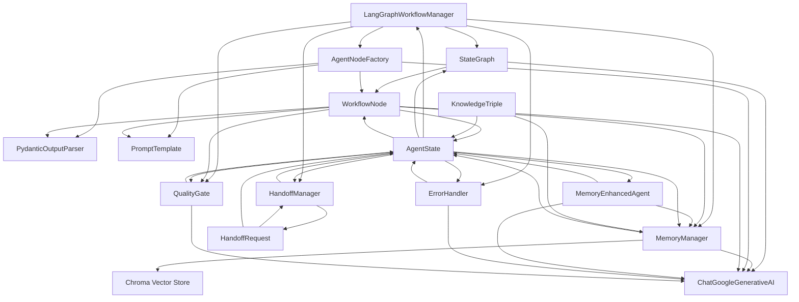

# LangGraph Workflow System - Component Diagram

This diagram shows the component architecture and interfaces of the LangGraph workflow system, illustrating how different components interact and communicate.

## Component Descriptions

### Core Components

#### LangGraphWorkflowManager
The main orchestrator component that:
- **execute_workflow()**: Executes the complete workflow with project context
- **create_workflow()**: Creates and configures the workflow graph
- **validate_state()**: Validates workflow state integrity

#### StateGraph
LangGraph's workflow graph container that:
- **add_node()**: Adds agent nodes to the workflow
- **add_edge()**: Creates connections between nodes
- **compile()**: Compiles the workflow for execution
- **invoke()**: Executes the compiled workflow

#### MemoryManager
Manages long-term memory using vector stores:
- **save_recall_memory()**: Saves agent outputs as memories
- **search_recall_memories()**: Retrieves relevant memories
- **save_knowledge_triple()**: Stores structured knowledge
- **extract_knowledge_triples()**: Extracts knowledge from text
- **get_memory_stats()**: Provides memory usage statistics

#### HandoffManager
Manages dynamic agent handoffs:
- **validate_handoff_request()**: Validates handoff requests
- **suggest_alternative_agents()**: Suggests alternative agents
- **create_handoff_request()**: Creates new handoff requests
- **process_handoff_queue()**: Processes pending handoffs

### Agent System Components

#### AgentNodeFactory
Factory for creating specialized workflow nodes:
- **create_requirements_node()**: Creates requirements analysis node
- **create_architecture_node()**: Creates architecture design node
- **create_code_generator_node()**: Creates code generation node
- **create_test_generator_node()**: Creates test generation node
- **create_code_reviewer_node()**: Creates code review node
- **create_security_analyst_node()**: Creates security analysis node
- **create_documentation_generator_node()**: Creates documentation node

#### WorkflowNode
Base class for all agent nodes:
- **execute()**: Executes the node's main logic
- **create_chain()**: Creates the execution chain
- **validate_output()**: Validates node output
- **update_state()**: Updates workflow state

#### MemoryEnhancedAgent
Agent wrapper with memory capabilities:
- **execute()**: Executes agent with memory context
- **load_memories()**: Loads relevant memories
- **create_memory_context()**: Creates memory context
- **extract_and_save_triples()**: Extracts and saves knowledge

### Support Components

#### ErrorHandler
Handles errors and retries:
- **handle_error()**: Processes errors and creates error states
- **should_retry()**: Determines if operation should be retried
- **create_error_state()**: Creates error state for workflow
- **log_error()**: Logs error information

#### QualityGate
Validates outputs and workflow state:
- **validate_agent_output()**: Validates individual agent outputs
- **validate_workflow_state()**: Validates complete workflow state
- **calculate_quality_score()**: Calculates output quality scores
- **generate_validation_report()**: Generates validation reports

### External Dependencies

#### ChatGoogleGenerativeAI
LLM service integration:
- **invoke()**: Synchronous LLM invocation
- **ainvoke()**: Asynchronous LLM invocation

#### Chroma Vector Store
Vector database for memory:
- **add_documents()**: Adds documents to vector store
- **similarity_search()**: Performs semantic search
- **persist()**: Persists vector store data

#### PydanticOutputParser
Structured output parsing:
- **parse()**: Parses LLM output into structured format
- **get_format_instructions()**: Gets format instructions for LLM

#### PromptTemplate
Prompt management:
- **format()**: Formats prompts with variables
- **partial()**: Creates partial prompts

### Data Models

#### AgentState
Main workflow state container:
- **update()**: Updates state with new data
- **validate()**: Validates state integrity

#### HandoffRequest
Represents agent handoff requests:
- **validate()**: Validates handoff request
- **model_dump()**: Serializes request data

#### KnowledgeTriple
Structured knowledge representation:
- **validate()**: Validates triple structure
- **to_dict()**: Converts to dictionary format

## Component Interactions

### Primary Data Flow
1. **LangGraphWorkflowManager** orchestrates the entire workflow
2. **StateGraph** manages workflow execution and state transitions
3. **AgentNodeFactory** creates specialized agent nodes
4. **WorkflowNode** executes individual agent logic
5. **MemoryManager** provides context and stores outputs
6. **HandoffManager** manages dynamic agent reassignment

### Memory Integration
- **MemoryEnhancedAgent** loads memories before execution
- **MemoryManager** stores agent outputs as memories
- **Chroma Vector Store** provides semantic search capabilities
- **KnowledgeTriple** structures extracted knowledge

### Quality Assurance
- **QualityGate** validates all agent outputs
- **ErrorHandler** manages errors and retries
- **WorkflowNode** includes validation in execution
- **LangGraphWorkflowManager** enforces quality standards

### External Integration
- **ChatGoogleGenerativeAI** provides LLM capabilities
- **PydanticOutputParser** ensures structured outputs
- **PromptTemplate** manages prompt formatting
- **Chroma Vector Store** provides memory persistence

## Interface Contracts

### Execution Interfaces
- All components implement standardized execution interfaces
- Error handling is consistent across all components
- State management follows established patterns
- Memory integration is transparent to agents

### Data Flow Interfaces
- **AgentState** serves as the central data container
- All components read from and write to the state
- Data validation occurs at component boundaries
- State transitions are atomic and consistent

### Quality Interfaces
- **QualityGate** provides validation services
- All agent outputs are validated before state updates
- Quality metrics are collected and reported
- Validation failures trigger appropriate handling

## Architecture Benefits

### Modularity
- Components are loosely coupled and highly cohesive
- Clear separation of concerns between components
- Easy to extend and modify individual components
- Standardized interfaces enable component replacement

### Scalability
- Memory management supports large-scale operations
- Vector store provides efficient semantic search
- Handoff system enables dynamic resource allocation
- Quality gates ensure consistent performance

### Maintainability
- Clear component responsibilities and interfaces
- Comprehensive error handling and logging
- Structured data flow and state management
- Quality validation at multiple levels

### Extensibility
- Factory pattern enables easy agent addition
- Memory system supports knowledge accumulation
- Handoff system enables dynamic workflow adaptation
- Quality system supports custom validation rules
