# LangGraph Workflow System - Sequence Diagram

This diagram illustrates the complete execution flow of the LangGraph workflow system, showing how components interact over time.

```mermaid
sequenceDiagram
    participant User
    participant WFM as LangGraphWorkflowManager
    participant SG as StateGraph
    participant MM as MemoryManager
    participant HM as HandoffManager
    participant ANF as AgentNodeFactory
    participant WN as WorkflowNode
    participant LLM as ChatGoogleGenerativeAI
    participant CVS as Chroma Vector Store
    participant EH as ErrorHandler
    participant QG as QualityGate

    User->>WFM: execute_workflow(project_context)
    activate WFM

    WFM->>WFM: _setup_llm()
    WFM->>WFM: _create_workflow()
    activate WFM

    WFM->>SG: StateGraph(AgentState)
    activate SG

    WFM->>ANF: create_requirements_node(llm)
    activate ANF
    ANF->>WN: new WorkflowNode("requirements_analysis")
    activate WN
    ANF-->>WFM: requirements_node_function
    deactivate ANF

    WFM->>SG: add_node("requirements_analysis", node_func)
    WFM->>SG: add_node("architecture_design", node_func)
    WFM->>SG: add_node("code_generation", node_func)
    WFM->>SG: add_node("test_generation", node_func)
    WFM->>SG: add_node("code_review", node_func)
    WFM->>SG: add_node("security_analysis", node_func)
    WFM->>SG: add_node("documentation_generation", node_func)

    WFM->>SG: add_edge("requirements_analysis", "architecture_design")
    WFM->>SG: add_edge("architecture_design", "code_generation")
    WFM->>SG: add_edge("code_generation", "test_generation")
    WFM->>SG: add_edge("test_generation", "code_review")
    WFM->>SG: add_edge("code_review", "security_analysis")
    WFM->>SG: add_edge("security_analysis", "documentation_generation")

    WFM->>SG: compile(checkpointer=MemorySaver())
    SG-->>WFM: compiled_workflow
    deactivate SG

    WFM->>WFM: create_initial_state(project_context)
    WFM->>MM: __init__(user_id="default")
    activate MM
    MM->>CVS: Chroma(persist_directory, embedding_function)
    activate CVS
    CVS-->>MM: vector_store
    deactivate CVS
    MM-->>WFM: memory_manager
    deactivate MM

    WFM->>HM: __init__()
    activate HM
    HM-->>WFM: handoff_manager
    deactivate HM

    WFM->>SG: invoke(initial_state)
    activate SG

    %% Requirements Analysis Phase
    SG->>WN: execute(state)
    activate WN

    WN->>MM: search_recall_memories("requirements analysis", k=5)
    activate MM
    MM->>CVS: similarity_search_with_relevance_scores(query, k=5)
    activate CVS
    CVS-->>MM: relevant_memories
    deactivate CVS
    MM-->>WN: memory_context
    deactivate MM

    WN->>WN: create_memory_context(state, query, k=5)
    WN->>LLM: invoke(enhanced_prompt_with_memory)
    activate LLM
    LLM-->>WN: llm_response
    deactivate LLM

    WN->>WN: parse_response(response)
    WN->>MM: save_recall_memory(agent_output, context)
    activate MM
    MM->>CVS: add_documents([document])
    activate CVS
    CVS-->>MM: memory_id
    deactivate CVS
    MM-->>WN: memory_id
    deactivate MM

    WN->>MM: extract_knowledge_triples(agent_output)
    activate MM
    MM->>LLM: ainvoke(extraction_prompt)
    activate LLM
    LLM-->>MM: triples_response
    deactivate LLM
    MM->>MM: parse_triples(response)
    MM-->>WN: knowledge_triples
    deactivate MM

    WN->>QG: validate_agent_output(output, "requirements_analyst")
    activate QG
    QG-->>WN: validation_result
    deactivate QG

    WN-->>SG: updated_state_with_requirements
    deactivate WN

    %% Architecture Design Phase
    SG->>WN: execute(state)
    activate WN

    WN->>HM: validate_handoff_request(handoff, state)
    activate HM
    HM-->>WN: validation_result
    deactivate HM

    WN->>LLM: invoke(architecture_prompt)
    activate LLM
    LLM-->>WN: llm_response
    deactivate LLM

    WN->>QG: validate_agent_output(output, "architecture_designer")
    activate QG
    QG-->>WN: validation_result
    deactivate QG

    WN-->>SG: updated_state_with_architecture
    deactivate WN

    %% Code Generation Phase
    SG->>WN: execute(state)
    activate WN

    WN->>HM: suggest_alternative_agents("code generation")
    activate HM
    HM-->>WN: agent_suggestions
    deactivate HM

    WN->>LLM: invoke(code_generation_prompt)
    activate LLM
    LLM-->>WN: llm_response
    deactivate LLM

    WN->>QG: validate_agent_output(output, "code_generator")
    activate QG
    QG-->>WN: validation_result
    deactivate QG

    WN-->>SG: updated_state_with_code
    deactivate WN

    %% Test Generation Phase
    SG->>WN: execute(state)
    activate WN

    WN->>LLM: invoke(test_generation_prompt)
    activate LLM
    LLM-->>WN: llm_response
    deactivate LLM

    WN->>QG: validate_agent_output(output, "test_generator")
    activate QG
    QG-->>WN: validation_result
    deactivate QG

    WN-->>SG: updated_state_with_tests
    deactivate WN

    %% Code Review Phase
    SG->>WN: execute(state)
    activate WN

    WN->>LLM: invoke(code_review_prompt)
    activate LLM
    LLM-->>WN: llm_response
    deactivate LLM

    WN->>QG: validate_agent_output(output, "code_reviewer")
    activate QG
    QG-->>WN: validation_result
    deactivate QG

    WN-->>SG: updated_state_with_review
    deactivate WN

    %% Security Analysis Phase
    SG->>WN: execute(state)
    activate WN

    WN->>LLM: invoke(security_analysis_prompt)
    activate LLM
    LLM-->>WN: llm_response
    deactivate LLM

    WN->>QG: validate_agent_output(output, "security_analyst")
    activate QG
    QG-->>WN: validation_result
    deactivate QG

    WN-->>SG: updated_state_with_security
    deactivate WN

    %% Documentation Generation Phase
    SG->>WN: execute(state)
    activate WN

    WN->>LLM: invoke(documentation_prompt)
    activate LLM
    LLM-->>WN: llm_response
    deactivate LLM

    WN->>QG: validate_agent_output(output, "documentation_generator")
    activate QG
    QG-->>WN: validation_result
    deactivate QG

    WN-->>SG: updated_state_with_documentation
    deactivate WN

    %% Workflow Completion
    SG->>QG: validate_workflow_state(final_state)
    activate QG
    QG-->>SG: workflow_validation_result
    deactivate QG

    SG-->>WFM: final_state
    deactivate SG

    WFM->>MM: get_memory_stats()
    activate MM
    MM-->>WFM: memory_statistics
    deactivate MM

    WFM->>HM: process_handoff_queue(final_state)
    activate HM
    HM-->>WFM: state_with_processed_handoffs
    deactivate HM

    WFM-->>User: complete_project_artifacts
    deactivate WFM
```

## Sequence Flow Description

### Phase 1: Initialization
1. **User Input**: User initiates workflow execution with project context
2. **Workflow Setup**: LangGraphWorkflowManager sets up LLM and creates workflow
3. **StateGraph Creation**: Creates StateGraph with AgentState
4. **Node Creation**: AgentNodeFactory creates specialized workflow nodes
5. **Graph Assembly**: Adds all agent nodes and edges to the workflow
6. **Compilation**: Compiles workflow with MemorySaver checkpointer

### Phase 2: System Initialization
1. **State Creation**: Creates initial state with project context
2. **Memory Manager**: Initializes MemoryManager with Chroma vector store
3. **Handoff Manager**: Initializes HandoffManager for dynamic agent handoffs
4. **Workflow Invocation**: Starts workflow execution with initial state

### Phase 3: Agent Execution Phases

#### Requirements Analysis Phase
1. **Memory Loading**: Searches for relevant memories from vector store
2. **Context Creation**: Creates memory context for agent consumption
3. **LLM Execution**: Executes requirements analysis with enhanced prompt
4. **Output Parsing**: Parses structured output from LLM
5. **Memory Storage**: Saves agent output and extracts knowledge triples
6. **Quality Validation**: Validates output quality
7. **State Update**: Updates workflow state with requirements

#### Architecture Design Phase
1. **Handoff Validation**: Validates any handoff requests
2. **LLM Execution**: Executes architecture design
3. **Quality Validation**: Validates architecture output
4. **State Update**: Updates state with architecture

#### Code Generation Phase
1. **Agent Suggestions**: Gets alternative agent suggestions if needed
2. **LLM Execution**: Generates code based on requirements and architecture
3. **Quality Validation**: Validates generated code
4. **State Update**: Updates state with code files

#### Test Generation Phase
1. **LLM Execution**: Generates comprehensive test suites
2. **Quality Validation**: Validates test generation
3. **State Update**: Updates state with test files

#### Code Review Phase
1. **LLM Execution**: Reviews generated code for quality
2. **Quality Validation**: Validates review output
3. **State Update**: Updates state with review results

#### Security Analysis Phase
1. **LLM Execution**: Analyzes code for security vulnerabilities
2. **Quality Validation**: Validates security analysis
3. **State Update**: Updates state with security assessment

#### Documentation Generation Phase
1. **LLM Execution**: Generates comprehensive documentation
2. **Quality Validation**: Validates documentation
3. **State Update**: Updates state with documentation

### Phase 4: Workflow Completion
1. **Final Validation**: Validates complete workflow state
2. **Memory Statistics**: Retrieves memory usage statistics
3. **Handoff Processing**: Processes any pending handoffs
4. **Result Delivery**: Returns complete project artifacts to user

## Key Interaction Patterns

### Memory Integration
- Each agent loads relevant memories before execution
- Agent outputs are saved as memories for future reference
- Knowledge triples are extracted and stored automatically
- Memory context enhances agent performance

### Quality Control
- Every agent output is validated by QualityGate
- Quality thresholds ensure consistent output quality
- Validation results guide workflow progression
- Quality issues trigger appropriate handling

### Handoff Management
- Dynamic agent handoffs are validated before execution
- Alternative agent suggestions are provided when needed
- Handoff queue is processed at workflow completion
- Handoff history is maintained for analysis

### Error Handling
- ErrorHandler manages exceptions throughout the workflow
- Retry mechanisms handle transient failures
- Graceful degradation maintains workflow stability
- Comprehensive error logging and reporting

## Timing Considerations

### Execution Times
- **Initialization**: 2-5 seconds
- **Requirements Analysis**: 10-15 seconds
- **Architecture Design**: 10-15 seconds
- **Code Generation**: 15-30 seconds
- **Test Generation**: 10-15 seconds
- **Code Review**: 5-10 seconds
- **Security Analysis**: 10-15 seconds
- **Documentation Generation**: 10-20 seconds
- **Completion**: 2-5 seconds

### Total Workflow Time
- **Simple Projects**: 1-2 minutes
- **Complex Projects**: 3-5 minutes
- **Projects with Multiple Iterations**: 5-10 minutes

## System Integration Points

### LLM Integration
- All agents use ChatGoogleGenerativeAI for execution
- Consistent prompt templates and output parsing
- Error handling for LLM failures
- Performance optimization through caching

### Vector Store Integration
- Chroma provides semantic search capabilities
- Memory storage and retrieval throughout workflow
- Knowledge triple extraction and storage
- Memory statistics and analytics

### Quality Assurance
- QualityGate validates all agent outputs
- Quality thresholds ensure consistent results
- Validation reports provide detailed feedback
- Quality metrics guide workflow optimization
