# Sequence Diagram

```mermaid
sequenceDiagram
    participant User
    participant UI as Streamlit UI
    participant PM as Project Manager
    participant RA as Requirements Analyst
    participant AD as Architecture Designer
    participant CG as Code Generator
    participant CR as Code Reviewer
    participant TG as Test Generator
    participant DG as Documentation Generator
    participant SA as Security Analyst
    participant FS as File System
    
    %% Initial Setup
    User->>UI: Enter project description
    UI->>PM: Initialize project workflow
    PM->>PM: Create project state
    
    %% First Iteration - Requirements Analysis
    PM->>RA: Execute requirements analysis
    RA->>RA: Analyze project context
    RA-->>PM: Return requirements specification
    PM->>PM: Update project state with requirements
    
    %% Architecture Design
    PM->>AD: Execute architecture design
    AD->>AD: Design system architecture
    AD-->>PM: Return architecture specification
    PM->>PM: Update project state with architecture
    
    %% Code Generation
    PM->>CG: Execute code generation
    CG->>CG: Generate source code
    CG-->>PM: Return generated code
    PM->>PM: Update project state with code
    
    %% Feedback Loop - Code Review
    PM->>CR: Execute code review
    CR->>CR: Review generated code
    CR-->>PM: Return review feedback
    PM->>PM: Check if feedback requires iteration
    
    alt Feedback requires code changes
        PM->>CG: Re-execute with feedback
        CG->>CG: Update code based on feedback
        CG-->>PM: Return updated code
        PM->>PM: Update project state
        PM->>CR: Re-review updated code
        CR->>CR: Review updated code
        CR-->>PM: Return final review
    end
    
    %% Test Generation
    PM->>TG: Execute test generation
    TG->>TG: Generate test suites
    TG-->>PM: Return generated tests
    PM->>PM: Update project state with tests
    
    %% Documentation Generation
    PM->>DG: Execute documentation generation
    DG->>DG: Generate project documentation
    DG-->>PM: Return generated documentation
    PM->>PM: Update project state with documentation
    
    %% Security Analysis
    PM->>SA: Execute security analysis
    SA->>SA: Analyze code and architecture
    SA-->>PM: Return security assessment
    PM->>PM: Update project state with security analysis
    
    %% Final Quality Check
    PM->>PM: Assess overall project quality
    
    alt Quality issues detected
        PM->>PM: Create decision point
        PM->>PM: Make quality improvement decisions
        PM->>CG: Re-execute with improvements
        CG->>CG: Apply quality improvements
        CG-->>PM: Return improved code
        PM->>PM: Update project state
    end
    
    %% File Generation
    PM->>FS: Save all generated files
    FS-->>PM: Confirm file creation
    
    %% Final Result
    PM-->>UI: Return complete project
    UI-->>User: Display project results
    
    %% Project Management
    User->>UI: Request project management
    UI->>FS: List generated projects
    FS-->>UI: Return project list
    UI-->>User: Display project management interface
    
    alt User requests project deletion
        User->>UI: Delete project
        UI->>FS: Delete project files
        FS-->>UI: Confirm deletion
        UI-->>User: Confirm project deleted
    end
```

## Sequence Flow Description

### Phase 1: Project Initialization
1. **User Input**: User provides project description through the Streamlit UI
2. **Project Manager Initialization**: Project Manager creates initial project state
3. **Workflow Setup**: Project Manager prepares the development workflow

### Phase 2: Core Development Workflow
1. **Requirements Analysis**: Requirements Analyst analyzes the project context and creates detailed specifications
2. **Architecture Design**: Architecture Designer creates system architecture based on requirements
3. **Code Generation**: Code Generator creates source code based on requirements and architecture

### Phase 3: Feedback and Iteration
1. **Code Review**: Code Reviewer analyzes generated code for quality and best practices
2. **Feedback Processing**: If issues are found, the Project Manager initiates feedback loops
3. **Code Iteration**: Code Generator updates code based on review feedback
4. **Re-review**: Code Reviewer validates the updated code

### Phase 4: Completion and Quality Assurance
1. **Test Generation**: Test Generator creates comprehensive test suites
2. **Documentation Generation**: Documentation Generator creates project documentation
3. **Security Analysis**: Security Analyst performs security assessment
4. **Quality Assessment**: Project Manager evaluates overall project quality

### Phase 5: Finalization
1. **Quality Improvements**: If needed, additional iterations are performed
2. **File Generation**: All project files are saved to the file system
3. **Result Delivery**: Complete project is returned to the user

### Phase 6: Project Management
1. **Project Listing**: User can view all generated projects
2. **Project Deletion**: User can delete unwanted projects
3. **Project Management**: Ongoing project management capabilities

## Key Interaction Patterns

### Feedback Loops
- **Code Review → Code Generator**: Iterative code improvement
- **Security Analysis → Code Generator**: Security-focused improvements
- **Test Generator → Code Reviewer**: Test quality validation

### Decision Points
- **Quality Thresholds**: Project Manager intervenes when quality standards aren't met
- **Technical Conflicts**: Resolution of disagreements between agents
- **Iteration Limits**: Management of maximum iteration cycles

### State Management
- **Shared State**: All agents work with a shared ProjectState
- **State Updates**: Each agent updates the state with their contributions
- **State Validation**: Project Manager validates state consistency

### Error Handling
- **Agent Failures**: Graceful handling of agent execution failures
- **Validation Errors**: Proper handling of validation failures
- **System Errors**: Comprehensive error logging and recovery

## Timing Considerations

### Execution Times
- **Requirements Analysis**: 5-10 seconds
- **Architecture Design**: 10-15 seconds
- **Code Generation**: 15-30 seconds
- **Code Review**: 5-10 seconds
- **Test Generation**: 10-15 seconds
- **Documentation Generation**: 10-20 seconds
- **Security Analysis**: 10-15 seconds

### Feedback Loop Timing
- **Review Feedback**: 2-5 seconds
- **Code Updates**: 5-15 seconds
- **Re-review**: 3-8 seconds

### Total Project Time
- **Simple Projects**: 1-2 minutes
- **Complex Projects**: 3-5 minutes
- **Projects with Multiple Iterations**: 5-10 minutes
