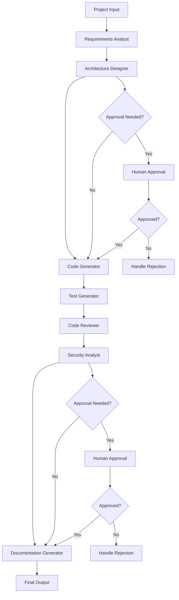

# AI Development Agent System - Agent Graph

## Overview

The AI Development Agent system is a sophisticated multi-agent architecture designed to automate the entire software development lifecycle. The system uses specialized AI agents that work together in a coordinated workflow to transform high-level project requirements into complete, production-ready applications.

## System Architecture

```
┌─────────────────────────────────────────────────────────────────────────────┐
│                           AI Development Agent System                        │
├─────────────────────────────────────────────────────────────────────────────┤
│                                                                             │
│  ┌─────────────────┐    ┌─────────────────┐    ┌─────────────────┐         │
│  │   Main System   │    │  Workflow Graph │    │  Context Engine │         │
│  │   Orchestrator  │◄──►│   (LangGraph)   │◄──►│   & State Mgmt  │         │
│  └─────────────────┘    └─────────────────┘    └─────────────────┘         │
│           │                       │                       │                 │
│           ▼                       ▼                       ▼                 │
│  ┌─────────────────────────────────────────────────────────────────────────┐ │
│  │                        Specialized Agents                              │ │
│  │                                                                         │ │
│  │  ┌─────────────┐ ┌─────────────┐ ┌─────────────┐ ┌─────────────┐       │ │
│  │  │Requirements │ │Architecture │ │   Code      │ │    Test     │       │ │
│  │  │  Analyst    │ │ Designer    │ │ Generator   │ │ Generator   │       │ │
│  │  └─────────────┘ └─────────────┘ └─────────────┘ └─────────────┘       │ │
│  │                                                                         │ │
│  │  ┌─────────────┐ ┌─────────────┐ ┌─────────────┐                       │ │
│  │  │    Code     │ │  Security   │ │Documentation│                       │ │
│  │  │  Reviewer   │ │  Analyst    │ │ Generator   │                       │ │
│  │  └─────────────┘ └─────────────┘ └─────────────┘                       │ │
│  └─────────────────────────────────────────────────────────────────────────┘ │
│                                                                             │
│  ┌─────────────────────────────────────────────────────────────────────────┐ │
│  │                        Support Components                              │ │
│  │                                                                         │ │
│  │  ┌─────────────┐ ┌─────────────┐ ┌─────────────┐ ┌─────────────┐       │ │
│  │  │   Prompt    │ │   File      │ │   Error     │ │   Human     │       │ │
│  │  │  Manager    │ │  Manager    │ │  Handler    │ │  Approval   │       │ │
│  │  └─────────────┘ └─────────────┘ └─────────────┘ └─────────────┘       │ │
│  └─────────────────────────────────────────────────────────────────────────┘ │
└─────────────────────────────────────────────────────────────────────────────┘
```

## Agent Workflow

The system follows a sequential workflow where each agent builds upon the output of previous agents:



## Agent Details

### 1. Requirements Analyst
- **Purpose**: Transforms high-level project descriptions into detailed, actionable requirements
- **Input**: Project context, user stories, business requirements
- **Output**: Functional requirements, non-functional requirements, user stories, technical constraints
- **Key Features**:
  - Extracts functional and non-functional requirements
  - Creates detailed user stories with acceptance criteria
  - Identifies technical constraints and assumptions
  - Assesses project complexity and timeline

### 2. Architecture Designer
- **Purpose**: Designs scalable, maintainable system architecture
- **Input**: Requirements analysis, technical constraints
- **Output**: System architecture, technology stack, component design
- **Key Features**:
  - Creates system architecture diagrams
  - Selects appropriate technology stack
  - Defines component interactions
  - Establishes design patterns and principles

### 3. Code Generator
- **Purpose**: Generates production-ready code based on requirements and architecture
- **Input**: Requirements, architecture design, technology stack
- **Output**: Complete codebase with all necessary files
- **Key Features**:
  - Generates comprehensive, production-ready code
  - Implements proper error handling and validation
  - Includes security measures and best practices
  - Creates complete project structure

### 4. Test Generator
- **Purpose**: Creates comprehensive test suites for the generated code
- **Input**: Generated code, requirements, architecture
- **Output**: Unit tests, integration tests, test documentation
- **Key Features**:
  - Generates unit tests for all components
  - Creates integration tests for system interactions
  - Implements test coverage analysis
  - Provides test documentation and guidelines

### 5. Code Reviewer
- **Purpose**: Reviews generated code for quality, best practices, and maintainability
- **Input**: Generated code, test results
- **Output**: Code review report, improvement suggestions
- **Key Features**:
  - Analyzes code quality and maintainability
  - Identifies potential issues and improvements
  - Ensures adherence to coding standards
  - Provides detailed feedback and recommendations

### 6. Security Analyst
- **Purpose**: Identifies and mitigates security vulnerabilities
- **Input**: Generated code, architecture, requirements
- **Output**: Security analysis report, vulnerability assessment
- **Key Features**:
  - Identifies security vulnerabilities
  - Analyzes authentication and authorization
  - Checks for common security issues
  - Provides security recommendations

### 7. Documentation Generator
- **Purpose**: Creates comprehensive documentation for the project
- **Input**: Code, architecture, requirements, test results
- **Output**: User documentation, API documentation, deployment guides
- **Key Features**:
  - Generates user and technical documentation
  - Creates API documentation
  - Provides deployment and setup instructions
  - Includes troubleshooting guides

## Base Agent Architecture

All agents inherit from the `BaseAgent` class, which provides:

### Common Functionality
- **Gemini API Integration**: Standardized AI model interaction
- **State Management**: Consistent state handling across agents
- **Error Handling**: Robust error recovery and retry mechanisms
- **Logging**: Comprehensive execution logging
- **Performance Tracking**: Execution time and success rate monitoring
- **Response Formatting**: Standardized output formatting

### Key Methods
- `execute()`: Main agent execution logic
- `get_prompt_template()`: Agent-specific prompt retrieval
- `generate_response()`: AI model interaction
- `validate_input()`: Input validation
- `handle_error()`: Error handling and recovery
- `update_state_with_result()`: State management

## Workflow Management

### LangGraph Integration
The system uses LangGraph for workflow orchestration, providing:
- **State Management**: Persistent state across agent executions
- **Conditional Logic**: Dynamic workflow routing based on conditions
- **Error Recovery**: Automatic retry and error handling
- **Human Approval**: Integration points for human oversight

### State Flow
```python
AgentState = {
    "project_context": str,
    "requirements": Dict,
    "architecture": Dict,
    "code_files": Dict,
    "test_files": Dict,
    "review_results": Dict,
    "security_analysis": Dict,
    "documentation": Dict,
    "workflow_status": str,
    "errors": List,
    "metadata": Dict
}
```

## Prompt Management

### Database-Driven Prompts
The system uses a centralized prompt database (`prompt_templates.db`) that stores:
- Agent-specific prompt templates
- Performance metrics and success rates
- Usage statistics and analytics
- Enhanced prompt versions

### Prompt Loading Strategy
1. **Enhanced Prompts**: First priority for high-performance prompts
2. **Database Prompts**: Fallback to best-performing database prompts
3. **Default Prompts**: Final fallback for basic functionality

## Error Handling and Recovery

### Multi-Level Error Handling
1. **Agent Level**: Individual agent error recovery and retry
2. **Workflow Level**: Workflow-wide error handling and routing
3. **System Level**: Global error recovery and fallback mechanisms

### Retry Mechanisms
- **Exponential Backoff**: Intelligent retry timing
- **Max Retries**: Configurable retry limits per agent
- **Error Classification**: Different handling for different error types
- **State Recovery**: Preserve progress on retry

## Human Approval Integration

### Approval Points
- **Architecture Design**: After system architecture is complete
- **Security Analysis**: After security assessment is complete

### Approval Workflow
1. **Approval Check**: Determine if approval is needed
2. **Approval Request**: Present results to human reviewer
3. **Approval Response**: Handle approval, rejection, or modification
4. **Workflow Continuation**: Continue or modify based on response

## Performance and Monitoring

### Metrics Tracking
- **Execution Times**: Per-agent and total execution time
- **Success Rates**: Agent-specific success metrics
- **Error Rates**: Error frequency and types
- **Resource Usage**: Memory and API usage tracking

### Analytics
- **Prompt Performance**: Success rates for different prompts
- **Workflow Efficiency**: Time spent in each workflow stage
- **Quality Metrics**: Code quality and test coverage
- **User Satisfaction**: Human approval rates and feedback

## Configuration and Customization

### System Configuration
- **Agent Settings**: Individual agent configuration
- **Workflow Settings**: Workflow behavior configuration
- **API Settings**: Gemini API configuration
- **Storage Settings**: File and database configuration

### Extensibility
- **Custom Agents**: Easy addition of new agent types
- **Custom Workflows**: Flexible workflow modification
- **Custom Prompts**: Database-driven prompt management
- **Custom Integrations**: Plugin architecture for external tools

## Security and Privacy

### Data Protection
- **API Key Management**: Secure API key handling
- **Data Encryption**: Sensitive data encryption
- **Access Control**: Role-based access control
- **Audit Logging**: Comprehensive audit trails

### Code Security
- **Vulnerability Scanning**: Automated security analysis
- **Best Practices**: Security-focused code generation
- **Compliance**: Industry standard compliance
- **Regular Updates**: Security patch management

## Future Enhancements

### Planned Features
- **Multi-Model Support**: Integration with additional AI models
- **Advanced Analytics**: Enhanced performance monitoring
- **Collaborative Features**: Multi-user collaboration support
- **Deployment Integration**: Direct deployment capabilities
- **Custom Frameworks**: Framework-specific optimizations

### Scalability Improvements
- **Distributed Processing**: Multi-node agent execution
- **Caching Layer**: Intelligent result caching
- **Load Balancing**: Dynamic workload distribution
- **Resource Optimization**: Efficient resource utilization
