# System Architecture Diagram

```mermaid
graph TB
    %% User Interface Layer
    subgraph "User Interface"
        UI[Streamlit Web App]
        CLI[Command Line Interface]
    end
    
    %% Core System Layer
    subgraph "Core System"
        PM[Project Manager Agent]
        WF[Workflow Manager]
        EH[Error Handler]
        HA[Human Approval]
        PA[Project Analyzer]
        MCE[Mode Configuration Engine]
        DMS[Dynamic Mode Switcher]
    end
    
    %% Dual-Mode Workflow System
    subgraph "Dual-Mode Workflow System"
        subgraph "Mode Selection"
            PA2[Project Analyzer]
            MS[Mode Selector]
            PEM[Project Evolution Monitor]
        end
        
        subgraph "Workflow Modes"
            WM[Waterfall Mode]
            AM[Agile/XP Mode]
            MM[Mixed Mode]
        end
        
        subgraph "Mode Switching"
            DMS2[Dynamic Mode Switcher]
            TM[Transition Manager]
            SM[State Migrator]
            TA[Team Adapter]
        end
    end
    
    %% Agent Layer
    subgraph "AI Agents"
        RA[Requirements Analyst]
        AD[Architecture Designer]
        CG[Code Generator]
        TG[Test Generator]
        DG[Documentation Generator]
        CR[Code Reviewer]
        SA[Security Analyst]
        
        %% Agile/XP Specific Agents
        ASM[Agile Sprint Manager]
        USM[User Story Manager]
        TDDM[TDD Manager]
        PPM[Pair Programming Manager]
    end
    
    %% Data Layer
    subgraph "Data & State"
        PS[Project State]
        CF[Configuration]
        LG[Logging]
        CT[Context Engine]
        EP[Evolution Profile]
        SC[Staffing Configuration]
    end
    
    %% External Services
    subgraph "External Services"
        AI[Gemini AI API]
        FS[File System]
        DB[(Database)]
    end
    
    %% Connections - User Interface to Core
    UI --> PM
    CLI --> PM
    PM --> WF
    WF --> EH
    WF --> HA
    
    %% Connections - Core to Dual-Mode System
    PM --> PA
    PA --> MCE
    MCE --> DMS
    
    %% Connections - Mode Selection
    PA --> PA2
    PA2 --> MS
    MS --> PEM
    
    %% Connections - Mode Selection to Workflow Modes
    MS --> WM
    MS --> AM
    MS --> MM
    
    %% Connections - Mode Switching
    PEM --> DMS2
    DMS2 --> TM
    TM --> SM
    TM --> TA
    
    %% Connections - Workflow Modes to Agents
    WM --> RA
    WM --> AD
    WM --> CG
    WM --> TG
    WM --> DG
    WM --> CR
    WM --> SA
    
    AM --> ASM
    AM --> USM
    AM --> TDDM
    AM --> PPM
    AM --> CG
    AM --> TG
    AM --> CR
    
    MM --> RA
    MM --> AD
    MM --> CG
    MM --> TG
    MM --> DG
    MM --> CR
    MM --> SA
    MM --> ASM
    MM --> USM
    MM --> TDDM
    MM --> PPM
    
    %% Feedback Loops
    RA -.->|Feedback| AD
    AD -.->|Feedback| CG
    CG -.->|Feedback| CR
    CR -.->|Feedback| CG
    SA -.->|Feedback| CG
    TG -.->|Feedback| CR
    
    %% Agile/XP Feedback Loops
    ASM -.->|Sprint Planning| USM
    USM -.->|Story Refinement| TDDM
    TDDM -.->|TDD Cycle| PPM
    PPM -.->|Code Review| CR
    
    %% Mode Switching Feedback
    PEM -.->|Evolution Detection| DMS2
    DMS2 -.->|Mode Switch| TM
    TM -.->|State Migration| SM
    SM -.->|Team Adaptation| TA
    
    %% Data Flow
    RA --> PS
    AD --> PS
    CG --> PS
    TG --> PS
    DG --> PS
    CR --> PS
    SA --> PS
    ASM --> PS
    USM --> PS
    TDDM --> PS
    PPM --> PS
    PA2 --> EP
    MCE --> SC
    
    %% External Integrations
    RA --> AI
    AD --> AI
    CG --> AI
    TG --> AI
    DG --> AI
    CR --> AI
    SA --> AI
    ASM --> AI
    USM --> AI
    TDDM --> AI
    PPM --> AI
    PA2 --> AI
    MCE --> AI
    
    %% File Operations
    CG --> FS
    TG --> FS
    DG --> FS
    
    %% Configuration & Logging
    PM --> CF
    PM --> LG
    PM --> CT
    
    %% Styling
    classDef userInterface fill:#e1f5fe
    classDef coreSystem fill:#f3e5f5
    classDef dualMode fill:#fff8e1
    classDef agents fill:#e8f5e8
    classDef dataLayer fill:#fff3e0
    classDef external fill:#ffebee
    
    class UI,CLI userInterface
    class PM,WF,EH,HA,PA,MCE,DMS coreSystem
    class PA2,MS,PEM,WM,AM,MM,DMS2,TM,SM,TA dualMode
    class RA,AD,CG,TG,DG,CR,SA,ASM,USM,TDDM,PPM agents
    class PS,CF,LG,CT,EP,SC dataLayer
    class AI,FS,DB external
```

## System Components

### User Interface Layer
- **Streamlit Web App**: Primary web interface for project creation and management
- **Command Line Interface**: Alternative interface for automation and scripting

### Core System Layer
- **Project Manager Agent**: Orchestrates the entire development workflow
- **Workflow Manager**: Manages the execution flow and agent coordination
- **Error Handler**: Handles errors and exceptions gracefully
- **Human Approval**: Manages points where human intervention is required
- **Project Analyzer**: Analyzes project requirements and characteristics
- **Mode Configuration Engine**: Configures workflow based on selected mode
- **Dynamic Mode Switcher**: Handles mode switching during project execution

### Dual-Mode Workflow System

#### Mode Selection
- **Project Analyzer**: Analyzes project to determine optimal methodology
- **Mode Selector**: Selects between Waterfall, Agile/XP, or Mixed modes
- **Project Evolution Monitor**: Monitors project evolution for mode switching opportunities

#### Workflow Modes
- **Waterfall Mode**: Traditional linear workflow for well-defined, stable projects
- **Agile/XP Mode**: Iterative workflow with sprints and continuous improvement
- **Mixed Mode**: Hybrid approaches combining both methodologies

#### Mode Switching
- **Dynamic Mode Switcher**: Evaluates and executes mode switches
- **Transition Manager**: Plans and manages mode transitions
- **State Migrator**: Migrates project state between modes
- **Team Adapter**: Adapts team composition for new modes

### AI Agents Layer
- **Requirements Analyst**: Analyzes project requirements and creates specifications
- **Architecture Designer**: Designs system architecture and technical decisions
- **Code Generator**: Generates source code based on requirements and architecture
- **Test Generator**: Creates comprehensive test suites
- **Documentation Generator**: Generates project documentation
- **Code Reviewer**: Reviews code quality and provides feedback
- **Security Analyst**: Analyzes security aspects and vulnerabilities

#### Agile/XP Specific Agents
- **Agile Sprint Manager**: Manages sprint planning, execution, and tracking
- **User Story Manager**: Manages user stories with INVEST criteria
- **TDD Manager**: Manages Test-Driven Development cycles
- **Pair Programming Manager**: Simulates pair programming collaboration

### Data & State Layer
- **Project State**: Maintains the current state of the project
- **Configuration**: Manages system configuration and settings
- **Logging**: Provides comprehensive logging and monitoring
- **Context Engine**: Manages context and knowledge sharing between agents
- **Evolution Profile**: Tracks project evolution and mode switching history
- **Staffing Configuration**: Manages team composition and adaptation

### External Services
- **Gemini AI API**: Provides AI capabilities for all agents
- **File System**: Stores generated project files
- **Database**: Stores project metadata and configurations

## Key Features

### Dual-Mode Workflow System
The system implements three distinct workflow modes:

1. **Waterfall Mode**: Linear workflow with formal phases and gates
2. **Agile/XP Mode**: Iterative workflow with sprints and continuous improvement
3. **Mixed Mode**: Hybrid approaches with dynamic mode switching

### Adaptive Mode Switching
The system can dynamically switch between modes based on:
- Project evolution and requirement changes
- Stakeholder preference changes
- Risk profile evolution
- Performance trends and patterns

### Intelligent Configuration
The system automatically:
- Analyzes project characteristics and requirements
- Selects optimal methodology and team composition
- Configures appropriate quality gates and validation
- Adapts to changing project conditions

### Feedback Loops
The system implements sophisticated feedback loops:
- **Traditional Feedback**: Between requirements, design, implementation, and review
- **Agile Feedback**: Between sprint planning, development, review, and retrospective
- **Mode Switching Feedback**: Between evolution monitoring, mode switching, and adaptation

### Decision Management
The Project Manager Agent can intervene when:
- Agents disagree on technical decisions
- Quality thresholds are not met
- Human approval is required for critical decisions
- Mode switching is recommended
- Iteration limits are reached

### State Management
All agents work with a shared Project State that maintains:
- Current requirements and specifications
- Architecture decisions and diagrams
- Generated code and files
- Test results and coverage
- Documentation artifacts
- Review feedback and decisions
- Evolution metrics and mode switching history
- Team composition and adaptation data
