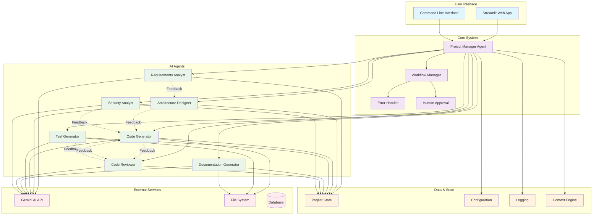

# System Architecture Diagram

## System Components

### User Interface Layer
- **Streamlit Web App**: Primary web interface for project creation and management
- **Command Line Interface**: Alternative interface for automation and scripting

### Core System Layer
- **Project Manager Agent**: Orchestrates the entire development workflow
- **Workflow Manager**: Manages the execution flow and agent coordination
- **Error Handler**: Handles errors and exceptions gracefully
- **Human Approval**: Manages points where human intervention is required

### AI Agents Layer
- **Requirements Analyst**: Analyzes project requirements and creates specifications
- **Architecture Designer**: Designs system architecture and technical decisions
- **Code Generator**: Generates source code based on requirements and architecture
- **Test Generator**: Creates comprehensive test suites
- **Documentation Generator**: Generates project documentation
- **Code Reviewer**: Reviews code quality and provides feedback
- **Security Analyst**: Analyzes security aspects and vulnerabilities

### Data & State Layer
- **Project State**: Maintains the current state of the project
- **Configuration**: Manages system configuration and settings
- **Logging**: Provides comprehensive logging and monitoring
- **Context Engine**: Manages context and knowledge sharing between agents

### External Services
- **Gemini AI API**: Provides AI capabilities for all agents
- **File System**: Stores generated project files
- **Database**: Stores project metadata and configurations

## Key Features

### Feedback Loops
The system implements sophisticated feedback loops where agents can provide feedback to each other:
- Requirements Analyst → Architecture Designer
- Architecture Designer → Code Generator
- Code Generator → Code Reviewer
- Code Reviewer → Code Generator (iterative improvement)
- Security Analyst → Code Generator
- Test Generator → Code Reviewer

### Decision Management
The Project Manager Agent can intervene when:
- Agents disagree on technical decisions
- Quality thresholds are not met
- Human approval is required for critical decisions
- Iteration limits are reached

### State Management
All agents work with a shared Project State that maintains:
- Current requirements and specifications
- Architecture decisions and diagrams
- Generated code and files
- Test results and coverage
- Documentation artifacts
- Review feedback and decisions
