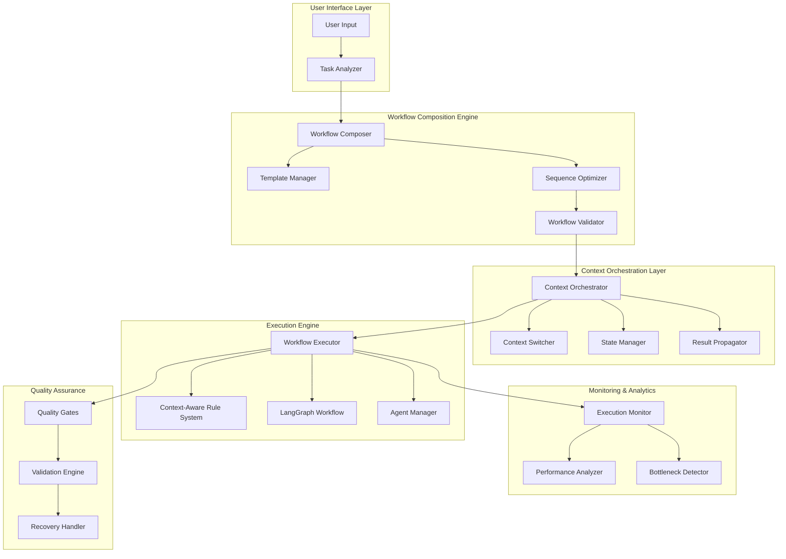

# Workflow Composition Engine Architecture

**Document**: Technical Architecture for US-AUTO-001  
**Version**: 1.0  
**Status**: Design Phase  
**Last Updated**: 2025-01-27

## Overview

The **Workflow Composition Engine** transforms single-task requests into complete, multi-phase development workflows by intelligently composing different @keyword contexts in optimal sequences. This system builds upon the existing context-aware rule system and LangGraph infrastructure to provide full automation of development workflows.

## System Architecture

### **Core Components**



## Detailed Component Design

### **1. Task Analyzer**

**Purpose**: Analyzes natural language task descriptions to determine workflow requirements.

**Key Responsibilities**:
- Parse natural language task descriptions
- Extract key entities and requirements
- Determine task complexity and scope
- Identify required contexts and capabilities
- Generate structured task analysis

**Implementation**:
```python
class TaskAnalyzer:
    """
    Analyzes task requirements to determine needed contexts and workflow patterns.
    """
    
    def analyze_task(self, task_description: str, context: Dict[str, Any]) -> TaskAnalysis:
        """
        Analyze a task description to determine workflow requirements.
        
        Args:
            task_description: Natural language description of the task
            context: Current project and environment context
            
        Returns:
            TaskAnalysis with workflow requirements and recommendations
        """
        
    def extract_entities(self, task_description: str) -> List[Entity]:
        """Extract key entities from task description."""
        
    def assess_complexity(self, entities: List[Entity], context: Dict[str, Any]) -> ComplexityLevel:
        """Assess task complexity based on entities and context."""
        
    def identify_contexts(self, entities: List[Entity], complexity: ComplexityLevel) -> List[str]:
        """Identify required @keyword contexts for the task."""
```

### **2. Workflow Composer**

**Purpose**: Composes optimal workflows using available contexts and templates.

**Key Responsibilities**:
- Select appropriate workflow templates
- Compose custom workflows for unique requirements
- Optimize context sequences for efficiency
- Handle dependencies between workflow phases
- Validate workflow completeness

**Implementation**:
```python
class WorkflowComposer:
    """
    Composes optimal workflows using available contexts and templates.
    """
    
    def compose_workflow(self, analysis: TaskAnalysis) -> WorkflowDefinition:
        """
        Compose optimal workflow based on task analysis.
        
        Args:
            analysis: Task analysis results
            
        Returns:
            Complete workflow definition with context sequences
        """
        
    def select_template(self, analysis: TaskAnalysis) -> Optional[WorkflowTemplate]:
        """Select best matching workflow template."""
        
    def customize_workflow(self, template: WorkflowTemplate, analysis: TaskAnalysis) -> WorkflowDefinition:
        """Customize template based on specific requirements."""
        
    def optimize_sequence(self, workflow: WorkflowDefinition) -> WorkflowDefinition:
        """Optimize context sequence for maximum efficiency."""
```

### **3. Context Orchestrator**

**Purpose**: Manages execution across multiple @keyword contexts with seamless transitions.

**Key Responsibilities**:
- Execute workflow phases in optimal sequence
- Handle context transitions and state management
- Propagate results between contexts
- Manage error recovery and rollback
- Coordinate with existing context-aware rule system

**Implementation**:
```python
class ContextOrchestrator:
    """
    Manages execution across multiple @keyword contexts with state management.
    """
    
    def execute_workflow(self, workflow: WorkflowDefinition) -> WorkflowResult:
        """
        Execute complete workflow with context orchestration.
        
        Args:
            workflow: Workflow definition to execute
            
        Returns:
            Complete workflow execution results
        """
        
    def transition_context(self, from_context: str, to_context: str, state: WorkflowState) -> WorkflowState:
        """Handle smooth transition between contexts."""
        
    def propagate_results(self, from_phase: str, to_phase: str, results: Dict[str, Any]) -> Dict[str, Any]:
        """Propagate outputs from one phase as inputs to the next."""
        
    def handle_failure(self, context: str, error: Exception, state: WorkflowState) -> RecoveryAction:
        """Handle failures with graceful recovery."""
```

### **4. Template Manager**

**Purpose**: Manages predefined and custom workflow templates.

**Key Responsibilities**:
- Store and retrieve workflow templates
- Support template customization and creation
- Learn from successful workflow executions
- Optimize templates based on usage patterns
- Provide template recommendations

**Predefined Templates**:

#### **Feature Development Template**
```yaml
name: "feature_development"
description: "Complete feature implementation from requirements to deployment"
contexts:
  - context: "@agile"
    phase: "requirements_analysis"
    inputs: ["task_description", "project_context"]
    outputs: ["user_stories", "acceptance_criteria"]
    
  - context: "@design"
    phase: "architecture_design"
    inputs: ["user_stories", "existing_architecture"]
    outputs: ["design_specifications", "api_contracts"]
    
  - context: "@code"
    phase: "implementation"
    inputs: ["design_specifications", "coding_standards"]
    outputs: ["source_code", "unit_tests"]
    
  - context: "@test"
    phase: "testing"
    inputs: ["source_code", "acceptance_criteria"]
    outputs: ["test_suite", "test_results"]
    
  - context: "@debug"
    phase: "issue_resolution"
    condition: "test_failures_exist"
    inputs: ["test_results", "source_code"]
    outputs: ["fixed_code", "resolution_notes"]
    
  - context: "@docs"
    phase: "documentation"
    inputs: ["source_code", "api_contracts"]
    outputs: ["api_docs", "user_guides"]
    
  - context: "@security"
    phase: "security_review"
    inputs: ["source_code", "api_contracts"]
    outputs: ["security_analysis", "vulnerability_report"]
    
  - context: "@git"
    phase: "deployment"
    inputs: ["source_code", "test_results", "documentation"]
    outputs: ["commit_hash", "pull_request"]
```

#### **Bug Fix Template**
```yaml
name: "bug_fix"
description: "Systematic bug investigation and resolution"
contexts:
  - context: "@debug"
    phase: "investigation"
    inputs: ["bug_report", "system_logs"]
    outputs: ["root_cause", "reproduction_steps"]
    
  - context: "@test"
    phase: "test_creation"
    inputs: ["reproduction_steps", "expected_behavior"]
    outputs: ["failing_test", "test_case"]
    
  - context: "@code"
    phase: "fix_implementation"
    inputs: ["root_cause", "failing_test"]
    outputs: ["fixed_code", "implementation_notes"]
    
  - context: "@test"
    phase: "verification"
    inputs: ["fixed_code", "test_case"]
    outputs: ["test_results", "regression_tests"]
    
  - context: "@docs"
    phase: "documentation_update"
    condition: "documentation_affected"
    inputs: ["fixed_code", "implementation_notes"]
    outputs: ["updated_docs", "changelog"]
    
  - context: "@git"
    phase: "deployment"
    inputs: ["fixed_code", "test_results"]
    outputs: ["commit_hash", "fix_description"]
```

### **5. Execution Monitor**

**Purpose**: Monitors workflow execution and provides real-time analytics.

**Key Responsibilities**:
- Track workflow progress and performance
- Detect bottlenecks and optimization opportunities
- Collect execution metrics and analytics
- Generate performance reports
- Support continuous improvement

**Implementation**:
```python
class ExecutionMonitor:
    """
    Monitors workflow execution and provides analytics.
    """
    
    def track_execution(self, workflow_id: str, phase: str, metrics: ExecutionMetrics) -> None:
        """Track workflow execution metrics."""
        
    def detect_bottlenecks(self, workflow_history: List[WorkflowExecution]) -> List[Bottleneck]:
        """Detect performance bottlenecks in workflows."""
        
    def generate_analytics(self, timeframe: str) -> AnalyticsReport:
        """Generate comprehensive analytics report."""
        
    def suggest_optimizations(self, workflow: WorkflowDefinition) -> List[Optimization]:
        """Suggest workflow optimizations based on historical data."""
```

## Integration Architecture

### **Integration with Existing Systems**

#### **Context-Aware Rule System Integration**
```python
class ContextAwareIntegration:
    """
    Integrates with existing context-aware rule system for seamless context switching.
    """
    
    def switch_context(self, target_context: str, workflow_state: WorkflowState) -> RuleSet:
        """
        Switch to target context and load appropriate rules.
        
        Args:
            target_context: Target @keyword context
            workflow_state: Current workflow state
            
        Returns:
            Active rule set for the target context
        """
        # Leverage existing context detection and rule loading
        context_detector = IntelligentContextDetector()
        rule_loader = IntelligentRuleLoader()
        
        # Apply context-specific rules
        rules = rule_loader.load_context_rules(target_context)
        
        return rules
```

#### **LangGraph Workflow Integration**
```python
class LangGraphIntegration:
    """
    Integrates with existing LangGraph workflow system for agent orchestration.
    """
    
    def execute_context_phase(self, context: str, inputs: Dict[str, Any], state: AgentState) -> AgentState:
        """
        Execute a workflow phase using LangGraph agents.
        
        Args:
            context: @keyword context for the phase
            inputs: Phase inputs from previous context
            state: Current LangGraph agent state
            
        Returns:
            Updated agent state with phase results
        """
        # Use existing LangGraph workflow manager
        workflow_manager = LangGraphWorkflowManager(self.llm_config, self.agents)
        
        # Execute context-specific workflow
        result = workflow_manager.execute_workflow(inputs, state)
        
        return result
```

## Data Models

### **Core Data Structures**

```python
from typing import Dict, List, Any, Optional, Literal
from pydantic import BaseModel, Field
from datetime import datetime

class TaskAnalysis(BaseModel):
    """Analysis results for a task description."""
    task_id: str
    description: str
    entities: List[str]
    complexity: Literal["simple", "medium", "complex"]
    required_contexts: List[str]
    estimated_duration: int  # minutes
    dependencies: List[str]
    success_criteria: List[str]
    
class WorkflowPhase(BaseModel):
    """Individual phase in a workflow."""
    phase_id: str
    context: str  # @keyword context
    name: str
    description: str
    inputs: List[str]
    outputs: List[str]
    condition: Optional[str] = None
    timeout: int = 300  # seconds
    retry_count: int = 3
    
class WorkflowDefinition(BaseModel):
    """Complete workflow definition."""
    workflow_id: str
    name: str
    description: str
    phases: List[WorkflowPhase]
    dependencies: Dict[str, List[str]]
    estimated_duration: int
    quality_gates: List[str]
    
class WorkflowState(BaseModel):
    """Current state of workflow execution."""
    workflow_id: str
    current_phase: str
    completed_phases: List[str]
    phase_results: Dict[str, Any]
    context_data: Dict[str, Any]
    errors: List[str]
    start_time: datetime
    
class WorkflowResult(BaseModel):
    """Complete workflow execution result."""
    workflow_id: str
    status: Literal["completed", "failed", "cancelled"]
    results: Dict[str, Any]
    execution_time: int
    phases_executed: List[str]
    errors: List[str]
    metrics: Dict[str, Any]
```

## Quality Assurance Architecture

### **Quality Gates System**

```python
class QualityGate:
    """
    Quality gate that validates workflow phase outputs.
    """
    
    def validate_phase_output(self, phase: str, output: Any, criteria: List[str]) -> ValidationResult:
        """
        Validate phase output against quality criteria.
        
        Args:
            phase: Workflow phase name
            output: Phase output to validate
            criteria: Quality criteria to check
            
        Returns:
            Validation result with pass/fail and details
        """
        
class ValidationEngine:
    """
    Comprehensive validation engine for workflow quality assurance.
    """
    
    def validate_workflow_completion(self, workflow: WorkflowResult) -> ValidationResult:
        """Validate complete workflow execution."""
        
    def validate_context_transition(self, from_context: str, to_context: str, state: WorkflowState) -> ValidationResult:
        """Validate context transition integrity."""
        
    def validate_result_propagation(self, from_phase: str, to_phase: str, data: Dict[str, Any]) -> ValidationResult:
        """Validate data propagation between phases."""
```

## Performance Architecture

### **Optimization Strategies**

1. **Parallel Execution**: Execute independent phases concurrently
2. **Caching**: Cache workflow templates and analysis results
3. **Lazy Loading**: Load contexts and rules only when needed
4. **Resource Pooling**: Reuse LLM instances and agent connections
5. **Incremental Processing**: Process large workflows in chunks

### **Scalability Design**

```python
class WorkflowExecutor:
    """
    High-performance workflow executor with parallel processing support.
    """
    
    async def execute_workflow_parallel(self, workflow: WorkflowDefinition) -> WorkflowResult:
        """
        Execute workflow with parallel processing for independent phases.
        
        Args:
            workflow: Workflow definition to execute
            
        Returns:
            Workflow execution result
        """
        
    async def execute_phase_batch(self, phases: List[WorkflowPhase], state: WorkflowState) -> Dict[str, Any]:
        """Execute multiple independent phases in parallel."""
```

## Security Architecture

### **Security Considerations**

1. **Context Isolation**: Ensure contexts cannot access unauthorized data
2. **Input Validation**: Validate all workflow inputs and parameters
3. **Access Control**: Control access to sensitive workflow operations
4. **Audit Logging**: Log all workflow executions and context switches
5. **Error Sanitization**: Sanitize error messages to prevent information leakage

### **Security Implementation**

```python
class WorkflowSecurityManager:
    """
    Security manager for workflow execution.
    """
    
    def validate_context_access(self, context: str, user: str, resource: str) -> bool:
        """Validate user access to context and resources."""
        
    def sanitize_workflow_input(self, input_data: Dict[str, Any]) -> Dict[str, Any]:
        """Sanitize workflow input data."""
        
    def audit_workflow_execution(self, workflow_id: str, user: str, action: str) -> None:
        """Audit workflow execution for security monitoring."""
```

## Deployment Architecture

### **File Structure**

```
workflow/
├── composition/                    # Workflow composition engine
│   ├── __init__.py
│   ├── task_analyzer.py           # Natural language task analysis
│   ├── workflow_composer.py       # Workflow composition logic
│   ├── template_manager.py        # Template management
│   └── sequence_optimizer.py      # Sequence optimization
├── orchestration/                  # Context orchestration
│   ├── __init__.py
│   ├── context_orchestrator.py    # Multi-context execution
│   ├── state_manager.py           # Workflow state management
│   ├── result_propagator.py       # Inter-phase data flow
│   └── error_handler.py           # Error recovery
├── execution/                      # Workflow execution engine
│   ├── __init__.py
│   ├── workflow_executor.py       # Core execution engine
│   ├── quality_gates.py           # Quality validation
│   └── security_manager.py        # Security enforcement
├── monitoring/                     # Execution monitoring
│   ├── __init__.py
│   ├── execution_monitor.py       # Real-time monitoring
│   ├── performance_analyzer.py    # Performance analytics
│   └── bottleneck_detector.py     # Optimization insights
├── templates/                      # Workflow templates
│   ├── core/                      # Core development workflows
│   │   ├── feature_development.yaml
│   │   ├── bug_fix.yaml
│   │   ├── code_review.yaml
│   │   └── refactoring.yaml
│   ├── quality/                   # Quality-focused workflows
│   │   ├── security_audit.yaml
│   │   └── performance_testing.yaml
│   └── deployment/                # Deployment workflows
│       ├── release_preparation.yaml
│       └── hotfix_deployment.yaml
├── integration/                    # System integration
│   ├── __init__.py
│   ├── context_aware_integration.py
│   ├── langgraph_integration.py
│   └── agent_integration.py
└── models/                        # Data models
    ├── __init__.py
    ├── workflow_models.py
    ├── execution_models.py
    └── analytics_models.py
```

## Success Metrics

### **Performance Metrics**
- **Workflow Completion Rate**: 95%+ successful automated executions
- **Execution Speed**: 60-80% faster than manual orchestration
- **Context Transition Time**: <2 seconds per transition
- **Resource Utilization**: Optimal CPU and memory usage

### **Quality Metrics**
- **Output Quality**: No degradation compared to manual processes
- **Error Rate**: <5% workflow failures
- **Recovery Rate**: 90%+ successful error recovery
- **Validation Accuracy**: 95%+ quality gate accuracy

### **User Experience Metrics**
- **Ease of Use**: Single command → complete workflow
- **Learning Curve**: <30 minutes to effective use
- **Customization**: 100% template customization support
- **Transparency**: Complete visibility into workflow decisions

## Future Enhancements

### **Phase 2 Enhancements**
1. **Machine Learning Integration**: Learn optimal sequences from usage patterns
2. **Advanced Analytics**: Predictive analytics for workflow optimization
3. **Multi-Project Support**: Handle workflows across multiple projects
4. **Cloud Integration**: Support for cloud-based workflow execution

### **Agent Swarm Evolution**
1. **Agent Specialization**: Dedicated agents for each @keyword context
2. **Swarm Coordination**: Multi-agent coordination protocols
3. **Distributed Execution**: Distributed workflow execution across agent swarms
4. **Collective Intelligence**: Shared learning across agent swarms

## Conclusion

This architecture provides a comprehensive foundation for the Workflow Composition Engine that:

1. **Leverages Existing Systems**: Builds upon context-aware rules and LangGraph
2. **Enables Full Automation**: Transforms single requests into complete workflows
3. **Maintains Quality**: Ensures high-quality outputs through systematic processes
4. **Supports Scalability**: Designed for future agent swarm coordination
5. **Provides Transparency**: Clear visibility into workflow decisions and progress

The system represents a significant advancement in development automation, providing the foundation for truly autonomous software development workflows.
