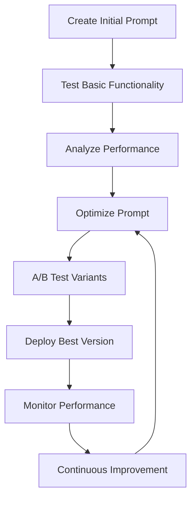
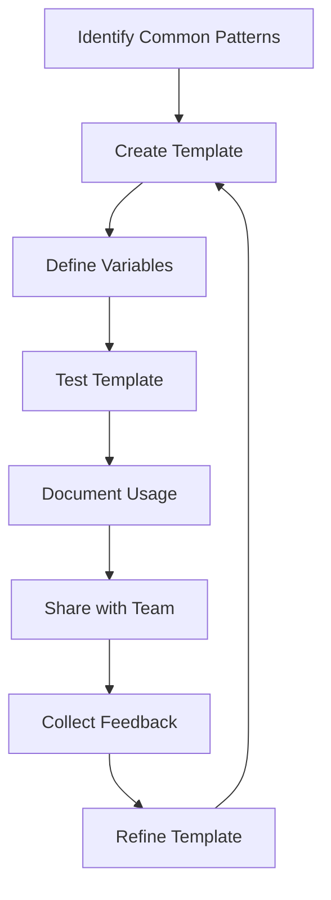
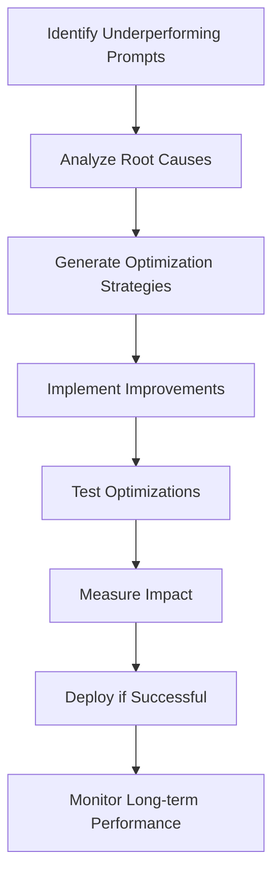

# Prompt Manager App - Complete User Guide

**🤖 Professional Prompt Management Interface**

---

## 🎯 **Overview**

The Prompt Manager App is a specialized interface for managing AI Development Agent prompts and RAG documents. Built on the completed US-PE-01 prompt management system, it provides comprehensive tools for prompt creation, optimization, analytics, and performance tracking.

**Key Features**:
- **Advanced Prompt Management**: Create, edit, and organize system prompts
- **Template System**: Reusable prompt templates with variable substitution
- **Prompt Optimization**: AI-powered prompt improvement and refinement
- **Performance Analytics**: Detailed metrics and performance tracking
- **RAG Document Management**: Handle retrieval-augmented generation documents
- **Version Control**: Track prompt changes and maintain history
- **A/B Testing**: Compare prompt performance with controlled testing

---

## 🚀 **Getting Started**

### **1. Launch the Application**

```bash
# Install dependencies
pip install -r requirements.txt

# Set up API configuration
[secrets]
GEMINI_API_KEY = "your-gemini-api-key"

# Launch the prompt manager
streamlit run apps/prompt_manager_app.py --server.port 8504
```

### **2. Access the Interface**

Open your browser to: `http://localhost:8504`

### **3. First-Time Setup**

1. **API Configuration**: Verify your AI API keys are configured
2. **Database Initialization**: Allow system to initialize prompt database
3. **Template Loading**: Load default prompt templates
4. **Analytics Setup**: Initialize performance tracking system

---

## 📱 **Main Interface Components**

### **1. Prompt Management**

**Purpose**: Core prompt creation, editing, and organization

#### **Prompt Creation**
- **Prompt Editor**: Rich text editor with syntax highlighting
- **Category Assignment**: Organize prompts by functional categories
- **Tag System**: Flexible tagging for easy prompt discovery
- **Variable Definition**: Define dynamic variables for template use
- **Validation**: Real-time prompt syntax and structure validation

#### **Prompt Categories**
- **System Prompts**: Core system behavior and personality
- **Agent Prompts**: Specialized agent role definitions
- **Task Prompts**: Specific task and workflow instructions
- **Template Prompts**: Reusable prompt patterns
- **Testing Prompts**: Prompts for testing and validation

#### **Advanced Features**
- **Prompt Chaining**: Link related prompts for complex workflows
- **Conditional Logic**: Dynamic prompt selection based on context
- **Multi-Language Support**: Prompts in multiple languages
- **Prompt Inheritance**: Template-based prompt hierarchies

### **2. Template System**

**Purpose**: Create and manage reusable prompt templates

#### **Template Types**
- **Basic Templates**: Simple prompts with variable substitution
- **Structured Templates**: Complex prompts with sections and logic
- **Conditional Templates**: Templates with conditional content
- **Composite Templates**: Templates combining multiple sub-templates

#### **Template Features**
- **Variable Substitution**: Dynamic content insertion
- **Default Values**: Fallback values for undefined variables
- **Type Validation**: Ensure variables match expected types
- **Template Preview**: Real-time template rendering preview

#### **Template Management**
- **Template Library**: Organized collection of reusable templates
- **Version Control**: Track template changes and iterations
- **Sharing**: Export and import templates between systems
- **Documentation**: Comprehensive template usage documentation

### **3. Prompt Optimization**

**Purpose**: AI-powered prompt improvement and refinement

#### **Optimization Strategies**
- **Clarity Enhancement**: Improve prompt clarity and specificity
- **Performance Optimization**: Optimize for AI model performance
- **Token Efficiency**: Reduce token usage while maintaining quality
- **Response Quality**: Enhance response accuracy and relevance

#### **Optimization Process**
1. **Analysis**: AI analyzes current prompt effectiveness
2. **Suggestions**: Generate improvement recommendations
3. **Testing**: A/B test optimized versions against originals
4. **Metrics**: Measure performance improvements
5. **Implementation**: Apply successful optimizations

#### **Optimization Metrics**
- **Response Quality**: Accuracy, relevance, completeness
- **Performance**: Response time and token efficiency
- **Consistency**: Response consistency across multiple runs
- **User Satisfaction**: Qualitative feedback and ratings

### **4. Performance Analytics**

**Purpose**: Comprehensive prompt performance tracking and analysis

#### **Usage Analytics**
- **Prompt Usage Frequency**: Track most and least used prompts
- **Performance Trends**: Monitor prompt performance over time
- **Error Rates**: Track prompt failures and issues
- **User Feedback**: Collect and analyze user satisfaction data

#### **Performance Metrics**
- **Response Time**: Average time to generate responses
- **Token Usage**: Efficiency of token consumption
- **Success Rate**: Percentage of successful prompt executions
- **Quality Scores**: AI-generated quality assessments

#### **Advanced Analytics**
- **Cohort Analysis**: Compare performance across user groups
- **Seasonal Trends**: Identify usage patterns over time
- **Comparative Analysis**: Compare prompt variants and versions
- **Predictive Analytics**: Forecast prompt performance trends

### **5. RAG Document Management**

**Purpose**: Manage documents for retrieval-augmented generation

#### **Document Processing**
- **Text Extraction**: Extract text from various document formats
- **Chunking**: Intelligent document chunking for optimal retrieval
- **Embedding Generation**: Create vector embeddings for semantic search
- **Metadata Management**: Track document metadata and properties

#### **Document Types**
- **Code Documentation**: Technical documentation and API references
- **Project Files**: Project-specific documents and resources
- **Knowledge Base**: General knowledge and reference materials
- **Web Content**: Processed web pages and online resources

#### **Retrieval Features**
- **Semantic Search**: Advanced semantic similarity search
- **Context Filtering**: Filter results based on context and relevance
- **Multi-Source Retrieval**: Combine information from multiple documents
- **Real-Time Updates**: Keep document index current and accurate

### **6. Version Control**

**Purpose**: Track changes and maintain prompt history

#### **Change Tracking**
- **Version History**: Complete history of prompt modifications
- **Diff Visualization**: Visual comparison of prompt versions
- **Change Attribution**: Track who made changes and when
- **Rollback Capability**: Revert to previous prompt versions

#### **Branching and Merging**
- **Prompt Branches**: Create branches for experimental changes
- **Merge Functionality**: Merge successful experiments into main
- **Conflict Resolution**: Handle conflicts between concurrent changes
- **Release Management**: Manage prompt releases and deployments

---

## ⚡ **Advanced Features**

### **1. A/B Testing Framework**

**Purpose**: Compare prompt performance with controlled testing

#### **Test Setup**
- **Variant Creation**: Create multiple prompt variants for testing
- **Traffic Splitting**: Distribute traffic between variants
- **Control Groups**: Maintain control groups for baseline comparison
- **Test Duration**: Set appropriate test durations for statistical significance

#### **Statistical Analysis**
- **Significance Testing**: Determine statistical significance of results
- **Confidence Intervals**: Calculate confidence intervals for metrics
- **Power Analysis**: Ensure adequate sample sizes for reliable results
- **Effect Size**: Measure practical significance of improvements

### **2. Prompt Optimization Engine**

**Purpose**: Automated prompt improvement using AI

#### **Optimization Algorithms**
- **Gradient-Based Optimization**: Iterative prompt improvement
- **Genetic Algorithms**: Evolutionary prompt optimization
- **Reinforcement Learning**: Learn optimal prompts through feedback
- **Multi-Objective Optimization**: Balance multiple performance criteria

#### **Quality Assessment**
- **Automated Scoring**: AI-generated quality scores
- **Human Evaluation**: Human-in-the-loop quality assessment
- **Benchmark Testing**: Performance against standard benchmarks
- **Domain-Specific Metrics**: Specialized metrics for specific use cases

### **3. Integration Capabilities**

**Purpose**: Connect with external systems and workflows

#### **API Integration**
- **RESTful API**: Complete REST API for prompt management
- **Webhook Support**: Real-time notifications and updates
- **Batch Operations**: Bulk operations for large-scale management
- **Authentication**: Secure API access with authentication

#### **Workflow Integration**
- **CI/CD Integration**: Include prompt management in deployment pipelines
- **Version Control Systems**: Integration with Git and other VCS
- **Monitoring Tools**: Connect with monitoring and alerting systems
- **Analytics Platforms**: Export data to external analytics tools

---

## 🔧 **Configuration and Setup**

### **1. Database Configuration**

```python
# Prompt database settings
database_config = {
    "type": "sqlite",  # or postgresql, mysql
    "path": "prompts.db",
    "backup_enabled": True,
    "backup_interval": 3600  # seconds
}
```

### **2. Analytics Configuration**

```python
# Analytics settings
analytics_config = {
    "enable_tracking": True,
    "retention_days": 90,
    "sampling_rate": 1.0,
    "export_format": "json"
}
```

### **3. Optimization Settings**

```python
# Optimization parameters
optimization_config = {
    "max_iterations": 10,
    "quality_threshold": 0.8,
    "token_efficiency_weight": 0.3,
    "response_quality_weight": 0.7
}
```

---

## 🎯 **User Workflows**

### **1. Prompt Development Workflow**



**Process Steps**:
1. **Initial Creation**: Draft initial prompt based on requirements
2. **Basic Testing**: Test prompt with sample inputs and scenarios
3. **Performance Analysis**: Analyze response quality and efficiency
4. **Optimization**: Apply AI-powered optimization techniques
5. **A/B Testing**: Compare optimized versions with controlled testing
6. **Deployment**: Deploy best-performing prompt version
7. **Monitoring**: Continuously monitor prompt performance
8. **Iteration**: Continuous improvement based on feedback and data

### **2. Template Management Workflow**



**Template Lifecycle**:
1. **Pattern Recognition**: Identify recurring prompt patterns
2. **Template Creation**: Convert patterns into reusable templates
3. **Variable Definition**: Define template variables and parameters
4. **Testing**: Test template with various input scenarios
5. **Documentation**: Create comprehensive usage documentation
6. **Team Sharing**: Share templates with development team
7. **Feedback Collection**: Gather feedback from template users
8. **Refinement**: Improve templates based on usage and feedback

### **3. Performance Optimization Workflow**



**Optimization Process**:
1. **Performance Review**: Identify prompts with poor performance
2. **Root Cause Analysis**: Analyze reasons for underperformance
3. **Strategy Development**: Develop targeted optimization strategies
4. **Implementation**: Apply optimization techniques and improvements
5. **Testing**: Comprehensive testing of optimized prompts
6. **Impact Measurement**: Quantify improvements and benefits
7. **Deployment**: Deploy successful optimizations to production
8. **Long-term Monitoring**: Monitor sustained performance improvements

---

## 🐛 **Troubleshooting**

### **Common Issues**

#### **Database Connection Problems**
```python
# Issue: Database connection errors
# Solution: Check database configuration and permissions
import sqlite3
try:
    conn = sqlite3.connect('prompts.db')
    conn.execute('SELECT 1')
    conn.close()
    print("Database connection successful")
except Exception as e:
    print(f"Database error: {e}")
```

#### **Prompt Optimization Failures**
```python
# Issue: Optimization process fails
# Solution: Check AI API configuration and limits
def test_optimization_api():
    try:
        # Test basic API functionality
        response = optimize_prompt("test prompt")
        return response.success
    except Exception as e:
        print(f"Optimization API error: {e}")
        return False
```

#### **Performance Analytics Issues**
```python
# Issue: Analytics data not loading
# Solution: Check analytics database and permissions
def verify_analytics():
    try:
        # Check analytics table existence
        analytics_data = load_analytics_data()
        return len(analytics_data) > 0
    except Exception as e:
        print(f"Analytics error: {e}")
        return False
```

### **Debug Mode**

Enable comprehensive debugging:

```bash
# Set debug environment variables
export PROMPT_MANAGER_DEBUG=True
export LOG_LEVEL=DEBUG

# Run with detailed logging
streamlit run apps/prompt_manager_app.py --logger.level=debug
```

---

## 📊 **Performance Optimization**

### **1. Database Optimization**

- **Indexing**: Create appropriate indexes for frequent queries
- **Connection Pooling**: Use connection pooling for better performance
- **Query Optimization**: Optimize database queries for speed
- **Caching**: Implement caching for frequently accessed data

### **2. UI Performance**

- **Lazy Loading**: Load data only when needed
- **Pagination**: Implement pagination for large datasets
- **Caching**: Cache UI components and data
- **Async Operations**: Use asynchronous operations for better responsiveness

### **3. Analytics Performance**

- **Data Aggregation**: Pre-aggregate analytics data for faster access
- **Sampling**: Use sampling for large datasets when appropriate
- **Parallel Processing**: Process analytics data in parallel
- **Incremental Updates**: Update analytics incrementally rather than full recalculation

---

## 🎓 **Best Practices**

### **1. Prompt Design**

- **Clarity**: Write clear, specific, and unambiguous prompts
- **Consistency**: Maintain consistent style and structure
- **Testing**: Thoroughly test prompts with diverse inputs
- **Documentation**: Document prompt purpose and usage guidelines

### **2. Template Management**

- **Modularity**: Create modular, reusable template components
- **Versioning**: Maintain clear version control for templates
- **Documentation**: Provide comprehensive template documentation
- **Testing**: Test templates with various parameter combinations

### **3. Performance Monitoring**

- **Regular Review**: Regularly review prompt performance metrics
- **Trend Analysis**: Monitor trends and identify performance patterns
- **Proactive Optimization**: Address performance issues proactively
- **Continuous Improvement**: Continuously refine and improve prompts

---

## 🔮 **Future Enhancements**

### **Planned Features**

1. **Advanced AI Integration**: Support for multiple AI models and providers
2. **Collaborative Editing**: Real-time collaborative prompt editing
3. **Advanced Analytics**: Machine learning-powered performance insights
4. **Integration Marketplace**: Third-party integrations and extensions
5. **Mobile Interface**: Mobile-optimized prompt management interface
6. **Enterprise Features**: Advanced security, audit trails, and compliance

### **Community Features**

- **Prompt Marketplace**: Share and discover prompts from community
- **Best Practice Library**: Curated collection of proven prompt patterns
- **Expert Reviews**: Professional prompt review and optimization services
- **Training Resources**: Educational content for prompt engineering

---

**The Prompt Manager App provides professional-grade prompt management capabilities, enabling teams to create, optimize, and maintain high-quality AI prompts with confidence and precision.**
