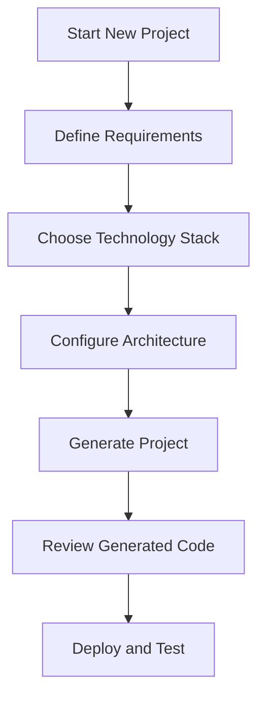
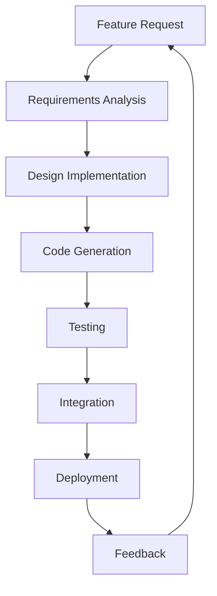
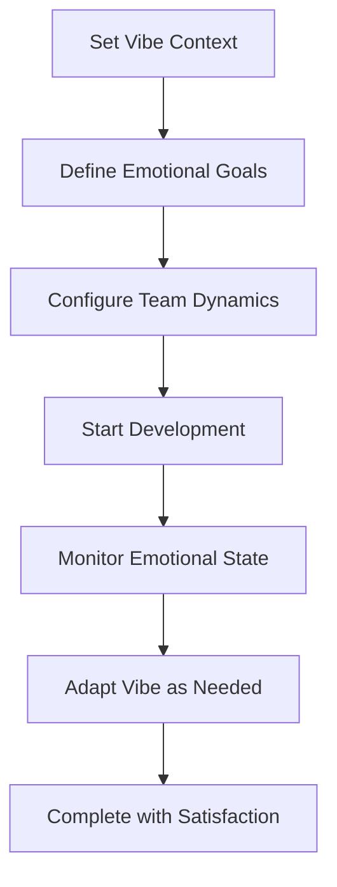

# Streamlit App - Complete User Guide

**🚀 AI Development Agent - Main Web Interface**

---

## 🎯 **Overview**

The Streamlit App is the primary web interface for the AI Development Agent system. It provides an intuitive, user-friendly platform for project generation, agent interaction, and system management. This application serves as the main entry point for most users and offers comprehensive project development capabilities.

**Key Features**:
- **Interactive Project Generation**: AI-powered project creation with real-time feedback
- **Vibe Coding Integration**: Emotional intelligence in development workflows
- **Progress Tracking**: Real-time project progress monitoring
- **Agent Conversation**: Direct interaction with AI development agents
- **Configuration Management**: Easy setup and configuration options
- **RAG Integration**: Retrieval-Augmented Generation for enhanced responses

---

## 🚀 **Getting Started**

### **1. Launch the Application**

```bash
# Install dependencies
pip install -r requirements.txt

# Set up API key in .streamlit/secrets.toml
[secrets]
GEMINI_API_KEY = "your-gemini-api-key"

# Launch the main app
streamlit run apps/streamlit_app.py
```

### **2. Access the Interface**

Open your browser to: `http://localhost:8501`

### **3. First-Time Setup**

1. **API Configuration**: Verify your Gemini API key is configured
2. **Project Directory**: Choose or create a project workspace
3. **Agent Initialization**: Allow the system to initialize AI agents
4. **Configuration Review**: Check default settings and preferences

---

## 📱 **Main Interface Components**

### **1. Project Generator**

**Purpose**: Create new software projects with AI assistance

#### **Project Configuration**
- **Project Name**: Unique identifier for your project
- **Description**: Detailed project description and requirements
- **Technology Stack**: Choose programming languages and frameworks
- **Project Type**: Web app, API service, desktop application, etc.
- **Complexity Level**: Simple, intermediate, or advanced

#### **AI-Powered Analysis**
- **Requirements Analysis**: Intelligent requirement extraction
- **Technology Recommendations**: AI-suggested tech stack
- **Architecture Planning**: System design and structure
- **Implementation Strategy**: Development approach and phases

#### **Generation Process**
1. **Input Collection**: Gather project requirements and preferences
2. **AI Processing**: Analyze requirements and generate architecture
3. **Code Generation**: Create project structure and initial code
4. **Documentation**: Generate README, API docs, and user guides
5. **Testing Setup**: Create test frameworks and initial tests

### **2. Vibe Coding Interface**

**Purpose**: Integrate emotional intelligence into development workflows

#### **Vibe Configuration**
- **Emotional Context**: Set the emotional tone for development
- **Intensity Level**: Control emotional influence strength
- **Coding Style**: Choose development approach and methodology
- **Team Dynamics**: Configure team interaction patterns

#### **Vibe Types**
- **Creative**: Innovative and experimental approach
- **Focused**: Concentrated and precise development
- **Collaborative**: Team-oriented and communicative
- **Analytical**: Data-driven and systematic
- **Energetic**: Fast-paced and dynamic

#### **Real-Time Adaptation**
- **Mood Detection**: AI-powered emotional state recognition
- **Dynamic Adjustment**: Automatic vibe adaptation
- **Progress Influence**: Emotional impact on development progress
- **Team Synchronization**: Align team emotional states

### **3. Agent Conversation**

**Purpose**: Direct interaction with AI development agents

#### **Agent Types**
- **Requirements Analyst**: Requirement gathering and analysis
- **Architecture Designer**: System design and planning
- **Code Generator**: Implementation and development
- **Quality Assurance**: Testing and validation
- **Project Manager**: Coordination and oversight

#### **Conversation Features**
- **Natural Language Input**: Conversational project requests
- **Context Awareness**: Agents remember conversation history
- **Multi-Agent Coordination**: Agents collaborate on complex tasks
- **Real-Time Responses**: Immediate agent feedback and suggestions

#### **Advanced Interactions**
- **Code Review**: AI-powered code analysis and feedback
- **Architecture Discussion**: System design conversations
- **Problem Solving**: Collaborative issue resolution
- **Learning Integration**: Knowledge sharing and skill development

### **4. Progress Tracking**

**Purpose**: Monitor project development progress and metrics

#### **Real-Time Monitoring**
- **Task Completion**: Track completed development tasks
- **Code Generation**: Monitor generated code volume and quality
- **Test Coverage**: Real-time test coverage metrics
- **Documentation Progress**: Track documentation completion

#### **Performance Metrics**
- **Development Velocity**: Code generation speed
- **Quality Indicators**: Code quality and test coverage
- **Agent Efficiency**: AI agent performance metrics
- **User Satisfaction**: Development experience feedback

#### **Visual Progress**
- **Progress Bars**: Visual representation of completion status
- **Timeline View**: Development milestone tracking
- **Metrics Dashboard**: Comprehensive performance overview
- **Historical Data**: Progress trends and patterns

### **5. Configuration Management**

**Purpose**: Manage application settings and preferences

#### **AI Configuration**
- **Model Selection**: Choose AI models and providers
- **API Settings**: Configure API keys and endpoints
- **Response Parameters**: Control AI response behavior
- **Context Management**: Manage conversation context

#### **Interface Preferences**
- **Theme Selection**: Light, dark, or custom themes
- **Layout Options**: Interface layout and organization
- **Feature Toggles**: Enable/disable specific features
- **Accessibility Settings**: Accessibility and usability options

#### **Project Settings**
- **Default Templates**: Set preferred project templates
- **Technology Preferences**: Configure default tech stacks
- **Quality Standards**: Set code quality requirements
- **Integration Options**: Configure external tool integrations

---

## ⚡ **Advanced Features**

### **1. RAG Integration**

**Purpose**: Enhanced AI responses with project-specific knowledge

#### **Document Processing**
- **Codebase Analysis**: Analyze existing code for context
- **Documentation Integration**: Include project docs in responses
- **Knowledge Base**: Build project-specific knowledge repository
- **URL Processing**: Extract information from web resources

#### **Smart Retrieval**
- **Context-Aware Search**: Find relevant information based on queries
- **Semantic Matching**: Advanced semantic similarity search
- **Multi-Source Integration**: Combine information from multiple sources
- **Real-Time Updates**: Keep knowledge base current

### **2. Template System**

**Purpose**: Reusable project templates and patterns

#### **Built-in Templates**
- **Web Applications**: React, Vue, Angular, Django, Flask
- **API Services**: FastAPI, Express, Spring Boot, ASP.NET
- **Mobile Apps**: React Native, Flutter, Native iOS/Android
- **Desktop Applications**: Electron, PyQt, Tkinter, WPF
- **Data Projects**: Jupyter, pandas, scikit-learn, TensorFlow

#### **Custom Templates**
- **Template Creation**: Build custom project templates
- **Template Sharing**: Share templates with team members
- **Template Versioning**: Manage template versions and updates
- **Template Validation**: Ensure template quality and completeness

### **3. Integration Capabilities**

**Purpose**: Connect with external tools and services

#### **Version Control**
- **Git Integration**: Automatic git repository initialization
- **GitHub/GitLab**: Direct integration with code hosting platforms
- **Branch Management**: Automated branch creation and management
- **Commit Automation**: Intelligent commit message generation

#### **Development Tools**
- **IDE Integration**: Connect with popular IDEs and editors
- **Testing Frameworks**: Automated test setup and execution
- **CI/CD Pipelines**: Generate deployment and testing pipelines
- **Code Quality Tools**: Integration with linting and analysis tools

#### **Cloud Services**
- **Cloud Deployment**: Direct deployment to cloud platforms
- **Database Services**: Connect to cloud database services
- **API Integrations**: Easy API service integration
- **Monitoring Tools**: Integration with monitoring and logging services

---

## 🎯 **User Workflows**

### **1. New Project Creation**



**Detailed Steps**:
1. **Project Initialization**: Enter project details and requirements
2. **Technology Selection**: Choose appropriate technologies and frameworks
3. **Architecture Design**: Define system architecture and components
4. **Code Generation**: AI generates initial project structure and code
5. **Review and Refinement**: Review generated code and make adjustments
6. **Testing and Deployment**: Set up testing and deployment processes

### **2. Iterative Development**



**Process Flow**:
1. **Feature Request**: Define new feature requirements
2. **Analysis**: AI analyzes requirements and suggests implementation
3. **Implementation**: Generate code for new feature
4. **Testing**: Create and run tests for new functionality
5. **Integration**: Integrate feature into existing codebase
6. **Deployment**: Deploy updated application
7. **Feedback**: Collect feedback and iterate

### **3. Vibe-Driven Development**



**Vibe Integration**:
1. **Context Setting**: Choose appropriate emotional context
2. **Goal Alignment**: Align emotional goals with project objectives
3. **Team Configuration**: Set up team emotional dynamics
4. **Development Process**: Integrate vibe into development workflow
5. **Continuous Monitoring**: Track emotional state and productivity
6. **Dynamic Adjustment**: Adapt vibe based on progress and feedback

---

## 🔧 **Configuration Options**

### **1. Application Settings**

```yaml
# Streamlit configuration
[server]
port = 8501
address = "localhost"
enableCORS = false

[theme]
primaryColor = "#1f77b4"
backgroundColor = "#ffffff"
secondaryBackgroundColor = "#f0f2f6"
textColor = "#262730"

[global]
developmentMode = false
```

### **2. AI Configuration**

```python
# AI model settings
ai_config = {
    "model_provider": "gemini",
    "model_name": "gemini-1.5-pro",
    "temperature": 0.7,
    "max_tokens": 4000,
    "context_window": 32000
}

# Response parameters
response_config = {
    "format": "structured",
    "include_reasoning": True,
    "code_style": "clean",
    "documentation_level": "comprehensive"
}
```

### **3. Project Defaults**

```python
# Default project settings
project_defaults = {
    "version_control": "git",
    "testing_framework": "pytest",
    "documentation_format": "markdown",
    "code_quality_tools": ["pylint", "black", "mypy"],
    "ci_cd_platform": "github_actions"
}
```

---

## 🐛 **Troubleshooting**

### **Common Issues**

#### **API Key Problems**
```python
# Issue: Invalid API key error
# Solution: Check secrets.toml configuration
[secrets]
GEMINI_API_KEY = "valid-api-key-here"

# Verify key is working
import google.generativeai as genai
genai.configure(api_key="your-key")
```

#### **Interface Loading Issues**
```bash
# Issue: Streamlit app won't start
# Solution: Check dependencies and ports
pip install -r requirements.txt
lsof -i :8501  # Check if port is in use
streamlit run apps/streamlit_app.py --server.port 8502
```

#### **Agent Response Problems**
```python
# Issue: Agents not responding
# Solution: Check agent initialization
# Clear cache and restart
streamlit cache clear
# Check logs for errors
```

### **Debug Mode**

Enable detailed debugging:

```bash
# Set debug environment variables
export STREAMLIT_LOGGER_LEVEL=DEBUG
export AI_DEV_AGENT_DEBUG=True

# Run with verbose logging
streamlit run apps/streamlit_app.py --logger.level=debug
```

---

## 📊 **Performance Tips**

### **1. Optimization Strategies**

- **Cache Management**: Use Streamlit caching for expensive operations
- **Lazy Loading**: Load components only when needed
- **Session Management**: Efficient session state handling
- **Memory Management**: Monitor and optimize memory usage

### **2. Response Time Optimization**

- **AI Model Selection**: Choose appropriate models for tasks
- **Context Management**: Optimize context size and relevance
- **Parallel Processing**: Use async operations where possible
- **Caching**: Cache frequent AI responses

### **3. User Experience Optimization**

- **Progressive Loading**: Show progress during long operations
- **Responsive Design**: Ensure interface works on all screen sizes
- **Error Handling**: Provide clear error messages and recovery options
- **Accessibility**: Ensure interface is accessible to all users

---

## 🎓 **Best Practices**

### **1. Project Development**

- **Clear Requirements**: Start with well-defined project requirements
- **Iterative Approach**: Use iterative development with frequent feedback
- **Code Quality**: Maintain high code quality standards throughout
- **Documentation**: Keep documentation updated with development

### **2. Vibe Coding**

- **Context Awareness**: Choose vibe context appropriate for task
- **Team Alignment**: Ensure all team members understand vibe approach
- **Regular Assessment**: Regularly assess emotional state and adjust
- **Balance**: Maintain balance between emotion and technical requirements

### **3. Agent Interaction**

- **Clear Communication**: Use clear, specific language with agents
- **Context Provision**: Provide sufficient context for agent understanding
- **Feedback**: Give feedback to help agents improve responses
- **Patience**: Allow time for complex agent processing

---

**The Streamlit App provides the perfect balance of simplicity and power, making AI-powered development accessible to users of all skill levels while maintaining professional-grade capabilities for serious development work.**
