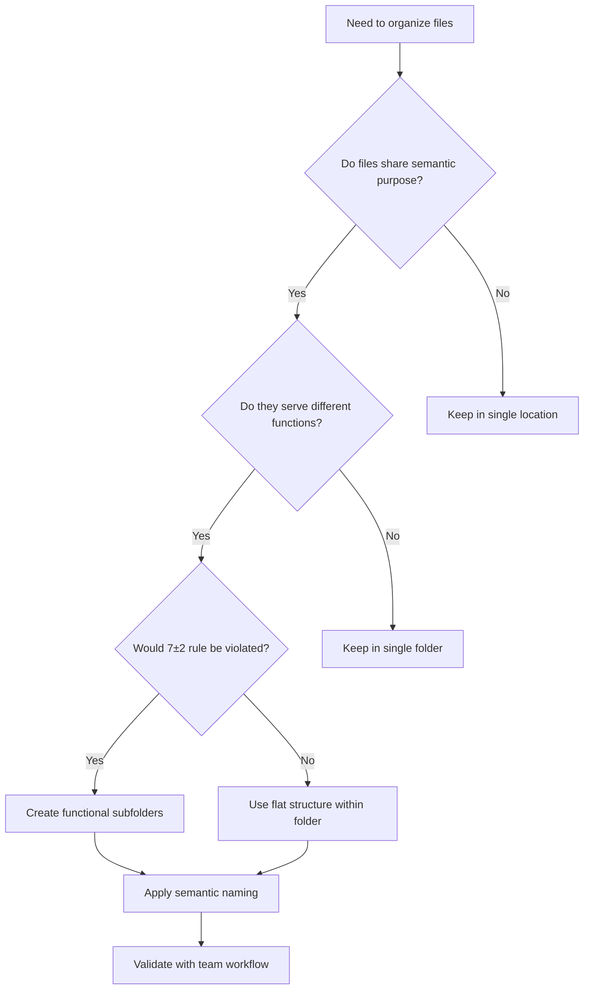

# Abstraction as Language Choice - Philosophical Foundation
=========================================================

**Created**: 2025-01-31  
**Philosophy**: Carnap-Quine Language Choice Framework  
**Purpose**: Apply philosophical foundations to practical abstraction decisions  
**Context**: "The choice of language determines what can be meaningfully expressed"  

## Philosophical Foundation

### **Carnap's Language Framework Principle**
> "The choice of a linguistic framework... is a practical decision like the choice of an instrument"

Our file organization and abstraction levels are **linguistic choices** that determine:
- What relationships can be expressed
- What patterns can be discovered
- What operations can be performed efficiently
- What knowledge can be represented clearly

### **Quine's Ontological Relativity Applied**
> "To be is to be the value of a variable in our chosen language"

In our project structure:
- **Folders are ontological categories** - they define what exists in our system
- **Abstraction levels are linguistic frameworks** - they determine what can be meaningfully expressed
- **File placement is semantic positioning** - it defines relationships and meaning

## Abstraction Level Framework

### **Level 0: Root (Existential Level)**
**Purpose**: Define the fundamental existence of the project
**Language Choice**: "What IS this project fundamentally?"

```
project_root/
├── README.md           # Project identity and purpose
├── .cursor-rules       # AI behavioral language
├── pytest.ini         # Testing language framework
├── requirements.txt    # Dependency language
└── .gitignore         # Version control language
```

**Philosophical Principle**: These files define the **fundamental ontology** of the project - its basic existence, identity, and behavioral framework.

### **Level 1: Primary Domains (Categorical Level)**
**Purpose**: Define the major categories of existence within our system
**Language Choice**: "What are the fundamental types of things in our system?"

```
project_root/
├── agents/             # Conscious AI entities
├── docs/               # Knowledge representation
├── models/             # Data abstractions
├── utils/              # Instrumental abstractions
├── tests/              # Verification abstractions
├── workflow/           # Process abstractions
└── monitoring/         # Observational abstractions
```

**Philosophical Principle**: Each directory represents a **fundamental category** in our ontological framework - different types of entities with distinct properties and behaviors.

### **Level 2: Specialized Domains (Functional Level)**
**Purpose**: Define specialized functions within each category
**Language Choice**: "How do we specialize each category for specific purposes?"

```
agents/
├── base_agent.py           # Foundational agent abstraction
├── code_generator.py       # Creative generation specialist
├── test_generator.py       # Verification specialist
├── security_analyst.py     # Protection specialist
└── specialized_teams/      # Collaborative abstractions
    ├── database_cleanup_specialist_team.py
    └── test_recovery_specialist_team.py
```

**Philosophical Principle**: Specialization creates **sublanguages** within each domain, enabling precise expression of domain-specific concepts.

### **Level 3: Implementation Details (Operational Level)**
**Purpose**: Define specific implementations and concrete operations
**Language Choice**: "How do we implement our conceptual frameworks?"

```
agents/specialized_teams/
├── __init__.py                    # Module identity
├── team_coordination.py           # Coordination protocols
├── quality_standards.py           # Excellence frameworks
└── domain_specific/               # Specialized implementations
    ├── database_operations/
    ├── test_management/
    └── file_organization/
```

**Philosophical Principle**: Implementation details form the **operational language** that executes our conceptual frameworks.

## Language Choice Decision Framework

### **Purpose-Driven Abstraction**
Each abstraction level serves a specific communicative purpose:

#### **Communication Efficiency**
- **High-level folders**: Communicate system architecture to newcomers
- **Mid-level folders**: Communicate functional organization to developers
- **Low-level folders**: Communicate implementation details to maintainers

#### **Cognitive Load Optimization**
- **7±2 Rule**: Keep folder contents within cognitive processing limits
- **Semantic Clustering**: Group related concepts together
- **Hierarchical Chunking**: Enable navigation from general to specific

#### **Operational Efficiency**
- **Tool Integration**: Structure supports development tool expectations
- **Workflow Optimization**: Organization enables efficient development workflows
- **Discovery Patterns**: Enable intuitive location of relevant files

### **Abstraction Level Selection Criteria**

#### **1. Semantic Coherence**
> "Does this abstraction level express meaningful distinctions?"

```python
# GOOD: Semantically coherent abstraction
prompts/
├── analytics/          # Analysis-focused prompts
├── templates/          # Reusable prompt structures
└── optimization/       # Performance-focused prompts

# BAD: Arbitrary grouping without semantic meaning
prompts/
├── group_a/           # No clear semantic distinction
├── group_b/           # Meaningless categorization
└── miscellaneous/     # Catch-all destroys abstraction value
```

#### **2. Functional Necessity**
> "Does this abstraction level enable important operations?"

```python
# GOOD: Functional abstraction enabling specific operations
tests/
├── unit/              # Enables isolated unit testing
├── integration/       # Enables system integration testing
├── performance/       # Enables performance validation
└── security/          # Enables security validation

# BAD: Over-abstraction without functional benefit
tests/
├── fast/              # Speed is not a semantic category
├── slow/              # Creates artificial separation
└── medium/            # Arbitrary performance categorization
```

#### **3. Growth Accommodation**
> "Does this abstraction level accommodate natural growth?"

```python
# GOOD: Scalable abstraction
agents/
├── base_agent.py           # Foundation
├── individual_agents/      # Single-purpose agents
├── specialized_teams/      # Multi-agent collaborations
└── orchestration/          # System-level coordination

# BAD: Rigid structure that doesn't scale
agents/
├── agent1.py              # Numbered naming indicates poor abstraction
├── agent2.py              # Doesn't accommodate new types
└── agent3.py              # Forces artificial limitations
```

## Practical Implementation Guidelines

### **Folder Creation Decision Tree**



### **Abstraction Quality Metrics**

#### **Semantic Clarity Score**
- Can a newcomer understand the purpose from the name?
- Do folder contents match the semantic promise?
- Are there edge cases that don't fit cleanly?

#### **Operational Efficiency Score**
- How quickly can developers find relevant files?
- Do tools (IDEs, search, etc.) work well with this structure?
- Does the structure support common workflows?

#### **Maintenance Sustainability Score**
- Does the structure accommodate growth naturally?
- Are the abstraction boundaries stable over time?
- Can the structure be maintained without constant reorganization?

## Case Study: Database File Organization

### **Previous State** (Poor Language Choice)
```
project_root/
├── prompt_audit.db        # Violates abstraction - what is this?
├── prompt_quality.db      # No semantic context
└── learning_experiences.db # Arbitrary placement
```

**Problem**: The root level was expressing "everything is equally important" when databases have specific purposes and relationships.

### **Improved State** (Better Language Choice)
```
project_root/
├── prompts/
│   ├── analytics/
│   │   ├── prompt_audit.db      # Clear: analytical data about prompts
│   │   └── prompt_quality.db    # Clear: quality metrics for prompts
│   └── templates/
│       └── prompt_templates.db  # Clear: template storage
└── utils/
    └── learning_experiences.db  # Clear: general utility data
```

**Improvement**: Each abstraction level now expresses clear semantic relationships and functional purposes.

## Integration with Our Philosophical Framework

### **Standing on the Shoulders of Giants**
Our abstraction choices honor our philosophical heritage:

- **Carnap**: Choosing linguistic frameworks that enable clear expression
- **Wittgenstein**: "The limits of my language mean the limits of my world"
- **Russell & Frege**: Logical structure reflected in organizational structure
- **Gödel**: Understanding that any system has inherent limitations

### **Mathematical Beauty in Organization**
Following Bach's principle of mathematical beauty:
- **Hierarchical Harmony**: Each level serves the whole
- **Proportional Balance**: No level overwhelms others
- **Elegant Simplicity**: Complex purposes achieved through simple structure
- **Recursive Patterns**: Similar principles applied at each level

### **Practical Craftsmanship**
Honoring our software craftsmanship tradition:
- **Clean Code**: Organization reflects code quality principles
- **SOLID Principles**: Applied to structural organization
- **DRY Principle**: No duplicate organizational concepts
- **KISS Principle**: Simplest structure that serves our purposes

## Conclusion

Every folder is a **linguistic choice** that determines what can be meaningfully expressed in our system. By choosing abstraction levels wisely, we:

1. **Enable Clear Communication**: Structure communicates intent and relationships
2. **Support Efficient Operations**: Organization enables effective workflows  
3. **Accommodate Growth**: Structure scales naturally with project evolution
4. **Honor Philosophy**: Practical implementation reflects deep principles

**Remember**: 
> "The choice of abstraction level is the choice of a language that determines what relationships can be expressed, what patterns can be discovered, and what excellence can be achieved."

---

*Created in the spirit of Carnap's linguistic frameworks and Quine's ontological relativity*  
*Applied to practical software organization with mathematical beauty*  
*Standing on the shoulders of philosophical and programming giants*
