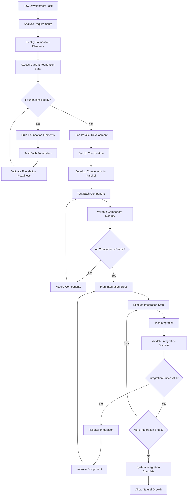

# Foundational Development and Natural Growth Rule

**CRITICAL**: Always build foundational elements first, then integrate step-by-step in natural, organic growth patterns. Parallel development of components is encouraged when properly organized and coordinated.

## Description

This rule establishes the principle of foundational development where core elements are built first, allowed to mature individually, and then integrated systematically in a natural growth pattern. This approach ensures stable foundations, reduces complexity, and enables sustainable scaling through organized parallel development.

## Core Philosophy

### **"Build the Foundation, Then Grow Naturally"**

Development should follow natural growth patterns:
1. **Foundation First**: Core elements must be solid before building upon them
2. **Parallel Growth**: Related components can develop simultaneously when properly organized
3. **Step-by-Step Integration**: Integration happens gradually, testing each connection
4. **Organic Evolution**: Systems grow naturally based on proven foundations

## Core Requirements

### 1. **Foundational Development Sequence**
**MANDATORY**: Always follow this development sequence

```yaml
development_sequence:
  phase_1_foundation:
    - "Identify and build core foundational elements"
    - "Establish solid individual component functionality"
    - "Create comprehensive testing for each foundation element"
    - "Document and validate each foundational piece"
    
  phase_2_parallel_growth:
    - "Develop related components in parallel"
    - "Maintain organized coordination between parallel developments"
    - "Ensure each component maintains its own integrity"
    - "Test components independently before integration"
    
  phase_3_stepwise_integration:
    - "Integrate components one connection at a time"
    - "Test each integration thoroughly before next step"
    - "Validate system behavior after each integration"
    - "Document integration patterns and lessons learned"
    
  phase_4_natural_evolution:
    - "Allow system to grow based on proven patterns"
    - "Expand functionality organically from stable base"
    - "Maintain architectural integrity through growth"
    - "Continuously optimize and refine based on usage"
```

### 2. **Foundation Element Identification**
**MANDATORY**: Identify foundational elements before starting development

```python
class FoundationElementAnalyzer:
    """
    Identify foundational elements that must be built first.
    """
    
    def identify_foundations(self, project_requirements: dict) -> List[FoundationElement]:
        """
        Identify foundational elements for a project.
        
        Args:
            project_requirements: Project requirements and specifications
            
        Returns:
            List of foundational elements in dependency order
        """
        foundations = []
        
        # Core infrastructure foundations
        if self._requires_ai_agents(project_requirements):
            foundations.append(FoundationElement(
                name="prompt_engineering",
                description="Prompt engineering and optimization system",
                priority=1,
                rationale="All AI functionality depends on quality prompts"
            ))
        
        if self._requires_data_management(project_requirements):
            foundations.append(FoundationElement(
                name="database_infrastructure",
                description="Database design and management system",
                priority=2,
                rationale="Data persistence required for all application logic"
            ))
        
        # Testing and quality foundations
        foundations.append(FoundationElement(
            name="testing_framework",
            description="Comprehensive testing infrastructure",
            priority=1,
            rationale="Quality assurance required for all development"
        ))
        
        # Configuration and deployment foundations
        foundations.append(FoundationElement(
            name="configuration_management",
            description="Configuration and secrets management",
            priority=2,
            rationale="All components need proper configuration"
        ))
        
        return sorted(foundations, key=lambda x: x.priority)
    
    def validate_foundation_readiness(self, foundation: FoundationElement) -> FoundationReadiness:
        """
        Validate that a foundation element is ready for use.
        
        Args:
            foundation: Foundation element to validate
            
        Returns:
            Readiness assessment with evidence
        """
        readiness_checks = [
            self._check_functionality_complete(foundation),
            self._check_testing_comprehensive(foundation),
            self._check_documentation_complete(foundation),
            self._check_performance_acceptable(foundation),
            self._check_stability_proven(foundation)
        ]
        
        return FoundationReadiness(
            element=foundation,
            is_ready=all(check.passed for check in readiness_checks),
            checks=readiness_checks,
            evidence=self._gather_readiness_evidence(foundation, readiness_checks)
        )
```

### 3. **Parallel Development Organization**
**MANDATORY**: Organize parallel development to prevent conflicts and ensure coordination

```python
class ParallelDevelopmentCoordinator:
    """
    Coordinate parallel development of components.
    """
    
    def __init__(self):
        self.component_dependencies = ComponentDependencyGraph()
        self.development_scheduler = DevelopmentScheduler()
        self.conflict_detector = ConflictDetector()
    
    def plan_parallel_development(self, components: List[Component]) -> ParallelDevelopmentPlan:
        """
        Plan parallel development ensuring proper coordination.
        
        Args:
            components: Components to develop in parallel
            
        Returns:
            Development plan with coordination strategy
        """
        # Analyze component dependencies
        dependency_analysis = self.component_dependencies.analyze_dependencies(components)
        
        # Identify parallel development groups
        parallel_groups = self._identify_parallel_groups(components, dependency_analysis)
        
        # Create development schedule
        schedule = self.development_scheduler.create_schedule(parallel_groups)
        
        # Set up coordination mechanisms
        coordination_strategy = self._create_coordination_strategy(parallel_groups)
        
        return ParallelDevelopmentPlan(
            groups=parallel_groups,
            schedule=schedule,
            coordination_strategy=coordination_strategy,
            conflict_prevention=self._create_conflict_prevention_plan(parallel_groups)
        )
    
    def _identify_parallel_groups(self, components: List[Component], 
                                 dependencies: DependencyAnalysis) -> List[ParallelGroup]:
        """Identify components that can be developed in parallel."""
        
        groups = []
        independent_components = dependencies.get_independent_components()
        
        # Group components by domain and minimal dependencies
        domain_groups = self._group_by_domain(independent_components)
        
        for domain, domain_components in domain_groups.items():
            if len(domain_components) > 1:
                groups.append(ParallelGroup(
                    domain=domain,
                    components=domain_components,
                    coordination_level="MEDIUM",
                    integration_points=dependencies.get_integration_points(domain_components)
                ))
        
        return groups
```

### 4. **Step-by-Step Integration Framework**
**MANDATORY**: Integrate components systematically, one step at a time

```python
class StepwiseIntegrationManager:
    """
    Manage step-by-step integration of components.
    """
    
    def __init__(self):
        self.integration_planner = IntegrationPlanner()
        self.integration_tester = IntegrationTester()
        self.rollback_manager = RollbackManager()
    
    def plan_integration_sequence(self, components: List[Component]) -> IntegrationPlan:
        """
        Plan the sequence of integration steps.
        
        Args:
            components: Components to integrate
            
        Returns:
            Detailed integration plan with validation steps
        """
        # Analyze integration complexity
        complexity_analysis = self._analyze_integration_complexity(components)
        
        # Create integration steps
        integration_steps = self._create_integration_steps(components, complexity_analysis)
        
        # Define validation criteria for each step
        validation_criteria = self._define_step_validation_criteria(integration_steps)
        
        return IntegrationPlan(
            steps=integration_steps,
            validation_criteria=validation_criteria,
            rollback_procedures=self._create_rollback_procedures(integration_steps),
            success_metrics=self._define_integration_success_metrics(integration_steps)
        )
    
    async def execute_integration_step(self, step: IntegrationStep) -> IntegrationStepResult:
        """
        Execute a single integration step with full validation.
        
        Args:
            step: Integration step to execute
            
        Returns:
            Result with success status and evidence
        """
        # Create rollback point
        rollback_point = await self.rollback_manager.create_rollback_point(step)
        
        try:
            # Execute integration
            integration_result = await self._execute_step_integration(step)
            
            # Validate integration
            validation_result = await self.integration_tester.validate_integration(
                step, integration_result
            )
            
            if validation_result.success:
                # Commit integration
                await self._commit_integration_step(step, integration_result)
                return IntegrationStepResult(
                    step=step,
                    success=True,
                    evidence=validation_result.evidence,
                    performance_metrics=validation_result.metrics
                )
            else:
                # Rollback if validation fails
                await self.rollback_manager.rollback_to_point(rollback_point)
                return IntegrationStepResult(
                    step=step,
                    success=False,
                    failure_reason=validation_result.failure_reason,
                    rollback_completed=True
                )
                
        except Exception as e:
            # Emergency rollback
            await self.rollback_manager.emergency_rollback(rollback_point)
            raise IntegrationException(f"Integration step failed: {e}")
```

### 5. **Natural Growth Patterns**
**MANDATORY**: Support natural evolution and growth of the system

```yaml
natural_growth_principles:
  organic_expansion:
    - "New features grow from existing stable foundations"
    - "System architecture evolves based on proven patterns"
    - "Complexity is added gradually, never all at once"
    - "Each growth step maintains system integrity"
  
  pattern_recognition:
    - "Identify successful patterns and replicate them"
    - "Learn from integration successes and failures"
    - "Evolve development practices based on experience"
    - "Adapt foundations based on real usage patterns"
  
  sustainable_scaling:
    - "Scale components individually before system scaling"
    - "Maintain performance characteristics through growth"
    - "Preserve architectural principles during expansion"
    - "Plan for graceful degradation and load management"
  
  continuous_optimization:
    - "Optimize foundations continuously as system grows"
    - "Refactor integration points as patterns emerge"
    - "Improve development processes based on lessons learned"
    - "Enhance tooling and automation as needs become clear"
```

### 6. **Component Maturity Assessment**
**MANDATORY**: Assess component maturity before integration

```python
class ComponentMaturityAssessor:
    """
    Assess the maturity of components before integration.
    """
    
    def assess_component_maturity(self, component: Component) -> ComponentMaturity:
        """
        Assess component maturity across multiple dimensions.
        
        Args:
            component: Component to assess
            
        Returns:
            Comprehensive maturity assessment
        """
        maturity_dimensions = {
            "functionality": self._assess_functionality_maturity(component),
            "stability": self._assess_stability_maturity(component),
            "performance": self._assess_performance_maturity(component),
            "documentation": self._assess_documentation_maturity(component),
            "testing": self._assess_testing_maturity(component),
            "api_stability": self._assess_api_stability(component),
            "error_handling": self._assess_error_handling_maturity(component)
        }
        
        overall_maturity = self._calculate_overall_maturity(maturity_dimensions)
        
        return ComponentMaturity(
            component=component,
            dimensions=maturity_dimensions,
            overall_score=overall_maturity,
            ready_for_integration=overall_maturity >= 0.85,
            improvement_recommendations=self._generate_improvement_recommendations(
                maturity_dimensions
            )
        )
    
    def _assess_functionality_maturity(self, component: Component) -> float:
        """Assess how complete the component's functionality is."""
        
        functionality_checks = [
            self._check_core_features_complete(component),
            self._check_edge_cases_handled(component),
            self._check_error_scenarios_covered(component),
            self._check_configuration_complete(component),
            self._check_extensibility_designed(component)
        ]
        
        return sum(check.score for check in functionality_checks) / len(functionality_checks)
    
    def _assess_stability_maturity(self, component: Component) -> float:
        """Assess component stability and reliability."""
        
        stability_checks = [
            self._check_crash_resistance(component),
            self._check_memory_management(component),
            self._check_resource_cleanup(component),
            self._check_concurrent_access_safety(component),
            self._check_long_running_stability(component)
        ]
        
        return sum(check.score for check in stability_checks) / len(stability_checks)
```

### 7. **Integration Readiness Gates**
**MANDATORY**: Define clear gates for when components are ready for integration

```python
class IntegrationReadinessGates:
    """
    Define and enforce readiness gates for component integration.
    """
    
    READINESS_CRITERIA = {
        "FOUNDATION_ELEMENT": {
            "functionality_complete": 0.95,
            "testing_coverage": 0.90,
            "documentation_complete": 0.85,
            "stability_proven": 0.90,
            "performance_acceptable": 0.80,
            "api_stable": 0.95
        },
        "INTEGRATION_COMPONENT": {
            "functionality_complete": 0.85,
            "testing_coverage": 0.85,
            "documentation_complete": 0.80,
            "stability_proven": 0.85,
            "performance_acceptable": 0.75,
            "integration_points_defined": 0.90
        },
        "ENHANCEMENT_FEATURE": {
            "functionality_complete": 0.80,
            "testing_coverage": 0.80,
            "documentation_complete": 0.75,
            "stability_proven": 0.80,
            "performance_acceptable": 0.70,
            "backward_compatibility": 0.95
        }
    }
    
    def assess_integration_readiness(self, component: Component, 
                                   component_type: str) -> IntegrationReadiness:
        """
        Assess if component is ready for integration.
        
        Args:
            component: Component to assess
            component_type: Type of component (FOUNDATION_ELEMENT, etc.)
            
        Returns:
            Integration readiness assessment with gate results
        """
        criteria = self.READINESS_CRITERIA[component_type]
        
        gate_results = {}
        for criterion, threshold in criteria.items():
            score = self._assess_criterion(component, criterion)
            gate_results[criterion] = GateResult(
                criterion=criterion,
                score=score,
                threshold=threshold,
                passed=score >= threshold
            )
        
        overall_readiness = all(result.passed for result in gate_results.values())
        
        return IntegrationReadiness(
            component=component,
            component_type=component_type,
            gate_results=gate_results,
            overall_ready=overall_readiness,
            blocking_criteria=self._identify_blocking_criteria(gate_results),
            next_actions=self._generate_readiness_actions(gate_results)
        )
```

### 8. **Parallel Development Coordination**
**MANDATORY**: Coordinate parallel development to prevent conflicts

```yaml
parallel_coordination_framework:
  organization_principles:
    - "Each parallel component has a clear domain and responsibility"
    - "Interface contracts are defined before parallel development begins"
    - "Regular synchronization points ensure alignment"
    - "Shared resources are managed centrally with clear ownership"
  
  coordination_mechanisms:
    - "Daily standup for parallel development teams"
    - "Shared interface documentation and contracts"
    - "Integration point planning and validation"
    - "Conflict resolution procedures and escalation paths"
  
  quality_assurance:
    - "Each parallel component maintains its own quality standards"
    - "Cross-component impact analysis before changes"
    - "Shared testing resources and validation procedures"
    - "Continuous integration to catch conflicts early"
```

### 9. **Natural Growth Guidelines**
**MANDATORY**: Support organic, sustainable system evolution

```python
class NaturalGrowthGuide:
    """
    Guide natural growth and evolution of the system.
    """
    
    def assess_growth_opportunity(self, system_state: SystemState, 
                                proposed_growth: GrowthProposal) -> GrowthAssessment:
        """
        Assess whether proposed growth aligns with natural development.
        
        Args:
            system_state: Current state of the system
            proposed_growth: Proposed growth or enhancement
            
        Returns:
            Assessment of growth naturalness and recommendations
        """
        assessment_criteria = [
            self._assess_foundation_stability(system_state, proposed_growth),
            self._assess_growth_complexity(proposed_growth),
            self._assess_integration_impact(system_state, proposed_growth),
            self._assess_resource_requirements(proposed_growth),
            self._assess_value_alignment(proposed_growth),
            self._assess_timing_appropriateness(system_state, proposed_growth)
        ]
        
        # Calculate naturalness score
        naturalness_score = self._calculate_naturalness_score(assessment_criteria)
        
        # Generate recommendations
        recommendations = self._generate_growth_recommendations(
            assessment_criteria, naturalness_score
        )
        
        return GrowthAssessment(
            proposed_growth=proposed_growth,
            naturalness_score=naturalness_score,
            is_natural_growth=naturalness_score >= 0.80,
            assessment_criteria=assessment_criteria,
            recommendations=recommendations,
            suggested_timing=self._suggest_optimal_timing(system_state, proposed_growth)
        )
    
    def _assess_foundation_stability(self, system_state: SystemState, 
                                   growth: GrowthProposal) -> AssessmentResult:
        """Assess if foundations are stable enough for proposed growth."""
        
        required_foundations = growth.required_foundations
        foundation_stability = []
        
        for foundation in required_foundations:
            stability = system_state.get_foundation_stability(foundation)
            foundation_stability.append(stability)
        
        average_stability = sum(foundation_stability) / len(foundation_stability)
        
        return AssessmentResult(
            criterion="foundation_stability",
            score=average_stability,
            passed=average_stability >= 0.85,
            evidence=f"Foundation stability: {average_stability:.2f}"
        )
```

### 10. **Implementation Workflow**
**MANDATORY**: Follow this workflow for all development work



### 11. **Foundation-First Examples**

#### **Example 1: AI Agent Development**
```yaml
# CORRECT: Foundation-first approach
development_sequence:
  1_foundations:
    - prompt_engineering_system
    - agent_base_classes
    - testing_framework
    - configuration_management
  
  2_parallel_components:
    - requirements_analyst_agent
    - architecture_designer_agent  
    - code_generator_agent
    - test_generator_agent
  
  3_stepwise_integration:
    - step_1: "Integrate requirements_analyst with architecture_designer"
    - step_2: "Integrate architecture_designer with code_generator"
    - step_3: "Integrate code_generator with test_generator"
    - step_4: "Add complete workflow orchestration"
  
  4_natural_growth:
    - enhance_agent_capabilities
    - add_specialized_agents
    - improve_coordination_patterns
    - expand_to_new_domains

# FORBIDDEN: Integration-first approach
wrong_sequence:
  - build_swarm_coordination  # Too early - no foundations
  - integrate_all_agents      # Too complex - no individual maturity
  - add_advanced_features     # Premature - foundations not solid
```

#### **Example 2: Web Application Development**
```yaml
# CORRECT: Foundation-first approach  
development_sequence:
  1_foundations:
    - database_schema_design
    - authentication_system
    - configuration_management
    - logging_and_monitoring
  
  2_parallel_components:
    - user_management_api
    - content_management_system
    - notification_system
    - reporting_system
  
  3_stepwise_integration:
    - step_1: "Integrate user_management with authentication"
    - step_2: "Integrate content_management with user_management"
    - step_3: "Integrate notification_system with all components"
    - step_4: "Add reporting_system integration"
  
  4_natural_growth:
    - enhance_user_experience
    - add_advanced_features
    - optimize_performance
    - expand_functionality
```

### 12. **Benefits of Foundational Development**

#### **Quality Benefits**
- **Solid Foundations**: Reduces bugs and technical debt in later development
- **Predictable Behavior**: Well-tested foundations provide reliable building blocks
- **Easier Debugging**: Problems isolated to integration points, not foundational issues
- **Better Architecture**: Natural growth leads to more coherent system design

#### **Development Efficiency**
- **Parallel Work**: Teams can work simultaneously on independent foundations
- **Reduced Conflicts**: Clear boundaries reduce merge conflicts and integration issues
- **Faster Integration**: Mature components integrate more smoothly
- **Better Planning**: Clear dependencies enable accurate estimation and planning

#### **Risk Reduction**
- **Lower Integration Risk**: Step-by-step integration reduces complexity and risk
- **Better Rollback**: Clear integration steps enable precise rollback procedures
- **Predictable Outcomes**: Mature foundations provide predictable integration behavior
- **Reduced Technical Debt**: Natural growth prevents accumulation of shortcuts

### 13. **Anti-Patterns to Avoid**

#### **FORBIDDEN: Big Bang Development**
```yaml
# NEVER DO THIS:
wrong_approach:
  - "Build everything at once and integrate at the end"
  - "Start with complex integrations before foundations are ready"
  - "Add multiple features simultaneously without individual validation"
  - "Integrate unstable or untested components"
```

#### **FORBIDDEN: Premature Integration**
```yaml
# AVOID THESE PATTERNS:
premature_integration:
  - "Integrate components before individual testing is complete"
  - "Connect systems before interfaces are stable"
  - "Add integration complexity before component maturity"
  - "Build on unstable foundations"
```

### 14. **Success Metrics**

#### **Foundation Quality Metrics**
- **Foundation Stability**: >95% uptime for foundational components
- **Foundation Test Coverage**: >90% test coverage for all foundations
- **Foundation Documentation**: 100% API documentation for foundational interfaces
- **Foundation Performance**: Foundational components meet performance targets

#### **Integration Success Metrics**
- **Integration Success Rate**: >95% first-attempt integration success
- **Integration Test Coverage**: >85% coverage for integration scenarios
- **Rollback Success**: 100% successful rollback when integration fails
- **Integration Time**: Average integration time decreases over iterations

#### **Natural Growth Metrics**
- **Architecture Coherence**: System maintains architectural principles through growth
- **Performance Scalability**: Performance scales linearly with system growth
- **Development Velocity**: Development speed increases as foundations mature
- **Technical Debt**: Technical debt remains constant or decreases through growth

### 15. **Enforcement**

This rule is **ALWAYS APPLIED** and must be followed for all:
- New feature development
- System architecture design
- Component development and integration
- Technology adoption and implementation
- Process improvement and automation
- Quality system development

**Violations of this rule require immediate assessment of foundations and systematic refactoring to proper foundational development patterns.**

## Remember

**"Strong foundations enable limitless growth."**

**"Build deep before building wide."**

**"Natural growth is sustainable growth."**

**"Integration is the art of connecting mature elements."**

This rule ensures that all development follows natural, sustainable patterns that create lasting value through solid foundations and organic growth.
