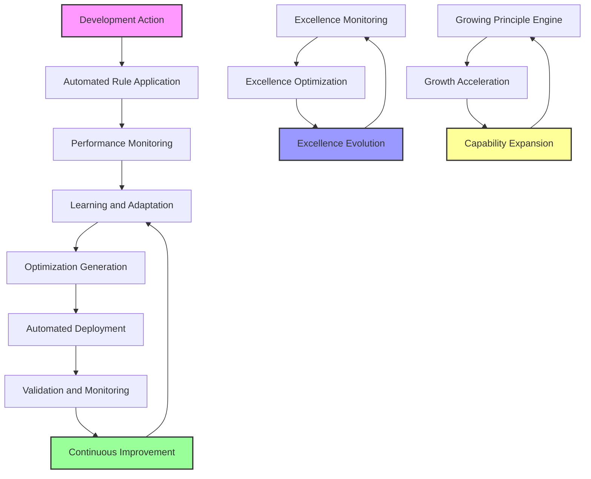

# Self-Optimizing Automation Rule

**CRITICAL**: The development system must be fully self-optimizing and automated, continuously improving its own performance, learning from outcomes, and evolving toward perfect efficiency and excellence.

## Description
This rule establishes the requirement for complete automation of development optimization, creating a system that continuously learns, adapts, and improves without manual intervention. The system embodies the growing principle and excellence through automated evolution.

## Core Automation Requirements

### 1. Continuous Self-Optimization
**MANDATORY**: The system must continuously optimize its own performance
```yaml
optimization_targets:
  rule_application:
    - "Optimize rule selection algorithms"
    - "Improve rule sequencing efficiency"
    - "Enhance rule conflict resolution"
    - "Automate rule priority adjustment"
  
  development_velocity:
    - "Optimize development workflow efficiency"
    - "Automate repetitive development tasks"
    - "Improve automation decision-making"
    - "Enhance parallel processing capabilities"
  
  quality_assurance:
    - "Optimize quality detection algorithms"
    - "Automate quality improvement actions"
    - "Enhance testing automation"
    - "Improve error detection and resolution"
  
  learning_advancement:
    - "Optimize learning model performance"
    - "Automate knowledge acquisition"
    - "Enhance pattern recognition"
    - "Improve prediction accuracy"
```

### 2. Automated Learning and Adaptation
**MANDATORY**: System must learn from every development action
```python
# REQUIRED: Continuous learning from all actions
class ContinuousLearningRequirement:
    """
    System must learn from every development action.
    """
    
    def learn_from_action(self, action: str, context: dict, outcome: dict) -> dict:
        """
        Extract learning from every development action.
        
        Args:
            action: Development action performed
            context: Context in which action was performed
            outcome: Outcome and results of the action
            
        Returns:
            Learning insights and model improvements
        """
        return {
            "patterns_learned": self._extract_action_patterns(action, context, outcome),
            "optimization_opportunities": self._identify_optimization_opportunities(outcome),
            "model_improvements": self._update_learning_models(action, outcome),
            "performance_insights": self._analyze_performance_data(outcome)
        }
    
    def adapt_based_on_learning(self, learning_insights: dict) -> dict:
        """Apply learned insights to improve system performance."""
        
        adaptations = []
        
        # Adapt rule selection algorithms
        if learning_insights["rule_effectiveness_data"]:
            adaptations.append(self._adapt_rule_selection(learning_insights))
        
        # Adapt optimization strategies
        if learning_insights["optimization_effectiveness"]:
            adaptations.append(self._adapt_optimization_strategies(learning_insights))
        
        # Adapt quality metrics
        if learning_insights["quality_patterns"]:
            adaptations.append(self._adapt_quality_assessment(learning_insights))
        
        return {"adaptations_applied": adaptations, "system_improvement": self._measure_improvement(adaptations)}
```

### 3. Automated Performance Optimization
**MANDATORY**: System must automatically optimize its own performance
```yaml
performance_optimization_requirements:
  real_time_monitoring:
    - "Monitor rule application speed continuously"
    - "Track quality metrics in real-time"
    - "Measure development velocity automatically"
    - "Monitor resource usage and efficiency"
  
  automatic_bottleneck_detection:
    - "Detect performance bottlenecks automatically"
    - "Identify optimization opportunities"
    - "Prioritize optimization actions"
    - "Schedule optimization implementations"
  
  automated_optimization_deployment:
    - "Deploy optimizations automatically"
    - "Validate optimization effectiveness"
    - "Rollback failed optimizations"
    - "Monitor post-optimization performance"
```

### 4. Growing Principle Implementation
**MANDATORY**: System must grow in capability and efficiency over time
```python
# REQUIRED: Growing principle automation
class GrowingPrincipleEngine:
    """
    Automated implementation of the growing principle.
    """
    
    def __init__(self):
        self.growth_metrics = {}
        self.capability_tracking = {}
        self.efficiency_history = []
        
    def measure_system_growth(self) -> dict:
        """
        Measure system growth across all dimensions.
        
        Returns:
            Comprehensive growth metrics
        """
        growth_metrics = {
            "capability_expansion": self._measure_capability_expansion(),
            "efficiency_improvement": self._measure_efficiency_improvement(),
            "quality_advancement": self._measure_quality_advancement(),
            "automation_coverage": self._measure_automation_coverage(),
            "learning_velocity": self._measure_learning_velocity(),
            "adaptation_speed": self._measure_adaptation_speed()
        }
        
        # Calculate overall growth rate
        growth_metrics["overall_growth_rate"] = self._calculate_overall_growth_rate(growth_metrics)
        
        return growth_metrics
    
    def accelerate_growth(self, growth_metrics: dict) -> dict:
        """
        Automatically accelerate system growth.
        
        Args:
            growth_metrics: Current growth metrics
            
        Returns:
            Growth acceleration results
        """
        acceleration_actions = []
        
        # Accelerate capability expansion
        if growth_metrics["capability_expansion"] < 0.8:  # Below 80% potential
            acceleration_actions.append(self._accelerate_capability_expansion())
        
        # Accelerate efficiency improvement
        if growth_metrics["efficiency_improvement"] < 0.9:  # Below 90% potential
            acceleration_actions.append(self._accelerate_efficiency_improvement())
        
        # Accelerate learning velocity
        if growth_metrics["learning_velocity"] < 0.85:  # Below 85% potential
            acceleration_actions.append(self._accelerate_learning_velocity())
        
        return {
            "acceleration_actions": acceleration_actions,
            "expected_growth_increase": self._calculate_expected_growth_increase(acceleration_actions),
            "implementation_timeline": self._estimate_acceleration_timeline(acceleration_actions)
        }
```

### 5. Excellence Evolution Automation
**MANDATORY**: System must automatically evolve toward higher excellence
```yaml
excellence_evolution_automation:
  excellence_metrics_tracking:
    - "Track excellence metrics continuously"
    - "Identify excellence improvement opportunities"
    - "Monitor excellence trend analysis"
    - "Predict excellence advancement paths"
  
  automated_excellence_optimization:
    - "Apply excellence optimization automatically"
    - "Validate excellence improvements"
    - "Deploy excellence enhancements"
    - "Monitor excellence impact"
  
  excellence_standard_evolution:
    - "Evolve excellence standards automatically"
    - "Raise quality bars based on capability"
    - "Implement advanced excellence measures"
    - "Enhance excellence validation criteria"
```

## Implementation Architecture

### Self-Optimization Components
```yaml
architecture_components:
  formal_rule_catalog:
    purpose: "Formal rule definitions and application logic"
    automation: "Automated rule selection and application"
    
  intelligent_rule_optimizer:
    purpose: "Intelligent optimization of rule application"
    automation: "Automated optimization strategy selection"
    
  self_optimizing_engine:
    purpose: "Continuous self-optimization and learning"
    automation: "Automated performance improvement cycles"
    
  automated_excellence_engine:
    purpose: "Complete automation of excellence optimization"
    automation: "Fully automated excellence evolution"
```

### Automation Workflow


## Automation Benefits

### Continuous Improvement
- **Automatic Performance Enhancement**: System gets faster and more efficient over time
- **Intelligent Learning**: System learns optimal strategies from every action
- **Adaptive Optimization**: System adapts to changing requirements and contexts
- **Predictive Enhancement**: System predicts and prevents performance issues

### Excellence Evolution
- **Automated Quality Improvement**: System automatically improves quality standards
- **Efficiency Optimization**: System continuously optimizes for maximum efficiency
- **Innovation Enablement**: System enables new optimization possibilities
- **Capability Expansion**: System grows in capability and sophistication

### Growing Principle Manifestation
- **Organic Growth**: System grows naturally through automated learning
- **Compound Improvement**: Each optimization builds on previous improvements
- **Accelerated Development**: System accelerates development velocity over time
- **Evolutionary Excellence**: System evolves toward perfect efficiency and quality

## Operational Requirements

### 1. Automated Activation
**MANDATORY**: System must activate automation automatically
```python
# REQUIRED: Automatic activation on system start
async def activate_automated_excellence():
    """Activate complete automation on system startup."""
    
    from utils.rule_system.automated_excellence_engine import activate_full_development_automation
    
    # Activate full automation
    automation_system = await activate_full_development_automation()
    
    print("🚀 **AUTOMATED EXCELLENCE ACTIVATED**")
    print("System will now continuously optimize itself")
    print("Growing in capability and efficiency")
    print("Evolving toward perfect development excellence")
    
    return automation_system
```

### 2. Monitoring and Reporting
**MANDATORY**: System must provide automated monitoring and reporting
```yaml
monitoring_requirements:
  real_time_dashboards:
    - "Automated excellence metrics dashboard"
    - "Real-time optimization effectiveness monitoring"
    - "Continuous learning advancement tracking"
    - "System growth and evolution monitoring"
  
  automated_reporting:
    - "Daily excellence optimization reports"
    - "Weekly growth and capability reports"
    - "Monthly system evolution summaries"
    - "Continuous improvement recommendations"
```

### 3. Evolution and Advancement
**MANDATORY**: System must evolve its own capabilities
```python
# REQUIRED: Automated capability evolution
class AutomatedCapabilityEvolution:
    """
    System that automatically evolves its own capabilities.
    """
    
    def evolve_capabilities(self) -> dict:
        """Automatically evolve system capabilities."""
        
        evolution_actions = [
            self._evolve_optimization_algorithms(),
            self._evolve_learning_models(),
            self._evolve_automation_strategies(),
            self._evolve_excellence_standards()
        ]
        
        return {
            "capabilities_evolved": len(evolution_actions),
            "evolution_effectiveness": self._measure_evolution_effectiveness(evolution_actions),
            "new_capabilities": self._identify_new_capabilities(evolution_actions),
            "capability_advancement": self._calculate_capability_advancement(evolution_actions)
        }
```

## Integration with Development Process

### Automatic Integration
- **Seamless Integration**: Automation integrates seamlessly with existing development
- **Non-Intrusive Operation**: Automation works in background without disrupting development
- **Enhanced Development**: Automation enhances rather than replaces human creativity
- **Adaptive Support**: Automation adapts to support developer preferences and patterns

### Development Enhancement
- **Accelerated Development**: Automation accelerates development velocity
- **Quality Assurance**: Automation ensures continuous quality improvement
- **Innovation Support**: Automation supports and enables innovation
- **Excellence Achievement**: Automation drives systematic excellence achievement

## Success Metrics

### Automation Effectiveness
- **Optimization Frequency**: Number of optimizations applied per time period
- **Performance Improvement**: Measurable performance improvements over time
- **Quality Enhancement**: Continuous quality score improvements
- **Learning Advancement**: Learning model accuracy and effectiveness improvements

### Growing Principle Metrics
- **Capability Growth**: Expansion of system capabilities over time
- **Efficiency Growth**: Improvement in system efficiency metrics
- **Automation Coverage**: Percentage of development process automated
- **Excellence Evolution**: Evolution of excellence standards and achievement

## Enforcement

This rule is **ALWAYS APPLIED** and must be followed for all:
- Rule system development and enhancement
- Development process optimization
- Quality assurance automation
- Learning and adaptation systems
- Excellence evolution mechanisms

**The system must continuously grow in capability and efficiency through automated optimization.**

## Remember

**"Automation enables excellence."**

**"Self-optimization drives continuous improvement."**

**"Growing systems achieve perfect efficiency through automated evolution."**

The system that optimizes itself grows without limits toward perfect excellence.
