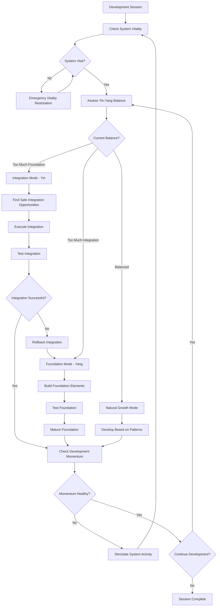

# Continuous Integration and System Vitality Rule

**CRITICAL**: Always maintain a running, integrated system while building foundations. The system must never become stagnant - continuous integration ensures system vitality, functionality, and evolutionary momentum.

## Description

This rule establishes the principle of continuous integration and system vitality - ensuring that while we build foundational elements methodically, the system always remains in a functional, integrated, and evolving state. This creates the essential yin-yang balance with foundational development, preventing stagnation while maintaining quality.

## Core Philosophy

### **"Keep the System Alive and Breathing"**

Development must balance two essential forces:
1. **Foundational Stability** (Yang): Building solid, mature components
2. **Continuous Vitality** (Yin): Keeping the system integrated and alive
3. **Dynamic Balance**: Both forces working together for sustainable growth
4. **Evolutionary Momentum**: Continuous progress prevents stagnation

## Core Requirements

### 1. **System Vitality Principles**
**MANDATORY**: Maintain these vitality characteristics at all times

```yaml
system_vitality_requirements:
  always_running:
    - "System must always be in a runnable state"
    - "No development work should break system execution"
    - "Temporary failures must be resolved within same session"
    - "System health must be continuously validated"
  
  continuous_integration:
    - "New components integrate incrementally, not in isolation"
    - "Integration happens frequently, not in large batches"
    - "System remains functional during integration process"
    - "Integration provides immediate feedback on compatibility"
  
  evolutionary_momentum:
    - "System continuously evolves and improves"
    - "New capabilities are immediately available once integrated"
    - "Development momentum never stops or stagnates"
    - "Progress is visible and demonstrable at all times"
  
  feedback_loops:
    - "Immediate feedback on integration success/failure"
    - "System behavior validates integration quality"
    - "User experience drives integration priorities"
    - "Performance metrics guide integration decisions"
```

### 2. **Continuous Integration Framework**
**MANDATORY**: Implement continuous integration to maintain system vitality

```python
class ContinuousIntegrationEngine:
    """
    Engine for maintaining continuous integration and system vitality.
    """
    
    def __init__(self):
        self.integration_monitor = IntegrationMonitor()
        self.vitality_checker = SystemVitalityChecker()
        self.integration_orchestrator = IntegrationOrchestrator()
        self.rollback_manager = RollbackManager()
    
    async def maintain_continuous_integration(self, development_session: DevelopmentSession) -> VitalityResult:
        """
        Maintain continuous integration throughout development session.
        
        Args:
            development_session: Current development session context
            
        Returns:
            System vitality result with integration status
        """
        vitality_result = VitalityResult()
        
        # Continuous monitoring loop
        while development_session.is_active:
            # Check system vitality
            vitality_status = await self.vitality_checker.check_system_vitality()
            vitality_result.vitality_checks.append(vitality_status)
            
            if not vitality_status.is_healthy:
                # Immediate intervention to restore vitality
                restoration_result = await self._restore_system_vitality(vitality_status)
                vitality_result.restoration_actions.append(restoration_result)
            
            # Check for integration opportunities
            integration_opportunities = await self._identify_integration_opportunities()
            
            for opportunity in integration_opportunities:
                if opportunity.safety_score > 0.8:  # Safe to integrate
                    integration_result = await self._execute_safe_integration(opportunity)
                    vitality_result.integrations.append(integration_result)
            
            # Brief pause before next check
            await asyncio.sleep(30)  # Check every 30 seconds
        
        return vitality_result
    
    async def _execute_safe_integration(self, opportunity: IntegrationOpportunity) -> IntegrationResult:
        """
        Execute integration while maintaining system vitality.
        
        Args:
            opportunity: Safe integration opportunity
            
        Returns:
            Integration result with vitality impact
        """
        # Create vitality checkpoint
        vitality_checkpoint = await self.vitality_checker.create_checkpoint()
        
        try:
            # Execute integration
            integration_result = await self.integration_orchestrator.integrate_component(
                opportunity.component,
                safety_mode=True,
                vitality_preservation=True
            )
            
            # Verify system remains vital
            post_integration_vitality = await self.vitality_checker.check_system_vitality()
            
            if post_integration_vitality.is_healthy:
                # Commit integration
                await self._commit_integration(integration_result)
                return IntegrationResult(
                    opportunity=opportunity,
                    success=True,
                    vitality_preserved=True,
                    performance_impact=post_integration_vitality.performance_delta
                )
            else:
                # Rollback to preserve vitality
                await self.rollback_manager.rollback_to_checkpoint(vitality_checkpoint)
                return IntegrationResult(
                    opportunity=opportunity,
                    success=False,
                    vitality_preserved=True,
                    rollback_reason="Vitality compromised by integration"
                )
                
        except Exception as e:
            # Emergency rollback
            await self.rollback_manager.emergency_rollback(vitality_checkpoint)
            raise IntegrationException(f"Integration failed with vitality preservation: {e}")
```

### 3. **System Vitality Monitoring**
**MANDATORY**: Continuously monitor and maintain system vitality

```python
class SystemVitalityChecker:
    """
    Monitor and ensure continuous system vitality.
    """
    
    def __init__(self):
        self.health_monitor = HealthMonitor()
        self.performance_monitor = PerformanceMonitor()
        self.functionality_monitor = FunctionalityMonitor()
        self.integration_monitor = IntegrationMonitor()
    
    async def check_system_vitality(self) -> SystemVitality:
        """
        Comprehensive check of system vitality.
        
        Returns:
            Complete system vitality assessment
        """
        vitality_checks = []
        
        # Health vitality
        health_status = await self.health_monitor.check_component_health()
        vitality_checks.append(VitalityCheck(
            dimension="health",
            score=health_status.overall_health_score,
            status=health_status.status,
            issues=health_status.issues
        ))
        
        # Performance vitality
        performance_status = await self.performance_monitor.check_performance_vitality()
        vitality_checks.append(VitalityCheck(
            dimension="performance",
            score=performance_status.performance_score,
            status=performance_status.status,
            metrics=performance_status.key_metrics
        ))
        
        # Functionality vitality
        functionality_status = await self.functionality_monitor.check_functionality_vitality()
        vitality_checks.append(VitalityCheck(
            dimension="functionality",
            score=functionality_status.functionality_score,
            status=functionality_status.status,
            working_features=functionality_status.working_features
        ))
        
        # Integration vitality
        integration_status = await self.integration_monitor.check_integration_vitality()
        vitality_checks.append(VitalityCheck(
            dimension="integration",
            score=integration_status.integration_score,
            status=integration_status.status,
            connection_health=integration_status.connection_health
        ))
        
        # Calculate overall vitality
        overall_vitality = self._calculate_overall_vitality(vitality_checks)
        
        return SystemVitality(
            checks=vitality_checks,
            overall_score=overall_vitality,
            is_healthy=overall_vitality >= 0.85,
            vitality_trend=self._calculate_vitality_trend(),
            recommended_actions=self._generate_vitality_actions(vitality_checks)
        )
    
    def _calculate_overall_vitality(self, checks: List[VitalityCheck]) -> float:
        """Calculate overall system vitality score."""
        
        # Weight different dimensions
        weights = {
            "health": 0.30,
            "performance": 0.25,
            "functionality": 0.30,
            "integration": 0.15
        }
        
        weighted_score = sum(
            check.score * weights.get(check.dimension, 0.25)
            for check in checks
        )
        
        return min(weighted_score, 1.0)  # Cap at 1.0
```

### 4. **Integration Momentum Framework**
**MANDATORY**: Maintain integration momentum to prevent stagnation

```python
class IntegrationMomentumManager:
    """
    Manage integration momentum to prevent system stagnation.
    """
    
    MOMENTUM_THRESHOLDS = {
        "CRITICAL": 24,    # Hours without integration
        "WARNING": 12,     # Hours without integration
        "OPTIMAL": 4,      # Hours between integrations
        "TARGET": 2        # Target hours between integrations
    }
    
    def __init__(self):
        self.momentum_tracker = MomentumTracker()
        self.integration_scheduler = IntegrationScheduler()
        self.opportunity_finder = IntegrationOpportunityFinder()
    
    async def maintain_integration_momentum(self) -> MomentumMaintenanceResult:
        """
        Maintain continuous integration momentum.
        
        Returns:
            Result of momentum maintenance activities
        """
        # Check current momentum
        current_momentum = await self.momentum_tracker.get_current_momentum()
        
        if current_momentum.hours_since_last_integration > self.MOMENTUM_THRESHOLDS["WARNING"]:
            # Find immediate integration opportunities
            immediate_opportunities = await self.opportunity_finder.find_immediate_opportunities()
            
            if immediate_opportunities:
                # Execute highest-value, lowest-risk integration
                best_opportunity = self._select_best_immediate_opportunity(immediate_opportunities)
                integration_result = await self._execute_momentum_integration(best_opportunity)
                
                return MomentumMaintenanceResult(
                    momentum_restored=True,
                    integration_executed=integration_result,
                    new_momentum=await self.momentum_tracker.get_current_momentum()
                )
            else:
                # Create micro-integration opportunity
                micro_opportunity = await self._create_micro_integration_opportunity()
                micro_result = await self._execute_micro_integration(micro_opportunity)
                
                return MomentumMaintenanceResult(
                    momentum_restored=True,
                    micro_integration_executed=micro_result,
                    new_momentum=await self.momentum_tracker.get_current_momentum()
                )
        
        return MomentumMaintenanceResult(
            momentum_adequate=True,
            current_momentum=current_momentum
        )
    
    async def _create_micro_integration_opportunity(self) -> MicroIntegrationOpportunity:
        """Create small integration opportunity to maintain momentum."""
        
        # Find smallest possible integration
        micro_opportunities = [
            "Integrate new configuration parameter",
            "Connect new utility function",
            "Add new test integration",
            "Integrate documentation update",
            "Connect new logging component",
            "Integrate performance metric",
            "Add new validation rule"
        ]
        
        for opportunity_type in micro_opportunities:
            opportunity = await self._assess_micro_opportunity(opportunity_type)
            if opportunity.is_safe and opportunity.adds_value:
                return opportunity
        
        # Last resort: create simple integration point
        return await self._create_simple_integration_point()
```

### 5. **Yin-Yang Balance Framework**
**MANDATORY**: Balance foundational development with continuous integration

```yaml
yin_yang_balance:
  foundational_force_yang:
    principles:
      - "Build solid, mature foundations"
      - "Test thoroughly before integration"
      - "Document completely before connection"
      - "Validate stability before expansion"
    
    when_to_emphasize:
      - "Starting new major components"
      - "Building critical infrastructure"
      - "Establishing core patterns"
      - "Creating reusable frameworks"
  
  integration_force_yin:
    principles:
      - "Keep system continuously integrated"
      - "Maintain functional wholeness"
      - "Preserve evolutionary momentum"
      - "Enable immediate feedback and validation"
    
    when_to_emphasize:
      - "System has been isolated too long"
      - "Components are mature enough for connection"
      - "User value requires integrated functionality"
      - "Momentum is declining or stagnating"
  
  balance_indicators:
    too_much_foundation:
      signals:
        - "Components developed in isolation for >48 hours"
        - "No new integrated functionality for >24 hours"
        - "System capabilities not advancing"
        - "Development feels disconnected from system"
      
      correction:
        - "Find safe integration opportunities"
        - "Create micro-integration points"
        - "Connect mature components immediately"
        - "Prioritize integration value demonstration"
    
    too_much_integration:
      signals:
        - "Integration failures >20% of attempts"
        - "System instability increasing"
        - "Rollbacks happening frequently"
        - "Components breaking each other"
      
      correction:
        - "Pause integration, focus on component maturity"
        - "Strengthen foundational elements"
        - "Improve component testing before integration"
        - "Build more stable interfaces"
```

### 6. **Living System Maintenance**
**MANDATORY**: Treat the system as a living organism that needs continuous care

```python
class LivingSystemMaintainer:
    """
    Maintain the system as a living, breathing organism.
    """
    
    def __init__(self):
        self.pulse_monitor = SystemPulseMonitor()
        self.circulation_manager = DataCirculationManager()
        self.breathing_controller = SystemBreathingController()
        self.metabolism_optimizer = SystemMetabolismOptimizer()
    
    async def maintain_system_life(self) -> SystemLifeResult:
        """
        Maintain system as a living organism.
        
        Returns:
            Result of system life maintenance
        """
        life_checks = []
        
        # Check system pulse (heartbeat)
        pulse_check = await self.pulse_monitor.check_system_pulse()
        life_checks.append(pulse_check)
        
        if pulse_check.pulse_rate < 0.5:  # System pulse too slow
            # Stimulate system activity
            stimulation_result = await self._stimulate_system_activity()
            life_checks.append(stimulation_result)
        
        # Check data circulation (blood flow)
        circulation_check = await self.circulation_manager.check_data_circulation()
        life_checks.append(circulation_check)
        
        if circulation_check.circulation_quality < 0.7:  # Poor circulation
            # Improve data flow
            circulation_improvement = await self._improve_data_circulation()
            life_checks.append(circulation_improvement)
        
        # Check system breathing (input/output flow)
        breathing_check = await self.breathing_controller.check_system_breathing()
        life_checks.append(breathing_check)
        
        if breathing_check.breathing_quality < 0.8:  # Breathing issues
            # Improve system breathing
            breathing_improvement = await self._improve_system_breathing()
            life_checks.append(breathing_improvement)
        
        # Check system metabolism (efficiency)
        metabolism_check = await self.metabolism_optimizer.check_system_metabolism()
        life_checks.append(metabolism_check)
        
        if metabolism_check.efficiency < 0.75:  # Slow metabolism
            # Optimize system metabolism
            metabolism_optimization = await self._optimize_system_metabolism()
            life_checks.append(metabolism_optimization)
        
        return SystemLifeResult(
            life_checks=life_checks,
            overall_vitality=self._calculate_overall_vitality(life_checks),
            system_alive=all(check.vital_sign_healthy for check in life_checks),
            recommended_care=self._generate_system_care_recommendations(life_checks)
        )
    
    async def _stimulate_system_activity(self) -> SystemStimulationResult:
        """Stimulate system activity to increase pulse rate."""
        
        stimulation_activities = [
            "Execute system health checks",
            "Run integration validation tests", 
            "Process data through all components",
            "Execute end-to-end workflow",
            "Generate system status reports",
            "Perform component interaction tests"
        ]
        
        stimulation_results = []
        for activity in stimulation_activities:
            result = await self._execute_stimulation_activity(activity)
            stimulation_results.append(result)
            
            # Check if pulse improved
            pulse_check = await self.pulse_monitor.check_system_pulse()
            if pulse_check.pulse_rate >= 0.8:  # Healthy pulse restored
                break
        
        return SystemStimulationResult(
            activities_executed=stimulation_results,
            pulse_improvement=pulse_check.pulse_rate,
            vitality_restored=pulse_check.pulse_rate >= 0.8
        )
```

### 7. **Integration Opportunity Recognition**
**MANDATORY**: Continuously identify and act on integration opportunities

```python
class IntegrationOpportunityEngine:
    """
    Continuously identify integration opportunities to maintain momentum.
    """
    
    def __init__(self):
        self.component_analyzer = ComponentAnalyzer()
        self.value_assessor = IntegrationValueAssessor()
        self.risk_calculator = IntegrationRiskCalculator()
        self.timing_optimizer = IntegrationTimingOptimizer()
    
    async def scan_for_opportunities(self) -> List[IntegrationOpportunity]:
        """
        Continuously scan for integration opportunities.
        
        Returns:
            List of integration opportunities with priority scores
        """
        opportunities = []
        
        # Scan for mature components ready for integration
        mature_components = await self.component_analyzer.find_mature_components()
        
        for component in mature_components:
            # Find potential integration points
            integration_points = await self._find_integration_points(component)
            
            for point in integration_points:
                # Assess value and risk
                value_score = await self.value_assessor.assess_integration_value(
                    component, point
                )
                risk_score = await self.risk_calculator.calculate_integration_risk(
                    component, point
                )
                
                # Calculate opportunity score
                opportunity_score = (value_score * 0.6) - (risk_score * 0.4)
                
                if opportunity_score > 0.6:  # Good opportunity
                    optimal_timing = await self.timing_optimizer.find_optimal_timing(
                        component, point
                    )
                    
                    opportunities.append(IntegrationOpportunity(
                        component=component,
                        integration_point=point,
                        value_score=value_score,
                        risk_score=risk_score,
                        opportunity_score=opportunity_score,
                        optimal_timing=optimal_timing,
                        estimated_effort=self._estimate_integration_effort(component, point)
                    ))
        
        # Sort by opportunity score and timing
        return sorted(opportunities, key=lambda x: (x.opportunity_score, -x.estimated_effort))
    
    async def create_micro_integrations(self) -> List[MicroIntegration]:
        """
        Create small integration opportunities to maintain momentum.
        
        Returns:
            List of micro-integration opportunities
        """
        micro_integrations = []
        
        # Find simple configuration integrations
        config_integrations = await self._find_configuration_integrations()
        micro_integrations.extend(config_integrations)
        
        # Find utility function integrations
        utility_integrations = await self._find_utility_integrations()
        micro_integrations.extend(utility_integrations)
        
        # Find testing integrations
        test_integrations = await self._find_test_integrations()
        micro_integrations.extend(test_integrations)
        
        # Find documentation integrations
        doc_integrations = await self._find_documentation_integrations()
        micro_integrations.extend(doc_integrations)
        
        return sorted(micro_integrations, key=lambda x: x.value_score)
```

### 8. **Development Rhythm Management**
**MANDATORY**: Maintain healthy development rhythm balancing building and integrating

```yaml
development_rhythm:
  daily_cycle:
    morning_foundation_time:
      duration: "2-3 hours"
      activities:
        - "Build new foundational components"
        - "Mature existing components"
        - "Strengthen testing and documentation"
        - "Improve component stability"
    
    midday_integration_time:
      duration: "1-2 hours" 
      activities:
        - "Integrate mature components"
        - "Test integration points"
        - "Validate system functionality"
        - "Address integration issues"
    
    afternoon_growth_time:
      duration: "2-3 hours"
      activities:
        - "Build on integrated foundations"
        - "Add value-adding functionality"
        - "Optimize integrated systems"
        - "Plan next integration cycles"
    
    evening_reflection_time:
      duration: "30 minutes"
      activities:
        - "Assess system vitality"
        - "Plan tomorrow's balance"
        - "Document lessons learned"
        - "Prepare for next cycle"
  
  weekly_cycle:
    foundation_days:
      schedule: "Monday, Wednesday, Friday"
      focus: "Building solid foundational elements"
      
    integration_days:
      schedule: "Tuesday, Thursday"
      focus: "Connecting and integrating components"
      
    evolution_day:
      schedule: "Saturday"
      focus: "System-wide optimization and natural growth"
      
    reflection_day:
      schedule: "Sunday"
      focus: "Planning, assessment, and strategic alignment"
```

### 9. **Vitality Preservation During Development**
**MANDATORY**: Preserve system vitality during all development activities

```python
class VitalityPreservationProtocol:
    """
    Preserve system vitality during development activities.
    """
    
    def __init__(self):
        self.vitality_checker = SystemVitalityChecker()
        self.preservation_strategies = VitalityPreservationStrategies()
        self.emergency_procedures = EmergencyVitalityProcedures()
    
    async def preserve_vitality_during_development(self, 
                                                 development_activity: DevelopmentActivity) -> VitalityPreservationResult:
        """
        Preserve system vitality during development activity.
        
        Args:
            development_activity: Development activity being performed
            
        Returns:
            Result of vitality preservation efforts
        """
        # Check baseline vitality
        baseline_vitality = await self.vitality_checker.check_system_vitality()
        
        # Select preservation strategy
        strategy = await self.preservation_strategies.select_strategy(
            development_activity, baseline_vitality
        )
        
        # Execute development with vitality monitoring
        preservation_result = await self._execute_with_vitality_monitoring(
            development_activity, strategy
        )
        
        # Verify vitality maintained
        post_activity_vitality = await self.vitality_checker.check_system_vitality()
        
        if post_activity_vitality.overall_score < baseline_vitality.overall_score * 0.9:
            # Vitality declined - take corrective action
            restoration_result = await self._restore_vitality_after_activity(
                development_activity, baseline_vitality, post_activity_vitality
            )
            
            return VitalityPreservationResult(
                activity=development_activity,
                baseline_vitality=baseline_vitality,
                final_vitality=restoration_result.restored_vitality,
                vitality_preserved=True,
                restoration_required=True,
                restoration_actions=restoration_result.actions
            )
        
        return VitalityPreservationResult(
            activity=development_activity,
            baseline_vitality=baseline_vitality,
            final_vitality=post_activity_vitality,
            vitality_preserved=True,
            restoration_required=False
        )
```

### 10. **Emergency Vitality Procedures**
**MANDATORY**: Emergency procedures when system vitality is compromised

```python
class EmergencyVitalityProcedures:
    """
    Emergency procedures for restoring system vitality.
    """
    
    VITALITY_EMERGENCY_THRESHOLDS = {
        "CRITICAL": 0.5,   # Immediate emergency intervention
        "SEVERE": 0.65,    # Urgent intervention required
        "MODERATE": 0.75,  # Intervention recommended
        "MILD": 0.85       # Monitoring sufficient
    }
    
    async def handle_vitality_emergency(self, vitality_status: SystemVitality) -> EmergencyResponse:
        """
        Handle system vitality emergency.
        
        Args:
            vitality_status: Current system vitality status
            
        Returns:
            Emergency response result
        """
        emergency_level = self._determine_emergency_level(vitality_status.overall_score)
        
        if emergency_level == "CRITICAL":
            return await self._handle_critical_vitality_emergency(vitality_status)
        elif emergency_level == "SEVERE":
            return await self._handle_severe_vitality_emergency(vitality_status)
        elif emergency_level == "MODERATE":
            return await self._handle_moderate_vitality_emergency(vitality_status)
        else:
            return await self._monitor_vitality_decline(vitality_status)
    
    async def _handle_critical_vitality_emergency(self, vitality_status: SystemVitality) -> EmergencyResponse:
        """Handle critical vitality emergency - immediate action required."""
        
        emergency_actions = []
        
        # 1. Immediate system stabilization
        stabilization_result = await self._emergency_system_stabilization()
        emergency_actions.append(stabilization_result)
        
        # 2. Isolate problematic components
        isolation_result = await self._isolate_problematic_components(vitality_status)
        emergency_actions.append(isolation_result)
        
        # 3. Restore core functionality
        restoration_result = await self._restore_core_functionality()
        emergency_actions.append(restoration_result)
        
        # 4. Validate system recovery
        recovery_validation = await self._validate_system_recovery()
        emergency_actions.append(recovery_validation)
        
        return EmergencyResponse(
            emergency_level="CRITICAL",
            actions_taken=emergency_actions,
            recovery_successful=recovery_validation.system_stable,
            time_to_recovery=self._calculate_recovery_time(emergency_actions),
            lessons_learned=self._extract_emergency_lessons(emergency_actions)
        )
```

### 11. **Integration Breathing Pattern**
**MANDATORY**: Establish natural breathing rhythm of development and integration

```yaml
integration_breathing_pattern:
  breath_in_foundation_building:
    duration: "40-60 minutes"
    activities:
      - "Focus deeply on individual component development"
      - "Build component functionality and stability"
      - "Create comprehensive component tests"
      - "Document component interfaces and behavior"
    
    completion_signals:
      - "Component passes all individual tests"
      - "Component documentation complete"
      - "Component interfaces stable"
      - "Component ready for connection"
  
  breath_out_integration:
    duration: "15-30 minutes"
    activities:
      - "Connect mature component to system"
      - "Test integration points"
      - "Validate system behavior"
      - "Optimize integration performance"
    
    completion_signals:
      - "Integration tests pass"
      - "System remains stable"
      - "New functionality available"
      - "Performance acceptable"
  
  breathing_rhythm:
    pattern: "Build → Integrate → Build → Integrate"
    frequency: "3-4 breath cycles per day"
    adaptation: "Adjust rhythm based on component complexity"
    monitoring: "Track breathing health and effectiveness"
```

### 12. **System Momentum Preservation**
**MANDATORY**: Maintain forward momentum while building foundations

```python
class SystemMomentumEngine:
    """
    Preserve and enhance system momentum during foundational development.
    """
    
    def __init__(self):
        self.momentum_tracker = MomentumTracker()
        self.progress_accelerator = ProgressAccelerator()
        self.stagnation_detector = StagnationDetector()
        self.momentum_optimizer = MomentumOptimizer()
    
    async def maintain_development_momentum(self, session: DevelopmentSession) -> MomentumResult:
        """
        Maintain continuous development momentum.
        
        Args:
            session: Current development session
            
        Returns:
            Momentum maintenance result
        """
        momentum_checks = []
        
        # Track current momentum
        current_momentum = await self.momentum_tracker.track_momentum(session)
        momentum_checks.append(current_momentum)
        
        # Detect stagnation signs
        stagnation_analysis = await self.stagnation_detector.analyze_stagnation_risk(session)
        
        if stagnation_analysis.risk_level > 0.3:  # Stagnation risk detected
            # Apply momentum acceleration
            acceleration_result = await self.progress_accelerator.accelerate_progress(
                session, stagnation_analysis
            )
            momentum_checks.append(acceleration_result)
        
        # Optimize momentum patterns
        optimization_result = await self.momentum_optimizer.optimize_momentum_patterns(
            session, current_momentum
        )
        momentum_checks.append(optimization_result)
        
        return MomentumResult(
            session=session,
            momentum_checks=momentum_checks,
            final_momentum=optimization_result.optimized_momentum,
            momentum_healthy=optimization_result.optimized_momentum.velocity > 0.7,
            acceleration_applied=stagnation_analysis.risk_level > 0.3
        )
```

### 13. **Yin-Yang Development Workflow**
**MANDATORY**: Implement workflow that balances both principles



### 14. **Balance Indicators and Corrections**
**MANDATORY**: Monitor balance and apply corrections

```yaml
balance_monitoring:
  yang_dominance_indicators:
    - "Components isolated for >48 hours"
    - "No new integrated functionality for >24 hours"
    - "System capabilities stagnating"
    - "Development feels disconnected"
    
    correction_actions:
      - "Immediately find safe integration opportunities"
      - "Create micro-integration points"
      - "Connect most mature components"
      - "Execute system-wide functionality tests"
  
  yin_dominance_indicators:
    - "Integration failures >25% of attempts"
    - "System instability increasing"
    - "Frequent rollbacks required"
    - "Components breaking each other"
    
    correction_actions:
      - "Pause integration, focus on component maturity"
      - "Strengthen individual component testing"
      - "Improve interface definitions"
      - "Build more stable foundations"
  
  optimal_balance_indicators:
    - "Regular successful integrations (75%+ success rate)"
    - "System functionality continuously advancing"
    - "Components maturing at healthy pace"
    - "Development momentum maintained"
    - "System vitality score >0.85"
    - "Integration opportunities regularly available"
```

### 15. **Success Metrics for Yin-Yang Balance**

```python
class YinYangBalanceMetrics:
    """
    Measure and track yin-yang development balance.
    """
    
    def calculate_balance_score(self, session: DevelopmentSession) -> BalanceScore:
        """
        Calculate development balance score.
        
        Args:
            session: Development session to analyze
            
        Returns:
            Balance score with detailed metrics
        """
        foundation_metrics = self._measure_foundation_development(session)
        integration_metrics = self._measure_integration_activity(session)
        vitality_metrics = self._measure_system_vitality(session)
        
        # Calculate individual scores
        foundation_score = foundation_metrics.quality_score * foundation_metrics.completion_rate
        integration_score = integration_metrics.success_rate * integration_metrics.frequency_score
        vitality_score = vitality_metrics.overall_vitality
        
        # Calculate balance score (optimal when both forces are strong)
        balance_score = min(foundation_score, integration_score) * vitality_score
        
        # Determine balance state
        balance_state = self._determine_balance_state(
            foundation_score, integration_score, vitality_score
        )
        
        return BalanceScore(
            overall_balance=balance_score,
            foundation_strength=foundation_score,
            integration_strength=integration_score,
            system_vitality=vitality_score,
            balance_state=balance_state,
            recommendations=self._generate_balance_recommendations(balance_state)
        )
```

### 16. **Integration with Other Rules**

#### **Synergy with Foundational Development Rule**
- **Complement**: Provides the integration counterbalance to foundation building
- **Enhancement**: Ensures foundations are immediately put to use
- **Balance**: Prevents over-isolation of component development

#### **Synergy with Excellence Rules**
- **Quality Maintenance**: Continuous integration validates quality continuously
- **Momentum Preservation**: Maintains development excellence through momentum
- **Value Delivery**: Ensures continuous value delivery through integration

### 17. **Enforcement**

This rule is **ALWAYS APPLIED** and must be followed for all:
- Foundation development activities
- Component integration planning
- System architecture evolution
- Development session management
- Quality assurance processes
- Momentum and vitality monitoring

**Violations of this rule require immediate balance restoration and integration momentum recovery.**

## Benefits

### **Development Quality**
- **Continuous Validation**: Integration provides continuous validation of development
- **Early Issue Detection**: Problems discovered through integration, not at deployment
- **Real-world Testing**: Components tested in real system context
- **Adaptive Architecture**: System architecture evolves based on integration experience

### **Team Productivity**
- **Maintained Momentum**: Continuous progress prevents development stagnation
- **Immediate Feedback**: Integration provides immediate feedback on development quality
- **Reduced Risk**: Smaller, frequent integrations reduce integration risk
- **Sustainable Pace**: Natural rhythm supports sustainable development pace

### **System Excellence**
- **Living System**: System remains alive and functional throughout development
- **Evolutionary Architecture**: Architecture evolves naturally through integration
- **Continuous Improvement**: Integration drives continuous system improvement
- **User Value**: Continuous integration enables continuous value delivery

## Remember

**"A system that doesn't breathe cannot live."**

**"Integration is the heartbeat of development."**

**"Foundation and integration are dance partners, not competitors."**

**"Keep the system alive while building its future."**

This rule creates the essential balance with foundational development, ensuring the system remains vital, functional, and continuously evolving while building solid foundations for future growth.
