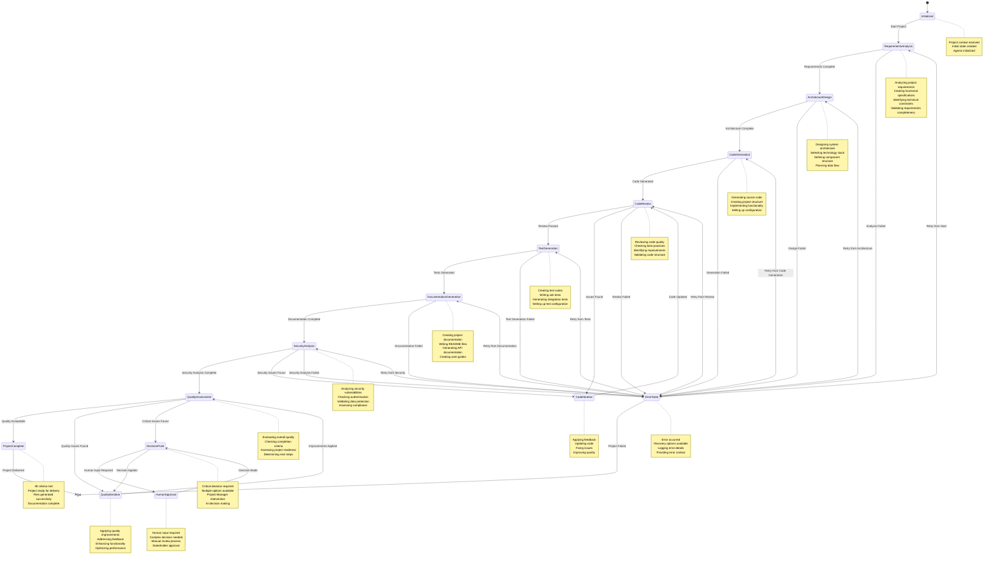

# State Machine Diagram

## State Descriptions

### Initial States

#### Initialized
- **Purpose**: System initialization and project setup
- **Activities**: 
  - Receive project context from user
  - Create initial project state
  - Initialize all agents
  - Set up logging and monitoring
- **Transitions**: Proceeds to RequirementsAnalysis when ready

### Core Development States

#### RequirementsAnalysis
- **Purpose**: Analyze and document project requirements
- **Activities**:
  - Parse project description
  - Identify functional requirements
  - Define non-functional requirements
  - Create user stories and acceptance criteria
  - Validate requirements completeness
- **Transitions**: 
  - Success: Proceeds to ArchitectureDesign
  - Failure: Moves to ErrorState

#### ArchitectureDesign
- **Purpose**: Design system architecture and technical decisions
- **Activities**:
  - Design system architecture
  - Select technology stack
  - Define component structure
  - Plan data flow and integration
  - Create architecture diagrams
- **Transitions**:
  - Success: Proceeds to CodeGeneration
  - Failure: Moves to ErrorState

#### CodeGeneration
- **Purpose**: Generate source code based on requirements and architecture
- **Activities**:
  - Generate source code files
  - Create project structure
  - Implement core functionality
  - Set up configuration files
  - Create build scripts
- **Transitions**:
  - Success: Proceeds to CodeReview
  - Failure: Moves to ErrorState

#### CodeReview
- **Purpose**: Review generated code for quality and best practices
- **Activities**:
  - Analyze code quality
  - Check coding standards
  - Identify potential issues
  - Provide improvement suggestions
  - Validate code structure
- **Transitions**:
  - Pass: Proceeds to TestGeneration
  - Issues Found: Moves to CodeIteration
  - Failure: Moves to ErrorState

#### CodeIteration
- **Purpose**: Apply feedback and improve code quality
- **Activities**:
  - Apply review feedback
  - Fix identified issues
  - Improve code quality
  - Update implementation
  - Validate changes
- **Transitions**: Returns to CodeReview for re-validation

#### TestGeneration
- **Purpose**: Create comprehensive test suites
- **Activities**:
  - Generate unit tests
  - Create integration tests
  - Set up test configuration
  - Create test data
  - Configure test runners
- **Transitions**:
  - Success: Proceeds to DocumentationGeneration
  - Failure: Moves to ErrorState

#### DocumentationGeneration
- **Purpose**: Create comprehensive project documentation
- **Activities**:
  - Generate README files
  - Create API documentation
  - Write user guides
  - Create deployment instructions
  - Generate architecture documentation
- **Transitions**:
  - Success: Proceeds to SecurityAnalysis
  - Failure: Moves to ErrorState

#### SecurityAnalysis
- **Purpose**: Analyze security aspects and vulnerabilities
- **Activities**:
  - Analyze code for vulnerabilities
  - Check authentication mechanisms
  - Validate data protection
  - Assess compliance requirements
  - Identify security risks
- **Transitions**:
  - Success: Proceeds to QualityAssessment
  - Security Issues: Moves to CodeIteration
  - Failure: Moves to ErrorState

### Quality and Decision States

#### QualityAssessment
- **Purpose**: Evaluate overall project quality and completion
- **Activities**:
  - Assess overall project quality
  - Check completion criteria
  - Validate all deliverables
  - Determine project readiness
  - Identify final improvements needed
- **Transitions**:
  - Quality Acceptable: Proceeds to ProjectComplete
  - Quality Issues: Moves to QualityIteration
  - Critical Issues: Moves to DecisionPoint

#### QualityIteration
- **Purpose**: Apply final quality improvements
- **Activities**:
  - Apply quality improvements
  - Address final feedback
  - Enhance functionality
  - Optimize performance
  - Final validation
- **Transitions**: Returns to QualityAssessment

#### DecisionPoint
- **Purpose**: Handle critical decisions requiring intervention
- **Activities**:
  - Identify decision options
  - Analyze alternatives
  - Make AI-powered decisions
  - Apply decision outcomes
  - Update project state
- **Transitions**:
  - Decision Made: Moves to QualityIteration
  - Human Input Required: Moves to HumanApproval

#### HumanApproval
- **Purpose**: Handle decisions requiring human intervention
- **Activities**:
  - Present decision options
  - Wait for human input
  - Process human decision
  - Apply approved decision
  - Update project state
- **Transitions**: Returns to DecisionPoint

### Final States

#### ProjectComplete
- **Purpose**: Project successfully completed and ready for delivery
- **Activities**:
  - Finalize all deliverables
  - Generate project files
  - Create project summary
  - Prepare for delivery
  - Log completion
- **Transitions**: Terminates workflow

#### ErrorState
- **Purpose**: Handle errors and provide recovery options
- **Activities**:
  - Log error details
  - Provide error context
  - Offer recovery options
  - Allow retry from various points
  - Handle graceful degradation
- **Transitions**:
  - Retry: Can return to any previous state
  - Failure: Terminates workflow

## State Transition Rules

### Success Transitions
- Each state must validate its output before proceeding
- Quality gates ensure only acceptable work moves forward
- Automatic progression when criteria are met

### Error Transitions
- Errors trigger immediate transition to ErrorState
- ErrorState provides recovery options
- Can retry from any previous state
- Graceful degradation when possible

### Feedback Transitions
- CodeReview can trigger CodeIteration for improvements
- SecurityAnalysis can trigger CodeIteration for security fixes
- QualityAssessment can trigger QualityIteration for final improvements

### Decision Transitions
- Critical issues trigger DecisionPoint
- Human input required for complex decisions
- AI can make decisions for standard scenarios
- Decisions are applied and workflow continues
