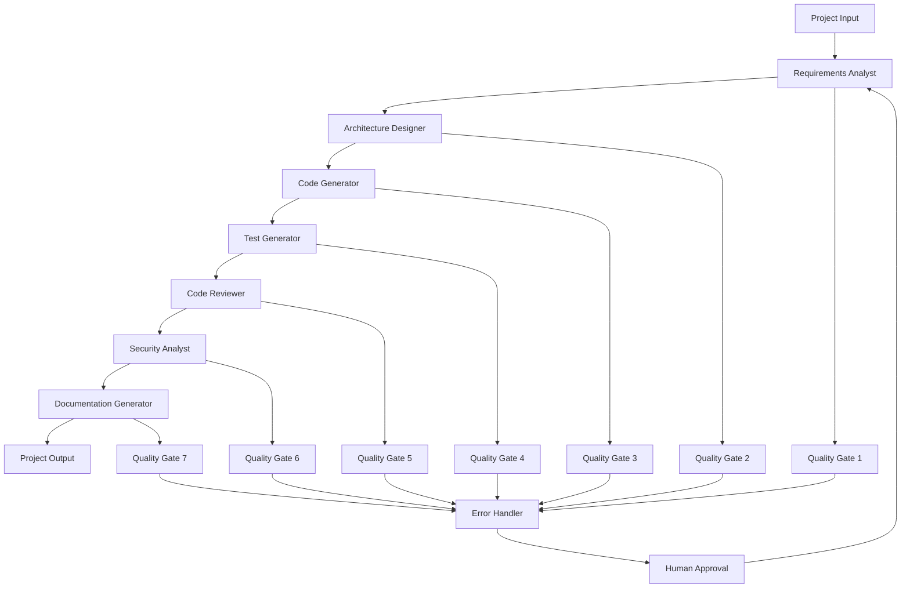

# Workflow Management

This directory contains the workflow orchestration and management system for the AI Development Agent. The workflow system is built on LangGraph and provides a robust, state-driven approach to coordinating multiple AI agents.

## 🏗️ Workflow Architecture

The workflow system implements a **Supervisor-Swarm hybrid architecture** with the following components:

### Core Components

#### 1. **LangGraph Workflow** (`langgraph_workflow.py`)
- **Purpose**: Main workflow implementation using LangGraph framework
- **Features**:
  - State-driven workflow execution
  - Agent coordination and sequencing
  - Error handling and recovery
  - Progress tracking and monitoring
  - Human-in-the-loop approval mechanisms

#### 2. **Workflow Manager** (`workflow_manager.py`)
- **Purpose**: High-level workflow orchestration and management
- **Features**:
  - Workflow initialization and configuration
  - Agent scheduling and coordination
  - State management and persistence
  - Error handling and recovery
  - Performance monitoring

#### 3. **Workflow Graph** (`workflow_graph.py`)
- **Purpose**: Defines the workflow structure and agent dependencies
- **Features**:
  - Agent dependency mapping
  - Workflow node definitions
  - Conditional execution logic
  - Parallel processing capabilities
  - State transition management

#### 4. **LangGraph Workflow Manager** (`langgraph_workflow_manager.py`)
- **Purpose**: LangGraph-specific workflow management and optimization
- **Features**:
  - LangGraph integration and configuration
  - Workflow state management
  - Agent execution coordination
  - Performance optimization
  - Monitoring and observability

### Supporting Components

#### 5. **Error Handler** (`error_handler.py`)
- **Purpose**: Comprehensive error handling and recovery
- **Features**:
  - Error detection and classification
  - Automatic retry mechanisms
  - Fallback strategies
  - Error logging and reporting
  - Recovery procedures

#### 6. **Human Approval** (`human_approval.py`)
- **Purpose**: Human-in-the-loop approval mechanisms
- **Features**:
  - Critical decision approval
  - Quality gate enforcement
  - Manual intervention points
  - Approval workflow management
  - Audit trail maintenance

## 🔄 Workflow Process

### Standard Development Workflow



### Workflow Stages

#### 1. **Requirements Analysis**
- **Agent**: Requirements Analyst
- **Input**: Project description and context
- **Output**: Structured requirements specification
- **Quality Gate**: Requirements validation and completeness

#### 2. **Architecture Design**
- **Agent**: Architecture Designer
- **Input**: Requirements and project context
- **Output**: System architecture and technology stack
- **Quality Gate**: Architecture feasibility and scalability

#### 3. **Code Generation**
- **Agent**: Code Generator
- **Input**: Requirements and architecture
- **Output**: Complete source code
- **Quality Gate**: Code structure and organization

#### 4. **Test Generation**
- **Agent**: Test Generator
- **Input**: Generated code and requirements
- **Output**: Comprehensive test suite
- **Quality Gate**: Test coverage and quality

#### 5. **Code Review**
- **Agent**: Code Reviewer
- **Input**: Generated code and project context
- **Output**: Code review report
- **Quality Gate**: Code quality and best practices

#### 6. **Security Analysis**
- **Agent**: Security Analyst
- **Input**: Code and security requirements
- **Output**: Security analysis report
- **Quality Gate**: Security compliance and vulnerability assessment

#### 7. **Documentation Generation**
- **Agent**: Documentation Generator
- **Input**: Code, architecture, and project context
- **Output**: Complete project documentation
- **Quality Gate**: Documentation completeness and quality

## 🔧 Configuration

### Workflow Configuration

The workflow system supports extensive configuration options:

```python
# Example workflow configuration
workflow_config = {
    "enable_human_approval": True,
    "quality_gates_enabled": True,
    "parallel_execution": False,
    "retry_attempts": 3,
    "timeout_seconds": 300,
    "enable_monitoring": True,
    "log_level": "INFO"
}
```

### Agent Configuration

Each agent can be configured independently:

```python
# Example agent configuration
agent_config = {
    "model_selection": "auto",  # auto, simple, complex
    "temperature": 0.1,
    "max_tokens": 8192,
    "enable_caching": True,
    "retry_on_failure": True
}
```

## 🛡️ Error Handling

### Error Categories

1. **Agent Errors**: Individual agent execution failures
2. **Parsing Errors**: Output parsing and validation failures
3. **API Errors**: External service and API failures
4. **State Errors**: Workflow state management issues
5. **Configuration Errors**: Configuration and setup issues

### Error Recovery Strategies

1. **Automatic Retry**: Retry failed operations with exponential backoff
2. **Fallback Mechanisms**: Use alternative approaches when primary fails
3. **State Recovery**: Restore workflow state from checkpoints
4. **Human Intervention**: Request manual intervention for critical errors
5. **Graceful Degradation**: Continue with reduced functionality

### Error Reporting

- **Comprehensive Logging**: Detailed error logs with context
- **Error Classification**: Automatic error categorization
- **Performance Metrics**: Error rates and recovery times
- **Alert System**: Real-time error notifications
- **Debug Information**: Detailed debugging information for troubleshooting

## 📊 Monitoring and Observability

### LangSmith Integration

The workflow system integrates with LangSmith for comprehensive observability:

- **Agent Executions**: Track individual agent performance
- **Workflow Steps**: Monitor workflow progression
- **State Changes**: Track state transitions and data flow
- **Performance Metrics**: Execution times and resource usage
- **Error Tracking**: Comprehensive error monitoring

### Performance Metrics

- **Execution Time**: Total workflow execution time
- **Agent Performance**: Individual agent execution times
- **Success Rates**: Agent and workflow success rates
- **Error Rates**: Error frequency and types
- **Resource Usage**: Memory and CPU utilization

## 🔄 State Management

### State Structure

The workflow uses a TypedDict-based state structure:

```python
class WorkflowState(TypedDict):
    project_name: str
    project_description: str
    requirements: Dict[str, Any]
    architecture: Dict[str, Any]
    code: Dict[str, Any]
    tests: Dict[str, Any]
    review: Dict[str, Any]
    security: Dict[str, Any]
    documentation: Dict[str, Any]
    metadata: Dict[str, Any]
```

### State Persistence

- **Checkpoint System**: Automatic state checkpointing
- **State Recovery**: Restore workflow from checkpoints
- **State Validation**: Validate state consistency
- **State Migration**: Handle state schema changes

## 🧪 Testing

### Test Organization

```
tests/
├── unit/workflow/           # Unit tests for workflow components
├── integration/workflow/    # Integration tests for workflow interactions
├── system/workflow/         # System tests for complete workflows
└── langgraph/              # LangGraph-specific tests
```

### Testing Standards

- **Workflow Testing**: Test complete workflow execution
- **State Testing**: Test state management and transitions
- **Error Testing**: Test error handling and recovery
- **Performance Testing**: Test workflow performance
- **Integration Testing**: Test workflow integration with agents

## 📚 Related Documentation

- **Agents**: See `agents/` directory for agent implementations
- **Models**: See `models/` directory for state and configuration models
- **Testing**: See `tests/` directory for comprehensive test suite
- **Configuration**: See `models/config.py` for configuration management
- **State Management**: See `models/state.py` for state management

## 🤝 Contributing

### Adding New Workflow Components

1. **Follow Architecture**: Adhere to established workflow patterns
2. **Implement Interfaces**: Use consistent interfaces and contracts
3. **Add Error Handling**: Implement comprehensive error handling
4. **Create Tests**: Add comprehensive test coverage
5. **Update Documentation**: Document new components and usage

### Workflow Standards

- **State-Driven**: All workflows should be state-driven
- **Error Handling**: Comprehensive error handling and recovery
- **Monitoring**: Full observability and monitoring support
- **Testing**: Complete test coverage for all components
- **Documentation**: Maintain complete documentation

---

**Last Updated**: Current session  
**Version**: 1.0  
**Maintainer**: Development Team
